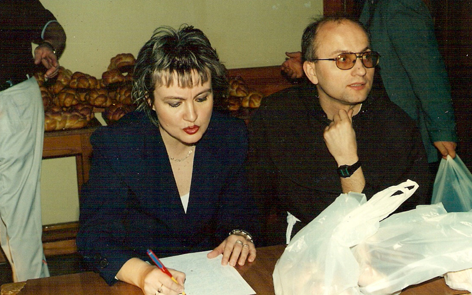
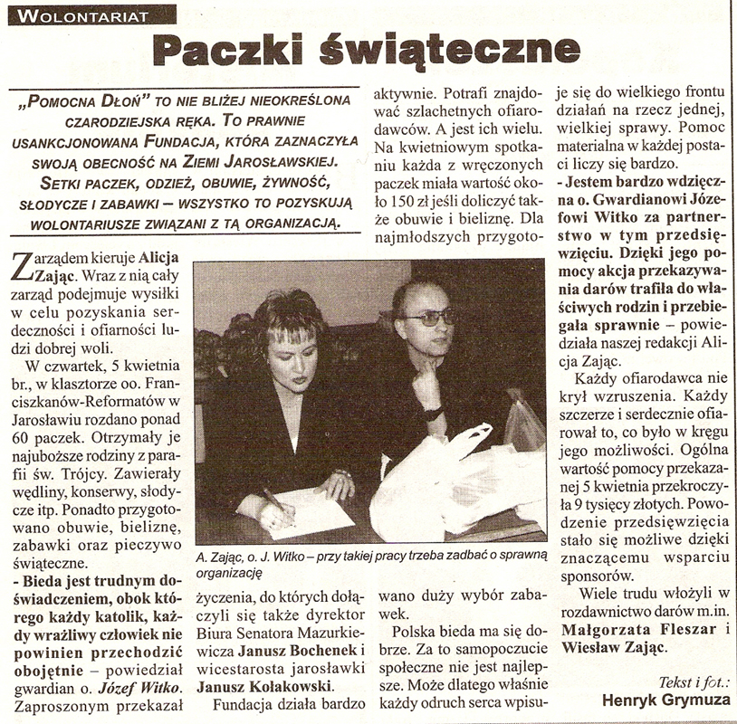
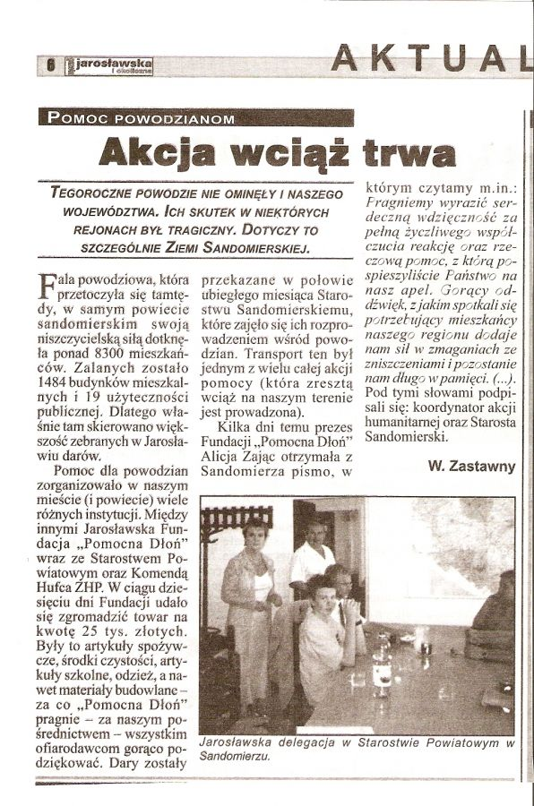
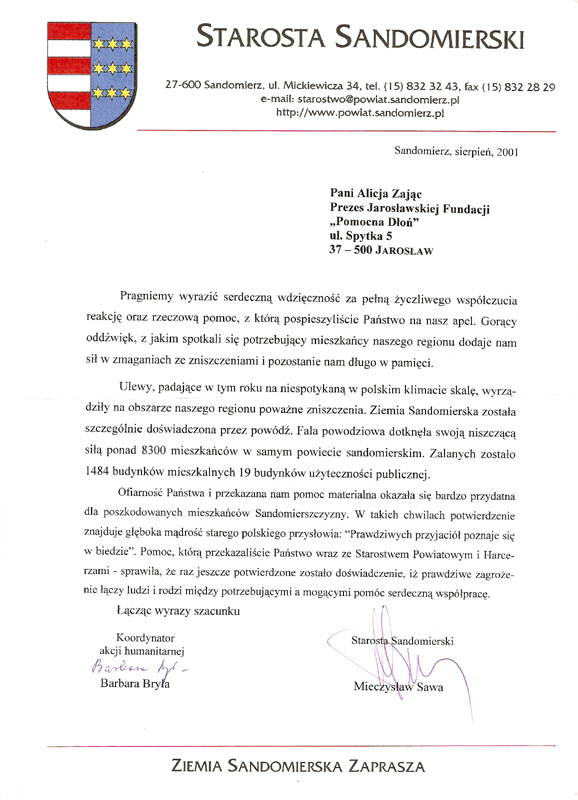

<i>2001-12-02 12:41:00</i> 
Dary dla dzieci potrzebujących
W niedzielę 2 grudnia 2001 r. w sali widowiskowej Miejskiego Ośrodka Kultury obdarowano ok. 300 dzieci z różnych placówek z Jarosławia i okolic.
 

W niedzielę 2 grudnia 2001 r. w sali widowiskowej Miejskiego Ośrodka Kultury obdarowano ok. 300 dzieci z Domu Dziecka Nr 1 przy ul. Poniatowskiego, Polskiego Stowarzyszenia na Rzecz Osób z Upośledzeniem Umysłowym, świetlic środowiskowych przy Kolegiacie i parafii NMP Królowej Polski, Polskiego Związku Niewidomych Koło w Jarosławiu, Specjalnego Ośrodka Szkolno Wychowawczego, wszystkich gimnazjów z Jarosławia oraz z Piwody, jarosławskich szkół podstawowych, Zespołu Szkół Ogólnokształcących Nr 2, a także z rodzin wytypowanych przez Powiatowe Centrum Pomocy Rodzinie.

Łączna wartość paczek to ok.<strong> 30 tys. zł</strong>. W programie artystycznym przygotowanym na tę okazję wystąpił zespół Państwowego Ogniska Baletowego oraz uczniowie Publicznego Gimnazjum nr 3.
 

<i>2001-12-03 14:49:00</i> 
Nomicnacja prezes Alicji Zając do konkursu o tytuł Społecznika Roku
Prezes Fundacji Pomocna Dłoń w Jarosławiu pani Alicja Zając w dowód uznania za szeroką działalność charytatywną została nominowana do konkursu o tytuł Społecznika Roku. Konkurs został zorganizowany przez Fundację Pomoc Społeczna SOS z Warszawy. Prezes Fundacji Jacek Kuroń.
 
 
<a href="#" class="loadImages">ZOBACZ ZDJĘCIA</a> 

 

<i>2001-04-05 14:39:00</i> 
Akcja charytatywna
Akcja charytatywna zorganizowana dla biednych rodzin wytypowanych przez Proboszcza z Kościoła Refermatów. Fundacja przekazała żywność i odzież.
 
 
<a href="#" class="loadImages">ZOBACZ ZDJĘCIA</a> 

 
 

<i>2001-06-03 12:44:00</i> 
Talony na Dzień Dziecka
Dzień Dziecka pod patronatem Senatora RP Andrzeja Tadeusza Mazurkiewicza, Burmistrza Jarosławia Jana Gilowskiego oraz Fundacji "Pomocna Dłoń", której Prezesem jest Alicja Zając.
 

Dzień Dziecka pod patronatem Senatora RP Andrzeja Tadeusza Mazurkiewicza, Burmistrza Jarosławia Jana Gilowskiego oraz Fundacji "Pomocna Dłoń", której Prezesem jest Alicja Zając.

Rozdano <strong>210 talonów</strong> dla szkół podstawowych, gimnazjów, świetlic środowiskowych, OO. Reformatów i Domu Dziecka Nr 2.

Talony upoważniały do odbioru cennych upominków w postaci odzieży, zabawek i słodyczy.
 

<i>2001-06-03 14:41:00</i> 
Dzień dziecka
Tegorocznym obchodom Dnia Dziecka patronowali: Senator RP Andrzej T. Mazurkiewicz, Burmistrz Miasta Jan Gilowski oraz Fundacja "Pomocna dłoń" reprezentowana przez Prezes Alicję Zając.
 
 
<a href="#" class="loadImages">ZOBACZ ZDJĘCIA</a> 

 
 
 
 

<i>2001-08-16 14:45:00</i> 
Dary dla powodzian
Dary dla powodzian dostarczono do Starostwa Powiatowego w Sandomierzu. Fundacja przekazała paszę, artykuły szkolne, słodycze, zabawki itp.
 
 
<a href="#" class="loadImages">ZOBACZ ZDJĘCIA</a> 

 
 

