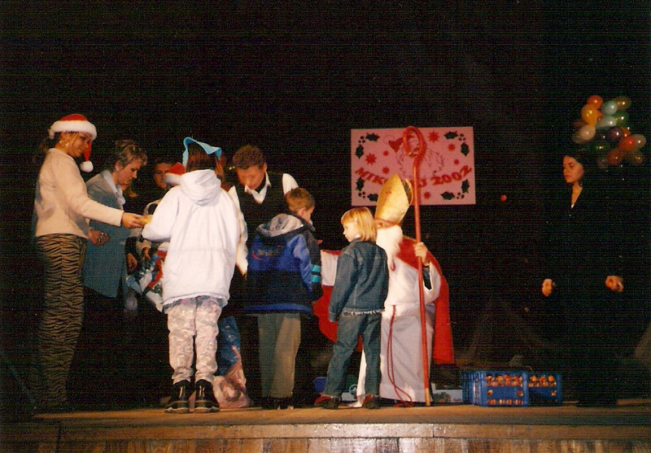
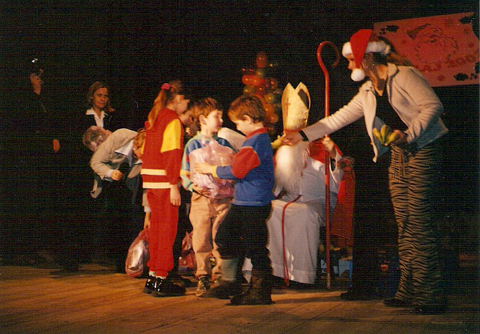

<i>2002-03-12 12:40:00</i>  
Podziękowanie dla sponsorów i wolontariuszy
W imieniu Fundacji "Pomocna Dłoń" pragniemy serdecznie podziękować wszystkim sponsorom i wolontariuszom, którzy przyczynili się do kolejnej akcji pomocy.
  

W imieniu Fundacji "Pomocna Dłoń" pragniemy serdecznie podziękować wszystkim sponsorom i wolontariuszom, którzy przyczynili się do kolejnej akcji pomocy.
|n|
W dniu 16 marca br. rozdane zostały nieodpłatnie bony towarowe wartości 100 zł każdy, artykuły spożywcze, obuwie, środki chemiczne i baranki dla ludzi potrzebujących z parafii Bożego Ciała. Łączna kwota przekazanych darów wynosiła <strong>14 tys. zł.</strong>
  

<i>2002-06-08 12:38:00</i>  
Program z okazji Dnia Dziecka
Fundacja "Pomocna Dłoń" w dniu 1 czerwca 2002 r. na stadionie Miejskiego Ośrodka Kultury przygotowała trzygodzinny program z okazji Dnia Dziecka.
  

Fundacja "Pomocna Dłoń" w dniu 1 czerwca 2002 r. na stadionie Miejskiego Ośrodka Kultury przygotowała trzygodzinny program z okazji Dnia Dziecka.
|n|
Wartość rozdanych prezentów wynosiła łącznie <strong>25 tys. zł</strong>. Spotkanie upłynęło w miłej atmosferze. Dzieci bawiły się wspaniale. Zorganizowano wiele konkursów m.in. malarski i wybory miss wśród dzieci. Wystąpiła grupa taneczna rap z Jankowic pod kierunkiem Anny Bojarskiej i Krystyny Missa.
|n|
Odbył się też pokaz mody od zarania dziejów Polski.
  

<i>2002-12-05 12:37:00</i>  
Mikołajki 2002
W dniu 5 grudnia 2002 r. odbyła się impreza "Mikołajki 2002" zorganizowana przez Miejski Ośrodek Kultury i Fundację "Pomocna dłoń" kierowaną przez p. Alicję Zając. Imprezę swoją obecnością zaszczycili Burmistrz Janusz Dąbrowski, Radny RMJ Zbigniew Możdżeń, przedstawiciele Starostwa Powiatowego, dyrektorzy i prezesi jarosławskich firm i spółek.
  

W dniu 5 grudnia 2002 r. odbyła się impreza <strong>"Mikołajki 2002"</strong> zorganizowana przez Miejski Ośrodek Kultury i Fundację "Pomocna dłoń" kierowaną przez p. Alicję Zając. Imprezę swoją obecnością zaszczycili Burmistrz Janusz Dąbrowski, Radny RMJ Zbigniew Możdżeń, przedstawiciele Starostwa Powiatowego, dyrektorzy i prezesi jarosławskich firm i spółek. Zabawę prowadziła Janina Suchożak. Święty Mikołaj obdarował blisko 300 dzieci. Paczki otrzymały dzieci wytypowane przez wszystkie szkoły podstawowe, dwa gimnazja - nr 2 i nr 3, Stowarzyszenie Rodzin Katolickich przy parafii Bożego Ciała, świetlicę przy parafii NMP Królowej Polski, Specjalny Ośrodek Szkolno-Wychowawczy, Dom Dziecka nr 1, Powiatowe Centrum Pomocy Rodzinie, Stowarzyszenie na Rzecz Osób Niepełnosprawnych koło Jarosław. Wartość jednej paczki to <strong>ok. 100 zł.</strong> W paczkach znalazły się słodycze, zabawki, obuwie i odzież.
  
<b>Zdjęcia:</b> 

 
 

<i>2002-12-14 22:21:00</i>  
Dary świąteczne dla potrzebujących
Rodziny najbardziej potrzebujące otrzymały dary Świąteczne w Kościele Najświętszej Marii Panny w Jarosławiu.
  

Rodziny najbardziej potrzebujące otrzymały dary Świąteczne (żywność i dary materialne) w Kościele Najświętszej Marii Panny w Jarosławiu.
  

