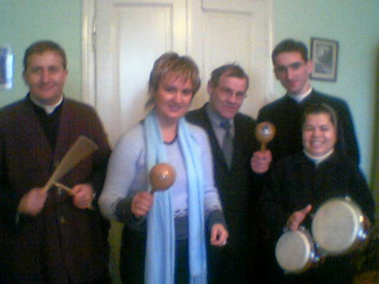
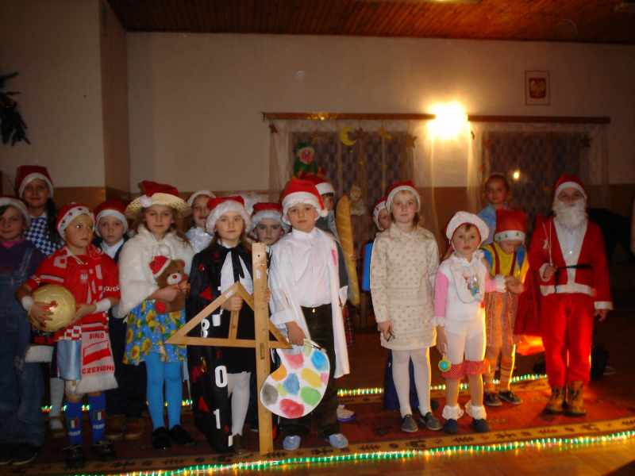

<i>2005-04-16 12:22:00</i>  
Akcja charytatywna w parafii pw. Świętego Brata Alberta
Akcja charytatywna w parafii pw. Świętego Brata Alberta w Szówsku oraz w Szkole Podstawowej Nr 5 - wydanie ponad 60 paczek dla potrzebujących.
  

Akcja charytatywna w parafii pw. Świętego Brata Alberta w Szówsku oraz w Szkole Podstawowej Nr 5 - wydanie ponad 60 paczek dla potrzebujących.
  

<i>2005-06-01 12:21:00</i>  
Festyn z okazji &quot;Dnia Dziecka&quot;
Festyn z okazji "Dnia Dziecka" w Gimnazjum i Szkole Podstawowej w Chłopicach oraz w Gimnazjum i Szkole Podstawowej w Laszkach.
  

Festyn z okazji "Dnia Dziecka" w Gimnazjum i Szkole Podstawowej w Chłopicach oraz w Gimnazjum i Szkole Podstawowej w Laszkach - rozdanie nieodpłatnie w konkursach 150 paczek ze słodyczami, zabawkami i odzieżą.
  
<a href="#" class="loadImages">Załaduj Zdjęcia</a> 

 

<i>2005-06-08 12:18:00</i>  
Wizyta na Ukrainie
06.Wizyta na Ukrainie - Jaworów - przekazanie polskim dzieciom pomocy w postaci darów materialnych i rzeczowych
  

Wizyta na Ukrainie - Jaworów - przekazanie polskim dzieciom pomocy w postaci darów materialnych i rzeczowych
  
<a href="#" class="loadImages">Załaduj Zdjęcia</a> 

 
 
 
 

<i>2005-06-08 12:20:00</i>  
Piknik dla dzieci
Piknik w Pełkiniach dla 80 dzieci z Gimnazjum Nr 3 w Jarosławiu oraz z Gimnazjum w Zapałowie.
  

Piknik w Pełkiniach dla 80 dzieci z Gimnazjum Nr 3 w Jarosławiu oraz z Gimnazjum w Zapałowie.
  

<i>2005-09-30 12:15:00</i>  
Akcja propagandowo-uświadamiająca
Akcja propagandowo-uświadamiająca z przedstawicielami Prokuratory Rejonowej i Kuratora Sądowego
  

30.09.2005 i 17.10.2005 r. - Akcja propagandowo-uświadamiająca z przedstawicielami Prokuratory Rejonowej i Kuratora Sądowego w miejscowości Szówsko i Munina - tematem prelekcji było przestrzeganie prawa i porządku publicznego, kradzieże, włamania, problemy alkoholowe, narkotyki, uzależnienia, molestowanie seksualne i inne zjawiska zachodzące w patologii.
  

<i>2005-12-11 12:11:00</i>  
Mikołajki 2005
Imprezy charytatywne "Mikołajki" dla dzieci z "Domu Dziecka" w Jarosławiu, dzieci ze Szkoły Podstawowej w Morawsku oraz dla dzieci ze Szkoły Podstawowej Nr 7 w Dolnoleżajsku.
  

Imprezy charytatywne "Mikołajki" dla dzieci z "Domu Dziecka" w Jarosławiu, dzieci ze Szkoły Podstawowej w Morawsku oraz dla dzieci ze Szkoły Podstawowej Nr 7 w Dolnoleżajsku.

Rozdanie paczek mikołajowych w innych szkołach podstawowych w Jarosławiu. Rozdano nieodpłatnie 330 paczek ze słodyczami, zabawkami oraz odzieżą.
  
<a href="#" class="loadImages">Załaduj Zdjęcia</a> 

 
 

