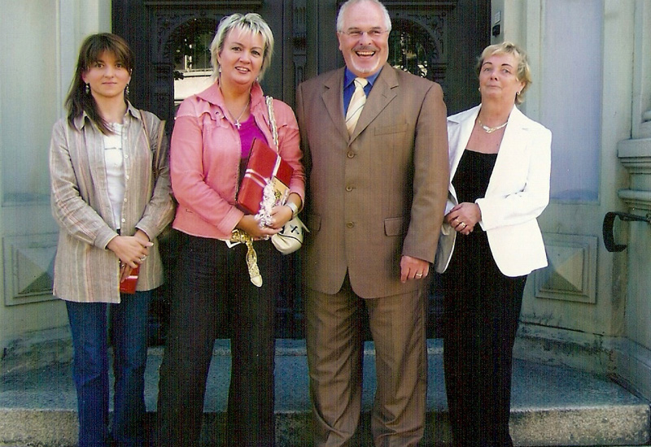
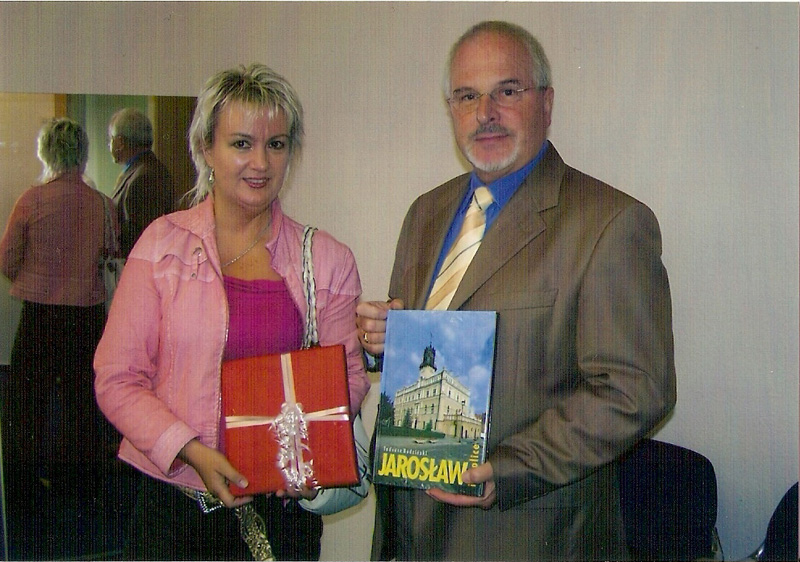
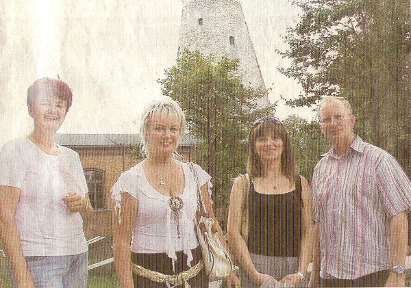
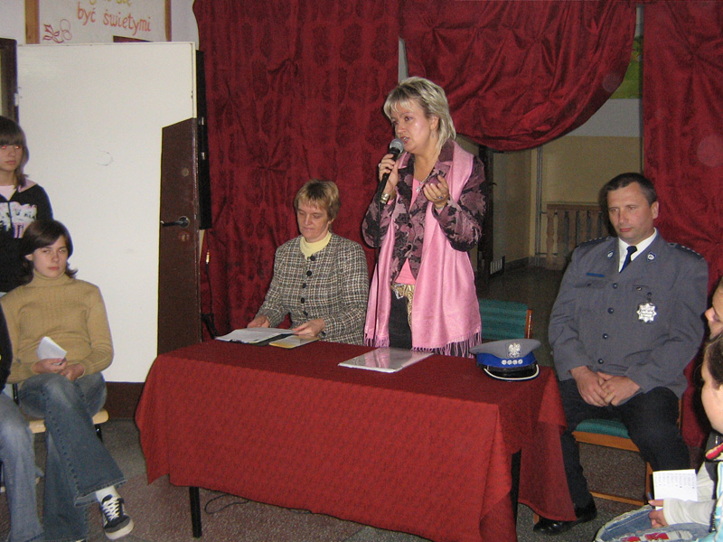
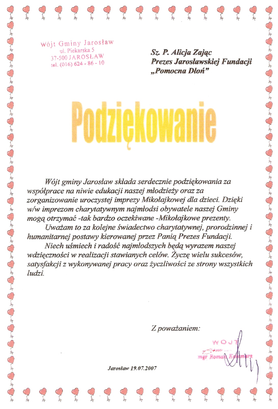
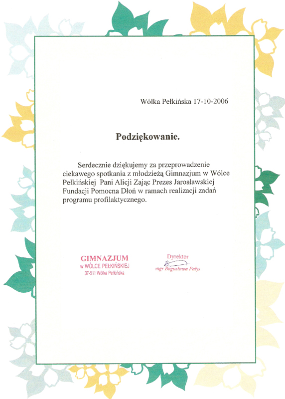
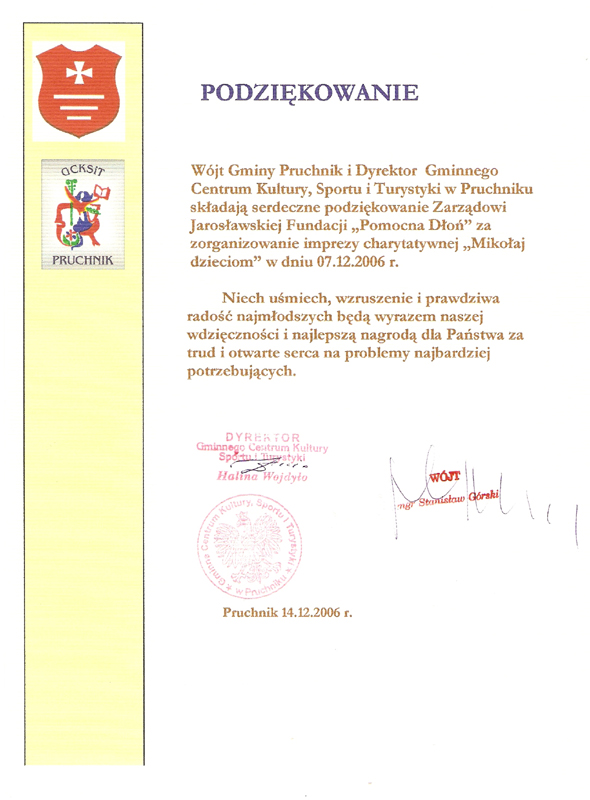

<i>2006-04-12 21:24:00</i>  
Akcja Świąteczna
Paczki dla Szkół Gimnazjum nr 3 – Jarosław, gimnazjum nr 2 – Jarosław, Szkola Podstawowa nr 4 – Jarosław, Parafia Brata Alberta – Szówsko.
  

Paczki dla Szkół Gimnazjum nr 3 – Jarosław, gimnazjum nr 2 – Jarosław, Szkoła Podstawowa nr 4 – Jarosław, Parafia Brata Alberta – Szówsko.
  

<i>2006-05-31 21:34:00</i>  
Festyn z okazji Dnia Dziecka w Morawsku
Festyn z okazji Dnia Dziecka w Morawsku. Rozdanie dzieciom z ubogich rodzin paczek ze słodyczami i gadżetów.
  

Festyn z okazji Dnia Dziecka w Morawsku.

Rozdanie dzieciom z ubogich rodzin paczek ze słodyczami i gadżetów.
  
<b>Zdjęcia:</b> 

 

<i>2006-06-02 20:53:00</i>  
Dzień Dziecka w przedszkolu nr 10
Fundacja Pomocna Dłoń zorganizowała i przeprowadziła Dzień Dziecka dla uczniów przedszkola numer 10 w Jarosławiu. Dzieci otrzymały prezenty oraz brały udział w grach, konkursach i zabawach.
  

Fundacja Pomocna Dłoń zorganizowała i przeprowadziła Dzień Dziecka dla uczniów przedszkola numer 10 w Jarosławiu. Dzieci otrzymały prezenty oraz brały udział w grach, konkursach i zabawach.

Honorowymi goścmi ww. imprezy byli przedstawiciele z miasta SCHÖNEBECK.
  
<b>Zdjęcia:</b> 

 
 
 
 
 
 
 
 

<i>2006-08-22 20:48:00</i>  
Podpisanie porozumienia z SCHÖNEBECK
Podpisane zostało porozumienie o współpracę zawartą przez Fundacje Pomocna Dłoń z Przedstawicielami Stowarzyszenia Miasta SCHÖNEBECK.
  

Podpisane zostało porozumienie o współpracę zawartą przez Fundacje Pomocna Dłoń z Przedstawicielami Stowarzyszenia Miasta SCHÖNEBECK. Dzięki umowie możliwa jest wymiana młodzieży obu miast oraz bliższe poznawanie obu kultur.
  
<b>Zdjęcia:</b> 

 
 
 

<i>2006-08-23 20:42:00</i>  
Fundacja Pomocna Dłoń w SCHÖNEBECK
Fundacja Pomocna Dłoń udała sie z wizyta do SCHÖNEBECKA. Przedstawiciele Fundacji zostali przyjęci przez burmistrza miasta Delef Nietz.
  

Fundacja Pomocna Dłoń udała sie z wizyta do SCHÖNEBECKA. Przedstawiciele Fundacji zostali przyjęci przez burmistrza miasta Delef Nietz.  Podjęto rozmowy o współpracy oaz dokonano wymiany gadżetów promujących miasta Jarosław oraz SCHÖNEBECK. Rozmowy śledziła lokalna prasa oraz telewizja.
  
<b>Zdjęcia:</b> 

 
 
 
 
 
 

<i>2006-09-03 22:06:00</i>  
Rozdanie wyprawek szkolnych dla najbiedniejszych dzieci 
Odbyło się rozdanie wyprawek szkolnych dla najbiedniejszych dzieci wytypowanych przez lokalne parafie.
  

Odbyło się rozdanie wyprawek szkolnych dla najbiedniejszych dzieci wytypowanych przez lokalne parafie: Parafia Bożego Ciała, Szkoła Podstawowa nr 6 w Jarosławiu, Parafia Chrystusa Króla, Parafia w Surochowie, Kościół w Pawłosiowie, Kościół w Radymno, Munina i Szówsko.
  

<i>2006-10-17 22:11:00</i>  
Akcja propagandowo uświadamiająca w Pełkiniach
Akcja propagandowo uświadamiająca w Gimnazjum w Wólce Pełkińskiej dotycząca problemów młodzieży, włamań, kradzieży, molestowania seksualnego. Akcja zyskała duże uznanie i proszono o przeprowadzanie ww. akcji także w innych szkołach.
  

Akcja propagandowo uświadamiająca w Gimnazjum w Wólce Pełkińskiej dotycząca problemów młodzieży, włamań, kradzieży, molestowania seksualnego. Akcja zyskała duże uznanie i proszono o przeprowadzanie ww. akcji także w innych szkołach.
  
<b>Zdjęcia:</b> 

 
 
 
 

<i>2006-12-06 22:14:00</i>  
Paczki mikołajkowe
Fundacja Pomocna Dłoń w Jarosławiu przeprowadziła akcje mikołajkowe, których efektem było przekazanie prezentów i paczek.
  

Fundacja Pomocna Dłoń w Jarosławiu przeprowadziła akcje mikołajkowe, których efektem było przekazanie prezentów i paczek dla Parafia Chrystusa Króla w Jarosławiu (168 szt.), Dom Dziecka w Jarosławiu (50 szt.), Impreza Pruchniku w MOK (136szt.), Impreza w Pełkiniach(196 szt.), Schola (50 szt.).
  
<b>Zdjęcia:</b> 

 

