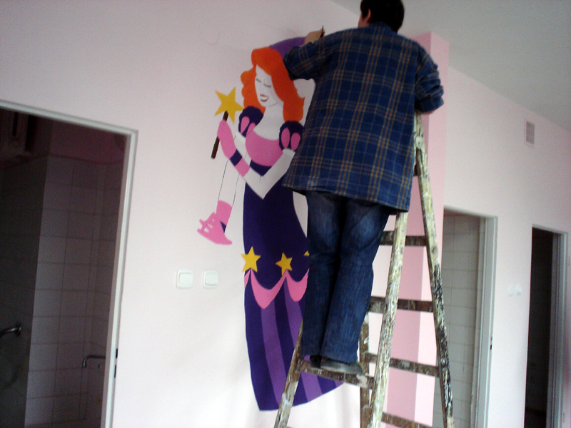
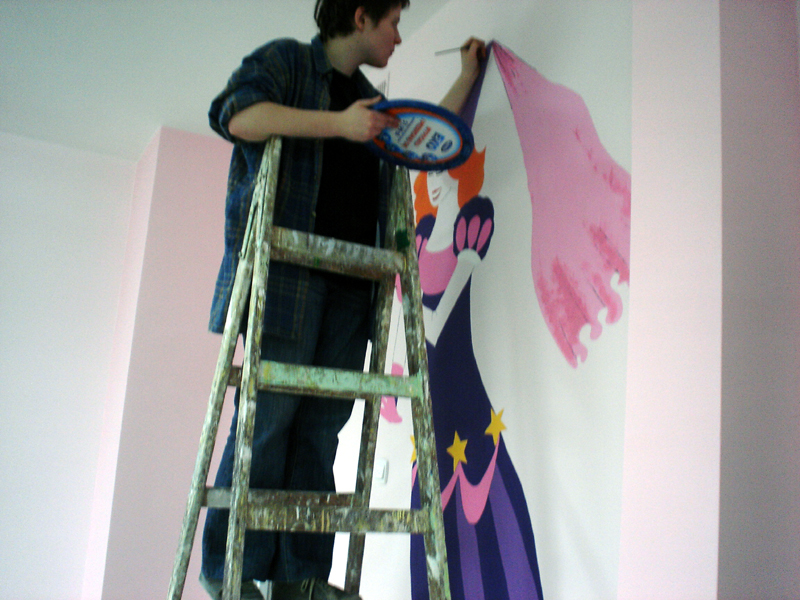
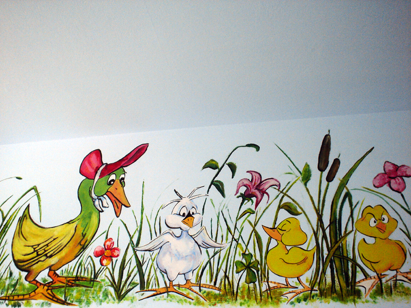
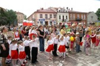
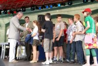
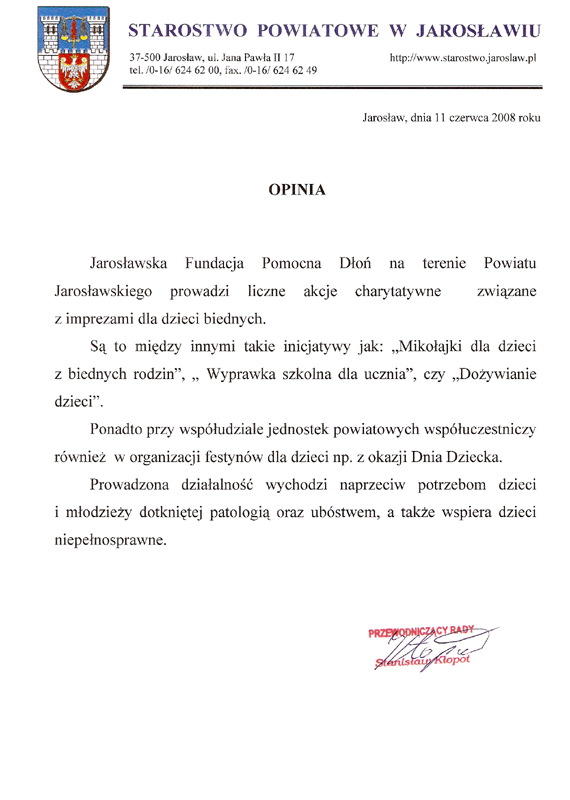
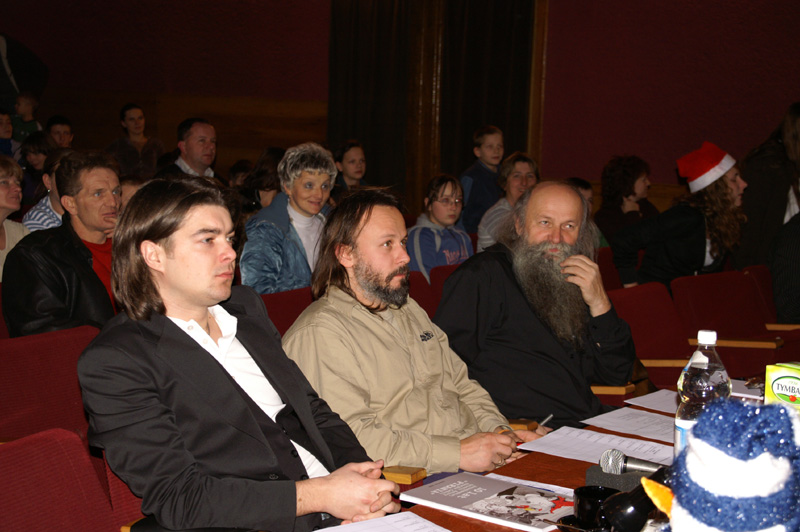
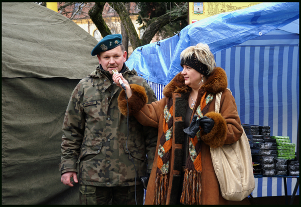
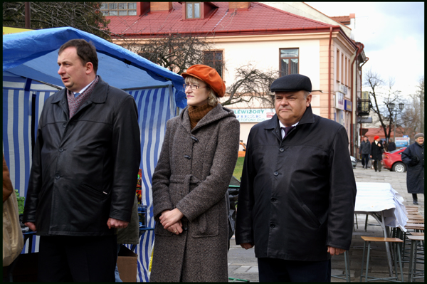

<i>2008-03-18 11:58:00</i> 
Remont dziecięcego oddziału COM
Zmodernizowano oddział dziecięcy jarosławskiego COM, który umieszczono w nowych, ładnie wykończonych pomieszczeniach, których wygląd umila czas pobytu najmłodszych pacjentów.
 

Zmodernizowano oddział dziecięcy jarosławskiego COM, który umieszczono w nowych, ładnie wykończonych pomieszczeniach, których wygląd umila czas pobytu najmłodszych pacjentów.

Bezinteresowną pomoc w tym przedsięwzięciu, wykazali wolontariusze fundacji "Pomocna Dłoń" oraz uczniowie Zespołu Szkół Plastycznych w Jarosławiu dzięki którym oddział ten stał się "bajkowym światem", w którym łatwiej będzie dzieciakom pogodzić się z koniecznością leczenia szpitalnego.
 
<a href="#" class="loadImages">ZOBACZ ZDJĘCIA</a> 

 
 
 
 
 
 
 
 
 
 
 
 
 
 
 
 
 

<i>2008-05-17 23:16:00</i> 
Promocja zdrowia
Fundacja Pomocna Dłoń w Jarosławiu zorganizowała i przeprowadziła program Szansa na Sukces.
 

Fundacja Pomocna Dłoń w Jarosławiu zorganizowała i przeprowadziła program Szansa na Sukces.

Impreza odbyła się na ul. Piekarskiej. Wystąpiły dzieci z powiatu jarosławskiego.

Szczególnie wyróżniały się dzieci z przedszkola numer 10 (grupa Plastusie i grupa Tygryski), Kornenko Adalberto z gimnazjum nr 3 w Jarosławiu, dzieci z Domu Dziecka (Daria Mendak, Anna Fogiel, Magdalena Żołądź, z Miejskiego Ośrodka Kultury w Pruchniku Paulina Szkoła i Paulina Fudali, rodzeństwo z Gimnazjum w Zapałowie Emanuel Włoch i Marcelina Włoch (tańczyli taniec latynoski), Dominika Kundera i Barbara Kasprzyk Liceum Sztuk Plastycznych w Jarosławiu.

Uczestnnicy otrzymali nagrody.
 
<a href="#" class="loadImages">ZOBACZ ZDJĘCIA</a> 

 
 
 
 
 

<i>2008-12-04 13:02:00</i> 
Mikołajki w Miejskim Osrodku Kultury w Jaroslawiu
W tym roku, z inicjatywy Jarosławskiej Fundacji „Pomocna Dłoń” oraz Miejskiego Ośrodka Kultury w Jarosławiu, Św. Mikołaj spotkał się z dziećmi nieco wcześniej: 4 grudnia 2008 r.
 

W tym roku, z inicjatywy Jarosławskiej Fundacji „Pomocna Dłoń” oraz Miejskiego Ośrodka Kultury w Jarosławiu, Św. Mikołaj spotkał się z dziećmi nieco wcześniej: 4 grudnia 2008 r.  Podczas tej najważniejszej w roku imprezy, oprócz zniecierpliwionych na prezenty maluchów, obecni byli również: Wicestarosta Powiatu Jarosławskiego Jacek Stańda, Naczelnik Wydziału Kultury, Turystyki i Promocji Miasta Joanna Mordarska, Prezes Fundacji „Pomocna Dłoń" Alicja Zając, Dyrektor Miejskiego Ośrodka Kultury Teresa Piątek oraz rodzice i nauczyciele.  Św. Mikołaj obdarował ponad 175 dzieci. Było to możliwe dzięki sponsorom, którymi byli: Regionalny Ośrodek Polityki Społecznej w Rzeszowie, Carrefour z Jarosławia, San "Pajda", Lu Polska, Zespół Szkół Spożywczych i Ogólnokształcących w Jarosławiu, Krystyna Dusiło. Ponadto 40 dzieci ze scholi w Bazylice Bożego Ciała otrzymało, 5 grudnia prezenty od Św. Mikołaja.  Spotkanie ze Św. Mikołajem poprzedził konkurs dla dzieci zatytułowany „Masz talent", który oceniał sam Tomasz Szczepanik - wokalista zespołu "Pectus".  Ponadto w rolę jury wcielili się: Henryk Cebula - jarosławski artysta, satyryk i wieloletni nauczyciel w Zespole Szkół Plastycznych w Jarosławiu, Anna Arciszewska z  Telewizji Rzeszów oraz Gabriel Manowiec - muzyk.  W konkursie wystąpiło aż 23. młodych artystów. Każdy z nich pokazał w czym najbardziej jest utalentowany. Jarosławska młodzież prezentowała swoje uzdolnienia wokalne, taneczne, recytatorskie, akrobatyczne, plastyczne oraz muzyczne. Ponadto dwie osoby wystąpiły poza konkursem.  Po burzliwej naradzie jury przyznało następujące nagrody:  I miejsce: Damian Kardasiński i Anna Barańska - para tańcząca ze SP 4  II miejsce równorzędne: Piotr Kąfera - instrumentalista ze SP 5 oraz Monika Sochacka - portrecistka z Zespołu Szkół Plastycznych  III miejsce: Weronika Makowska - recytacja ze SP 11  Ponadto wyróżnienia otrzymali wokaliści: Oliwia Wysocka z Zespołu Szkół im. Ks. Czartoryskich, Karolina Mazur ze SP 6, Aleksandra Lech ze SP 7.  Wszyscy uczestnicy konkursu otrzymali maskotki, gry, lalki, oraz ubrania. Główną nagrodą konkursu był tor Kubicy.  Gwiazdą wieczoru oprócz Św. Mikołaja był jeden z najbardziej utalentowanych wokalistów w Polsce - Tomasz Szczepanik, który zaśpiewał swoją najpopularniejszą piosenkę „To, co chciałbym ci dać". Tą piosenką wyśpiewał sobie „Słowika Publiczności" Sopot 2008. Tomasz Szczepanik wystąpił charytatywnie.

Magdalena Rożek Wydział Kultury, Turystyki i Promocji Miasta

 
 
<a href="#" class="loadImages">ZOBACZ ZDJĘCIA</a> 

 
 
 
 
 
 
 
 
 
 

<i>2008-12-23 13:05:00</i> 
Jarosławska Wigilia
23 grudnia o godz. 11.00 na Placu św. Michała w Jarosławiu Fundacja "Pomocna Dłoń" i Jednostka Wojskowa zorganizowały nieodpłatny wigilijny poczęstunek.
 

23 grudnia o godz. 11.00 na Placu św. Michała w Jarosławiu Fundacja "Pomocna Dłoń" i Jednostka Wojskowa zorganizowały nieodpłatny wigilijny poczęstunek.

W menu potraw, wydawanych przez żołnierzy Jednostki Wojskowej znalazły się:
<ul><li>ryba,</li><li>kiełbasa,</li><li>barszcz,</li><li>kawa,</li><li>herbata,</li><li>dodatki.</li></ul>
<strong>Chętnych było wielu.</strong> Dzień poprzedzający spotkanie przy wigilijnym stole był okazją do wyrażenia, iż tego rodzaju akcja, zorganizowana po raz pierwszy w Jarosławiu, ma pozytywny wymiar i będzie kontynuowana w latach następnych.

(Fot. Małgorzata Wielgos)
 
<a href="#" class="loadImages">ZOBACZ ZDJĘCIA</a> 

 
 
 
 
 
 
 
 

