

<i>2009-02-01 15:17:00</i>  
I Charytatywny Turniej Piłkarski
W Przemyślu odbył się I Charytatywny Turniej Piłkarski. Pieniądze zbierano dla chorego 17-to miesięcznego dziecka. Gościnnie wystąpił Tomasz Szczepanik, lider zespołu Pectus oraz Prezes Fundacji Pomocna Dłoń w Jarosławiu, która przekazała dary rzeczowe dla ww. dziecka.
  
  
<b>Zdjęcia:</b> 

 
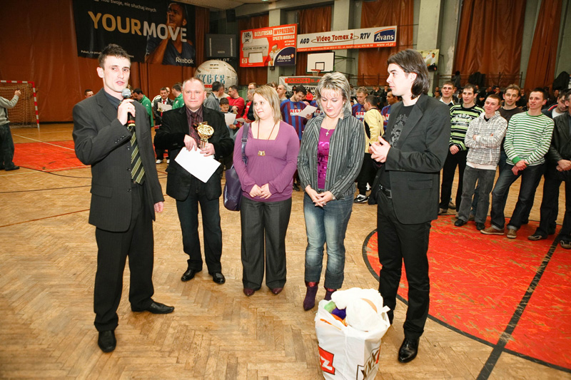 
 
 
 
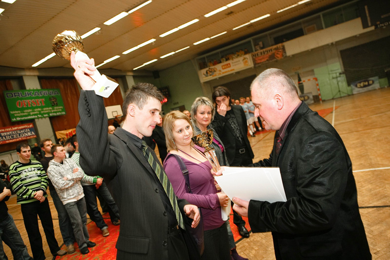 
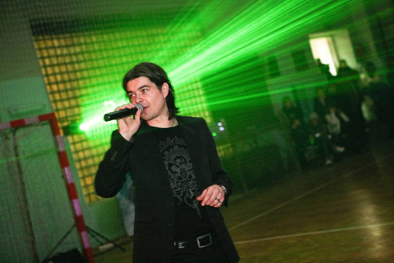 
 
 
 
 
 

<i>2009-03-25 11:51:00</i>  
&quot;Masz talent&quot; w PWSZ w Jarosławiu
25 marca br. w Państwowej Wyższej Szkole Zawodowej im. ks. Bronisława Markiewicza w Jarosławiu w Dniach Otwartych Uczelni Fundacja Pomocna Dłoń we współpracy z Urzędem Miasta Jarosławia zorganizowała i przeprowadziła eleminacje do programu artystycznego "Masz Talent". Finał odbędzie się 1-go i 2-go Maja podczas Jarosławskich Majówek.
  

 

25 marca br. w Państwowej Wyższej Szkole Zawodowej im. ks. Bronisława Markiewicza w Jarosławiu w Dniach Otwartych Uczelni Fundacja Pomocna Dłoń we współpracy z Urzędem Miasta Jarosławia zorganizowała i przeprowadziła eleminacje do programu artystycznego "Masz Talent". Finał odbędzie się 1-go i 2-go maja podczas Jarosławskich Majówek.

W jury zasiadali Przewodniczący Jacek Ścibor dr Sztuki Uniwersytetu Rzeszowskiego - Instytut Muzyki,  Henryk Cebula satyryk - grafik, absolwent Akademii Sztuk Pięknych w Krakowie, Panie z Działu Kultury, Turystyki i Promocji Miasta Urzędu Miasta Jarosławia Katarzyna Kędzior oraz Małgorzata Wielgos oraz Piotr Maziarz kierownik Działu Praktyk PWSZ.

 
  

<i>2009-04-20 18:48:00</i>  
Eliminacje I edycji programu „Masz Talent” zakończone
16 kwietnia 2009 r. Miejski Ośrodek Kultury w Jarosławiu stał się miejscem spotkań nie tylko uczniów jarosławskich szkół doskonale znających historię miasta, ale również tych, którzy w tym mieście rozwijają swoje talenty.
  

<strong>16 kwietnia 2009 r. Miejski Ośrodek Kultury w Jarosławiu stał się miejscem spotkań nie tylko uczniów jarosławskich szkół doskonale znających historię miasta, ale również tych, którzy w tym mieście rozwijają swoje talenty. </strong>  Od godz. 11.00 rozpoczęły się przesłuchania tych chętnych, którzy odpowiedzieli na zaproszenie organizatorów Wielkiej Majówki Jarosławskiej, do wzięcia udziału w rywalizacji o cenne nagrody - 2 laptopy - ufundowane przez Burmistrza Miasta Jarosławia oraz Jarosławską Fundację „Pomocna Dłoń".   Spośród kilku kategorii dominował śpiew, taniec, gra na instrumencie, akrobatyka sportowa oraz gra sceniczna.   W komisji konkursowej zasiedli: przewodnicząca <strong>Joanna Mordarska</strong> - naczelnik Wydziału Kultury, Turystyki i Promocji Miasta, <strong>Alicja Zając</strong> - prezes Jarosławskiej Fundacji „Pomocna Dłoń", <strong>Elżbieta Raczyńska</strong> - wiceprezes Fundacji „Pomocna Dłoń", <strong>Wiktor Marut</strong> i <strong>Paweł Sroka</strong> - instruktorzy MOK, <strong>Anita Banaś</strong> - inspektor Wydziału Kultury, Turystyki i Promocji Miasta oraz <strong>Marek Gliwa</strong> - plastyk.   Z 42 zgłoszonych osób (uczniów szkół podstawowych, gimnazjów i liceów), nie tylko z Jarosławia, ale i okolic <strong>JURY WYBRAŁO CZTERNASTU UTALENTOWANYCH MŁODYCH LUDZI. </strong>  Są to:   z Gimnazjum Publicznego Nr 1 w Jarosławiu:   1. <strong>Mateusz Wysocki</strong> -  śpiew.      z Gimnazjum Publicznego Nr 5 w Jarosławiu:   2. <strong>Krzysztof Szydłowski</strong> - beat box.   3. <strong>Marta Świętoniowska</strong> - śpiew.   4. <strong>Natalia Zygmunt</strong> i<strong> Gabriela Piśko</strong> - rap.      z Zespołu Szkół Ogólnokształcących im. Książąt Czartoryskich w Jarosławiu:   5. <strong>Kinga Zalot</strong>- śpiew.   6. <strong>Dominik Wołoszyn</strong>- śpiew.      z Zespołu Szkół Drogowo-Geodezyjnych i Ogólnokształcących w Jarosławiu:   7. <strong>Bernadeta Pusialska</strong> - śpiew.      z Zespołu Szkół Licealnych i Technicznych  w Jarosławiu:   8. <strong>Dawid Szynal</strong> - taniec electric boogie.      z Liceum Ogólnokształcącego im. M. Kopernika w Jarosławiu:   9. <strong>Karol Argasiński</strong> - śpiew.   10. <strong>Dominik Murawski</strong> - parkour.   11. <strong>Marek Lisańczuk </strong>-perkusja.      z Zespółu Szkół Spożywczych, Chemicznych i Ogólnokształcących  w Jarosławiu:   12. <strong>Natalia Łopuch</strong> - saksofon   13. <strong>Kamil Wywrót</strong> -fortepian.   14. <strong>Arkadiusz Kłusowski</strong> (zespół TRI LOGI)-śpiew.      W tym miejscu należą się wielkie słowa uznania dla wszystkich uczestników przeglądu „Masz Talent", za odwagę wystąpienia przed jury i licznie zgromadzoną publicznością, która niezwykle żywiołowo reagowała podczas kolejnych występów.   Jak się okazało, konkurs przyciągnął nie tylko tych, którzy pierwsze kroki na scenie mają już za sobą, ale i osoby debiutujące. Jest to dowód na to, że warto organizować podobne przedsięwzięcia, pozwalające młodzieży przełamać nieśmiałość i tremę sceniczną.   Finałową czternastkę będzie można obejrzeć w dwóch odsłonach na Wielkiej Majówce, kiedy to zostaną wyłonieni zwycięzcy.   <strong>W dniach 1 - 2 maja br. zapraszamy gorąco na jarosławski Rynek do dopingowania swoich faworytów oraz spędzenia czasu z gwiazdami serialu „Plebania", Piotrem Szczepanikiem i zespołem PECTUS.</strong>
  
<b>Zdjęcia:</b> 

 
 
 
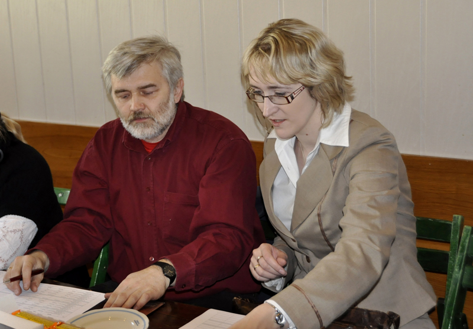 
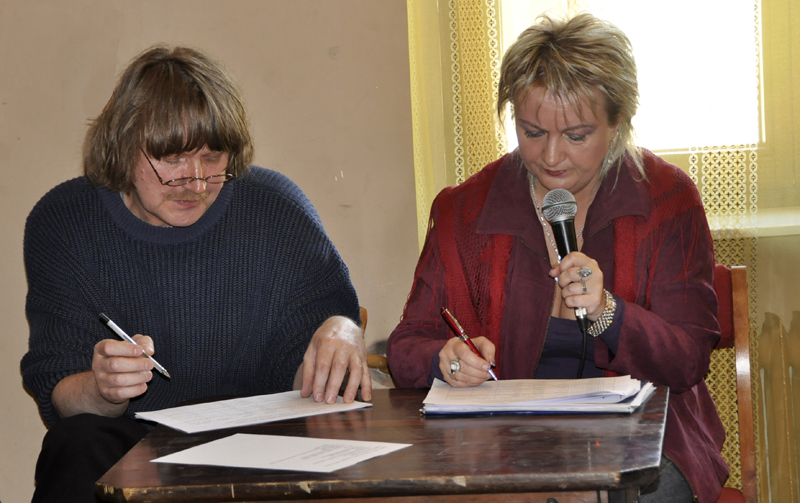 
 
 
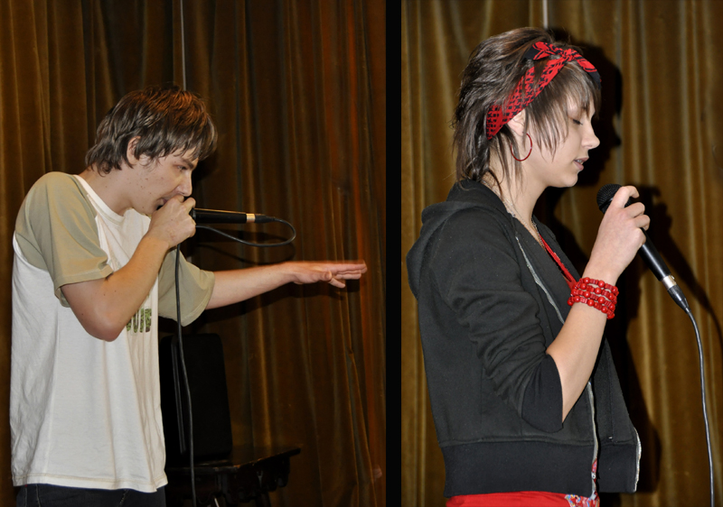 
 
 
 
 
 
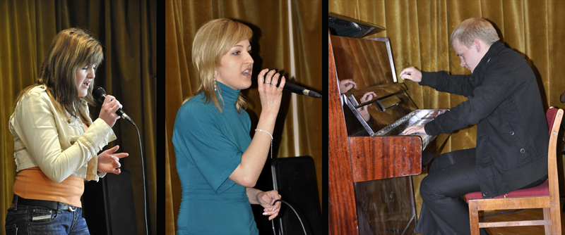 
 
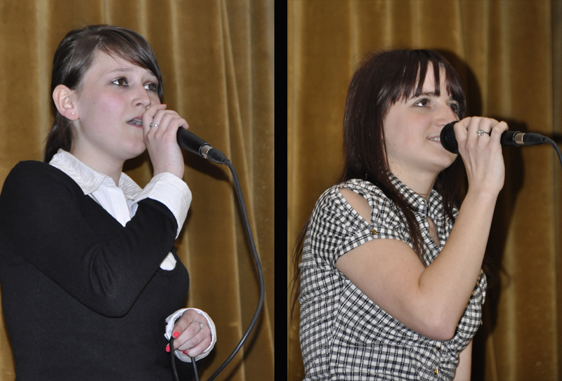 
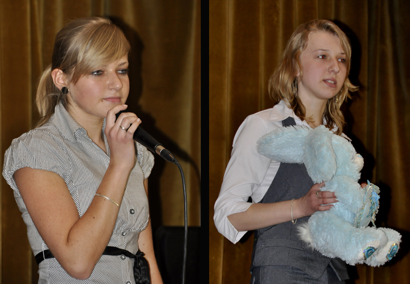 
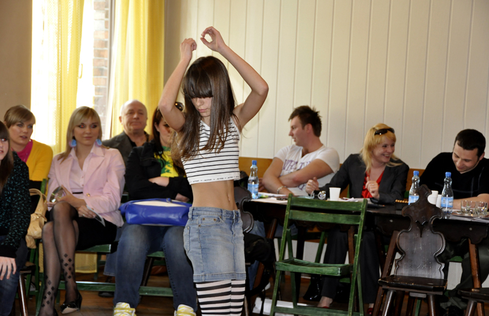 
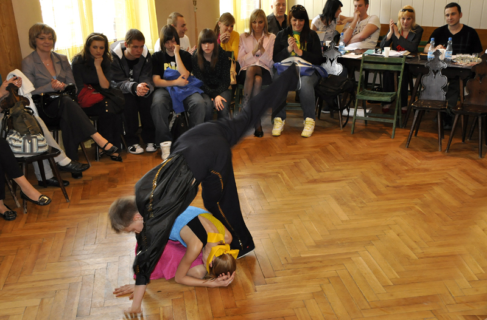 
 
 
 
 
 
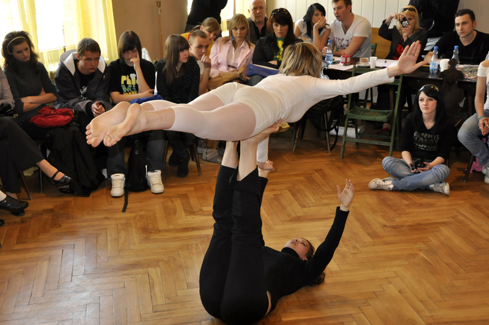 
 
 
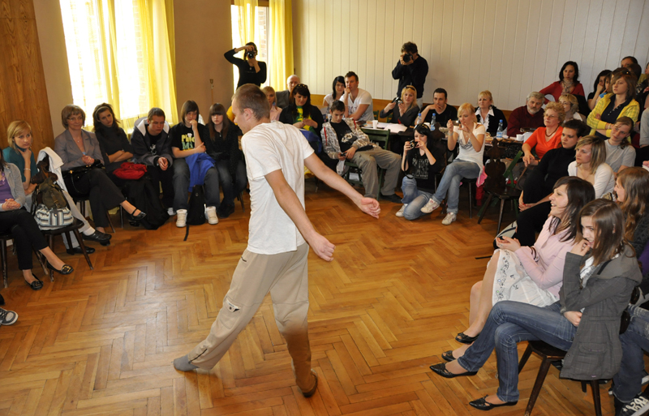 
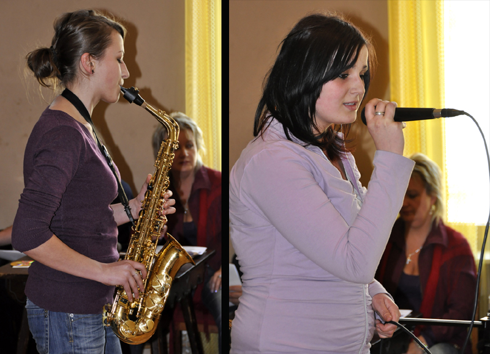 
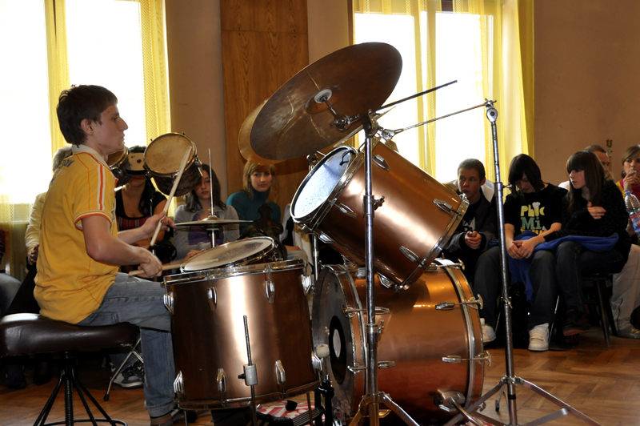 

<i>2009-05-05 20:54:00</i>  
Wielka Majówka 2009
Przygotowane atrakcje jak finał I edycji programu „Masz Talent”, spotkanie z aktorami serialu „Plebania” oraz występy gwiazd wieczoru podczas tegorocznej Majówki, przyciągnęły na jarosławski rynek licznie zgromadzoną publiczność.
  

Przygotowane atrakcje jak finał I edycji programu „Masz Talent”, spotkanie z aktorami serialu „Plebania” oraz występy gwiazd wieczoru podczas tegorocznej Majówki, przyciągnęły na jarosławski rynek licznie zgromadzoną publiczność.   <strong>1 maja</strong> od godz. 16.30 na scenie prezentował się jarosławski zespół ROAM oraz solistki i zespół GET BREAK z Miejskiego Ośrodka Kultury.  Podczas pierwszej części finału programu „Masz Talent" zostali wyłonieni zwycięzcy nagród, w tym nagrody głównej - laptopa, ufundowanego przez Jarosławską Fundację „POMOCNA DŁOŃ". Spośród 10 osób występujących przed komisją w składzie: przewodniczący: <strong>Tomasz Szczepanik</strong> - lider zespołu PECTUS, zastępca: <strong>Alicja Zając</strong> - prezes Jarosławskiej Fundacji „POMOCNA DŁOŃ", członkowie: <strong>dr Jacek Ścibor</strong> - artysta muzyk, <strong>Anna Arciszewska</strong> - redaktor z TVP3 Rzeszów, <strong>Wiktor Marut</strong> - instruktor MOK w Jarosławiu wybrano trójkę najlepszych.   Główna nagroda (laptop) trafiła w ręce <strong>Kingi Zalot</strong> z Zespołu Szkół Ogólnokształcących im. Książąt Czartoryskich w Jarosławiu za śpiew.   <strong>Ewelina Przybył </strong>z Państwowej Wyższej Szkoły Zawodowej w Jarosławiu  została doceniona przez publiczność za wykonanie piosenki Maryli Rodowicz.   <strong>Dominik Murawski</strong> z Liceum Ogólnokształcącego im. M. Kopernika w Jarosławiu otrzymał wyróżnienie za pokaz parkour połączony z elementami akrobatyki.   Publiczność mogła również obejrzeć występ trzyosobowego zespołu Y-CLAN. Panowie zachwycili wszystkich swoją sprawnością fizyczną i niezwykle trudnymi układami choreograficznymi.   <strong>O godz. 20.00 rozpoczął się koncert gwiazdy wieczoru, zespołu PECTUS.</strong> Atmosfera podczas jego występu była niezwykle gorąca.   Tego dnia imprezę prowadził Paweł Sroka - instruktor MOK.   <strong>2 maja</strong> mieszkańcy Jarosławia i nie tylko mogli spotkać się z aktorami popularnego serialu „Plebania":  <strong>Włodzimierzem Matuszakiem</strong> (ks. Antoni Wojtowicz proboszcz Tulczyna),  <strong>Katarzyną Łaniewsk</strong>ą (Józefina Lasek „babcia Józia", gospodyni proboszcza w Tulczynie),  <strong>Bernadettą Machałą-Krzemińską</strong> (Krystyna Cieplak-Walencik, siostra proboszcza),  <strong>Katarzyną Skarżanką </strong>(Wanda - pracowniczka urzędu gminy, narzeczona Zbyszka),  <strong>Stanisławem Górką</strong> (Zbigniew Sroka,były mąż Haliny, były kościelny),  oraz producentem serialu Stanisławem Krzemińskim.   W tym celu, w Wielkiej Izbie Rynek 6 o godz. 16.00 została zorganizowana konferencja prasowa, na której wszystkich obecnych przywitał organizator Wielkiej Majówki 2009 - Burmistrz Miasta Jarosławia Andrzej Wyczawski. Aktorzy zostali przyjęci przez jarosławian niezwykle ciepło. Odpowiadali na wiele pytań związanych z serialem „Plebania" i planami aktorów wychodzącymi poza serial. Nie mogło zabraknąć także pytań, dotyczących samego Jarosławia i wrażeń aktorów z pobytu w naszym mieście.   Po spotkaniu z aktorami na scenie można było oglądać występy zespołów Powiatowego Ogniska Baletowego z Jarosławia przeplatane konkursem wiedzy o „Plebanii". Konkurs prowadzili aktorzy: Bernadetta Machała-Krzemińska i Włodzimierz Matuszak. Publiczność okazała się doskonale zorientowana w serialowych perypetiach bohaterów.   O godz. 18.30 rozpoczęła się druga część finału programu „Masz Talent". Dziesięciu uczestników oceniała komisja w składzie: przewodnicząca: <strong>Joanna Mordarska</strong> - naczelnik Wydziału Kultury, Turystyki i Promocji Miasta w Urzędzie Miasta Jarosławia, zastępca: <strong>Aneta Fila </strong>- właścicielka Biura Turystyki „POLONEZ" w Jarosławiu, członkowie: <strong>Elżbieta Tkacz</strong> - dyrektor Miejskiej Biblioteki Publicznej w Jarosławiu, aktorzy z serialu „Plebania": <strong>Katarzyna Łaniewska</strong>, <strong>Katarzyna Skarżanka</strong>, <strong>Stanisław Górka</strong> oraz <strong>Anita Banaś</strong> - inspektor w Wydziale Kultury, Turystyki i Promocji Miasta.   Obrady komisji przebiegały bardzo burzliwie. Głosy były podzielone co do przyznania pierwszego miejsca. Ostatecznie podczas głosowania 4 do 2, przy 1 głosie wstrzymującym się laptop ufundowany przez Burmistrza Miasta Jarosławia Andrzeja Wyczawskiego trafił w ręce <strong>Bartosza Cebuli </strong>z Zespołu Szkół Plastycznych w Jarosławiu za film pt. „Homicida". Artyści byli pod wielkim wrażeniem telentu młodego "filmowca". Dlatego też poza główną nagrodą Bartosz otrzymał od producenta "Plebanii" zaproszenie do Warszawy na plan serialu.   Drugą osobą, która wywarła ogromne wrażenie na komisji był <strong>Dominik Wołoszyn</strong> z Zespołu Szkół Ogólnokształcących im. Książąt Czartoryskich w Jarosławiu. Otrzymał voucher na wyjazd do Lwowa ufundowany przez Biuro Turystyki POLONEZ, mp 4 oraz kontrakt na występy podczas miejskich imprez kulturalnych.   Dodatkowo wyróżnieni zostali:   <strong>Bernadeta Pusiarska</strong> z Zespołu Szkół Drogowo-Geodezyjnych i Ogólnokształcących w Jarosławiu za śpiew - otrzymała voucher na wyjazd do Lwowa ufundowany przez Biuro Turystyki POLONEZ z Jarosławia oraz <strong>Marek Lisańczuk</strong> z Liceum Ogólnokształcącego im. M. Kopernika w Jarosławiu za grę na perkusji. Otrzymał kontrakt na występy podczas miejskich imprez kulturalnych oraz zaproszenie od producenta serialu „Plebania" do Warszawy.   Po wręczeniu nagród przez burmistrza Andrzeja Wyczawskiego i komisję konkursową aktorzy zaśpiewali dla publiczności piosenkę tytułową z serialu „Plebania". Następnie można było posłuchać jarosławskiego zespołu AD REM.  <strong>Tego wieczoru gwiazdą był Piotr Szczepanik. </strong> Od 21.00 wszyscy bawili się przy muzyce DJ Gabriela Delgado z pokazem świateł laserowych.   <strong>Organizator Wielkiej Majówki: </strong>Burmistrz Miasta Jarosławia.   <strong>Patronat medialny objęli:</strong> TVP3 Rzeszów, Polskie Radio Rzeszów S.A., Nowiny, Życie Podkarpackie, Gazeta Jarosławska, Portal Internetowy „Uath Voice".
  
<b>Zdjęcia:</b> 

 
 
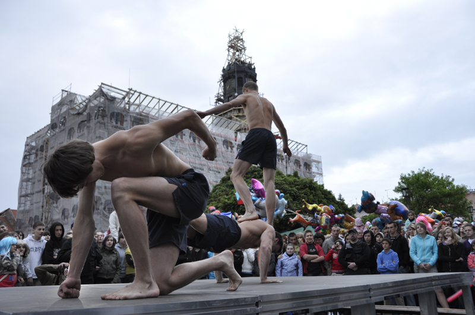 
 
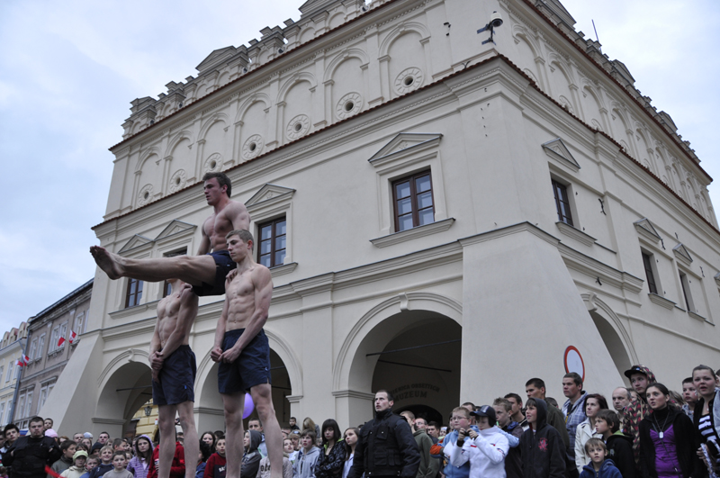 
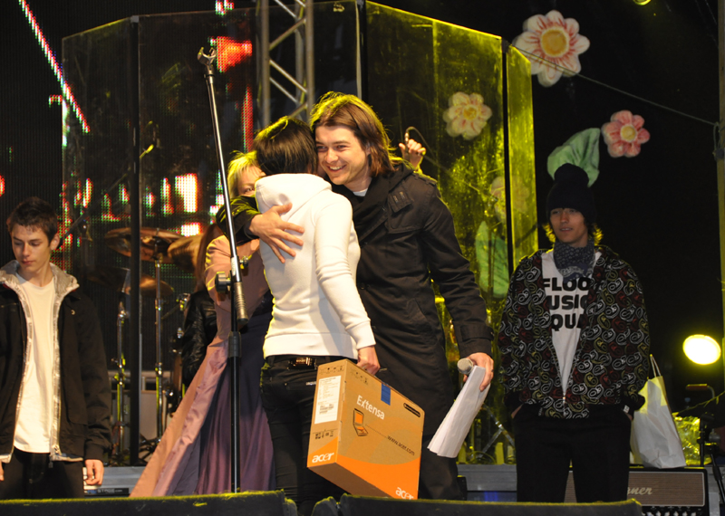 
 
 
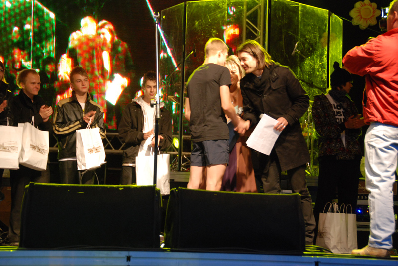 
 
 
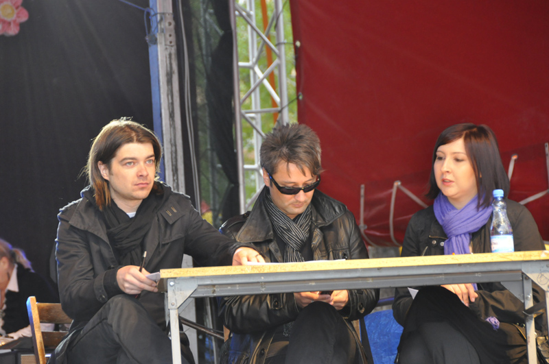 
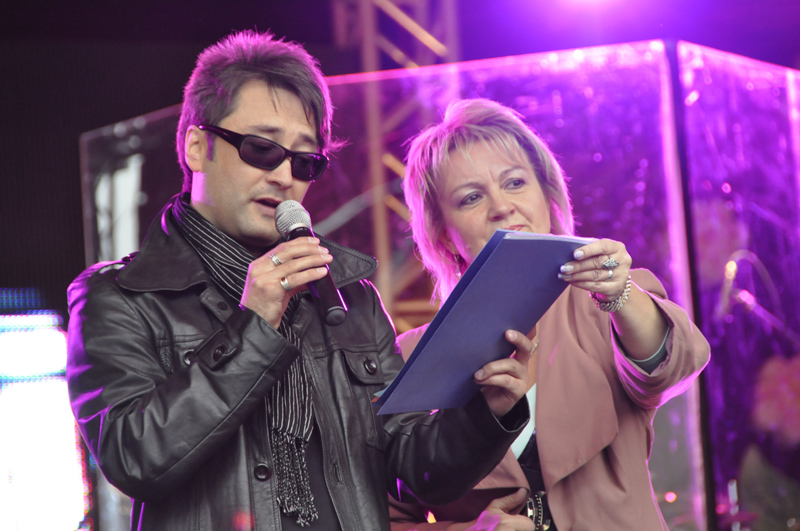 
 
 
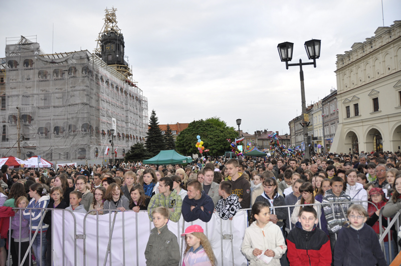 
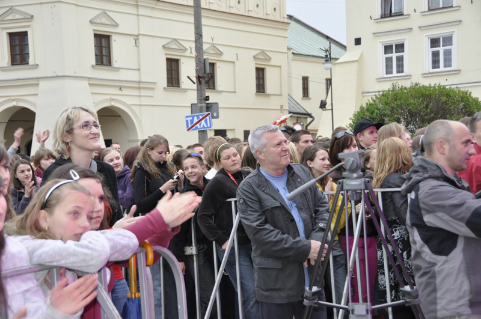 
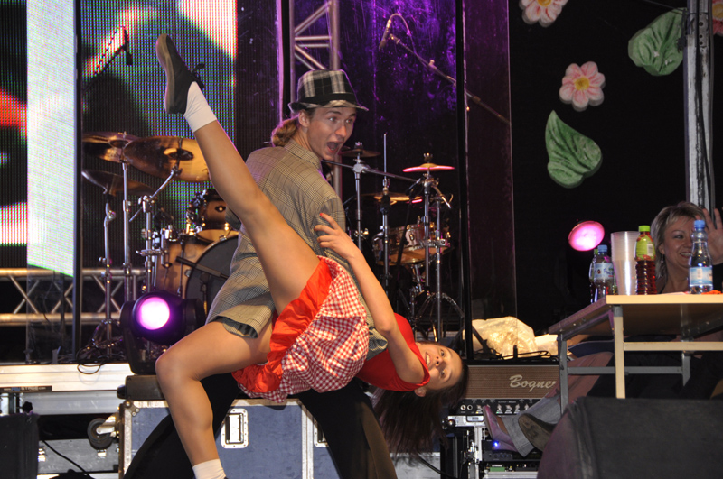 
 
 
 
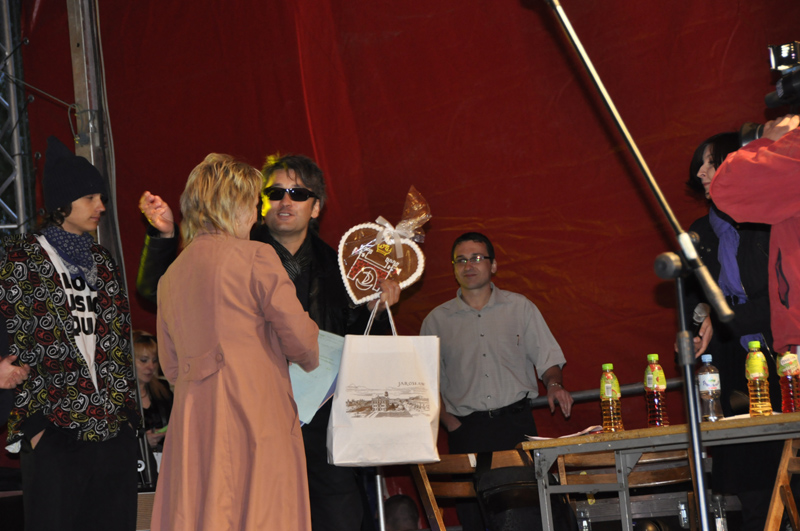 
 
 
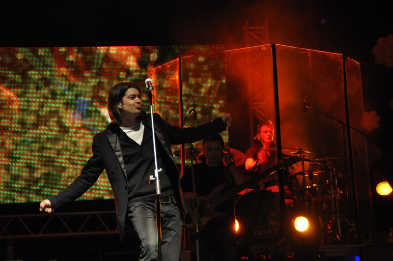 
 
 
 
 
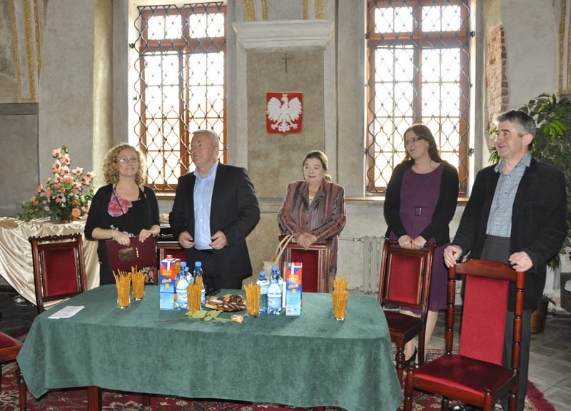 
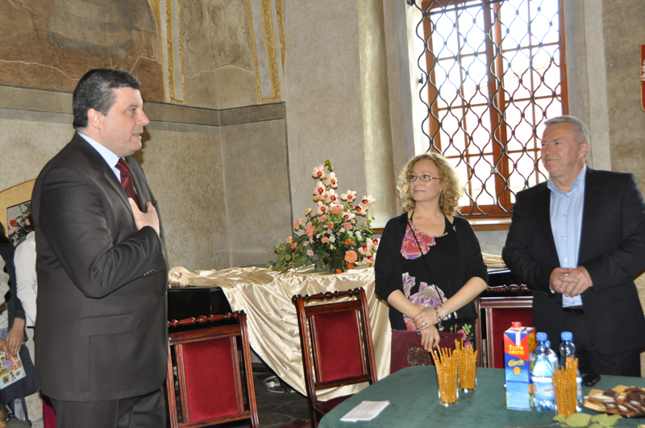 
 
 
 
 
 
 
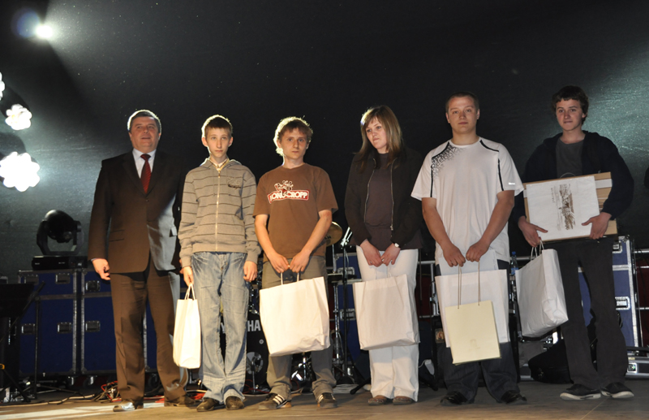 
 
 
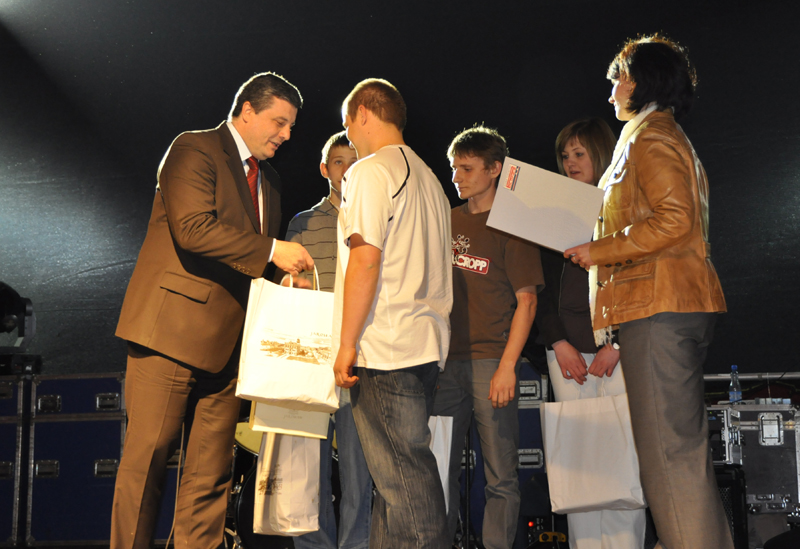 
 
 
 
 
 
 
 
 
 
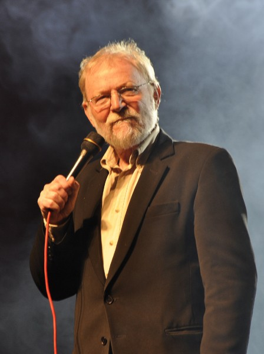 
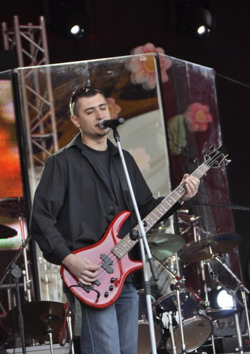 

<i>2009-05-06 15:01:00</i>  
Podziękowanie
Podziękowanie od Tomasza Lisa (Tele Tydzień) za zaproszenie na Jarosławską Majówkę przez Jarosławską Fundację Pomocna Dłoń.
  

<em>Pani Alicjo,  Witam serdecznie wszystkich przybyłych na tę wspaniałą imprezę. Jak już Państwo zauważyli, nie mogłem przybyć osobiście z powodów siły wyższej (siła wyższa dosłownie – uroczystość błogosławieństwa zaślubin bliskich) Pozwolę sobie podziękować Państwu przede wszystkim za to, że jesteście właśnie tutaj, za waszą dobroć, która jako jedyna jest tak naprawdę w stanie zmienić świat na lepsze. Zacznijmy go zmieniać tu w Jarosławiu, przyczyńmy się do zmiany sytuacji życiowej tych wspaniałych dzieci, przecież w każdym z nich zawarte jest marzenie Boga. Pozwolę sobie sparafrazować tutaj piękną myśl Talbotta "kto ratuje jedno życie, ratuje cały świat" na stwierdzenie "kto zmienia życie jednego dziecka, zmienia cały świat" Tą parafrazą rozpocznijmy zatem zmieniać świat już od teraz, gorąco zapraszam wasze serca do wsparcia tej pięknej sprawy. Liczymy na Was, waszą dobroć, działanie.  Dziękuję gorąco za to zaproszenie Jarosławskiej fundacji pomocna dłoń, a przede wszystkim Pani Prezes Alicji Zając, która stara się całym sercem, każdego dnia, aby pomóc tym wspaniałym dzieciom. Bierzmy z niej przykład.  Pozdrawiam wszystkich i życzę Wam wspaniałej zabawy. Bądźmy hojni, niech dobry czyn świadczy o nas, o tym, jacy jesteśmy naprawdę.   Pozdrawiam Tomasz Lis Tele Tydzień </em>
  

<i>2009-05-10 21:41:00</i>  
Koncert Charytatywny w Jarosławiu jakiego jeszcze nie było!!!
Informujemy, że dn. 21.05.2009 r. w Hali Sportowo-Widowiskowej Miejskiego Ośrodka Sportu i Rekreacji im. burmistrza Adolfa Dietziusa w Jarosławiu odbędzie się KONCERT CHARYTATYWNY „POMÓŻMY WOJTUSIOWI”. Podczas wydarzenia wystąpią gwiazdy muzyki pop: - Ivan Komarenko, Zespół Civer - „Kanikuły" oraz „Hity na czasie" - Marek Sierocki
  

Informujemy, że dn. 21.05.2009 r. w Hali Sportowo-Widowiskowej Miejskiego Ośrodka Sportu i Rekreacji im. burmistrza Adolfa Dietziusa w Jarosławiu odbędzie się <strong>KONCERT CHARYTATYWNY „POMÓŻMY WOJTUSIOWI”</strong>.

 Podczas wydarzenia wystąpią gwiazdy muzyki pop:  - <strong>Ivan Komarenko</strong>,  - <strong>Zespół CLIVER - „Kanikuły"</strong> oraz <strong>„HITY NA CZASIE" - Marek Sierocki </strong>  Organizatorem koncertu jest <strong>Jarosławska Fundacja Pomocna Dłoń</strong> przy wsparciu <strong>Burmistrza Miasta Jarosławia</strong>.   Czas trwania imprezy: 18.00-23.00.   <strong>Bilety do nabycia: </strong> - w Miejskim Ośrodku Kultury w Jarosławiu, pl. A. Mickiewicza 5  - w Miejskim Ośrodku Sportu i Rekreacji im. burmistrza Adolfa Dietziusa w Jarosławiu, ul. Sikorskiego 5  - w Sklepie Muzycznym "HIT" przy ul. Jana Pawła II w Jarosławiu    <strong>UWAGA KONKURS! </strong>  Dwie osoby, które jako pierwsze udzielą prawidłowych odpowiedzi na 3 poniższe pytania konkursowe otrzymają bilety wstępu na koncert.   1. Jaki jest tytuł piosenki, którą zaśpiewał Ivan Komarenko podczas 50. Konkursu Piosenki Eurowizji – Kijów 2005?   2. Jaki tytuł nosi pierwsza płyta zespołu CLIVER wydana w 2007 roku?   3. Kiedy Marek Sierocki rozpoczął prowadzenie muzycznego kącika w niezwykle popularnym telewizyjnym programie informacyjnym - „Teleexpress"?    Odpowiedzi proszę przesyłać na adres mailowy: <a href="mailto:ktp@jaroslaw.pl">ktp@jaroslaw.pl</a>

 

<strong>Filmy z występu </strong>

    

    

    

    
  
<b>Zdjęcia:</b> 

 
 
 
 
 
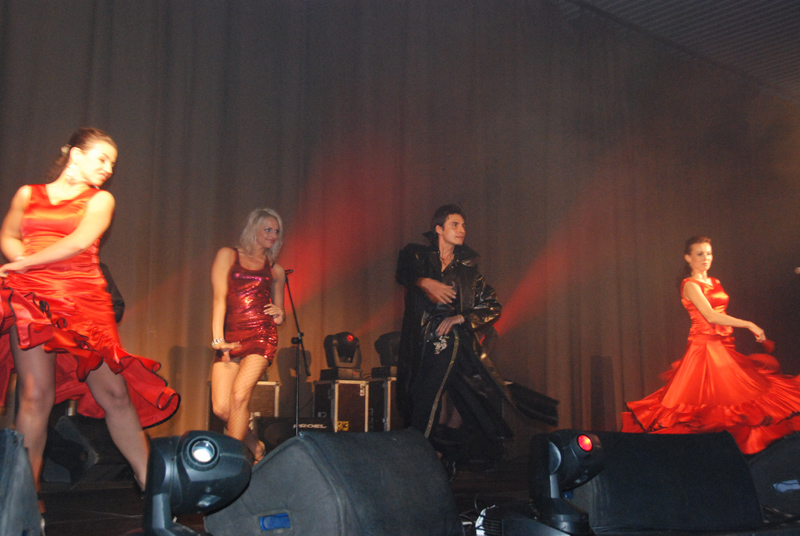 
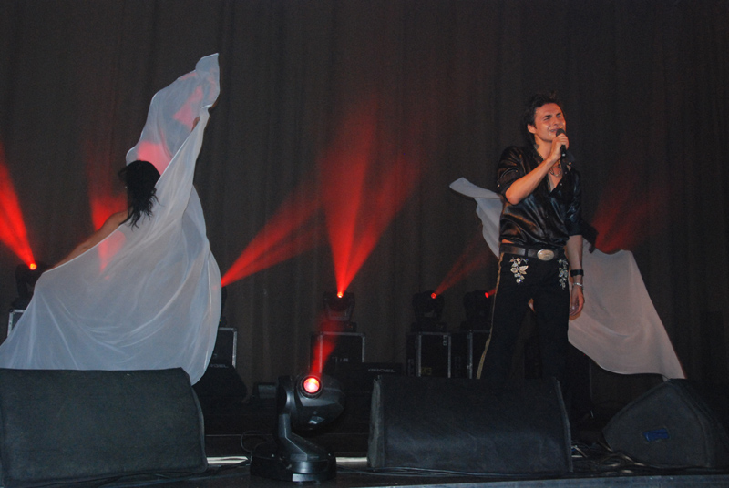 
 
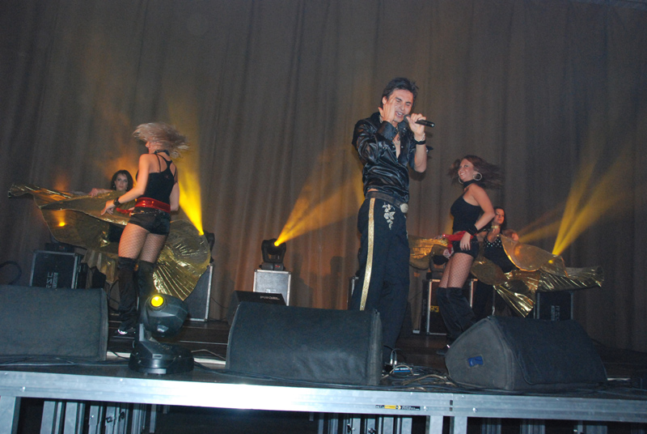 
 
 
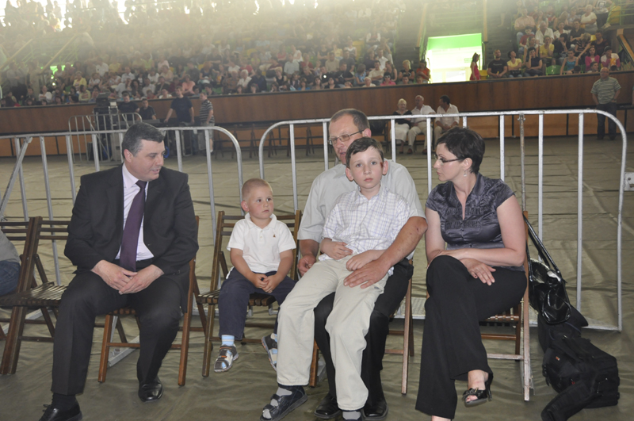 
 
 
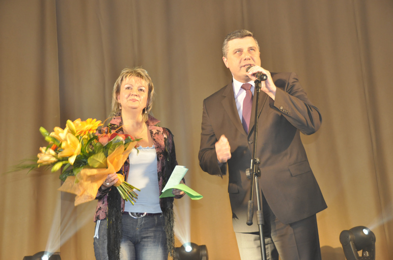 
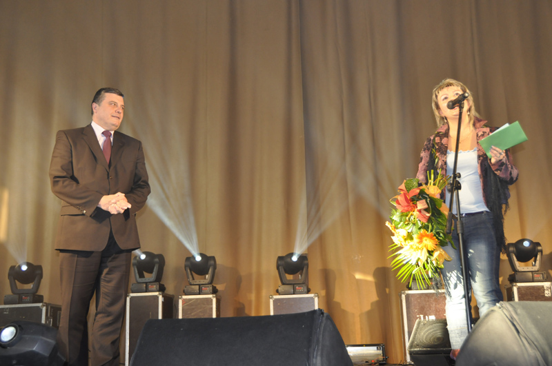 
 
 
 
 
 
 
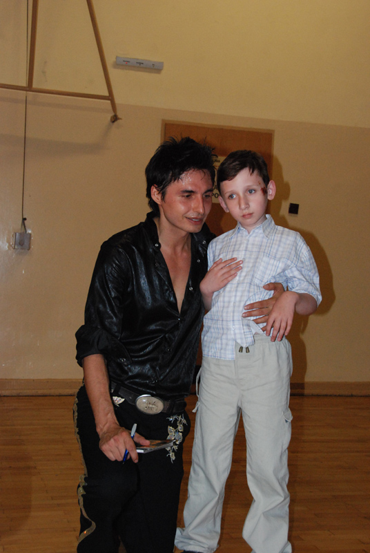 
 
 
 
 
 
 

<i>2009-06-17 10:57:00</i>  
Podziękowanie

W imieniu Wojtusia i jego rodziców dziękujemy za okazane przez Państwa wsparcie i pomoc. Dzięki Państwa wspaniałomyślności udało nam się zebrać znaczą sumę pieniędzy, które zostaną przekazane na ręce potrzebującemu Wojtusiowi.

Wierzymy, że każda zebrana złotówka przyczyni się do poprawy stanu zdrowia chłopca.

  
  
<b>Zdjęcia:</b> 

 

<i>2009-07-17 09:29:00</i>  
Organizacjia letniego wypoczynku dla dzieci z Ukrainy
Z inicjatywy ks. Mariana Bocho – proboszcza parafii pw. Bożego Ciała w Jarosławiu, 1 lipca 2009 r. nasze miasto odwiedziło ok. 40 dzieci z Czarnobyla.
  

Z inicjatywy ks. Mariana Bocho – proboszcza parafii pw. Bożego Ciała w Jarosławiu, 1 lipca 2009 r. nasze miasto odwiedziło ok. 40 dzieci z Czarnobyla.   Do organizacji letniego wypoczynku dla dzieci z Ukrainy włączyły się <strong>Jarosławska Fundacja Pomocna Dłoń</strong>, <strong>Urząd Miasta Jarosławia</strong> oraz <strong>Jarosławskie Stowarzyszenie Oświaty i Promocji Zdrowia</strong>.   Główną atrakcją dla dzieci był program <strong>„Masz talent"</strong>, który zorganizowała <strong>Jarosławska Fundacja Pomocna Dłoń</strong>. Kilkuosobowe jury w składzie: Alicja Zając - prezes fundacji, Elżbieta Raczyńska - wiceprezes fundacji, Joanna Mordarska - naczelnik Wydziału Kultury, Turystyki i Promocji Miasta i ks. Bogdan Czerwiński, oceniało występy najodważniejszych kolonistów.

I tak <strong>I miejsce</strong> zdobyła ośmioletnia Wiktoria, która w kategorii tanecznej zachwyciła publiczność i komisję, <strong>II miejsce</strong> zdobył trzynastoletni Walentyn - młody plastyk i gitarzysta Aleksander, <strong>III miejsce</strong> - trzynastolatek Andriej - młody piosenkarz i czternastolatek Igor recytacja i śpiew oraz Wiktoria i Anna - tancerki.   Nagrody w postaci odtwarzacza DVD, plecaków szkolnych, słodyczy, odzieży sportowej i przyborów szkolnych ufundowane zostały przez Jarosławską Fundację Pomocna Dłoń i Urząd Miasta Jarosławia.   Jak się okazuje wspólnymi siłami i przy dobrej organizacji można sprawić najmłodszym wiele radości.

    

 
  
<b>Zdjęcia:</b> 

 
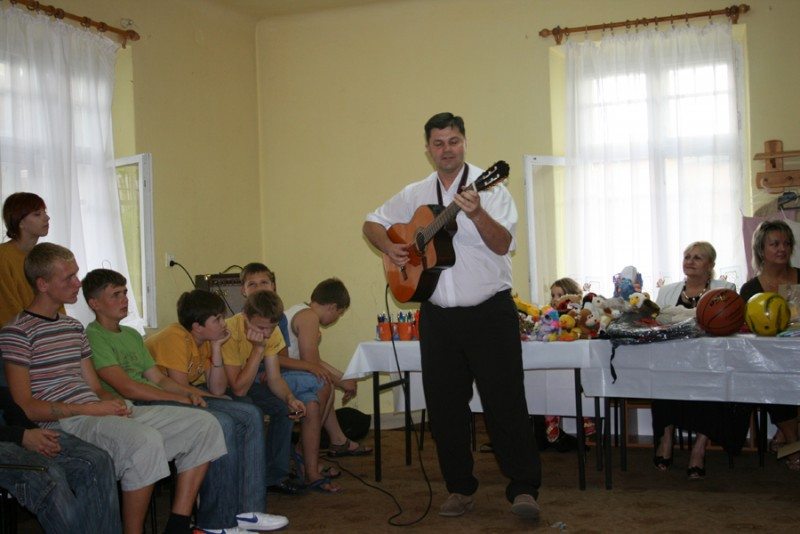 
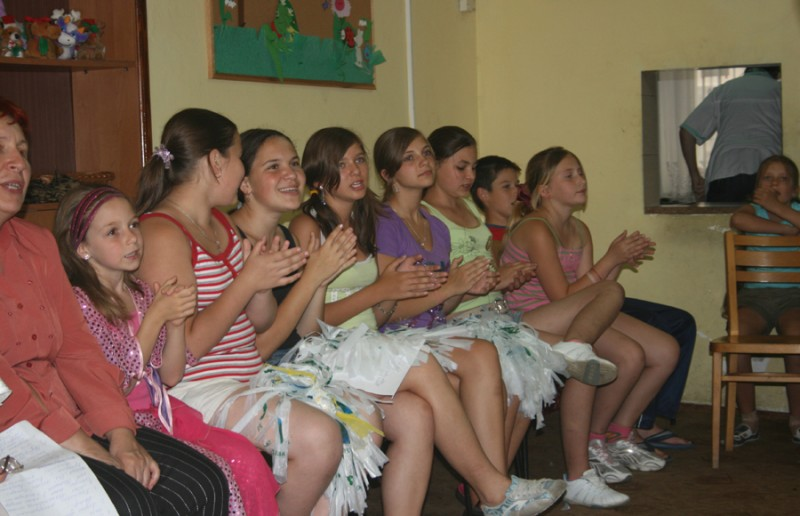 
 
 
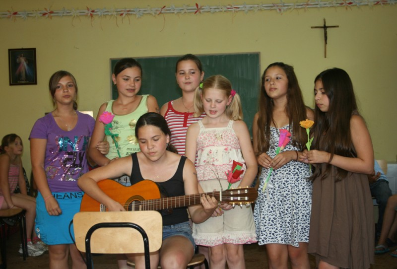 
 
 
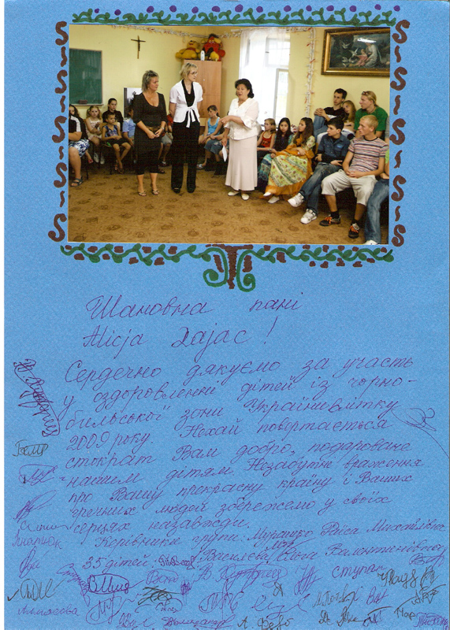 

<i>2009-08-22 11:35:00</i>  
Wywiad ze Strongmanem Arturem Walczakiem 
Wywiad przeprowadzony przez Prezes Jarosławskiej Fundacji Pomocna Dłoń ze utytułowanym zawodnikiem Strongmanem Arturem Walczakiem, zwycięzcą w Pucharze Europy 2004 (22 sierpień 2009 XIX Zlot Motocyklowy Motorbike).
<ul></ul>  

Artur Walczak "Waluś" "Bad Boy" – startujący w zawodach Strongman od 2002 roku:
<ul><li>Mistrz Europy Centralnej w parze z Grzegorzem Peksą,</li><li>wielokrotny zwycięzca Pucharu Polski "Spartakus Strongman Cup", </li><li>uczestnik Mistrzostw Polski w 2008 r.,</li><li>Mistrz Wielkopolski 2005 r., </li><li>w latach 2003-2004 v/C Mistrz Wielkopolski, </li><li>uczestnik Pucharu Świata w Dubaju, Ukrainie, Węgrzech, Słowacji, Polski,</li><li>Rekordzista Świata w "spacerze farmera" w Dubaju w roku 2006 r., </li><li>rywalizujący i wielokrotnie zwyciężający z takimi zawodnikami jak Irek Kuraś,Sławek Orzeł, Grzegorz Peksa, Robert Szczepański, Tyberiusz Kowalczyk występujących przez wiele lat i znanych z cyklu programowego "Siłacze" w telewizji TVN.</li></ul>
<strong>Alicja Zając: </strong>Witam Pana sredecznie! Proszę powiedzieć co Pana do nas sprowadza i jak się podoba nasze miasto?

<strong>Artur Walczak:</strong><em> W ostatnim okresie jestem dość częstym gościem w Państwa mieście Jarosławiu i nie ukrywam że mam wielką ochotę wystąpić wraz z moimi przyjaciółmi na zawodach lub pokazie dla mieszkańców tego pięknego miasta.</em>

<strong>Alicja Zając: </strong>Mam nadzieje ze uda się zorganizować Panu taka imprezę u nas.

<strong>Artur Walczak: </strong><em>Ja również mam nadzieję, że mieszkańcy będą mieć ochotę patrzeć na nasze zmagania.</em>

<strong>Alicja Zając:</strong> A kogo oprócz pana moglibyśmy zobaczyć?

<strong>Artur Walczak:<em> </em></strong><em>Mogę zaoferować występ takich polskich gwiazd polskiego Strongman, które budowały i nadal rozszerzają sławę tego sportu jak Irek Kuraś, Tyberiusz Kowalczyk, Sławek Orzeł, Sławek Toczek i innych, których można było widywać w programie „Siłacze” TVN</em>

<strong>Alicja Zając: </strong>Wiem, że bierzecie i udzielacie się dość czynnie w imprezach charytatywnych

<strong>Artur Walczak:<em> </em></strong><em>Jeżeli jest taka sposobność, w miarę swoich sił i możliwości i staramy się pomagać w takich akcjach.</em>

<strong>Alicja Zając:</strong> I właśnie w tym miejscu chciałabym podziękować Panu i Pana koledze za kalendarze i widokówki oraz koszulkę z autografami które ofiarowaliście mojej fundacji „Pomocna Dłoń". Zostaną wystawione na aukcję a dochód uzyskany ze sprzedaży przekażemy na cele charytatywne.

<strong>Artur Walczak: </strong><em>Cała przyjemność po naszej stronie. Mogę w obiecać w moim i kolegów Strongmanów imieniu pomoc w miarę możliwości.</em>

<strong>Alicja Zając:</strong> Dziękuję za ten krótki wywiad i mam nadzieje ze uda się Panu zrealizować swój plan zorganizowania imprezy Strongman w naszym mieście.

<strong>Artur Walczak:</strong> <em>Ja również mam taką nadzieję. Zainteresowanych proszę o kontakt ze mną pod nr 721054077.</em>
  
<b>Zdjęcia:</b> 

 
 
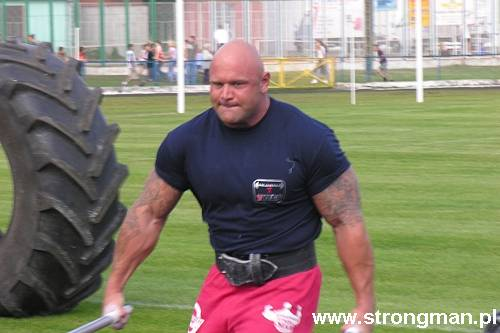 
 

<i>2009-08-25 10:53:00</i>  
Przekzanie wyprawkek szkolnych - wrzesień 2009
Po raz kolejny Jarosławska Fundacja Pomocna Dłoń zorganizowała pomoc dla najbiedniejszych dzieci w formie około 40 wyprawek szkolnych.  Wśród akcesoriów znalazły się plecaki, zeszyty, przybory do pisania.
  

Blisko czterdzieści plecaków z przyborami trafiło do uczniów Szkoły Podstawowej nr 7 w Jarosławiu i dzieci z jarosławskiej parafii Bożego Ciała oraz parafia  św. Brata Alberta w Szówsku.   Każdy miał w środku niespodziankę w postaci nowych piórników, zeszytów, długopisów i słodyczy. <strong>Łączny koszt każdej wyprawki wyniósł ok. 100 zł.</strong>   Fundacja wręczała dzieciom takie podarunki kilka dni przed rozpoczęciem roku szkolnego. Dlatego niektóre z nich nie odebrały ich osobiście, bo nie wróciły jeszcze z wakacji.  Pieniądze na wyprawki pochodziły z funduszy fundacji oraz <strong>Regionalnego Ośrodka Polityki Społecznej w Rzeszowie</strong>.   Kryterium branym pod uwagę przy rozdzielaniu wyprawek była sytuacja materialna dzieci oraz ich zaangażowanie w życie szkoły  Szczególne podziękowania dla <strong>Fabryka Pieczywa Cukierniczego "SAN" - PAJDA Sp. z o.o. </strong>oraz <strong>LU Polska</strong> za przekazanie słodyczy.

 

 
  
<b>Zdjęcia:</b> 

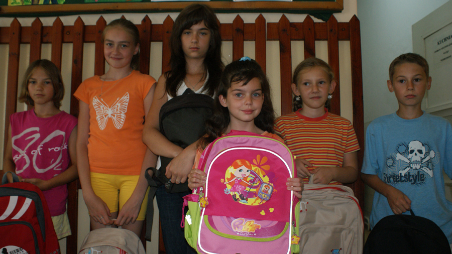 
 
 

<i>2009-10-01 12:11:00</i>  
III Międzynarodowa Konferencja pt. &quot;Śladami Jana III Sobieskiego na Ukrainie i w Polsce&quot;
Mając na celu pielęgnowanie pamięci o słynnym Polaku zorganizowano III Międzynarodową Konferencję pt. "Śladami Jana III Sobieskiego na Ukrainie i w Polsce", która odbyła się w dniach 24-27 września 2009 r. w Jaworowie na Ukrainie.
  

<strong>380 rocznica urodzin jednego z największych władców Europy – Jana III Sobieskiego.</strong>  Mając na celu pielęgnowanie pamięci o słynnym Polaku zorganizowano <strong>III Międzynarodową Konferencję pt. "Śladami Jana III Sobieskiego na Ukrainie i w Polsce"</strong>, która odbyła się w dniach 24-27 września 2009 r. w Jaworowie na Ukrainie.  W programie konferencji miały miejsce wykłady i wycieczki (Jaworów, Żółkiew, Olesko, Podhorce, Złochów, Zbaraż, Kamieniec Podolski, Chocim, Jazłowiec, Buchacz, Lwów) śladami największego dowódcy w dziejach Polski, występy dzieci i młodzieży ze szkół na Ukrainie, które reprezentowały swój folklor, oraz zespół wokalny Centrum Kultury Willanów z Warszawy występujący w strojach narodowych z epoki Jana III Sobieskiego, wystawa kultury regionalnej.  W konferencji brali udział:
<ul><li>Zofia Michniewicz – Prezes Towarzystwa Kultury Polskiej Ziemi Lwowskiej</li><li>Jacek Żur – przedstawiciel Konsulatu Generalnego RP we Lwowie</li><li>Paweł Czerkas – który wygłosił wzruszającą prelekcję o Janie III Sobieskim</li><li>Mariusz Olbromski – Dyrektor Muzeum Narodowego Ziemi Przemyskiej</li><li>Stanisław Ślęzak – Wójt Gminy Radymno</li><li>Tomasz Petry – były przewodniczący Rady Powiatu Jarosławskiego</li><li>Alicja Zając – Prezes Jarosławskiej Fundacji Pomocna Dłoń</li><li>Robert Woźniak - Dyrektor Centrum Kultury Wilanów</li></ul>  
<b>Zdjęcia:</b> 

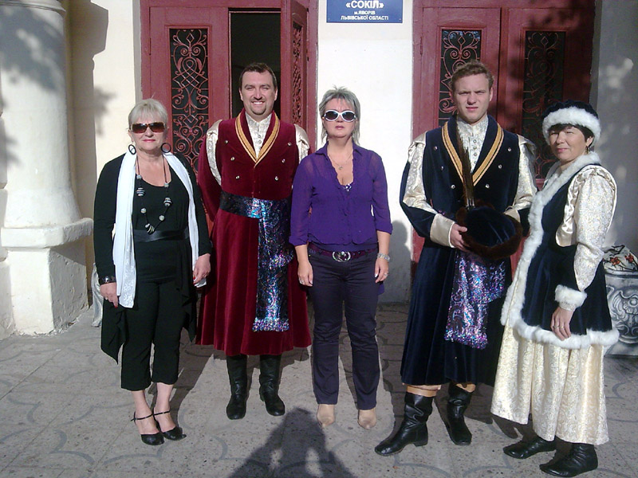 
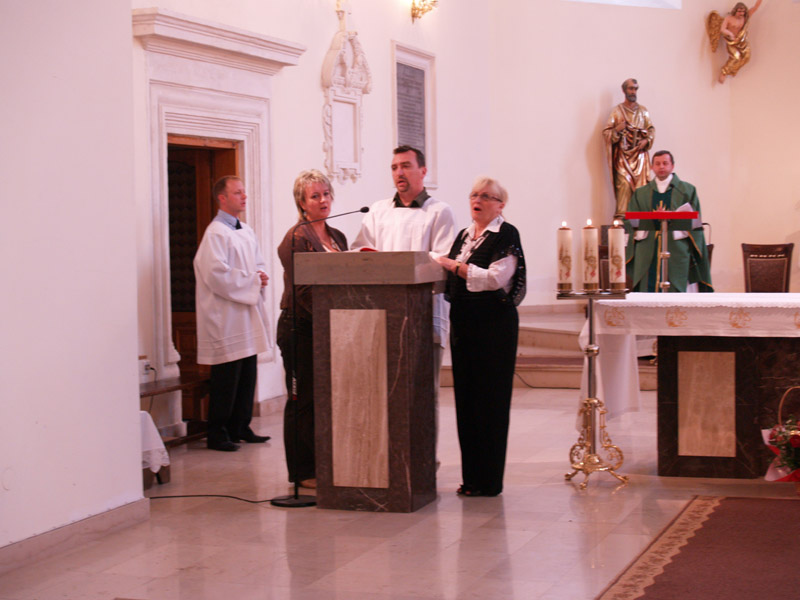 
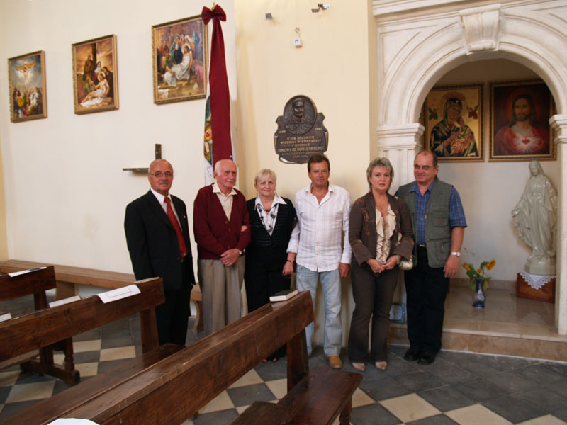 
 
 
 
 
 
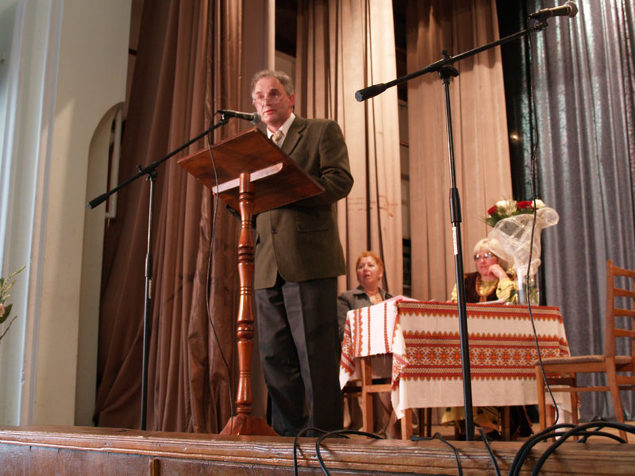 
 
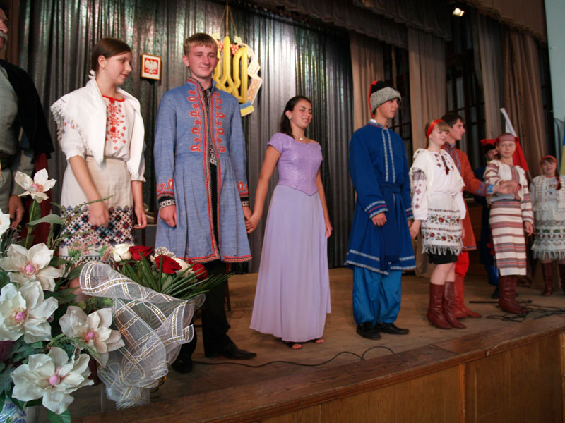 
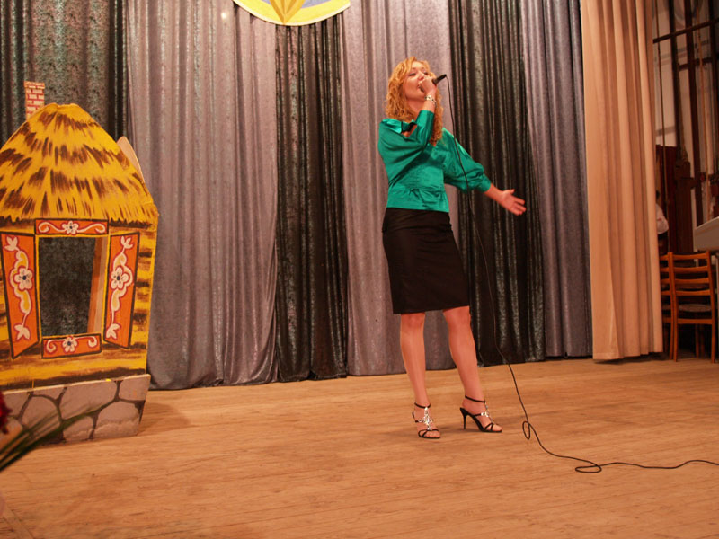 
 
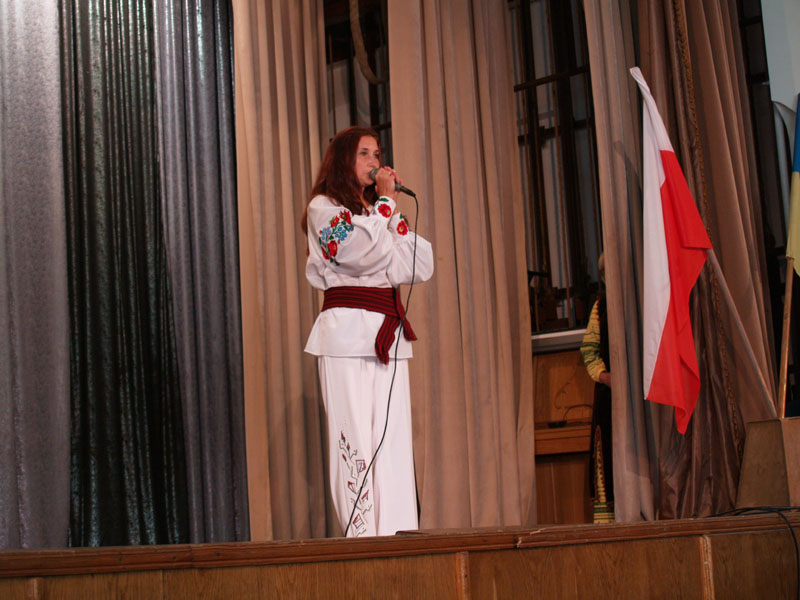 
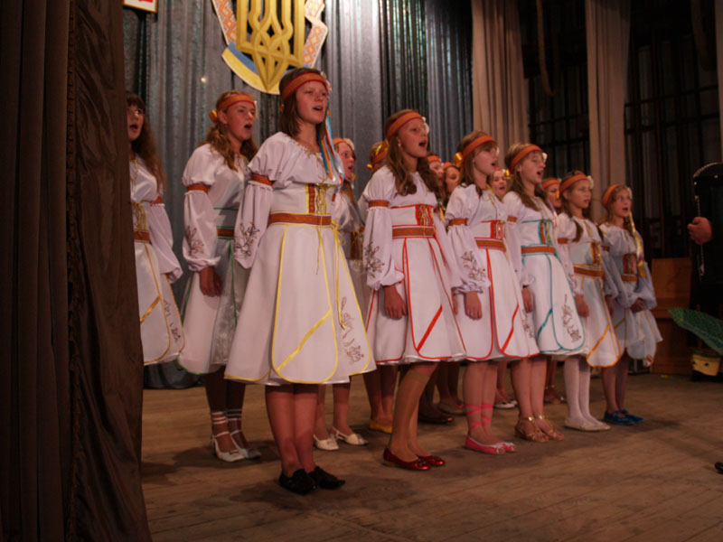 
 
 
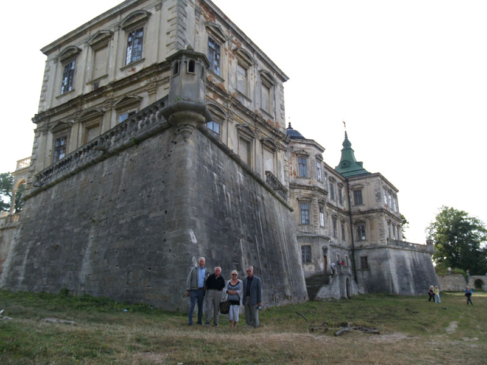 
 
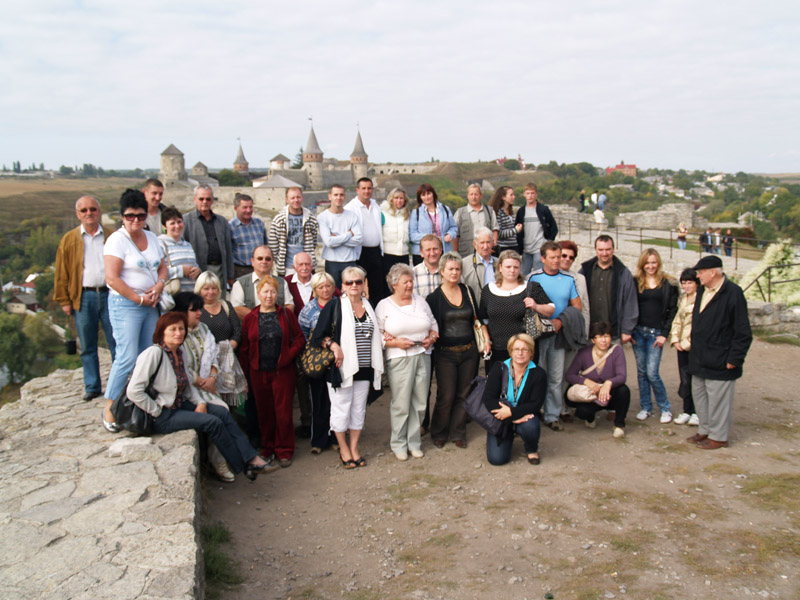 
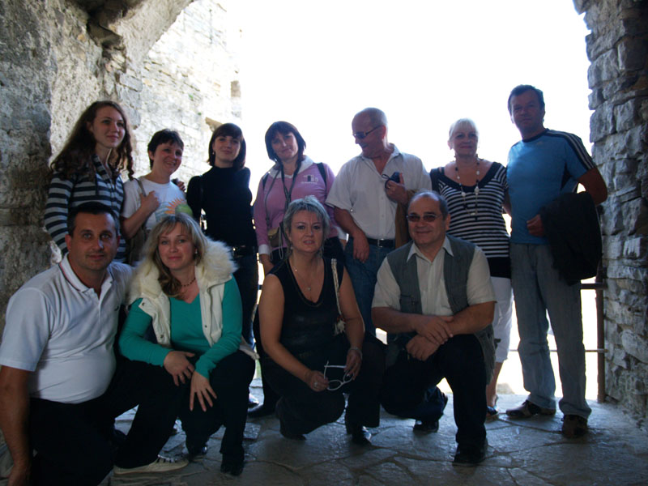 
 
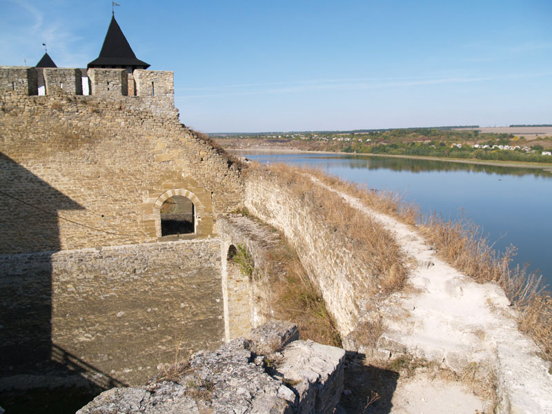 
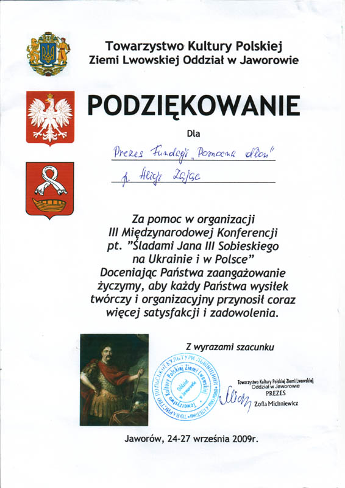 

<i>2009-10-15 11:45:00</i>  
Koncert Laureatów &quot;Masz Talent&quot; 
9.10.2009 r. odbył się koncert laureatów konkursu "Masz Talent" zorganizowany przez Jarosławską Fundację Pomocna Dłoń w Centrum Kultury i Promocji - Sala Lustrzana ul. Rynek 5. przy współudziale Burmistrza Miasta Jarosław.
  

9.10.2009 r. odbył się koncert laureatów konkursu "Masz Talent" zorganizowany przez Jarosławską Fundację Pomocna Dłoń w Centrum Kultury i Promocji - Sala Lustrzana ul. Rynek 5. przy współudziale Burmistrza Miasta Jarosław.   Imprezę rozpoczęły przemówieniem Naczelnik Wydziału Kultury, Turystyki i Promocji Miasta Jarosławia Joanna Mordarska, Dyrektor Centrum Kultury i Promocji w Jarosławiu - Iwona Turek oraz Prezes Jarosławskiej Fundacji Pomocna Dłoń - Alicja Zając   Wśród młodych artystów znaleźli się:
<ul><li>Arkadiusz Kłusowski - śpiew</li><li>Szkoła Tańca Pani Małgorzaty Przytockiej - taniec</li><li>Ewelina Przybył - śpiew (studentka PWSZ w Jarosławiu)</li><li>Karol Argasiński - śpiew (uczeń I Liceum Ogólnokształcącego im. Mikołaja Kopernika)</li><li>Yclan - zespół taneczno-akrobatyczny</li></ul>
Wysoki poziom występów został nagrodzony oklaskami. Wszyscy uczestnicy koncertu otrzymali od Fundacji upominki i prezenty.
  
<b>Zdjęcia:</b> 

 
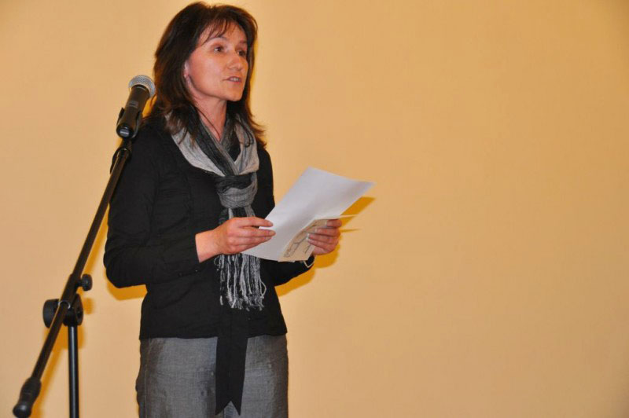 
 
 
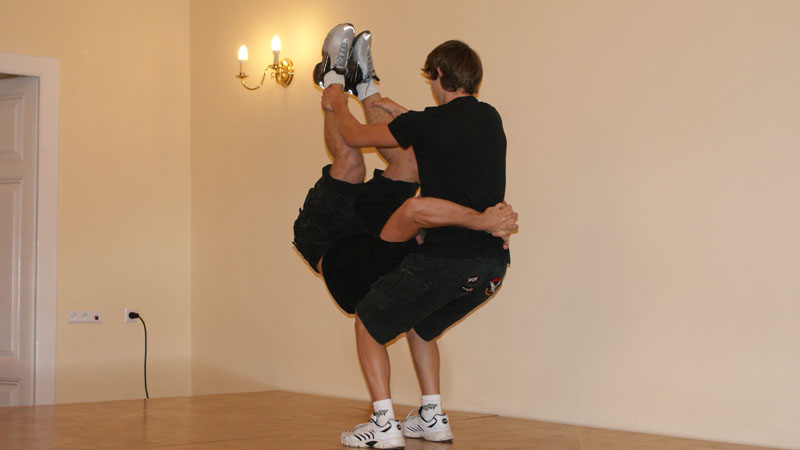 
 
 
 
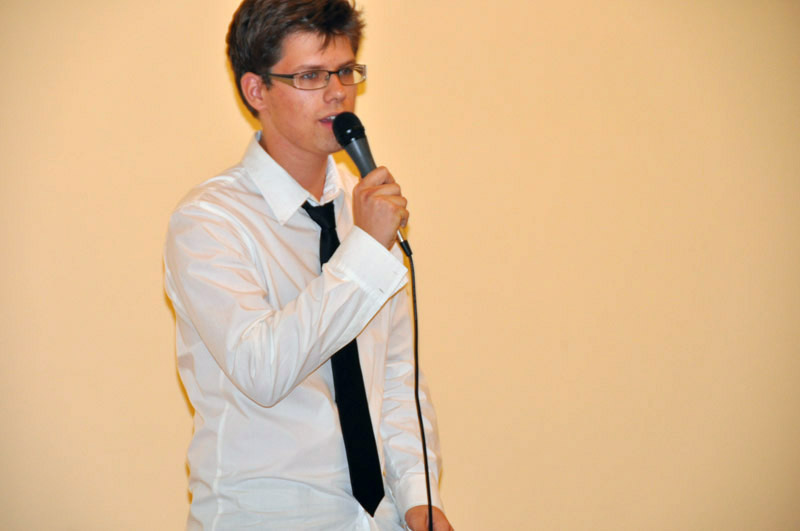 
 
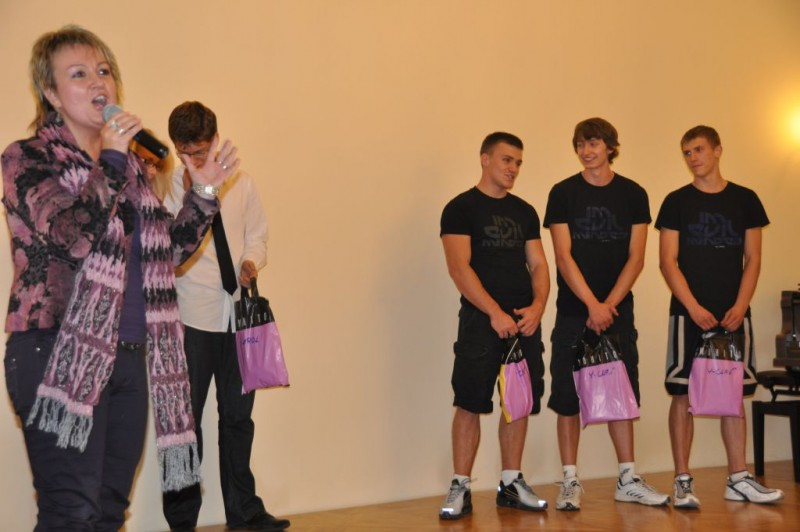 
 
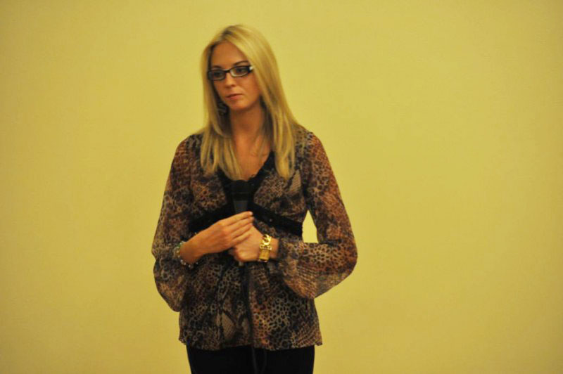 
 
 
 
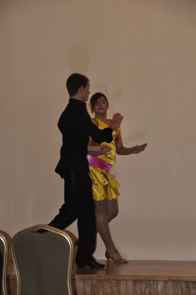 
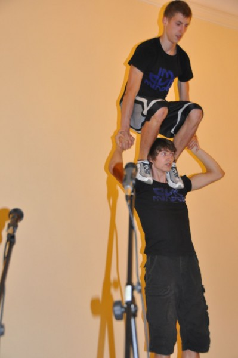 

<i>2009-10-20 16:06:00</i>  
Demonstracja filmów z koncertu laureatów konkursu &quot;Masz Talent&quot;
Zachęcamy Państwa do obejrzenia krótkich filmów nagranych podczas występów młodych artystów, laureatów konkursu zorganizowanego przez Jarosławską Fundację Pomocna Dłoń.
  

Zachęcamy Państwa do obejrzenia krótkich filmów nagranych podczas występów młodych artystów, laureatów konkursu zorganizowanego przez Jarosławską Fundację Pomocna Dłoń, który odbył się w Centrum Kultury i Promocji.

 

    

    

    

    

    

    

    

    
  
<b>Zdjęcia:</b> 

 

<i>2009-11-12 09:49:00</i>  
&quot;Pomocna Dłoń&quot; dla Wojtusia
Kwota, jaką udało się zebrać to 3 150 zł. Została ona w całości przekazana na rehabilitację Wojtka. Fundacja nie pobiera żadnych prowizji. Wszystkie pieniążki zostały przekazane. Wojtek potrzebuje stałej rehabilitacji, stąd też stała pomoc Fundacji "Pomocna Dłoń".
  

"W ubiegłym tygodniu prezes Fundacji "Pomocna Dłoń" Alicja Zając przekazała na ręce mamy Wojtka Słomy pomoc materialną.  Kwota, jaką udało się zebrać to 3 150 zł. Została ona w całości przekazana na rehabilitację Wojtka.   - Fundacja nie pobiera żadnych prowizji. Wszystkie pieniążki zostały przekazane. Wojtek potrzebuje stałej rehabilitacji, stąd też stała pomoc Fundacji "Pomocna Dłoń". Mam nadzieję, że dzięki osobom życzliwym o wielkim sercu będziemy mogli nadal pomagać zarówno Wojtkowi jak i innym naszym podopiecznym - stwierdza Alicja Zając, prezes Fundacji.   Mimo iż Wojtek powoli wraca do zdrowia, nadal wymaga stałej opieki.   - Nasze życie to ciągła bieganina. Od jednego ośrodka do drugiego, od fundacji do fundacji. Ale jesteśmy silni, musimy być silni. Dzięki temu nasz syn wraca do zdrowia. Jesteśmy wdzięczni za wszelką pomoc, to dla nas bardzo wiele - mówi mama Wojtka.   Oprócz pieniędzy Wojtek dostał także od pani Prezes wyprawkę szkolną. Bardzo zainteresował się zeszytami, może niebawem sam będzie mógł pójść do szkoły i usiąść w szkolnej ławce między swoimi rówieśnikami.   Po nowym roku rodzice Wojtka chcieliby zabrać syna na kolejny turnus i kolejne rehabilitacje. Jednakże to ogromny wydatek. Bez pomocy ludzi dobrej woli będzie to raczej niemożliwe. Dlatego wszyscy, którzy chcieliby pomóc Wojtkowi i innym podopiecznym mogą wpłacać pieniążki na konto Fundacji: 12 9096 0004 2001 0000 2264 0001 - Bank Spółdzielczy w Jarosławiu."

 

- tekst Gazeta Jarosławska, <a href="http://jaroslawska.pl/index.php?PHPSESSIONID=&amp;artykul=4422" target="_blank">www.jaroslawska.pl</a>
  
<b>Zdjęcia:</b> 

 

<i>2009-12-17 16:06:00</i>  
Wizyta św. Mikołaja w Roźwienicy
6 grudnia dzieci i młodzież z Gminy Roźwienica odwiedził św. Mikołaj. To właśnie z inicjatywy Fundacji rozdano ponad 200 mikołajkowych paczek i upominków oraz 60 pluszowych maskotek...
  

Były prezenty i miejsca na podium   6 grudnia dzieci i młodzież z <strong>Gminy Roźwienica</strong> odwiedził św. Mikołaj. Ale zanim obdarował wszystkich prezentami odbył się <strong>finał konkursu „Masz Talent” </strong>zorganizowany przez jarosławską Fundację „Pomocna Dłoń”. To właśnie z inicjatywy Fundacji rozdano <strong>ponad 200 mikołajkowych paczek i upominków oraz 60 pluszowych maskotek</strong>.

Na prośbę Fundacji św. Mikołaj odwiedził dzieci z Domu Dziecka w Jarosławiu, dzieci i młodzież Scholii mieszczącej się przy jarosławskiej Kolegiacie oraz dzieci i młodzież właśnie z Gminy Roźwienica. Do eliminacji konkursu „Masz Talent” zgłosiło się ponad 60 osób z terenu Gminy. Do wielkiego finału przeszło 16 grup. Byli wśród nich m. in. soliści, zespoły taneczne, śpiewacze i muzycy. Po naradzie jury wyłoniło zwycięzców. Wyróżnienia otrzymały: Dagmara Moskwa i Natalia Cycak. Miejsce I otrzymała Iwona Rogus, miejsce II zajęły dziewczynki z SP w Bystrowicach – Karolina Bulanowska, Aleksandra Chadała oraz Julia Mazur. Na miejscu III usytuował się Zespół Instrumentalno-Wokalny z Gimnazjum w Roźwienicy.

Nagrodę publiczności otrzymał uczeń klasy pierwszej w SP w Rudołowicach – Maksymilian Barszczak.  Gmina Roźwienica wykazała się naprawdę wysokim poziomem uczestników. Pokazali zdolną młodzież, która jak się okazuje jest nie tylko w dużych miastach, ale i w małych miejscowościach. Mikołaj docenił ich talent. Rozdał prezenty tym biedniejszym dzieciom i tym uzdolnionym. Myślę, że niebawem będziemy mogli pokazać nasze talenty – relacjonuje Alicja Zając, Prezes Fundacji „Pomocna Dłoń”. <strong>Gościem specjalnym był Arkadiusz Kłusowski</strong>.

 <em>Magdalena Mątkowska-Czyż</em>

Skład jury finału konkursu Masz Talent:
<ul><li><strong>Mieczysław Golba </strong>- poseł</li><li><strong>Tomasz Kotliński</strong> - Wójt Gminy Roźwienica </li><li><strong>Arkadiusz Kłusowski </strong>- przewodniczący jury </li><li><strong>Elżbieta Raczyńska</strong></li><li><strong>Ewa Chmiel </strong></li></ul>  
<b>Zdjęcia:</b> 

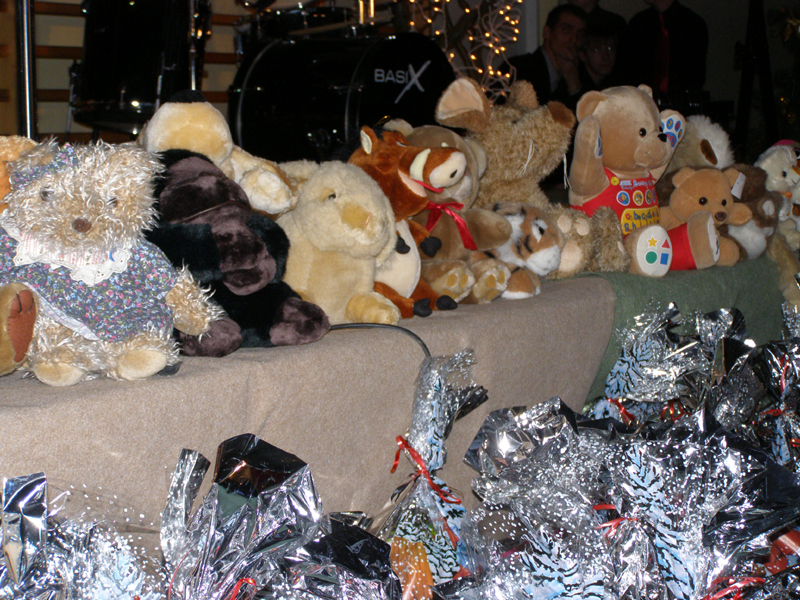 
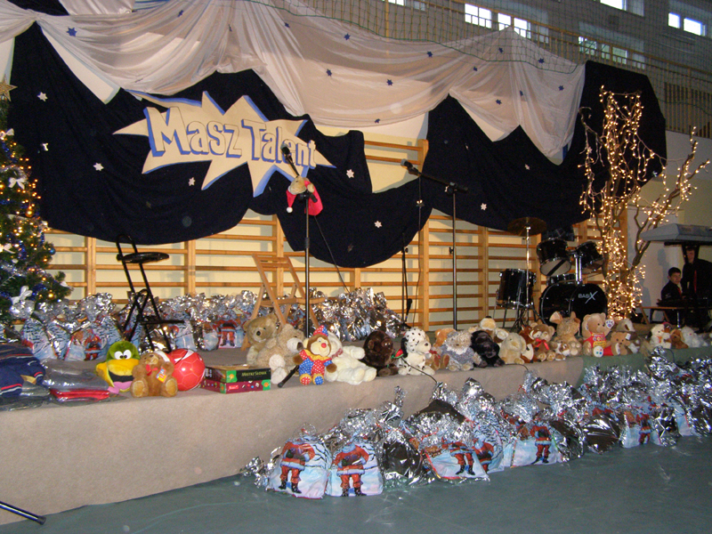 
 
 
 
 
 
 
 
 
 
 
 
 
 
 
 
 
 
 
 
 
 
 
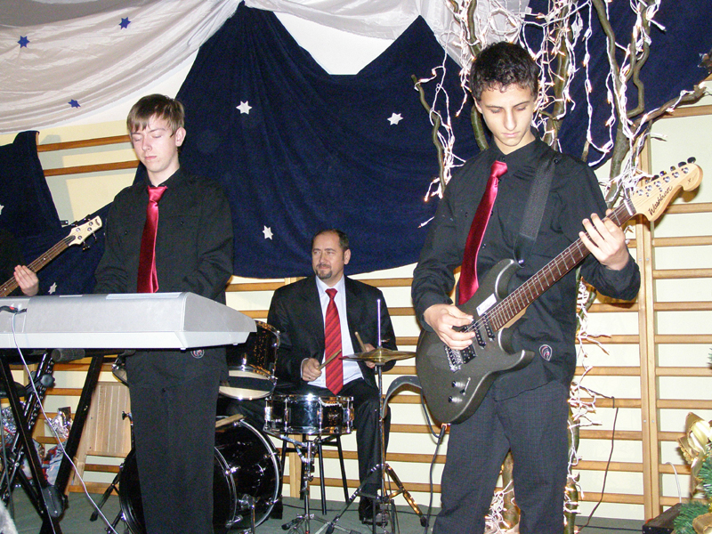 
 
 
 
 
 
 
 
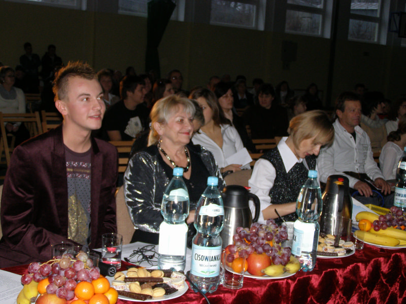 
 
 
 
 
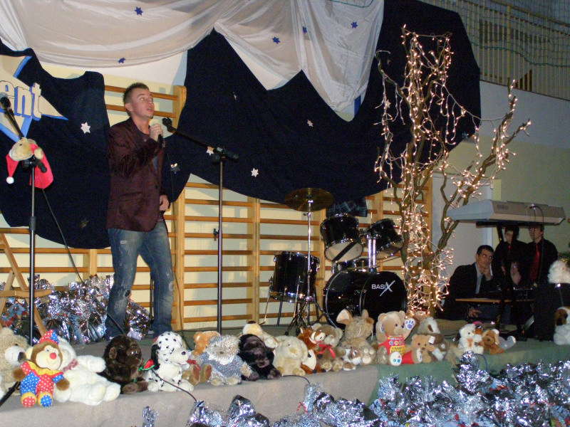 
 
 
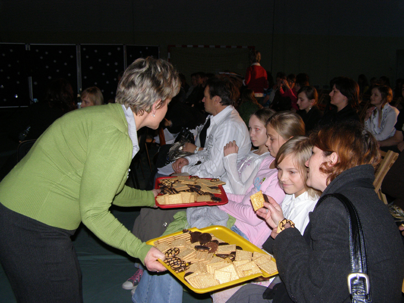 
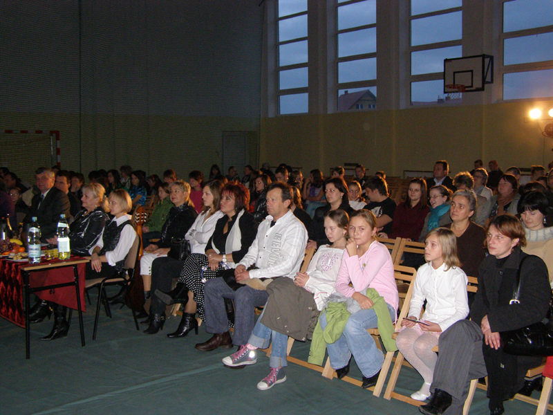 
 
 
 
 
 
 
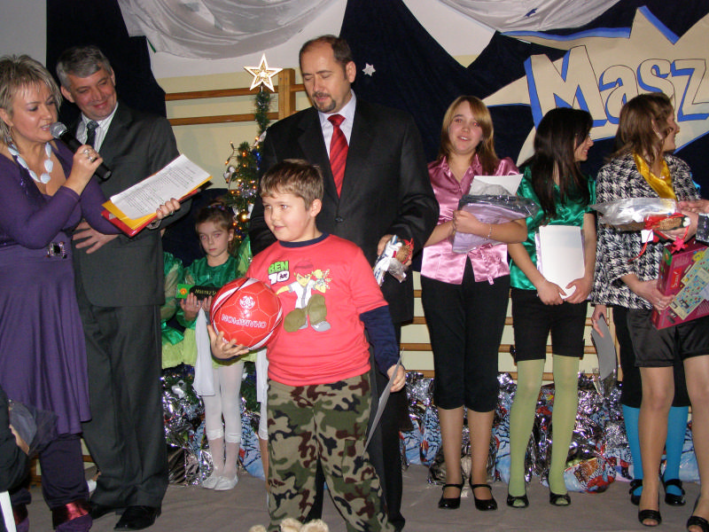 
 

<i>2009-12-22 10:24:00</i>  
Sprawozdanie filmowe z Mikołajek w Roźwienicy
W Mikołajki - 6 grudnia dzieci i młodzież z Gminy Roźwienica mogły zaprezentować swoje talenty, które oceniane były przez jury pod przewodnictwem Arkadiusza Kłusowskiego. Po koncercie szkołę w której odbywała się impreza odwiedził Święty Mikołaj.
  

W Mikołajki - 6 grudnia dzieci i młodzież z Gminy Roźwienica mogły zaprezentować swoje talenty, które oceniane były przez jury pod przewodnictwem Arkadiusza Kłusowskiego. Po koncercie szkołę w której odbywała się impreza odwiedził Święty Mikołaj.

Poniżej przestawiamy filmy nakręcone podczas imprezy.

 

  

    

    

    

    

    

    

    
  
<b>Zdjęcia:</b> 

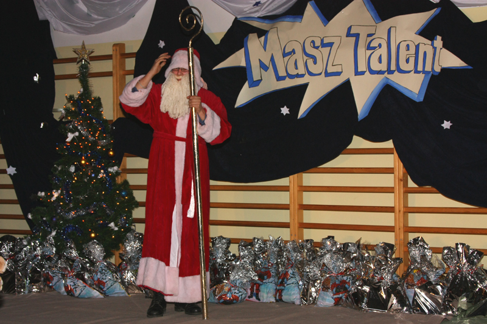 

