

<i>2010-01-18 16:31:00</i> 
Koncert kolęd i pastorałek 
24 stycznia br. o godzinie 12:30 w Kolegiacie Jarosławskiej - Parafia Rzymsko-Katolicka pw. Bożego Ciała odbędzie się koncert kolęd i pastorałek Arkadiusza Kłusowskiego przy akompaniamencie Bartosza Tarnawskiego oraz Michała Piwowara z zespołem AMITI.

<strong>Zapraszamy !!</strong>
 
 
<a href="#" class="loadImages">ZOBACZ ZDJĘCIA</a> 

 

<i>2010-02-10 12:49:00</i> 
Zapraszamy na koncert charytatywny zespołu Dżem !!
Zapraszamy serdecznie na koncert charytatywny zespołu Dżem, który odbędzie się <strong>14 marca 2010 r</strong>. <strong>o godzinie 18:00</strong> w sali sportowej Państwowej Wyższej Szkoły Zawodowej w Jarosławiu.
 

Zapraszamy serdecznie na koncert charytatywny Pt. <strong>"Pomóżmy dzieciom po urazie"</strong>, na którym gwiazdą wieczoru będzie zespół <strong>Dżem</strong>. Koncert odbędzie się <strong>14 marca 2010 r. o godzinie 18:00</strong> w sali sportowej Państwowej Wyższej Szkoły Zawodowej w Jarosławiu. Pieniądze zebrane z zakupionych biletów oraz licytacji zostaną przekazane na nowy sprzęt rehabilitacyjny do jarosławskiego szpitala.

Przed gwiazdą wieczoru o godzinie <strong>16:30</strong> zaśpiewają laureaci konkursu "Masz Talent" m. in. zespół AMITI, Kinga Zalot, Ewelina Przybył, Iwona Rogus oraz Zespół Road.

Bilety do nabycia w Miejskim Ośrodku Kultury, Sklepie Muzycznym HIT przy ul. Grunwaldzkiej 22, Miejskim Ośrodku Sportu i Rekreacji w Jarosławiu, Studio 21 i Państwowej Wyższej Szkole Zawodowej w Jarosławiu.
 
<a href="#" class="loadImages">ZOBACZ ZDJĘCIA</a> 

 

<i>2010-03-19 11:44:00</i> 
To był udany koncert
Gwiazdą niedzielnego wieczoru (14 bm.) był legendarny zespół Dżem, który zagrał swoje największe przeboje. Jako support wystąpili zaś młodzi artyści, uczestnicy pilotowanego przez fundację konkursu „Masz talent”: Arek Kłusowski, Kinga Zalot, Ewelina i Sylwia Przybył, Iwona Rogóż oraz rzeszowski zespół Amiti.
 

"Za ponad sześć tysięcy złotych Jarosławska Fundacja „Pomocna Dłoń” zakupi sprzęt dla oddziału ortopedii jarosławskiego szpitala. – Pieniądze zebrane podczas koncertu charytatywnego zamienimy na sprzęt, który będzie służył dzieciom – zapewnia prezes fundacji.

 Gwiazdą niedzielnego wieczoru (14 bm.) był legendarny zespół Dżem, który zagrał swoje największe przeboje. Jako support wystąpili zaś młodzi artyści, uczestnicy pilotowanego przez fundację konkursu „Masz talent”: Arek Kłusowski, Kinga Zalot, Ewelina i Sylwia Przybył, Iwona Rogus oraz rzeszowski zespół Amiti. W przerwach między koncertami prowadzono licytację, w trakcie której walczono m.in. o koszulkę z podpisami piłkarzy Wisły Kraków, piłkę z autografami koszykarzy Znicza Jarosław, obrazy czy koszulki i gadżety związane z zespołem Dżem.

Udało się zebrać 1 tys. 750 zł, a doliczając do tego wpływy z biletów i zbiórki pieniędzy – 6 tys. 250 zł. – To był bardzo udany koncert. Pozytywnie zaskoczyła mnie życzliwość ludzi, ich zrozumienie dla wspólnej zbiórki na szczytny cel – mówiła tuż po imprezie Alicja Zając, prezes Jarosławskiej Fundacji „Pomocna Dłoń”. – Bardzo dziękuję wszystkim, którzy pomogli w organizacji zbiórki pieniędzy. Włączyli się do niej wolontariusze oraz lokalni przedsiębiorcy. Pomagamy naszym dzieciom, to najważniejsze – nie kryła zadowolenia.

 Zarządzana przez A. Zając fundacja w ostatnim czasie zorganizowała też koncert „Pomóżmy Wojtusiowi”, podczas którego zbierano pieniądze na pomoc dla chorego chłopca. Koncert odbył się w sali gimnastycznej jarosławskiej Państwowej Wyższej Szkoły Zawodowej."

<em>Źródło: Życie Podkarpackie</em>

"Wszyscy występujący tego dnia na scenie artyści otrzymali od fundacji upominki - m.in. piernikowo-marcepanowe serca.  - Łącznie, już po wszystkich odliczeniach, udało nam się zebrać 6250 zł. Za te pieniądze (zebrane z biletów oraz podczas licytacji) zakupimy nowy sprzęt rehabilitacyjny do jarosławskiego szpitala - mówi Alicja Zając, prezes Fundacji "Pomocna Dłoń". - Najpierw będziemy rozmawiać z dyrekcją i zorientujemy się jaki konkretnie sprzęt jest potrzebny. Fundacja składa na łamach "GJ" serdeczne podziękowania wszystkim, którzy pomogli w organizacji koncertu."

<em> GJ</em>

<strong>Zapraszamy do obejrzenia galerii z koncertu!</strong><em> </em>

<em> </em>
 
<a href="#" class="loadImages">ZOBACZ ZDJĘCIA</a> 

 
 
 
 
 
 
 
 
 
 
 
 
 
 
 
 
 
 
 
 
 
 
 
 
 
 
 
 
 
 
 
 
 
 
 
 
 
 
 
 
 
 
 
 
 
 
 
 
 
 
 

<i>2010-04-01 09:52:00</i> 
Koncert Dżemu - relacja filmowa
Zapraszamy do obejrzenia i przesłuchania filmów i piosenek z koncertu charytatywnego "Pomóżmy dzieciom po urazie" gdzie gwiazdą wieczoru był polski rock'owy zespół Dżem.
 

Zapraszamy do obejrzenia i przesłuchania filmów i piosenek z koncertu  charytatywnego "Pomóżmy dzieciom po urazie" gdzie gwiazdą wieczoru był  polski rock'owy zespół Dżem.
 
<a href="#" class="loadImages">ZOBACZ ZDJĘCIA</a> 

 

<i>2010-04-06 11:34:00</i> 
Masz Talent 2010 !!
Jarosławska Fundacja „Pomocna Dłoń” przy wsparciu Burmistrza Miasta Jarosławia oraz Centrum Kultury i Promocji w Jarosławiu organizuje II edycję programu MASZ TALENT.
 

<strong>Jarosławska Fundacja „Pomocna Dłoń” </strong>przy wsparciu Burmistrza Miasta Jarosławia oraz Centrum Kultury i Promocji w Jarosławiu organizuje II edycję programu <strong>MASZ TALENT</strong>. Serdecznie zapraszamy młodzież jarosławską z gimnazjów i szkół średnich oraz utalentowane osoby (powyżej 15 r.ż.), do wzięcia udziału w wydarzeniu kulturalnym.  Nagrodą główną jest laptop ufundowany przez Jarosławską Fundację „Pomocna Dłoń".  Przegląd kandydatów odbędzie się dnia <strong>21.04.2010 r. </strong>o godz.<strong> 11.00</strong><strong></strong> w Centrum Kultury i Promocji w Jarosławiu.  Kategorie konkursowe: taniec, śpiew, sport, gra na instrumencie, gra sceniczna. Każdy uczestnik proszony jest o przygotowanie 3 min. programu artystycznego wraz z własnym podkładem muzycznym, w zależności od wybranej kategorii.  Finał programu odbędzie się <strong>1.05.2010 r. w Miejskim Ośrodku Kultury w Jarosławiu</strong> i będzie towarzyszył Wielkiej Majówce 2010.  Informacje udzielane są pod numerem telefonu: (016) 624 87 44. Zapytania proszę kierować również na adres mailowy: ktp@jaroslaw.pl.  Osoby chętne do wzięcia  udziału w wydarzeniu proszone są o stawienie się z wypełnionymi kartami zgłoszenia <strong>do dnia 19.04.2010 r. w Wydziale Kultury, Turystyki i Promocji Miasta w Urzędzie Miasta Jarosławia,</strong> Rynek 6 (II p. pok. nr 20), w celu rejestracji przed przeglądem.  Poniżej karta zgłoszenia udziału.
 
<a href="#" class="loadImages">ZOBACZ ZDJĘCIA</a> 

 

<i>2010-04-09 16:16:00</i> 
Wywiad z Prezes Fundacji Pomocna Dłoń w Radiu PWSZ Jarosław
Wywiad z Prezes Fundacji Pomocna Dłoń w Twoje Radio Jarosław. Wywiad  przeprowadzony przez redaktor  Annę Inglot.
 

Wywiad z Prezes Fundacji Pomocna Dłoń w Twoje Radio Jarosław. Wywiad  przeprowadzony przez redaktor Annę Inglot.
 
<a href="#" class="loadImages">ZOBACZ ZDJĘCIA</a> 

 

<i>2010-04-27 14:12:00</i> 
Międzynarodowy Festiwal Piosenki „Rzeszów Carpathia Festiwal” 2010 
Międzynarodowy Festiwal Piosenki „Rzeszów Carpathia Festival” to miejsce spotkań młodych wokalistów i zespołów muzycznych z całej Europy. W jury festiwalu zasiadają europejskie osobistości życia muzycznego – Dorota Szpetkowska, Michał Zabłocki, Zygmunt Kukla, Jerzy Dynia, Ruggero Robin, Egon Póka i Peter Lipa.
 

Międzynarodowy Festiwal Piosenki <strong>„Rzeszów Carpathia Festival”</strong> to miejsce spotkań młodych wokalistów i zespołów muzycznych z całej Europy. W jury festiwalu zasiadają europejskie osobistości życia muzycznego – Dorota Szpetkowska, Michał Zabłocki, Zygmunt Kukla, Jerzy Dynia, Ruggero Robin, Egon Póka i Peter Lipa.

Głosujcie na zespół <strong>Amiti</strong> w plebiscycie na nagrodę publiczności <strong>VI międzynarodowego Festivalu Carpathia Rzeszów </strong>SMS na numer <strong>72601</strong> o treści <strong>paulobettini.pl 1 </strong>

Więcej informacji na stronie <a href="http://www.carpathia.rzeszow.pl/" target="_blank"><strong>www.carpathia.rzeszow.pl</strong> </a>oraz <a href="http://www.rzeszow.pl/kultura/aktualnosci-kulturowe/miedzynarodowy-festiwal-piosenki-rzeszow-carpathia-festiwal-2010" target="_blank"><strong>Srerwis informacyjny UM Rzeszów</strong> </a>
 
<a href="#" class="loadImages">ZOBACZ ZDJĘCIA</a> 

 

<i>2010-04-28 12:00:00</i> 
Sprzet dla najmłodszych pacjentów COM
<strong>"Pomóżmy dzieciom po urazie".</strong> Takie założenie miał zorganizowany 14  marca przez <strong>Jarosławską Fundację "Pomocna Dłoń" </strong>koncert zespołu Dżem. To właśnie na zakup sprzętu Fundacja przekazała zebrane z koncertu  pieniądze. W jednej z sal Centrum Opieki Medycznej stanęły trzy nowe  łóżka z całym wyposażeniem.
 

<strong>"Pomóżmy dzieciom po urazie"</strong>. Takie założenie miał zorganizowany 14 marca przez "<strong>Jarosławską Fundację Pomocna Dłoń" koncert zespołu Dżem. </strong> To właśnie na zakup sprzętu Fundacja przekazała zebrane z koncertu pieniądze. W jednej z sal Centrum Opieki Medycznej stanęły trzy nowe łóżka z całym wyposażeniem.  - Dzisiaj oddział  ortopedyczny otrzymał dary z Jarosławskiej Fundacji "Pomocna Dłoń". Chcę serdecznie podziękować wszystkim, którzy się do tego przyczynili - mówiła dyrektor ds. lecznictwa - Janina Dańczak-Balicka. <strong>6250 zł </strong>to kwota, jaką udało się zebrać z koncertu. <strong> Koszt zakupionego sprzętu to blisko 13 tysięcy</strong>. - Zebrane pieniądze chcieliśmy przeznaczyć właśnie dla dzieci, na nowy sprzęt rehabilitacyjny. Trzy łóżka z całym wyposażeniem za ponad 13 tysięcy zakupione za połowę ceny, to wielki sukces. serdeczne podziękowania dla Zespołu Szkół Plastycznych za pomalowanie ścian w tej właśnie salo oraz dla Pana Tomasza Piotrów, który użyczył nam samochodu i przywiózł sprzęt z Tarnowa nieodpłatnie. Pamiętajmy, że żyjemy po to, aby pozostawić po sobie ślad - mówiła Alicja Zając - prezes Fundacji. Wyrazy wdzięczności złożył również ordynator oddziału ortopedii - Jerzy Błażejewski. - Serdecznie dziękuję za takie miłe i efektywne wsparcie. W naszym szpitalu rocznie przyjmujemy ok. 200 dzieci z urazami. jest to dla nich ogromne przeżycie. Dlatego chcielibyśmy aby byli tu najserdeczniej  przyjęci, aby ten pobyt był sympatyczny. Dzięki Fundacji i młodzieży z Zespołu Szkół Plastycznych mamy taką możliwość. Liczymy, że współpraca z Fundacją będzie owocna bo mamy jeszcze kilka sal do wyposażenia - mówi z uśmiechem.  Nowy sprzęt poświęcił ks. Władysław Janeczko.

<em> </em>

<em>Tekst: GJ</em>

<em>Zdjęcia: Ceramikowo-wppl</em>

<em>Zdjęcia: <a href="http://ceramikowo-wppl.blog.onet.pl/WSPOLPRACA-Z-JAROSLAWSKA-FUNDA,2,ID404865681,n">Ceramikowo.wppl</a> </em>
 
<a href="#" class="loadImages">ZOBACZ ZDJĘCIA</a> 

<a href="img/archive_files/1/DSCN4433.jpg" target="_blank">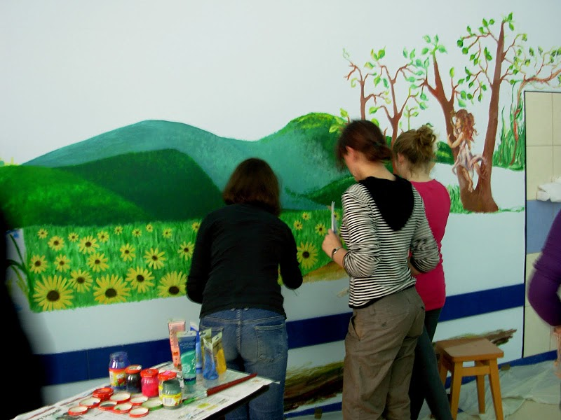</a> 
 
 
 
<a href="img/archive_files/1/DSCN4438.jpg" target="_blank">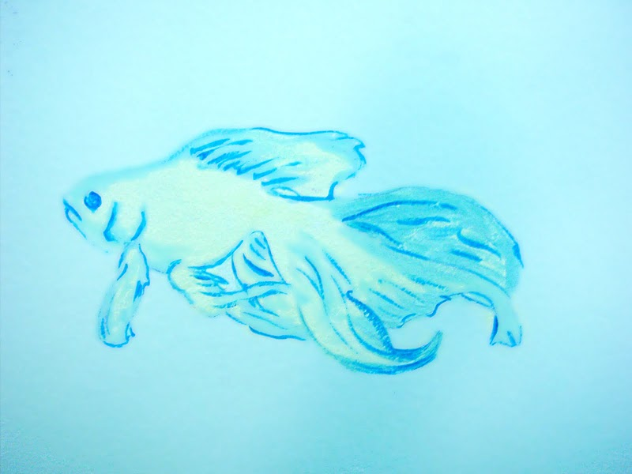</a> 
<a href="img/archive_files/1/DSCN4439.jpg" target="_blank">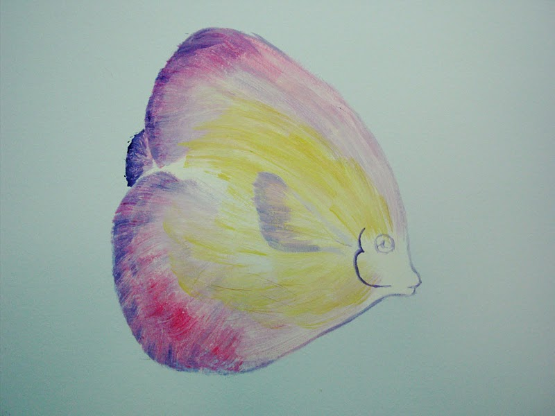</a> 
 
<a href="img/archive_files/1/DSCN4441.JPG" target="_blank">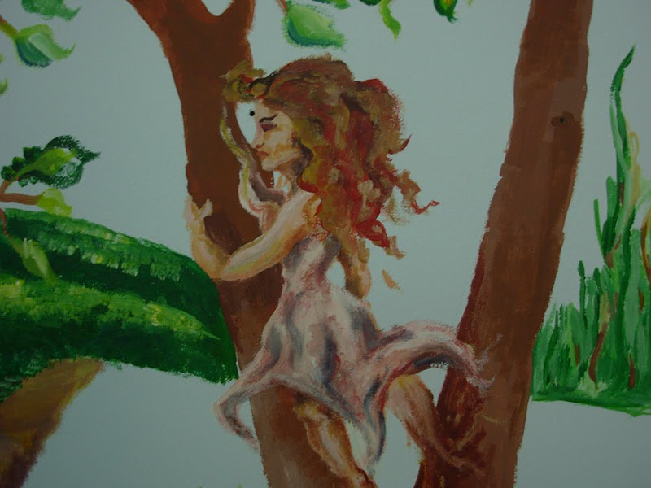</a> 
 
 
 
 
<a href="img/archive_files/1/DSCN4447.JPG" target="_blank">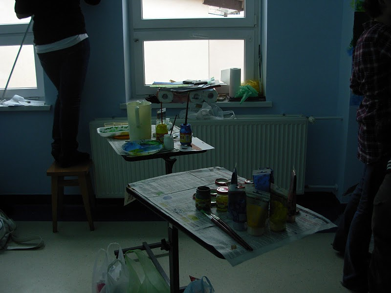</a> 
 
 
 
<a href="img/archive_files/1/DSCN4452.JPG" target="_blank">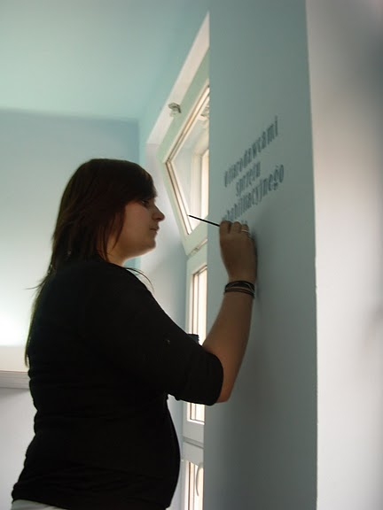</a> 
 
 
 
 
 
 
 
 
 
 
<a href="img/archive_files/1/DSCN4775.jpg" target="_blank">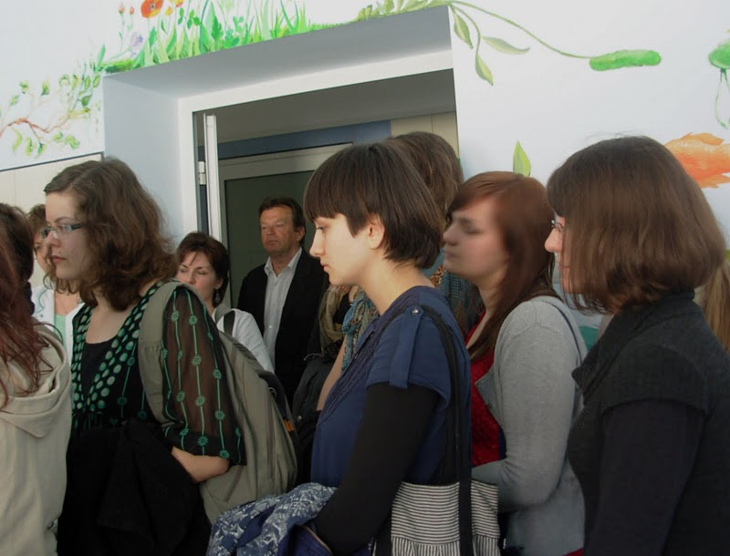</a> 
 
<a href="img/archive_files/1/DSCN4787.jpg" target="_blank">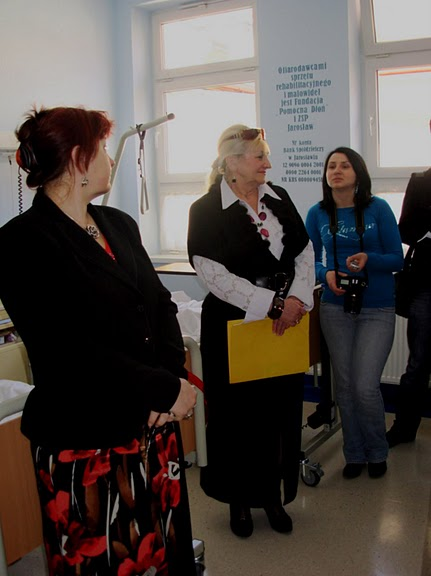</a> 
 
<a href="img/archive_files/1/DSCN4794.jpg" target="_blank">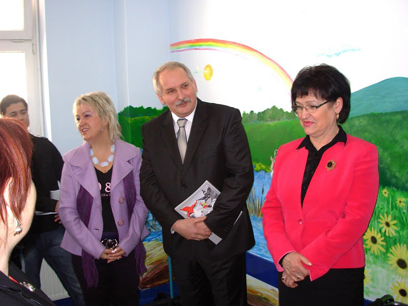</a> 
 
 
 
 

<i>2010-04-28 14:02:00</i> 
Eliminacje do finału II Edycji &quot;Masz Talent&quot;
W środę <strong>21 kwietnia</strong>, w Centrum Kultury i Promocji Miasta odbyły się eliminacje do finału <strong>II edycji programu "Masz Talent" </strong>organizowanego przez <strong>Jarosławską Fundację "Pomocna Dłoń"</strong> przy wsparciu Burmistrza Miasta Jarosławia i CKiP.
 

<!-- 		@page { size: 21cm 29.7cm; margin: 2cm } 		P { margin-bottom: 0.21cm } -->

W środę <strong>21 kwietnia</strong>, w Centrum Kultury i Promocji Miasta odbyły się eliminacje do finału <strong>II edycji programu "Masz Talent" </strong>organizowanego przez <strong>Jarosławską Fundację "Pomocna Dłoń"</strong> przy wsparciu Burmistrza Miasta Jarosławia i CKiP.

W śród najlepszych znaleźli się: Gabriel Brudniak i Krystian Nadgórny, Anna Dąbrowska, Artur Leśniowski, Krzysztof Szydłowski, Kamil Inglot, Jakub Magda, Karol Argasiński, Michał Niemiec, Monika Trojnar, Monika Czarny, Daria Kiper oraz Karolina Węgrzyn i Katarzyna Meissner.

Laureaci wystąpią w <strong>finale konkursu</strong>, który odbędzie się w sobotę <strong>1 maja, o godzinie 17:00 w Miejskim Ośrodku Kultury w Jarosławiu</strong>. Będą walczyć o nagrodę główną, którą jest laptop ufundowany przez Jarosławską Fundację "Pomocna Dłoń".

<em>Tekst: GJ</em>

<strong>Wyłoniono 12 finalistów</strong>
<ol><li>Gimnazjum Publiczne Nr 1 - Gabriel Brudniak i Krystian Nadgórny – gra sceniczna</li><li>Gimnazjum Publiczne Nr 5 - Anna Dąbkowska</li><li>Gimnazjum Publiczne Nr 5 - Artur Leśniowski</li><li>Gimnazjum Publiczne Nr 5 - Krzysztof Szydłowski</li><li>Gimnazjum Publiczne Nr 5 - Kamil Inglot </li><li>Zespół Szkół Drogowo-Geodeyzjnych i Ogólnokształcących w jarosławiu – Jakub Maga</li><li>Liceum Ogólnokształcące im. Mikołaja Kopernika w Jarosławiu – Karol Argasiński</li><li>Zespół Szkół Licealnych i Technicznych w Jarosławiu Michał Niemiec</li><li>Zespół Szkół im. Adama Mickiewicza w Pawłosiowie – Monika Trojnar</li><li>Zespół Szkół im. Adama Mickiewicza w Pawłosiowie Monika Czarny</li><li>Zespół Szkół Plastycznych i Ogólnokształcących w Jarosławiu - Daria Kiper</li><li>Zespół Szkół Plastycznych i Ogólnokształcących w Jarosławiu - Karolina Węgrzyn i Katarzyna Meissner</li></ol>
<strong>Zapraszamy do obejrzenia galerii zdjęć z eliminacji!</strong>
 
<a href="#" class="loadImages">ZOBACZ ZDJĘCIA</a> 

 
<a href="img/archive_files/1/DSC_3773.jpg" target="_blank">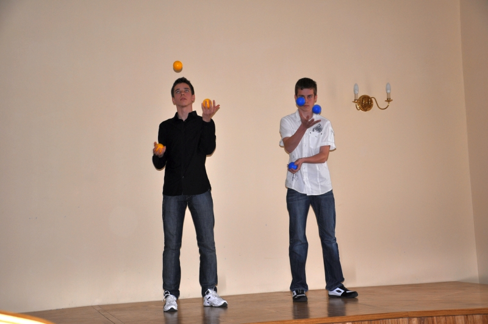</a> 
<a href="img/archive_files/1/DSC_3779.jpg" target="_blank">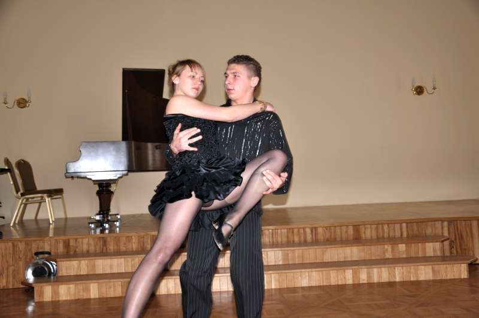</a> 
 
 
 
 
 
 
 
 
 
 
<a href="img/archive_files/1/DSC_3807.jpg" target="_blank">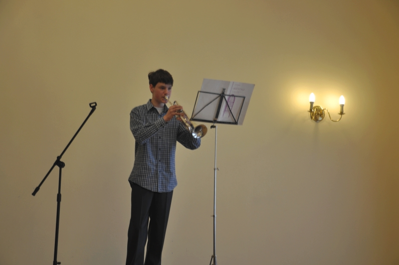</a> 
 
 
 

<i>2010-05-05 10:24:00</i> 
Finał II edycji konkursu &quot;Masz Talent&quot;
Dużo się działo na jarosławskim Rynku podczas tegorocznej Majówki 2010. W  MOK Jarosław odbył się II finał jarosławskiej edycji konkursu „Masz  talent”, którego organizatorem jest Jarosławska Fundacja „Pomocna Dłoń”  przy wsparciu Burmistrza Miasta Jarosławia, CKiP oraz TV Rzeszów. Do  finału dostało się 12 uczestników konkursu. Program prowadziła prezes  fundacji Alicja Zając otwierając imprezę cyt. <strong>„Każdy rodzi się z  talentem obdarowanym przez Boga, ale nie każdy potrafi go z siebie  wydobyć i umiejętnie wykorzystać”</strong>.
 

Dużo się działo na jarosławskim Rynku podczas tegorocznej Majówki 2010. W MOK Jarosław odbył się <strong>II finał jarosławskiej edycji konkursu „Masz Talent”,</strong> którego organizatorem jest <strong>Jarosławska Fundacja „Pomocna Dłoń”</strong> przy wsparciu Burmistrza Miasta Jarosławia, CKiP oraz TV Rzeszów.

Do finału dostało się 12 uczestników konkursu. Program prowadziła prezes fundacji Alicja Zając otwierając imprezę cyt. <strong>„Każdy rodzi się z talentem obdarowanym przez Boga, ale nie każdy potrafi go z siebie wydobyć i umiejętnie wykorzystać”. </strong>

Przewodniczącym Jury był dr. muzyki Jacek Ścibor, który stwierdził, że poziom imprezy tegorocznego konkursu był bardzo wysoki. Sala była zapełniona po brzegi. Finaliści wystąpili w różnych kategoriach artystycznych.

Konkurs wygrała zdobywając laptopa ufundowanego przez fundację <strong>Karolina Węgrzyn</strong> z Zespołu Szkól Plastycznych w Jarosławiu.

Nagrodę publiczności w postaci aparatu cyfrowego ufundowanego przez Biuro Turystyki „Polonez” Aneta Fila wygrał <strong>Kamil Inglot </strong>(Gimnazjum nr 5) tańcem „Elektro Boogi” .

Trzy wyróżnienia zdobyli:
<ul><li><strong>Jakub Maga</strong> (śpiew) Zespól Szkól Drogowo-Geodyzyjnych i Ogólnokształcących w Jarosławiu, </li><li><strong>Karol Argasiński</strong> (śpiew) Liceum Ogólnokształcące im. Mikołaja Kopernika w Jarosławiu, </li><li><strong>Monika Czarny</strong> (śpiew) Zespól Szkół im. A. Mickiewicza w Pawłosiowie </li><li>oraz nagroda pieniężna przyznana przez - posła Mieczysława Golbę (równocześnie członka Jury konkursu) którą otrzymał <strong>Krzysztof Szydłowski</strong> (GP nr 5) w kategorii „Beat Box” . </li></ul>
Gościnnie wystąpili: dr muzyki Jacek Ścibor, zespól „Amiti” z Arkadiuszem Kłusowskim i Szkoła Tańca ”Takt” - Marzeny Przytockiej.  <strong>Skład Jury:</strong>
<ol><li>Dr Sztuk Wokalnych Jacek Ścibor - Przewodniczący</li><li>Mieczysław Golba - Poseł na Sejm RP </li><li>Anna Arciszewska - TV Rzeszów</li><li>Joanna Mordarska – Naczelnik Wydziału Kultury Turystyki i Promocji Miasta</li><li>Arkadiusz Kłusowski - wokalista zespołu „Amiti”</li></ol> 
<a href="#" class="loadImages">ZOBACZ ZDJĘCIA</a> 

 
 
 
 
 
 
 
 
 
 
 
 
 
 
 
 
 
 
 
 
 
 
 
 
 
<a href="img/archive_files/1/H-02d.JPG" target="_blank">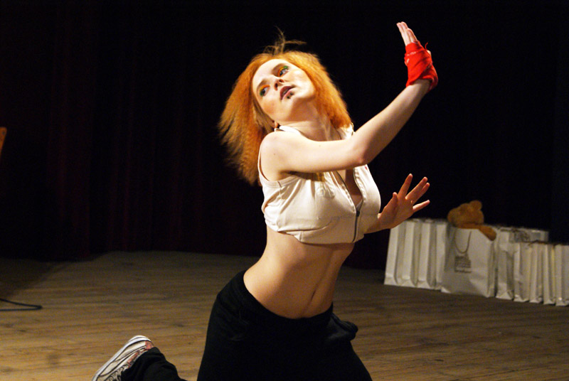</a> 
 
<a href="img/archive_files/1/H-02g.JPG" target="_blank">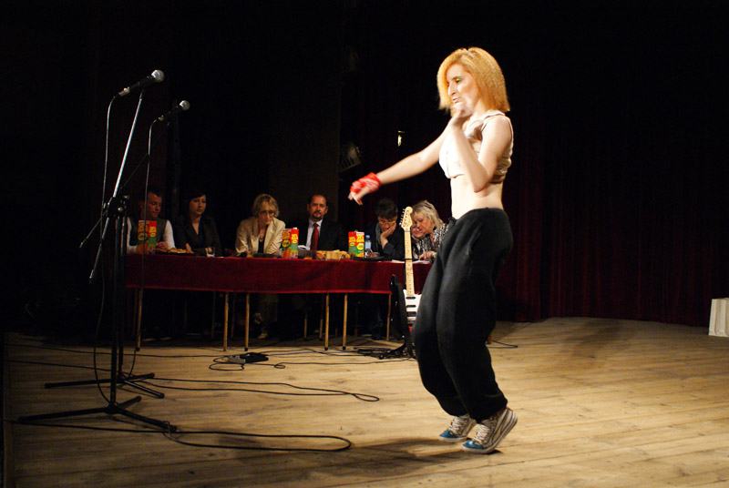</a> 
<a href="img/archive_files/2/P1100019.JPG" target="_blank">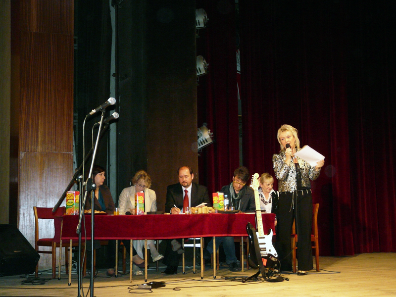</a> 
 
 
 
 
<a href="img/archive_files/1/H-03d.JPG" target="_blank">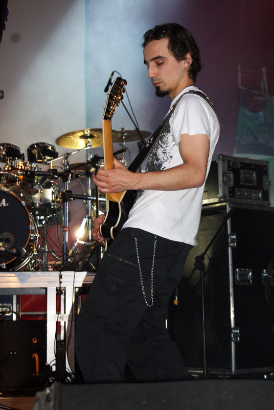</a> 
 
 
 
 
<a href="img/archive_files/1/H-03k.JPG" target="_blank">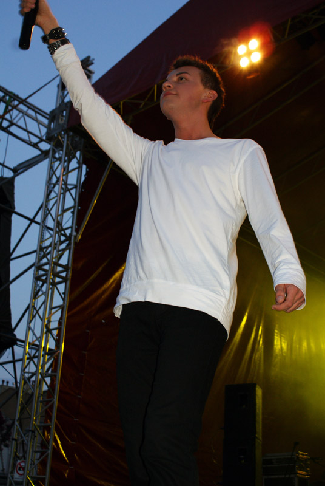</a> 
 
 
<a href="img/archive_files/1/H-03n.JPG" target="_blank">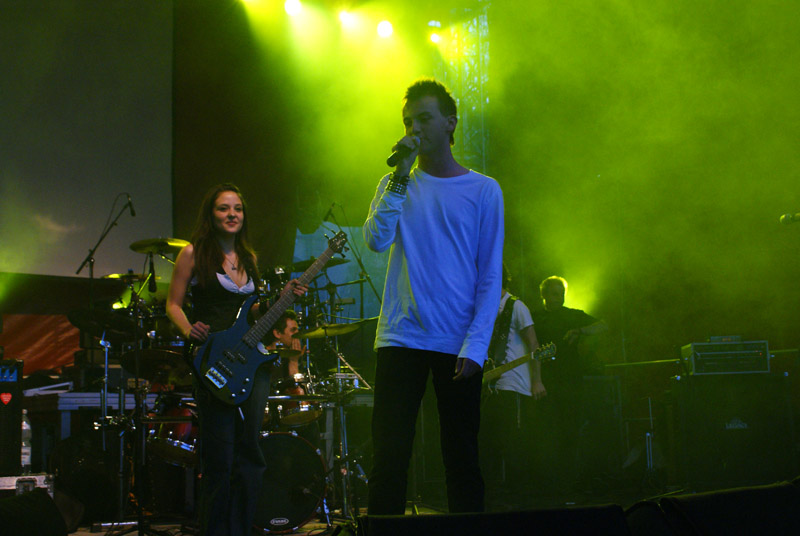</a> 
<a href="img/archive_files/1/H-03o.JPG" target="_blank">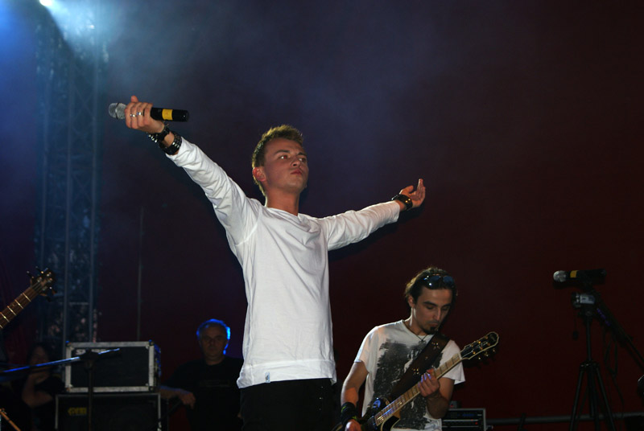</a> 
 
<a href="img/archive_files/1/H-03r.JPG" target="_blank">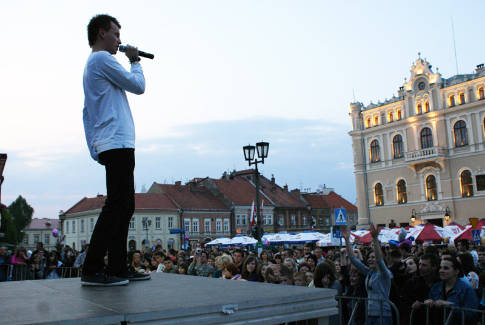</a> 
<a href="img/archive_files/1/H-04.JPG" target="_blank">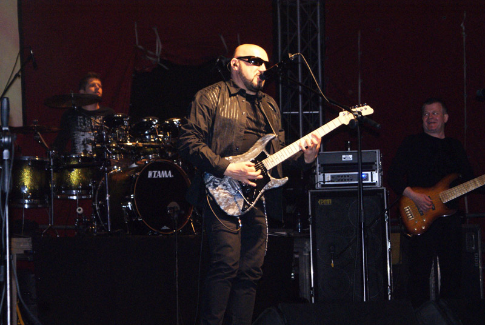</a> 
 
<a href="img/archive_files/1/H-06.JPG" target="_blank">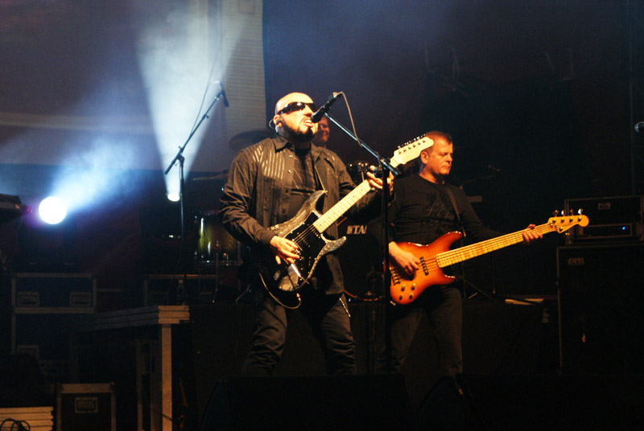</a> 
 
 
 
 
 
 

<i>2010-05-12 10:51:00</i> 
Nagrania filmowe  II Edycji konursu &quot;Masz Talent&quot;
Prezentujemy Państwo nagrania filmowe II Edycji "Masz talent" zosrganizwoanego przez Jarosławską Fundację "Pomocna Dłoń"
 

Nagrania filmowe II Edycji konursu "Masz Talent"  Prezentujemy Państwo nagrania filmowe II Edycji "Masz talent" zosrganizwoanego przez Jarosławską Fundację "Pomocna Dłoń"
 
<a href="#" class="loadImages">ZOBACZ ZDJĘCIA</a> 

 

<i>2010-05-25 09:45:00</i> 
Na pomoc powodzianom
Jarosławska Fundacja Pomocna Dłon i Kolegiata pod wezwaniem Bożego Ciała  w Jarosławiu <strong>zwracają się z uprzejmą prośbą o przekazanie darow dla  powodzian z gminy Gorzyce (powiat tarnobrzeski) </strong>w postaci: woda  mineralna, soki, napoje, koce, śpiwory, pościel, materace, środki  czystości, higieniczne, art,spożywcze i cukiernicze w opakowaniach  jednostkowych trwałych, naczynia jednorazowego użytku (widelce, noże  łyżki, kubki), odzież nieużywaną, art.gospodarstwa domowego, sprzęt do  porządkowania terenu.
 

Jarosławska Fundacja Pomocna Dlon i Kolegiata pod wezwaniem Bożego Ciała w Jarosławiu <strong>zwracają się z uprzejmą prośbą o przekazanie darow dla powodzian z gminy Gorzyce (powiat tarnobrzeski)</strong> w postaci; woda mineralna, soki, napoje, koce, śpiwory, pościel, materace, środki czystości, higieniczne, art,spożywcze i cukiernicze w opakowaniach jednostkowych trwałych, naczynia jednorazowego użytku (widelce, noże łyżki, kubki), odzież nieużywaną, art.gospodarstwa domowego, sprzęt do porządkowania terenu.

Dary można przekazywac w budynku plebani przy Kolegiacie <strong>od dnia 24.05.2010 do 27.05.2010 r od godz. 9:00 - 17:00.</strong>

Dary osobiście zawieziemy i przekażemy powodzianom w Gorzycach . Liczymy na wsparcie naszej inicjatywy. Również można wplacać pieniadze na nasze konto z dopiskiem "Powodzianie". <strong>BS JAROSłAW 12 9096 0004 2001 0000 2264 0001</strong>
 
<a href="#" class="loadImages">ZOBACZ ZDJĘCIA</a> 

 

<i>2010-06-02 09:57:00</i> 
Na pomoc powodzianom - zebrane dary
Jarosławska Fundacja "Pomocna Dłoń" oraz Caritas przy Kolegiacie Bożego  Ciała w Jarosławiu w ubiegły piątek, 28 maja, udali się ze wsparciem do  dotkniętych przez powódź mieszkańców Gorzyc.
 

Jarosławska Fundacja "Pomocna Dłoń" oraz Caritas przy Kolegiacie Bożego Ciała w Jarosławiu w ubiegły piątek, 28 maja, udali się ze wsparciem do dotkniętych przez powódź mieszkańców Gorzyc. W ogłoszonej zbiórce zebrano najpotrzebniejsze rzeczy. Wypełniony po brzegi TIR wyruszył spod Kolegiaty. Na miejscu z młodzieżą czekał ks. Władysław Drewniak - Caritas Parafii Gorzyce.

- Widok jaki zastaliśmy po przybyciu na miejsce był szokujący. W przykościelnej salce na materacach i kocach śpią dzieci. Nie ma nauki w szkole, bo budynki są zalane. Uczą się gdzie mogą. Pojechaliśmy dalej, na Zalesie. Tam woda przelewała się przez ulice. Naszym oczom ukazał się widok zalanych domów, budynków, pól. Do większości z nich nie ma dojścia. Na strychach dobytku pilnują mężczyźni. Wielu z nich nie ma już do czego wracać, niektórzy nie zdążyli się nawet wprowadzić do nowo wybudowanych domów - relacjonuje prezes Fundacji Alicja Zając.

 Pani Prezes składa serdeczne podziękowania wszystkim, którzy wsparli dotkniętych przez powódź i pomogli w ładunku i dostarczeniu darów na miejsce. Ponadto deklaruje, że jeśli zajdzie taka potrzeba odwiedzi mieszkańców Gorzyc po raz kolejny. Pamiętajmy, że wciąż potrzebna jest nasza pomoc, a mieszkańcom najbardziej potrzebne są np. Wodery (wysokie gumowe buty), dzięki którym będą mogli dotrzeć do swych posiadłości.

 Jeśli chcemy wesprzeć dotkniętych przez powódź finansowo, możemy to zrobić za pośrednictwem Jarosławskiej Fundacji "Pomocna Dłoń". Szczegółowe informacje można uzyskać pod numerem pani Prezes: 696 475 057.

<em>Gazeta Jarosławska</em>

Pomoc Powodzianom w Gorzycach  pow. tarnobrzeski w dniu 28.05.2010 r  PODZIEKOWANIE DLA 1.<strong>Tomasz Piotrów- Agrimpex </strong>- tir nieodpłatnie   2.Szkoły; <strong>Zespół Szkół Budowlanych</strong> w Jarosławiu, <strong>Zespoł  Szkół Ekonomicznych</strong>, <strong>Zespół Szkół Spożywczych, Chemicznych i Ogólnokształcących </strong> 3. Markety; <strong>BIEDRONKA</strong> 2x, <strong>NIWEX</strong> 2x <strong>CARREFOUR</strong>, <strong>STOKROTKA</strong>, <strong>PANORAMA</strong>- pan Jacek Krzywonos  4. <strong>LU-POLSKA</strong> Jarosław- zbiórka wśród pracowników na kwotę; 2.400,00 zl z czego zakupiono; namiot,taczki 5x, gumiaki,stroje robocze, śpiwory, kalimaty, rękawice gumowe, ochronne, worki na gruz.  5. <strong>Barbara Matyja- Zakład Drobiarski</strong> - pasza dla kur i zwierząt ok; 1 100 kg .   6. <strong>COM</strong> - Jarosław- zbiórka pienięzna wśrod prac. Szpitala - 800 zł.  7. <strong>Dziedzic Teresa- Sklep z firankami</strong> - 11 szt. kompletów pościeli.  8. <strong>'MIK'</strong>-Jaroslaw- taczki, łopaty, farby, miotly.  9.San'<strong>PAJDA</strong>'- ciastka.  10. Hurtownia <strong>'Sokołów s.c.</strong> ul. Zwierzyniecka- konserwy.  11. <strong>Sklep 'Bobo' Elżbieta Pałys</strong>- odzież dziecięca.  12. <strong>Jaromir Łaguniak</strong>- nieodplatnie BUS.   13. <strong>Powiatowa Straż Pożarna w Jarosławi</strong>u.
 
<a href="#" class="loadImages">ZOBACZ ZDJĘCIA</a> 

 
 
 
 
<a href="img/archive_files/2/Zdjecie069.jpg" target="_blank">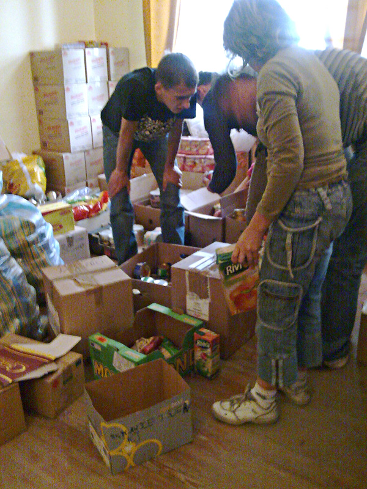</a> 
 
 
 
 
 
 
 
<a href="img/archive_files/2/Zdjecie087.jpg" target="_blank">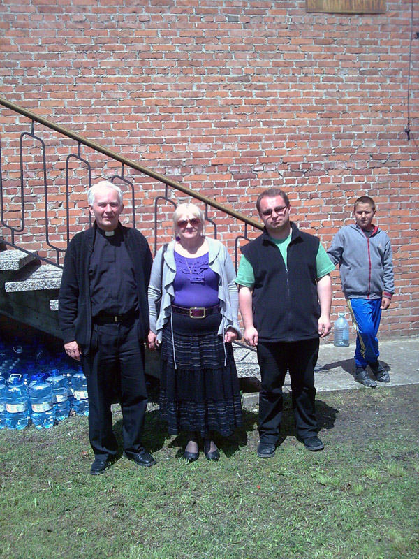</a> 
 
 
 
<a href="img/archive_files/2/Zdjecie092.jpg" target="_blank">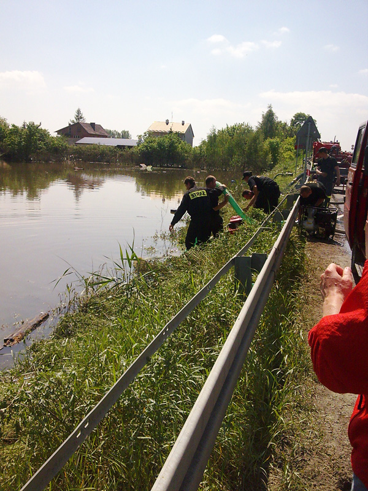</a> 
 
 
 
 
 

<i>2010-06-16 09:05:00</i> 
Wywiad z Prezes Fundacji Pomocna Dłon
Zapraszamy do posłuchania wywiadu w Radiu AM przeprowadzonego przez  Panią Annę Inglot z Prezes Fundascji "Powódź - Gorzyce powiat Tarnobrzeski"
 

Zapraszamy do posłuchania wywiadu w Radiu AM przeprowadzonego przez Panią Annę Inglot z Prezes Fundascji

 "Powódź - Gorzyce powiat Tarnobrzeski"
 
<a href="#" class="loadImages">ZOBACZ ZDJĘCIA</a> 

 

<i>2010-06-17 14:30:00</i> 
Arkadiusz Kłusowski - zwycięzca festiwalu EUROKIDS we Włoszech
Arkadiusz Kłusowski z Centrum Sztuki Wokalnej w Rzeszowie zajął I  miejsce na międzynarodowym festiwalu EUROKIDS we Włoszech w Neapolu,  konkurując z takimi krajami jak: Bulgaria, Rosja, Kosowo, Izrael,  Hiszpania. Nauczycielem przygotowującym go do występu była Pani mgr Anna  Czenczek - dyrektor CSW w Rzeszowie.
 

Arkadiusz Kłusowski z <strong>Centrum Sztuki Wokalnej w Rzeszowie</strong> zajął I miejsce na międzynarodowym festiwalu <strong>EUROKIDS</strong> we Włoszech w Neapolu, konkurując z takimi krajami jak: Bulgaria, Rosja, Kosowo, Izrael, Hiszpania. Nauczycielem przygotowującym go do występu była Pani <strong>mgr Anna Czenczek - dyrektor CSW w Rzeszowie</strong>.

 Zwycięstwo zapewniło mu nominację na największy festiwal we Włoszech <strong>"Canzoni dal Mondo"</strong> który odbedzie się 26 sierpnia 2010. Wokalista na co dzień współpracuje z <strong>Jarosławską Fundacją "Pomocna Dłoń"</strong> która to pomogła wylansować go programem <strong>Masz Talent</strong> organziowanym własnie przez tą fundację. Jest także jest wokalistą w zespole AMITI z którym wydał właśnie promocyjną płytę "Skandal!"

 <a href="http://www.myspace.com/amitiband">http://www.myspace.com/amitiband</a> na tej stronie można posłuchać utworów.
 
<a href="#" class="loadImages">ZOBACZ ZDJĘCIA</a> 

 

<i>2010-06-18 08:29:00</i> 
Warszawskie Spotkania Ceramiczne
12 czrwca 2010 w Centrum Promocji i Kultury Praga Południe odbyły się 6  Warszawskie Spotkania Ceramiczne.
 

12 czrwca 2010 w Centrum Promocji i Kultury Praga Południe odbyły się 6 Warszawskie Spotkania Ceramiczne. W programie: - prezentacja pracowni ceramicznych (około 80 ceramików z całej Polski) - wystawa ceramiki na wodzie - prezentacja ceramicznego fortepianu (artykuł o twórcy Rytis Konstantinavicius do przeczytania poniżej) - warszataty lepienia, toczenia na kole i malowania ceramiki - warsztarty układania mozaiki konkurs lepienia warszawskiej Syrenki - wypalanie ceramiki w piecu polowym koncert kameralnego Kwartetu Bacewicz w międzynarodowym składzie - sympozjum "Filozofia ziemi palonej - rękodzieło, sztuka, nauka, przemysł.
 
<a href="#" class="loadImages">ZOBACZ ZDJĘCIA</a> 

<a href="img/archive_files/1/DSCN7163.JPG" target="_blank">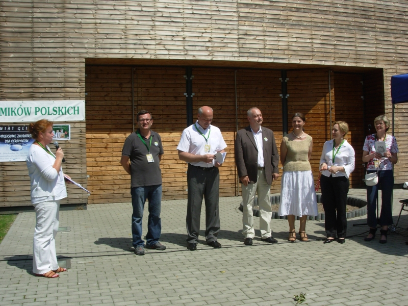</a> 
 
 
<a href="img/archive_files/1/DSCN7173.JPG" target="_blank">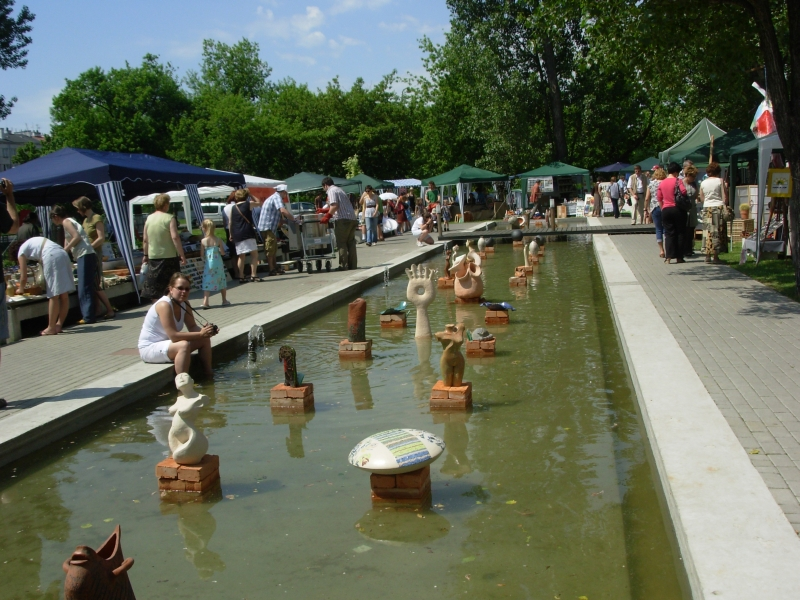</a> 
 
 
<a href="img/archive_files/1/DSCN7199.JPG" target="_blank">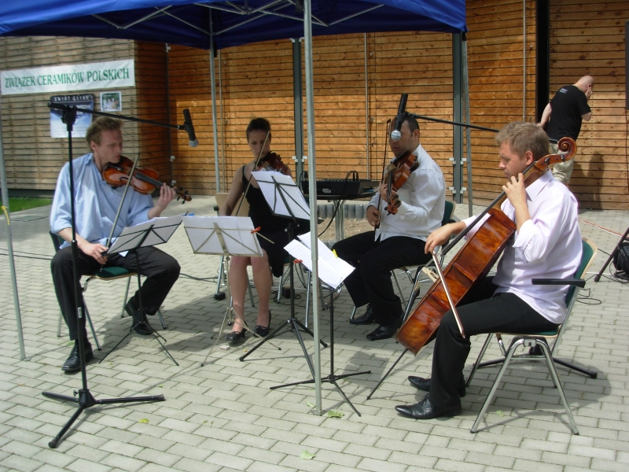</a> 
 
 
<a href="img/archive_files/1/DSCN7216.JPG" target="_blank">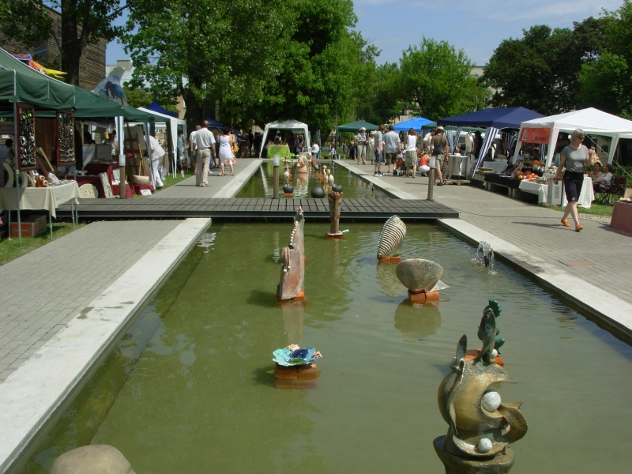</a> 
 
<a href="img/archive_files/1/DSCN7222.JPG" target="_blank">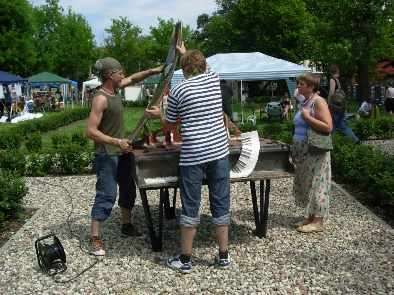</a> 
<a href="img/archive_files/1/DSCN7228.JPG" target="_blank">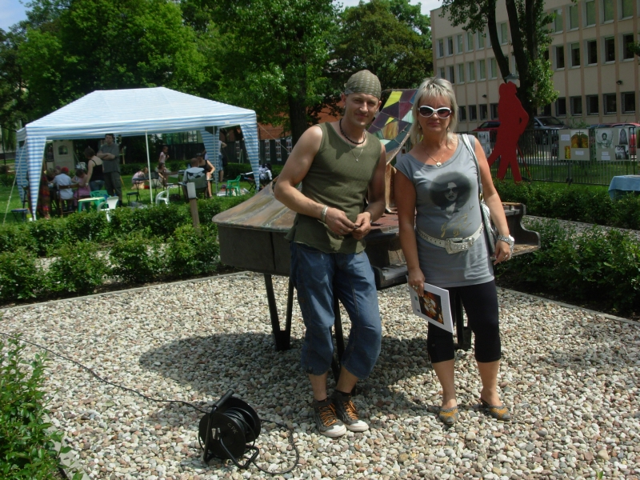</a> 
 
 
 
 
 
<a href="img/archive_files/2/Zdjecie100.jpg" target="_blank">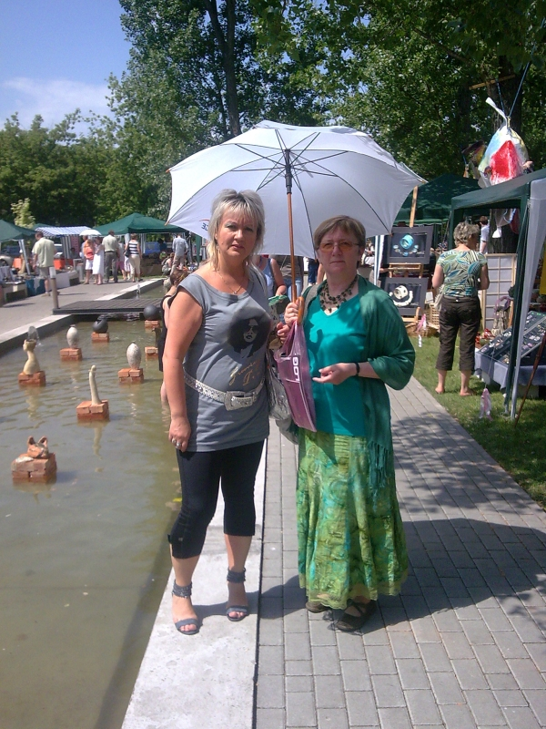</a> 
 

<i>2010-09-13 10:35:00</i> 
Z uśmiechem do szkoły -  wyprawki szkolne 2010
W piątkowe popołudnie, 27 sierpnia, jarosławska Fundacja "Pomocna Dłoń"  przekazała wyprawki do szkoły podopiecznym z Duszpasterstwa Osób  Niepełnosprawnych w Archidiecezji Przemyskiej "Arka" przy Parafii Bożego  Ciała w Jarosławiu.
 

W piątkowe popołudnie, 27 sierpnia, <strong>Jarosławska Fundacja "Pomocna Dłoń"</strong> przekazała wyprawki do szkoły podopiecznym z Duszpasterstwa Osób Niepełnosprawnych w Archidiecezji Przemyskiej "Arka" przy Parafii Bożego Ciała w Jarosławiu. Plecaki, zeszyty, piórniki i inne przybory szkolne, a także koszulki i maskotki trafiły w ręce kolejnych uczniów. Fundacji udało się pozyskać środki na zakup 50 kompletów (7 250 zł) - w dużej mierze dzięki dofinansowaniu z Regionalnego Ośrodka Polityki Społecznej w Rzeszowie, a także dzięki kwestom prowadzonym przez dzieci podczas pakowania zakupów w sklepach.

 - <em>Serdecznie dziękuję właścicielowi sieci sklepów "Niwex" za umożliwienie przeprowadzenia zbiórki pieniążków do puszek</em> - podsumowała Alicja Zając, prezes fundacji. - Tylko wspólne działanie przynosi takie świetne rezultaty.

Obdarowane dzieci wyraziły swoją wdzięczność za podarki śpiewem i tańcem.

 Podobne wyprawki otrzymały już dzieci z Domu Dziecka Nr 1 w Jarosławiu. Otrzymają je lada dzień gimnazjaliści z jarosławskiej "piątki".

Źródło: Gazeta Jarosławska
 
<a href="#" class="loadImages">ZOBACZ ZDJĘCIA</a> 

 
 
<a href="img/archive_files/1/005.jpg" target="_blank">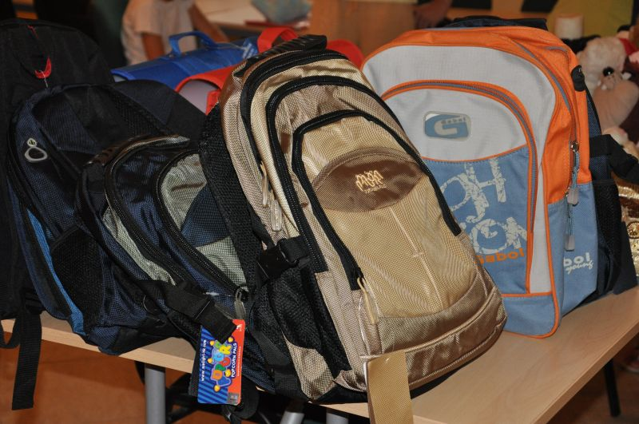</a> 
 
<a href="img/archive_files/1/008.jpg" target="_blank">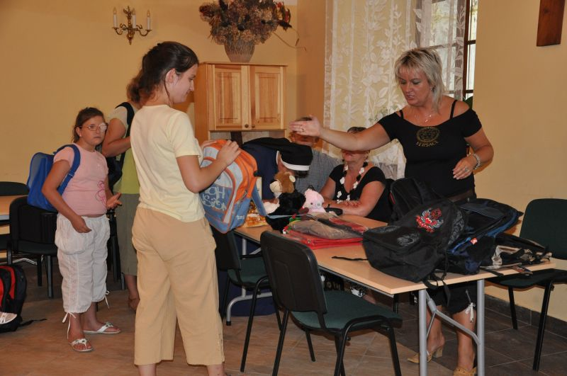</a> 
 
 
 
<a href="img/archive_files/1/014.jpg" target="_blank">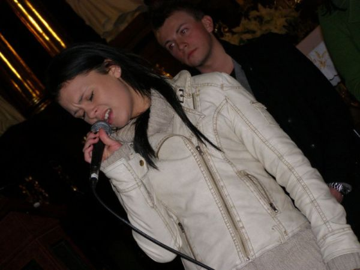</a> 

<i>2010-10-01 12:53:00</i> 
Recital &quot;100 % Real Music&quot; Arkadiusza Kłusowskiego - galeria
Recital "100 % Real Music" Arkadiusza Kłusowskiego - kompozytora,  tekściarza, laureata wielu nagród i wyróżnień muzycznych na terenie  całej Europy. Uczeń Centrum Sztuki Wokalnej Anny Czenczek w Rzeszowie.
 

<strong>Recital "100 % Real Music" Arkadiusza Kłusowskiego</strong> - kompozytora, tekściarza, laureata wielu nagród i wyróżnień muzycznych na terenie całej Europy. Uczeń Centrum Sztuki Wokalnej Anny Czenczek w Rzeszowie. Koncert podsumowujący 2 lata pracy artystycznej. W duetach gościnnie wystąpią m.in. Mariola Niziołek - laureatka Szansy na Sukces i laureatka festiwalu ukraińskiej telewizji "Vostok Bazar" na Krymie , Ewa Siembida - wokalistka kwartetu Mocchiatoo i Kacper Leśniewski z zespołu Moonshade. Oprawa muzyczna: fortepian - Bartosz Tarnawski, pianista zespołu Amiti. Podczas koncertu usłyszymy najważniejsze utwory z historii polskiej muzyki rozrywkowej a także utwory zespołu Amiti w wersjach akustycznych. <strong>Data : 17 września Godzina: 18:00 Miejsce: Sala Lustrzana w Centrum Kultury i Promocji Miasta w Jarosławiu. Wstęp: wolny</strong>
 

<i>2010-10-08 11:40:00</i> 
Koncert charytatywny  &quot;Podarujmy chorym dzieciom uśmiech&quot;
Jarosławska Fundacja "Pomocna dłoń" informuje ze w dniu 14.11.2010 r o godz. 17.00 odbędzie się koncert charytatywny pt. "Podarujmy chorym dzieciom uśmiech".  Pieniądze z koncertu przeznaczymy dla chorych dzieci które leża na Oddziale Dziecięcym w Jarosławiu. Na koncercie wystąpią gwiazdy polskiej estrady tj. zespół "CREE" z liderem Sebastianem Riedel oraz Marek Piekarczyk lider zespołu TSA.<strong> Honorowy patronat nad koncertem obejmują: Wojewoda Podkarpacki Pan Mirosław Karapyta oraz Burmistrz Miasta Jarosławia Andrzej Wyczawski.</strong>
 

Jarosławska Fundacja "Pomocna dłoń" informuje ze w dniu <strong>14.11.2010 r </strong>o godz. <strong>17.00</strong> odbędzie się koncert charytatywny pn. <strong>"Podarujmy chorym dzieciom uśmiech"</strong>.

Pieniądze z koncertu przeznaczymy dla chorych dzieci które leża na Oddziale Dziecięcym w Jarosławiu. Na koncercie wystąpią gwiazdy polskiej estrady tj. zespół "CREE" z liderem Sebastianem Riedel oraz Marek Piekarczyk lider zespołu TSA. Również gościnnie wystąpią; Arkadiusz Kłusowski, zespól  "Front Crash" oraz finaliści naszego programu "Masz talent" W koncercie przewidziana jest aukcja  na w/w cel.

<strong>Honorowy patronat nad koncertem obejmują: Wojewoda Podkarpacki Pan Mirosław Karapyta oraz Burmistrz Miasta Jarosławia Andrzej Wyczawski.</strong>

Bilety w cenie <strong>25 zł</strong> dostępne są w:
<ul><li><strong>MOK</strong> - Jarosław </li><li><strong>MOSiR </strong>- hala sportowa </li><li><strong>Restauracja Corleone</strong> ul Baśki  Puzon 2 </li><li>Sklep muzyczny <strong>"Hit"</strong> ul. Jana Pawla 22 a</li><li><strong>Infores Jarosław</strong> ul.3-go Maja 38</li><li><strong>Infores Przemyśl</strong> ul  3-go Maja, 1 Plac Konstytucji</li><li><strong>Prezes Fundacji Alicja</strong> <strong>Zając</strong> pod tel. 696 475  057</li></ul>
Cena
 
<a href="#" class="loadImages">ZOBACZ ZDJĘCIA</a> 

 

<i>2010-10-09 11:24:00</i> 
Koncert finalistów &quot;Masz Talent&quot;
9.10.2010r. o godz: 17.00 w Sali Lustrzanej Centrum Kultury i Promocji odbył się koncert finalistów programu "MASZ TALENT". Na scenie zaprezentowali się m.in Arkadiusz Kłusowski,  Monika Czarny, Jakub Maga, Kamil Inglot, Krzysztof Szydłowski, Karolina  Węgrzyn.
 

9.10.2010r. o godz: 17.00 w Sali Lustrzanej Centrum Kultury i Promocji odbył się koncert finalistów programu " MASZ TALENT". Na scenie zaprezentowali się m.in Arkadiusz Kłusowski (gościnnie), Monika Czarny, Jakub Maga, Kamil Inglot, Krzysztof Szydłowski, Karolina Węgrzyn. Publiczność mogła usłyszeć przeboje gwiazd estrady polskiej np. Czesława Niemena, Anny Jantar i wiele równie niesamowitych klasyków muzyki polskiej. Wśód gości zgromadzonych w Sali Lustrzanej znaleźli się m.in. P. Mieczysław Golba Poseł na Sejm RP, P. Mieczysław Kasprzak Poseł na Sejm RP, P. Jacek Ścibor dr Sztuk Wokalnych(przewodniczący składu Jury eliminacji " Masz Talent"), który na początku koncertu powitał finalistów życząc im sukcesów na drodze zawodowej. Główną prowadzącą była P. Alicja Zając prezes Jarosławskiej Fundacji " Pomocna Dłoń". Tak niesamowite wydarzenia są dowodem na to, że talent połączony z chęcią pomocy innym mogą zdziałać naprawdę bardzo dużo. Na koniec wieczoru gościliśmy Zespół " Barban", który gra muzykę inspirowaną folklorem z różnych stron i kultur Wschodu oraz Południa.Wykonuje melodie i pieśni ludowe vel. etniczne, rdzenne m.in z Ukrainy, Łemkowyny oraz Bałkanów, nadając im nowe formy aranżacyjne. W swym repertuarze ma także pieśni cygańskie i polskie a także muzyczne klimaty typowe dla Podkarpacia.

<em>Tekst i zdjęcia: Irmina Kardaszyńska</em>

<strong>Dziękujemy Tabitha Hastie za mozliowść wykorzystania zdjecia w kreacji plakatu:</strong>

<strong><a href="http://demorafairy.deviantart.com/art/Fantasy-Island-133017844" target="_blank">http://demorafairy.deviantart.com/art/Fantasy-Island-133017844</a></strong><em> </em>
 
<a href="#" class="loadImages">ZOBACZ ZDJĘCIA</a> 

 
 
<a href="img/archive_files/2/Masz_talent_02.jpg" target="_blank">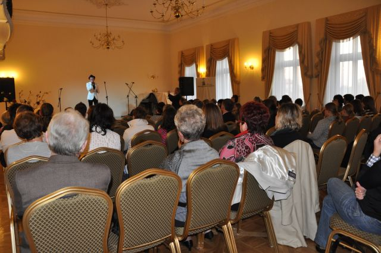</a> 
<a href="img/archive_files/2/Masz_talent_12.jpg" target="_blank">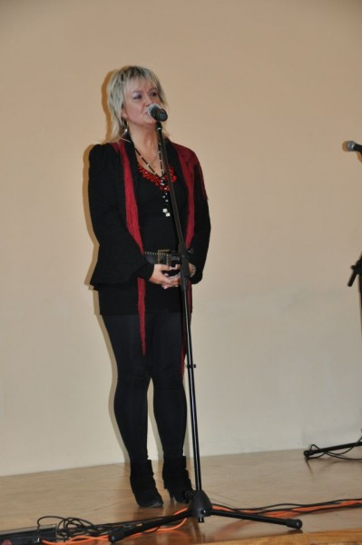</a> 
 
 
 
 
 
<a href="img/archive_files/2/Masz_talent_05.jpg" target="_blank">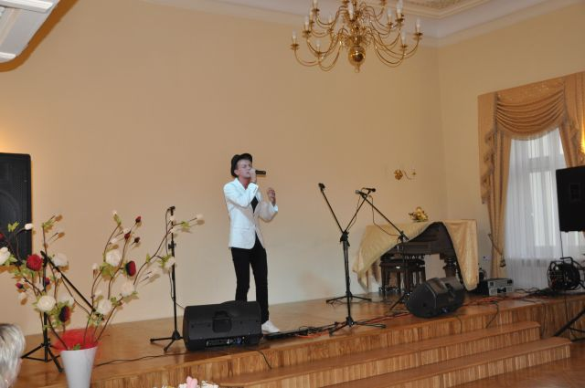</a> 
<a href="img/archive_files/2/Masz_talent_05a.jpg" target="_blank">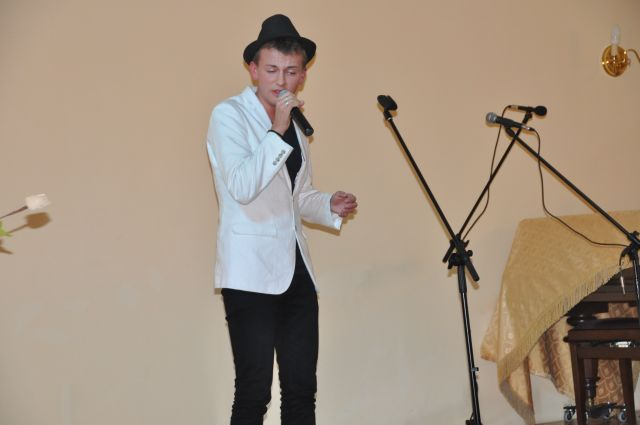</a> 
 
<a href="img/archive_files/2/Masz_talent_08.jpg" target="_blank">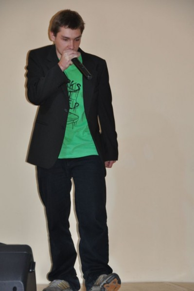</a> 
 
 
 
 
 

<i>2010-10-18 16:10:00</i> 
Kandydat do Sejmiku Województwa Podkarpackiego Prezes Alicja Zając
<strong>Moi drodzy, jestem Wam bardzo wdzięczna za poprcie i zaufanie, którym obdarzyliście mnie w wyborach w dniu 21.11.2010.</strong>

Kandydat z ramienia partii PSL do Sejmiku Województwa Podkarpackiego - Alicja Zając - Prezes Fundacji "Pomocna Dłoń" <em>"Jedynie prawdziwy człowiek zauważy potrzeby innego człowieka. Jedynie człowiek wielkiego serca wyciągnie doń pomocną dłoń"</em>
 

Kandydat z ramienia partii PSL do Sejmiku Województwa Podkarpackiego - Alicja Zając Prezes Fundacji "Pomocna Dłoń"

<em>"Jedynie prawdziwy człowiek zauważy potrzeby innego człowieka.</em>

<em>Jedynie człowiek wielkiego serca wyciągnie doń pomocną dłoń"</em>

<strong>Moi drodzy, jestem Wam bardzo wdzięczna za poprcie i zaufanie, którym obdarzyliście mnie w wyborach w dniu 21.11.2010</strong><em> </em>
 
<a href="#" class="loadImages">ZOBACZ ZDJĘCIA</a> 

<a href="img/archive_files/2/Kandydat_1.jpg" target="_blank">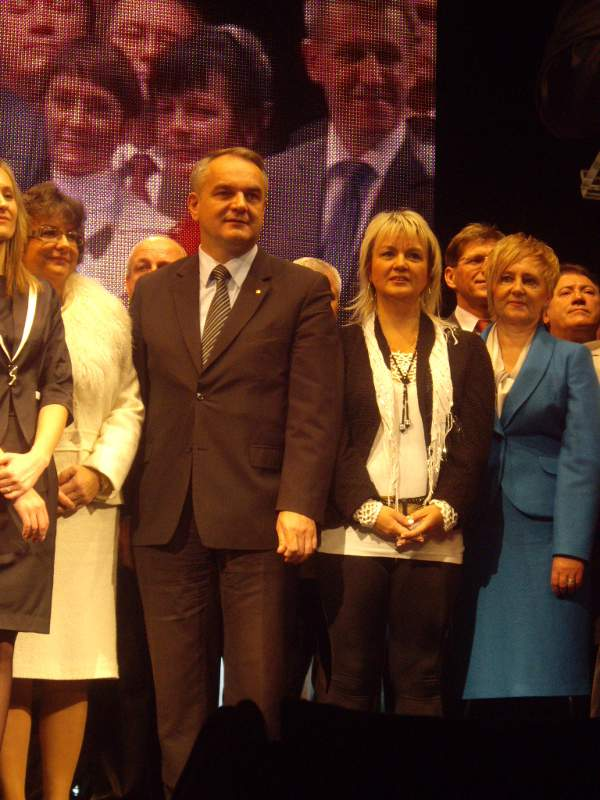</a> 
<a href="img/archive_files/2/Kandydat_2.jpg" target="_blank">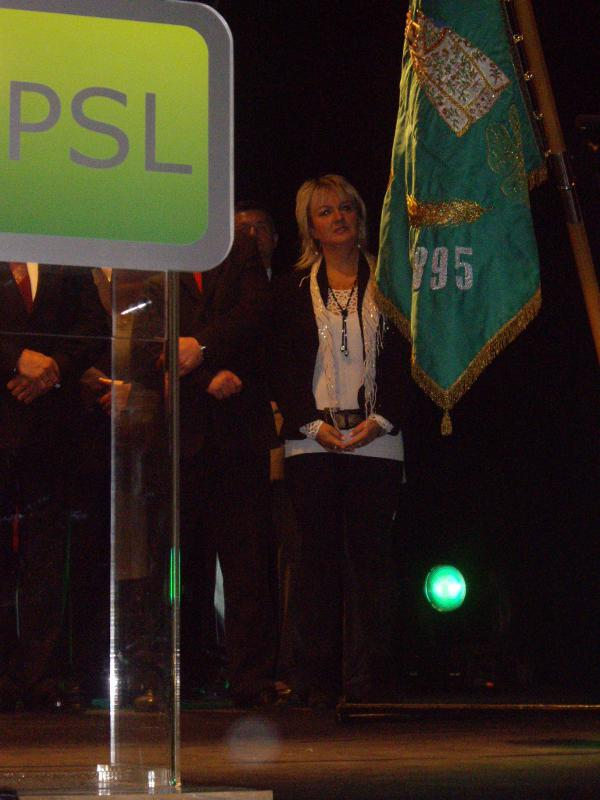</a> 
<a href="img/archive_files/2/Kandydat_3.jpg" target="_blank">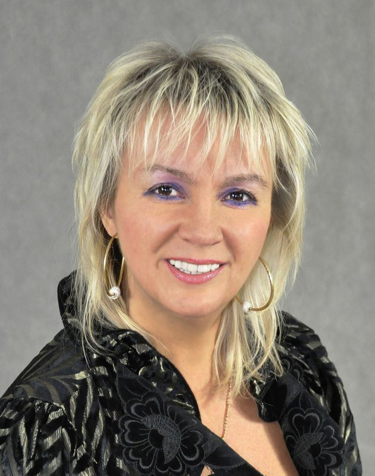</a> 
 

<i>2010-11-23 10:01:00</i> 
Podarujmy chorym dzieciom uśmiech
W niedzielę, 14 listopada, w hali sportowej Miejskiego Ośrodka Sportu i  Rekreacji w Jarosławiu odbył się koncert charytatywny zorganizowany  przez jarosławską Fundację "Pomocna Dłoń". Jego celem była zbiórka  pieniędzy dla chorych dzieci leczonych na Oddziale Dziecięcym  jarosławskiego szpitala Centrum Opieki Medycznej.
 

W niedzielę, 14 listopada, w hali sportowej Miejskiego Ośrodka Sportu i Rekreacji w Jarosławiu odbył się koncert charytatywny zorganizowany przez jarosławską <strong>Fundację "Pomocna Dłoń"</strong>. Jego celem była zbiórka pieniędzy dla chorych dzieci leczonych na Oddziale Dziecięcym jarosławskiego szpitala Centrum Opieki Medycznej. Gwiazdą koncertu był <strong>Marek Piekarczyk</strong> z zespołem towarzyszącym i śląska grupa <strong>Cree</strong>. Jako support wystąpili laureaci naszego rodzimego konkursu <strong>"Masz Talent" - Karol Argasiński, Jakub Maga, Monika Czarny i Arek Kłusowski.</strong> Marka Piekarczyka przedstawiać nie trzeba, bo to niekwestionowana, charyzmatyczna legenda polskiego heavy metalu. Związany z prekursorem tego gatunku muzyki w Polsce, zespołem TSA. Śpiewa od ponad trzydziestu lat i głos wciąż ma nie do zdarcia (i nie do podrobienia)...

 Zespół Cree został założony w 1993 roku w Tychach przez Sebastiana Riedla i Sylwestra Kramka. Sebastian spełnił marzenie ojca (śp. Ryszarda Riedla, wokalisty Dżemu), który zafascynowany Indianami wspominał, że chciałby mieć zespół o takiej właśnie nazwie (Cree to jedno z najliczniejszych plemion Indian kanadyjskich, zamieszkujące także północną część USA). Ojciec może być dumny z syna (i czuwać nad nim i jego kompanami z zaświatów), bo zespół radzi sobie doskonale, czego dowodem był koncert w Jarosławiu.

 I wszystko byłoby świetnie, gdyby nie zaskakująco mała frekwencja. Rozczarowani byli nie tylko organizatorzy. Nie bardzo jest to czym usprawiedliwić, bo jeśli nawet ktoś nie lubi tego rodzaju muzyki, to cel koncertu powinien być ponad tym. Gdzie jest jarosławska młodzież?! Gzie młodzież z okolicy?! (I nie tylko młodzież!). Cena biletów wcale nie była wygórowana. Aż łza się w oku kręci, jeśli przypomnieć sobie koncerty sprzed lat, na które przychodziły tysiące ludzi. Widać, że wraz z tamtymi latami przeminęło coś jeszcze...

 Patronat honorowy nad koncertem objął wojewoda podkarpacki Mirosław Karapyta (który pojawił się w trakcie, aby przywitać się z jego uczestnikami) oraz burmistrz Jarosławia Andrzej Wyczawski. W przerwie między występami odbyła się aukcja przekazanych przez ludzi dobrej woli przedmiotów, rękodzieła i obrazów. Prowadził ją nasz sztandarowy satyryk Henryk Cebula oraz dyrektor Kultury i Sportu w Cieszanowie, twórca tamtejszego Rock Festiwalu, Wojciech Świzdor. A cały koncert prowadziła Alicja Zając, jego duch sprawczy, prezes Fundacji "Pomocna Dłoń" wraz z dyrektorem Biura Wojewody Stanisławem Ryszem.

 Wykonawcy na pamiątkę otrzymali piernikowe serca - wypieki uczniów Zespołu Szkół Spożywczych, Chemicznych i Ogólnokształcących w Jarosławiu, oczywiście darowane organizatorom. Innych darczyńców także nie zabrakło (noclegi, katering, kolacja, ochrona, Straż Miejska, ratownictwo medyczne, rozkładanie i składnie sceny przez OSP z Wólki Pełkińskiej).

<em>Źródło: Gazeta Jarosławska</em>
 
<a href="#" class="loadImages">ZOBACZ ZDJĘCIA</a> 

 
 
 
 
 
<a href="img/archive_files/1/0012.JPG" target="_blank">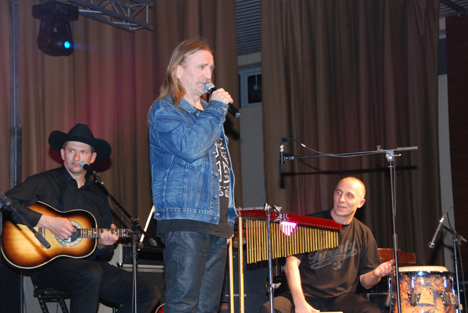</a> 
 
 
 
 
<a href="img/archive_files/1/0049.JPG" target="_blank">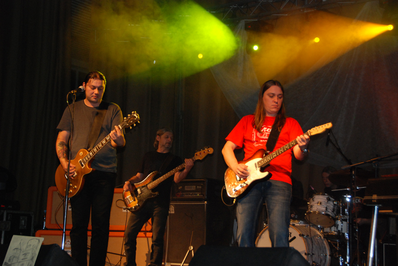</a> 
 
 
 
 
 
 
 
 
 
 
<a href="img/archive_files/2/k5.JPG" target="_blank">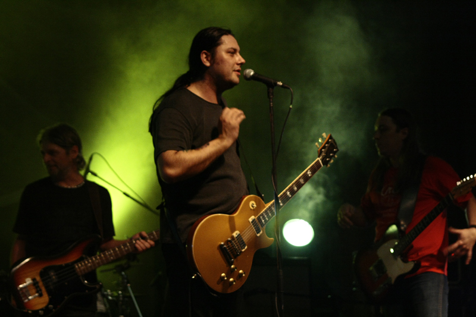</a> 
 
 
 
 
 
 
 
 
 
<a href="img/archive_files/2/Zdjecie091[1].jpg" target="_blank">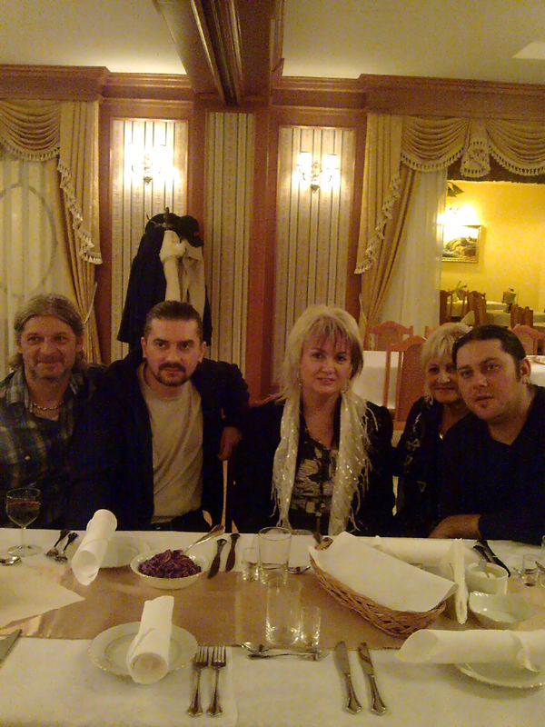</a> 
 
 
 

<i>2010-12-06 09:10:00</i> 
Wywiad z Radiem AM 
Zapraszamy do wysłuchania wywiadu z Prezes Fundacji "Pomocna Dłoń" Alicją Zając przeprowadzonego przez Radio AM oraz piosenki wykonanej przez S. Riedela z zespołem Cree dla  Prezes Fundacji podczas koncertu charytatywnego.
 

Zapraszamy do wysłuchania wywiadu z Prezes Fundacji "Pomocna Dłoń"  Alicją Zając przeprowadzonego przez Radio AM oraz piosenki wykonanej  przez S. Riedela z zespołem Cree dla  Prezes Fundacji podczas koncertu charytatywnego.

 </object>
 
<a href="#" class="loadImages">ZOBACZ ZDJĘCIA</a> 

 

<i>2010-12-14 10:54:00</i> 
Dar dla szpitala
W niedzielę, 14 listopada, odbył się w Jarosławiu koncert charytatywny  zorganizowany przez Jarosławską Fundację "Pomocna Dłoń". Jego celem była  zbiórka pieniędzy dla Oddziału Dziecięcego szpitala COM. Wystąpił Marek  Piekarczyk, Cree i laureaci "Masz Talent".
 

W niedzielę, 14 listopada, odbył się w Jarosławiu koncert charytatywny zorganizowany przez Jarosławską Fundację "Pomocna Dłoń". Jego celem była zbiórka pieniędzy dla Oddziału Dziecięcego szpitala COM. Wystąpił Marek Piekarczyk, Cree i laureaci "Masz Talent". Z uwagi na wynik finansowy koncertu jego organizatorzy przekazali szpitalowi COM nie to, co zamierzali, lecz to, co mogli wynegocjować za uzyskane pieniądze. A wynegocjowali dużo, jak na kwotę, którą dysponowali, jednak nie dla Oddziału Dziecięcego, tylko dla Urazowo-Ortopedycznego. Jest to łóżko rehabilitacyjne (za 3,5 tys. zł) wraz z drabinką (600 zł). Do tego doszedł jeszcze transport (1 000 zł). Tymczasem organizatorzy koncertu mieli na wszystko 1 625 zł.

 - Wielkie podziękowania należą się Jarosławowi Brodzie z firmy "Ortomedyka" w Tarnowie, który za taką kwotę nam to łóżko i drabinkę sprzedał oraz Tomaszowi Piotrów za sponsorowanie transportu - mówi Alicja Zając, prezes "Pomocnej Dłoni". Wynik finansowy koncertu był bardzo słaby. A był taki przez kiepską frekwencję. Łącznie sprzedano 690 biletów (po 25 zł), w tym zaledwie 26 przed samym koncertem. Co daje kwotę 17 250 zł. Ogólny dochód (bilety, sponsorzy i aukcja, która przyniosła 1 025 zł) wyniósł 19 625 zł.

Koszty związane z organizacją koncertu to 18 000 zł. Zostało 1 625 zł. Ponadto, gdy sprzęt został już zakupiony, okazało się, że organizatorzy koncertu muszą zapłacić podatek od występu zespołów, w wysokości 1 237 zł. Fundacja musi wziąć te pieniądze z własnego konta, a więc w ostatecznym rozrachunku tyle na tym koncercie straciła.

 Różnie się mówi o tej imprezie. Dlatego zacytujemy to, co napisał w e-mailu do Alicji Zając Marek Piekarczyk. A napisał tak: "Witam, witam. Dziękuję za znakomitą organizację i pozytywne klimaty na koncercie w Jarosławiu. Wszystko było naprawdę na wysokim poziomie. Serdecznie pozdrawiam w imieniu swoim i pozostałych muzyków &lt;Źródła&gt;".

 A tak a propos - Fundacja "Pomocna Dłoń" przekazała na Oddział Urazowo-Ortopedyczny już czwarte łóżko, natomiast uczniowie Zespołu Szkół Plastycznych w Jarosławiu wykonali kilka malunków na ścianach jednej z sal, żeby było weselej.

<em>Źródło: Gazeta Jarosławska</em>
 
<a href="#" class="loadImages">ZOBACZ ZDJĘCIA</a> 

<a href="img/archive_files/1/5925.jpg" target="_blank">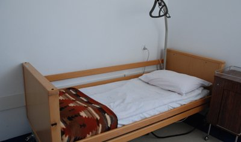</a> 

<i>2010-12-20 09:29:00</i> 
Mikołaj w Domu Dziecka nr 1
Jarosławska Fundacja „Pomocna Dłoń”, podobnie jak w latach minionych,  gościła w Domu Dziecka nr 1 w Jarosławiu, z worem pełnym prezentów.  Okazją był oczywiście Mikołaj... Dzieci i młodzież zgotowały mu niezwykle miła przyjęcie. Było mnóstwo śmiechu i świetna zabawa. A zaczęło się od przedstawienia przygotowanego specjalnie na tę okazję.
 

Radosne chwile Jarosławska Fundacja <strong>„Pomocna Dłoń”</strong>, podobnie jak w latach minionych, gościła w Domu Dziecka nr 1 w Jarosławiu, z worem pełnym prezentów. Okazją był oczywiście Mikołaj... Dzieci i młodzież zgotowały mu niezwykle miła przyjęcie. Było mnóstwo śmiechu i świetna zabawa. A zaczęło się od przedstawienia przygotowanego specjalnie na tę okazję. Następnie nie zabrakło przeróżnych konkursów, w których każdy coś wygrał.

 Podczas spotkania panowała prawdziwie świąteczna atmosfera – nie tylko za sprawą śpiewanych kolęd, ale też wystroju świetlicy, z pięknie przyozdobioną przez dzieci choinką.

 Fundację reprezentowała prezes Alicja Zając, wiceprezes Elżbieta Raczyńska oraz członek Zarządu Wiesław Zając. Muzycznie spotkanie uatrakcyjnił Roman Darowski.

 W Domu Dziecka nr 1 mieszka obecnie 36 dzieci, w wieku od 2 do 17 lat. A jego dyrekcja, wychowawcy i personel robią wszystko, by było tam jak w domu. (wu zet)
 
<a href="#" class="loadImages">ZOBACZ ZDJĘCIA</a> 

 
<a href="img/archive_files/2/SDC13247.JPG" target="_blank">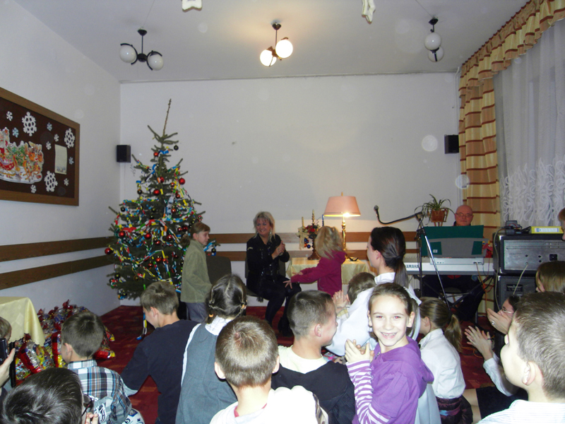</a> 
 
<a href="img/archive_files/2/SDC13256.JPG" target="_blank">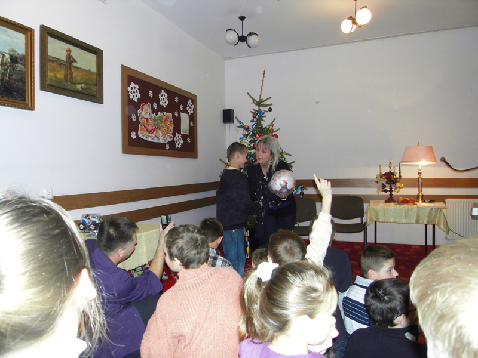</a> 
 
 
 
 
 
 
 

<i>2010-12-28 09:08:00</i> 
Nagrania filmowe z koncertu charytatywnego
Zapraszamy do obejrzenia krótkich filmów z koncertu charytatywnego "Podarujmy chorym dzieciom uśmiech", który odbyl się 14 listopada 2010.
 

Zapraszamy do obejrzenia krótkich filmów z koncertu charytatywnego "Podarujmy chorym dzieciom uśmiech", który odbyl się 14 listopada 2010
 
<a href="#" class="loadImages">ZOBACZ ZDJĘCIA</a> 

 

