

<i>2011-01-14 08:16:00</i> 
Podziękowanie - statuetka
Podziękowanie w postaci statuetki dla Pani Alicji Zając od Wojewody Podkarpackiego Mirosława Karapyty za organizację koncertu charytatywnego "Podarujmy chorym dzieciom uśmiech".
 

Podziękowanie w postaci statuetki dla Pani Alicji Zając od Wojewody  Podkarpackiego Mirosława Karapyty za organizację koncertu charytatywnego "Podarujmy chorym dzieciom uśmiech".
 
<a href="#" class="loadImages">ZOBACZ ZDJĘCIA</a> 

<a href="img/archive_files/2/statuetka1.jpg" target="_blank">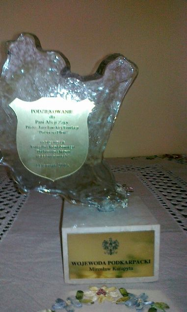</a> 
 

<i>2011-01-31 14:30:00</i> 
Koncert kolęd &quot;Stacja Betlejem&quot; 
Stacja „Betlejem” zainstalowała się w niedzielę, 30 stycznia, w  Kolegiacie Bożego Ciała. Jej członkowie zaśpiewali najpiękniejsze  kolędy. Koncert był to niezwykły z kilku względów. Przede wszystkim  dlatego, że wystąpili w nim znani, sympatyczni i utalentowani  piosenkarze.
 

Stacja „Betlejem” zainstalowała się w niedzielę, 30 stycznia, w Kolegiacie Bożego Ciała. Jej członkowie zaśpiewali najpiękniejsze kolędy. Koncert był to niezwykły z kilku względów. Przede wszystkim dlatego, że wystąpili w nim znani, sympatyczni i utalentowani piosenkarze: Katarzyna Kuraś - Zebzda, Sylwia Łyko, Mariola Niziołek, Magdalena Serafin, Aleksandra Zimny, Arkadiusz Kłusowski oraz Kacper Leśniewski, laureaci programów telewizyjnych tj. „Szansa na Sukces" i wielu konkursów ogólnopolskich i międzynarodowych tj. „Eurokids" we Włoszech, „Srebrna Jantra" w Bułgarii, „Kaunas Talent" na Litwie, „Vostok Bazar" na Krymie, Złoty Mikrofon Radia Jard w Bielsku Białej, Carpathia Festiwal w Rzeszowie i wielu innych konkursów.

Wokaliści kształceni pod okiem: Elżbiety Zapendowskiej, Jadwigi Gałęskiej Tritt, Grażyny Łobaszewskiej, Magdaleny Skubisz i Anny Czenczek. Wszyscy pełni uroku i talentu wykonawcy tworzą Rzeszowską Grupę Artystyczną Przystanek Betlejem w Jarosławskiej Kolegiacie H. Grymuza Koncert odbył się z udziałem zespołu akompaniującego „Lola Band” , który tworzą : Kamil Wójtowicz - klawisze, Przemysław Przywara - gitara akustyczna i elektryczna, Ritu Trzpis - gitara basowa, Wojciech Czachur - instrumenty perkusyjne.

 Zgromadzonych słuchaczy zauroczył nie tylko repertuar obejmujący kolędy i pastorałki, ale także forma ich aranżacji i transkrypcji muzycznej. Wydarzenie miało miejsce dzięki zaangażowaniu <strong>Jarosławskiej Fundacji „Pomocna Dłoń”</strong>.której cenionym prezesem jest Alicja Zając.

 Proboszcz Kolegiaty, ks. Marian Bocho, wyrażając wdzięczność artystom powiedział między innymi: „To bardzo budujące, ze młodzi ludzie chcą śpiewać o Dobrej Nowinie, o Narodzeniu Jezusa – Bożego Syna. Głosy mają piękne, możliwości wielkie, więc życzę, aby ta Dobra Nowina znalazła miejsce nie tylko na waszych koncertach, ale i w sercu”.

<em>Fot. Arek Kłusowski i </em><em>Henryk Grymuza</em> <em>źródło: Henryk Grymuza</em>

(...)  Grupa ta z programem “Stacja Betlejem” wystąpiła już o godzinie 11-tej w parafii Św. Brata Alberta w Szówsku – Krzyżówce. Swym występem uświetniła niedzielną liturgię Mszy Św. po której artyści wyśpiewali 45 minutowy koncert. Została ona bardzo ciepło przyjęta przez wiernych parafii oraz jej duszpasterzy. Zapraszamy na: <a href="http://www.bratalbert-szowsko.pl/index.php?p=aktt" target="_blank">http://www.bratalbert-szowsko.pl/</a> oraz http://<a href="www.bratalbert-szowsko.pl/index.php?p=gal46" target="_blank">www.bratalbert-szowsko.pl/</a> (...)

<em>Janusz Jachimski</em>
 
<a href="#" class="loadImages">ZOBACZ ZDJĘCIA</a> 

 
 
<a href="img/archive_files/1/04[3].jpg" target="_blank">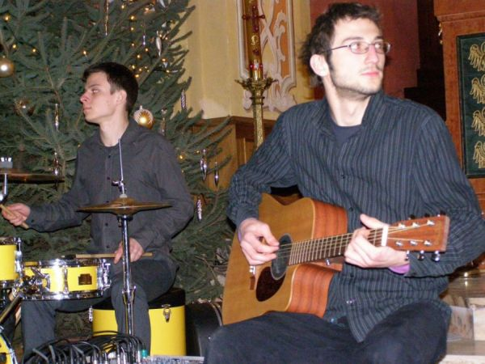</a> 
 
 
 
 
 
 
 
 
 
 
 
 
 
 
 
 
 
 

<i>2011-01-31 15:15:00</i> 
Jodłówka dla Maksia
<em>"Tata wskazał tę klacz, ja wybrałam  fundację, a fundacja Maksia. Teraz czekamy na chętnych, by klacz kupili"</em> –  mówi Magdalena Babiś-Leja. Jodłówka, dwuletnia huculska klacz ma pomóc w leczeniu Maksia. Tak  postanowili: Józef Babiś, jego córka Magdalena i Alicja Zając z  Jarosławskiej Fundacji „Pomocna Dłoń”, która konia od nich otrzymała.  Bez wahania podarowała go naszej fundacji, <strong>by pomóc <a title="Maks" href="http://www.youtube.com/watch?v=cIEZcH4o8zw&amp;feature=player_embedded" target="_blank">Maksiowi</a> stanąć na  nogi</strong>.
 

<strong>Jodłówka</strong>, dwuletnia huculska klacz ma pomóc w leczeniu Maksia. Tak postanowili: <strong>Józef Babiś, jego córka Magdalena i Alicja Zając z Jarosławskiej Fundacji „Pomocna Dłoń”</strong>, która konia od nich otrzymała. Bez wahania podarowała go naszej fundacji, by pomóc Maksiowi stanąć na nogi. Magdalena Babiś-Leja mimo wielu obowiązków przyjeżdża na spotkanie do Hawłowic. Tu, pod Pruchnikiem, jej ojciec Józef Babiś, znany lokalny przedsiębiorca od kilkunastu lat tworzył gospodarstwo agroturystyczne i stadninę koni pod wdzięczną nazwą „Swoboda”.

 Marek Wojdyła, pracownik stadniny, wyprowadza dwuletnią klacz, hucuła. Mały kucyk podchodzi do ogrodzenia. Patrzy z zachwytem na Jodłówkę, jakby wiedział, że to córka Juraty i wybitnego ogiera Puszkara, zwycięscy wielu czempionatów, ścieżek huculskich, konkursów skoków w Polsce, na Słowacji, Węgrzech i w Austrii. – Jodłówka to klacz wywodzącą się z bardzo utytułowanej rodziny, poprawna, urodziwa, dobrze rokująca na przyszłość – zachwala swoją wychowankę Agnieszka Sojka. Marzy o tym, by Jodłówka trafiła w odpowiednie ręce. Młoda klacz Jodłówka najpierw trafiła w ręce Alicji Zając, prezes Jarosławskiej Fundacji „Pomocna Dłoń” od lat wspieranej przez J. Babisia i jego córkę. – Zadzwoniła do mnie pani Magda z wiadomością, że ojciec chce przekazać klacz. Prosiła, bym wybrała potrzebującą osobę. Nie miałam wątpliwości, jaki będzie cel. To leczenie Maksia, trzylatka, dla którego Fundacja Życia Podkarpackiego „Podaruj Dzieciom Radość” organizuje turnieje sportowe. Mam nadzieję, że znajdą się osoby, które będą chciały kupić konia i wesprzeć leczenie małego chłopca – mówi Alicja Zając. Kup konia, pomóż Maksiowi

 <a title="Maksymilian" href="http://www.zycie.pl/sport.php?rodzaj=Pi%B3ka+no%BFna&amp;nr=365"><strong>Maksymilian Mach z Przemyśla</strong></a> choruje na atrogrypozę wrodzoną. Kosztowanego leczenia 3,5-letniego chłopca podjęła się Ortopedyczna Klinika Dziecięca w Aschau w Niemczech. Chłopiec jest już po dwóch operacjach, ale usztywnienie stawów nóg i rąk nie pozwala mu na samodzielne chodzenie. Fundacja Życia Podkarpackiego „Podaruj Dzieciom Radość” wspiera jego leczenie i 27 lutego br. organizuje kolejny – III Charytatywny Halowy Turniej Piłki Nożnej. Dla Maksia i wszystkich, którzy włączą się w akcję zaśpiewa Tomasz Szczepanik z zespołu Pectus. Włącz się i ty. Weź udział w licytacji Jodłówki, przesympatycznej młodej klaczy i pomóż Maksiowi stanąć na nogi. Kontakt: <strong>Małgorzata Tomasiak, dyrektor biura fundacji Życia Podkarpackiego<a title="Fundacja Życia Podkarpackiego" href="http://www.zycie.pl/fundacja.php"> „Podaruj dzieciom radość”</a>. Telefon: 16 670-22-00.</strong>

<strong><em>Źródło: Życie Podkarpackie</em> </strong>
 
<a href="#" class="loadImages">ZOBACZ ZDJĘCIA</a> 

<a href="img/archive_files/2/Jodlowka.jpg" target="_blank">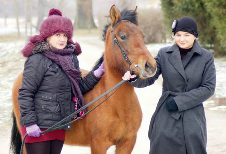</a> 
 

<i>2011-02-28 09:09:00</i> 
Charytatywny Halowy Turniej Piłki Nożnej
Już po raz trzeci Życie Podkarpackie i Fundacja Życia Podkarpackiego  „Podaruj Dzieciom Radość” zorganizowały piłkarski turniej halowy, z  którego dochód zostanie przeznaczony na leczenie i rehabilitację  3,5-letniego Maksymiliana Macha. Dzięki Wam udało się uzbierać 20 110 zł  62 gr, w tym z kwesty 9 677 zł 73 gr i 3 009 zł z licytacji 2-letniej  klaczy Jodłówki.
 

Już po raz trzeci Życie Podkarpackie i Fundacja Życia Podkarpackiego „Podaruj Dzieciom Radość” zorganizowały piłkarski turniej halowy, z którego dochód zostanie przeznaczony na leczenie i rehabilitację 3,5-letniego Maksymiliana Macha. Dzięki Wam udało się uzbierać 20 110 zł 62 gr, w tym z kwesty 9 677 zł 73 gr i 3 009 zł z licytacji 2-letniej klaczy Jodłówki. Historia chorego na artropgrypozę Maksia wzrusza wszystkich. Sympatyczny i rezolutny chłopczyk od kilku lat poddawany jest operacjom i rehabilitacji, które mają sprawić, że dziecko zacznie chodzić. W minioną niedzielę, 27 lutego, odbył się 3. Charytatywny Halowy Turniej Piłki Nożnej, z którego dochód zostanie przeznaczony na leczenie Maksymiliana. Na parkiecie potykało się 10 drużyn, a wśród nich dwie przyjezdne: oldboye Wisły Kraków i Legia Champions League. W przerwie pomiędzy meczami na boisku zmierzyły się reprezentacje przemyskich przedszkolaków z przedszkola nr 3 i z przedszkola nr 12. Ale piłka nożna to nie wszystko. W czasie turnieju rozstrzygnięty został Plebiscyt Życia Podkarpackiego na Najlepszego-Najpopularniejszego Sportowca 2010 roku (szczegóły w zakładce „sport”), a prezydent Przemyśla Robert Choma wręczył stypendia sportowe wyróżniającym się zawodnikom. Sportowa część imprezy zakończyła się meczem gwiazd, podczas którego zmierzyły się drużyny Wisły i Legii Champions League.  Megatort i Szczepanik na deser Jednym z najbardziej emocjonujących momentów niedzielnej imprezy był wjazd olbrzymiego tortu w kształcie boiska piłkarskiego. Bezpośrednio po rozkrojeniu tortu rozpoczął się niezwykły pokaz mody wieczorowej i sportowej. Stroje na ten pokaz zostały przygotowane przez Salon Mody Ślubnej Gaja Beaty Dzik, salon mody męskiej Guittard Witolda Szczepańskiego oraz salon mody sportowej Sarafis. Fryzury modelek przygotowało Studio Stylizacji Fryzur Magdaleny Błażkowskiej. Pokaz przygotowały także wizażystki z perfumerii Douglas: Natalia Malawska-Kostka i Joanna Lasota. W trakcie pokazu mody publiczność mogła także podziwiać występy artystyczne w wykonaniu grupy Unikal Street Artist oraz Formacji Tanecznej A-Z. I wreszcie na sam finał zaśpiewał wokalista popularnej grupy Pectus Tomasz Szczepanik. Oprawę audiowuzualną całego turnieju zapewnił DJ Gabriel Delgado. Patronat medialny nad imprezą sprawowało w tym roku Radio Rzeszów. Pełna relacja z wydarzenia w bieżącym wydaniu ŻP.

<em>Źródło: www.zycie.pl</em>

<em>"Podziękowanie dla Alicji Zając za pomoc w organizacji 3 Charytatywnego Halowego Turnieju Piłki Nożnej. Dziękujemy za życzliwość i wsparrcie oraz szczęgólne podziękowanie za przekazanie konia na licytację z której pieniądze zostaną przekazane na leczenie Maksymiliana" </em>
 
<a href="#" class="loadImages">ZOBACZ ZDJĘCIA</a> 

<a href="img/archive_files/2/Podziekowanie-Maksymilian.jpg" target="_blank">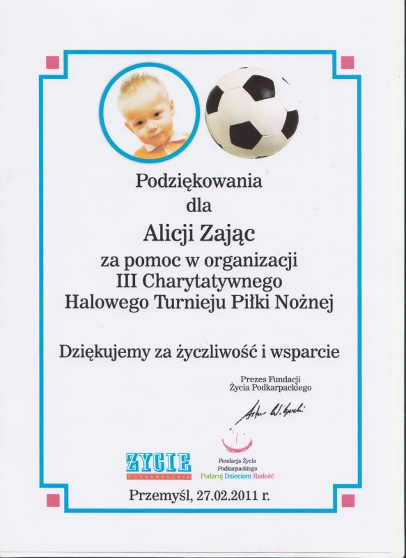</a> 
 
<a href="img/archive_files/1/DSC_3666.JPG" target="_blank">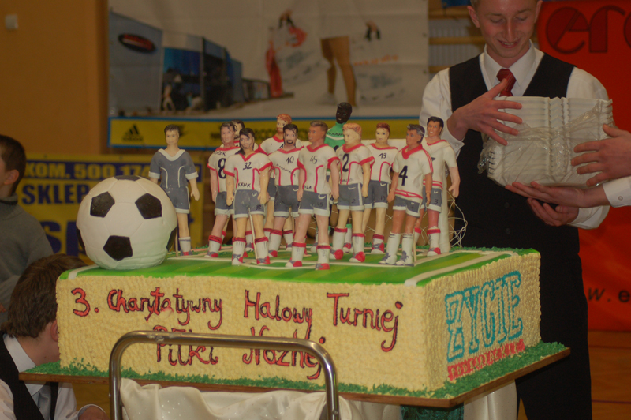</a> 
 
 
 

<i>2011-03-15 11:05:00</i> 
Wypełnij bezpłatnie swój PIT 
Wypełnij bezpłatnie swój PIT online i przekaż 1% na OPP KRS: 0000094513 JAROSŁAWSKA FUNDACJA "POMOCNA DŁOŃ"
 

Wypełnij bezpłatnie swój PIT online i przekaż 1% na OPP KRS: 0000094513 JAROSŁAWSKA FUNDACJA "POMOCNA DŁOŃ"

<a class="moz-txt-link-rfc2396E" href="http://www.e-pity.pl/darmowy-program-online-epity2010-pit37-pit36-pit38-pit39-dlaKRS0000094513"> </a>

 
<a href="#" class="loadImages">ZOBACZ ZDJĘCIA</a> 

 

<i>2011-03-24 13:09:00</i> 
Rusza III Edycja Programu &quot;Masz Talent&quot;
Rusza III Edycja Programu "Masz Talent". Eliminacje odbędą  się 12 04.2011r. o godz: 11.00 w Sali Lustrzanej Centrum Kultury i  Promocji w Jarosławiu, Rynek 5 (kamienica Attavantich).

<strong>Organizator:</strong> Jarosławska Fundacja "Pomocna Dłoń"
 

Rusza III Edycja Programu "Masz Talent"

Eliminacje odbędą się 12 04.2011r. o godz: 11.00 w Sali Lustrzanej Centrum Kultury i Promocji w Jarosławiu, Rynek 5 (kamienica Attavantich). <strong> </strong>

<strong>POTRAFISZ ŚPIEWAĆ? TAŃCZYĆ? KOMPONUJESZ WŁASNĄ MUZYKĘ? ODZNACZASZ SIĘ TALENTEM, KTÓRY CHCIAŁBYŚ ZAPREZENTOWAĆ?</strong>

 Przyjdź na eliminacje „Masz Talent” !!!!! To może być Twój pierwszy krok do rozpoczęcia kariery! Oferta jest przygotowana dla osób uczących się w Szkołach gimnazjalnych oraz średnich. Wszelkie dodatkowe informacje uzyskać można w Jarosławskiej Fundacji "Pomocna Dłoń" pod numerem tel. 696 475 057  <strong>Organizator:</strong> Jarosławska Fundacja "Pomocna Dłoń" <strong>Partnerzy:</strong> Urząd Miasta Jarosławia Centrum Kultury i Promocji w Jarosławiu <strong>Partonat medialny:</strong> Gazeta Jarosławska SERDECZNIE ZAPRASZAMY !!!

<em>Źródło: CKiP Jraosław</em>
 
<a href="#" class="loadImages">ZOBACZ ZDJĘCIA</a> 

 
 

<i>2011-03-25 08:44:00</i> 
Koncert charytatywny &quot;Podarujmy dzieciom uśmiech&quot; - gwiazda Modern Talking Reloaded Double Show
Jarosławska Fundacja "Pomocna dłoń" zaprasza na koncert charytatywny pt. <strong>"Podarujmy dzieciom uśmiech"</strong>, który odbędzie się w dniu 3.04.2011 r. o godzinie 17:00 w Hali Spotrowej MOSiR Jarosław.
 

Jarosławska Fundacja "Pomocna dłoń" zaprasza na koncert charytatywny pt. <strong>"Podarujmy dzieciom uśmiech"</strong>, który odbędzie się w dniu 3.04.2011 r. o godzinie 17:00 w Hali Spotrowej MOSiR Jarosław.

Pieniądze z koncertu przeznaczymy na cele statutowe naszej Fundacji. W koncercie weźmie udział znany wszystkim zespół <strong>Modern Talking Reloaded Double Show</strong> oraz finaliści naszego programu "Masz talent" i zespół "Amiti".

Bilety w cenie 40.00 zł będą do nabycia:
<ul><li> MOSiR hala Sportowa, </li><li>MOK, </li><li>Pizzeria Corleone ul. Baski Puzon, </li><li>Sklep Muzyczny na ul. Jana Pawła II,</li><li>Muzeum Historii Miasta Rzeszowa z Podziemną Trasą Turystyczną (Rynek 12, Rzeszów
 <a href="http://maps.google.pl/maps?oe=utf-8&amp;rls=org.mozilla:pl:official&amp;client=firefox-a&amp;um=1&amp;ie=UTF-8&amp;q=trasa+podziemna+rzesz%C3%B3w&amp;fb=1&amp;gl=pl&amp;hq=trasa+podziemna&amp;hnear=Rzesz%C3%B3w&amp;cid=0,0,4795531224298351360&amp;ei=9ghVTY_vOYG3hQfC3PSODQ&amp;sa=X&amp;oi=local_result&amp;ct=image&amp;resnum=5&amp;ved=0CDIQnwIwBA" target="_parent">Pokaż trasę</a>
,17 875-41-99),</li><li>Estrada Rzeszowska. Agencja artystyczna. Jagiellońska 24 II p.,</li><li>Miejski Dom Kultury w Łańcucie</li><li>Miejski Ośrodek Kultury w Przeworsku, ul. Jagiellońska 10a.</li><li>Sklep Muzyczny "MUSICLAND" ul. Serbańska 13 w Przemyślu. </li></ul>
Podczas koncertu odbędzie się <strong>Live Show DJ Gabriel Delegado</strong>.

Patronat honorowy obejmie <strong>Sekretarz Stanu Wice Minister Gospodarki Poseł RP Mieczysław Kasprzak</strong>.

Również Patronat nad naszą impreza obejmą: Burmistrz Miasta Jarosławia Andrzej Wyczawski, Urząd Gminy Jarosław, Życie Podkarpackie, Gazeta Jarosławska.

Do dnia 25.02.2011 r. będzie promocyjna cena biletów <strong>30.00 zł. </strong>

<strong></strong>Również bilety będą do nabycia pod tel. 696-475-057

<strong>Zapraszamy do zapoznania się z video przedstawiającym Zespół na żywo odbierający nagrodę.</strong>

<strong><a href="http://www.modern-talking-reloaded.de/pl/video.html">http://www.modern-talking-reloaded.de/pl/video.html</a></strong>
 
<a href="#" class="loadImages">ZOBACZ ZDJĘCIA</a> 

 

<i>2011-04-11 19:43:00</i> 
Modern Talking Reloaded Double Show  Koncert charytatywny
W niedzielę, 3 kwietnia, w hali sportowej MOSiR w Jarosławiu odbył się  koncert charytatywny Jarosławskiej Fundacji "Pomocna Dłoń", którą  kieruje Alicja Zając, zorganizowany z pomocą Centrum Kultury i Promocji.  Przebiegał pod hasłem "Podarujmy dzieciom uśmiech".
 

W niedzielę, 3 kwietnia, w hali sportowej MOSiR w Jarosławiu odbył się koncert charytatywny Jarosławskiej Fundacji "Pomocna Dłoń", którą kieruje Alicja Zając, zorganizowany z pomocą Centrum Kultury i Promocji. Przebiegał pod hasłem "Podarujmy dzieciom uśmiech". Gwiazdą koncertu był niemiecki duet Modern Talking Reloaded Double Show, który jako jedyny ma prawo używać nazwy Modern Talking. Duet tworzą Andre Brand i Michael Beurich. Do Jarosławia przyjechali prosto ze Słowacji, gdzie występowali dzień wcześniej. Zaśpiewali wszystkie największe przeboje Modern Talking, które w latach osiemdziesiątych podbijały listy przebojów Europy i świata oraz serca fanów.

 Długa kolejka po autografy świadczyła o tym, że występ się spodobał jarosławskiej publiczności. - Nie pamiętam tamtego zespołu, ale wiem o nim od moich rodziców - powiedziała nam Asia tuż po koncercie. - Przyszłam tu z nimi i bardzo mi się podobało. Przed gwiazdą koncertu wystąpili laureaci naszej rodzimej imprezy "Masz talent" - Karol Argasiński (I LO), Jakub Maga (ZSDGiL), Kamil Inglot (ZS nr 5) i Karolina Węgrzyn (ZSP) z przeworskim zespołem Baraban. Po nich na scenie pojawił się zespół Amiti z Rzeszowa (z Arkiem Kłusowskim, laureatem pierwszej edycji "Masz Talent"). Potem zagrał DJ Delgado.

 Wszyscy uczestnicy koncertu otrzymali na pamiątkę piernikowe serca przygotowane przez ZSSChiO w Jarosławiu. A Andre i Michael dodatkowo dostali olbrzymi kosz kwiatów, obrazy, a także swoje karykatury, które w trakcie ich występu sporządził Henryk Cebula. Koncert przebiegał pod honorowym patronatem sekretarza stanu w Ministerstwie Gospodarki posła Mieczysława Kasprzaka oraz burmistrza Jarosławia Andrzeja Wyczawskiego i wójta Gminy Jarosław Romana Kałamrza.

<em>Źródło: Gazeta Jarosławska</em>

Jarosławska Fundacja "Pomocna dłoń" dziękuje wszystkim Sponsorom za włączenie się w nasz koncert charytatywny "Podarujmy dzieciom uśmiech" Szczególne podziękowanie składamy zespołowi; MODERN TALKING RELOADED, Dj Gabriel Delgado, zespół AMITI i finalistom naszego programu "Masz talent". Mieliśmy również zaszczyt - gościć na naszej imprezie; Pana <strong>LESZKA KWIATKOWSKIEGO</strong> Producenta Teatralnego i Muzycznego,reżysera, właściciela Agencji Koncertowej "Syndykat Artystyczny" w Krakowie.

 <strong>"Kto ma serce pełne miłości zawsze ma coś do dania" </strong>

Zdjecia wykonali:
<ol><li>Ewa Kłak - Zarzecka</li><li>Roman Bury</li><li>Patryk Górecki</li><li>Maria Piśko<strong> </strong></li></ol> 
<a href="#" class="loadImages">ZOBACZ ZDJĘCIA</a> 

 
 
 
 
 
 
 
 
 
 
 
<a href="img/archive_files/1/_DSC0006.JPG" target="_blank">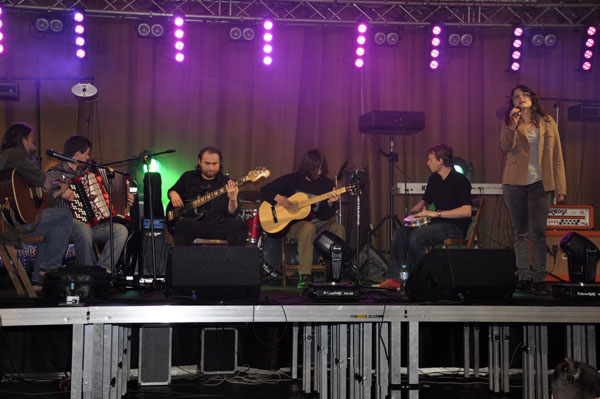</a> 
 
<a href="img/archive_files/1/_DSC0008.JPG" target="_blank">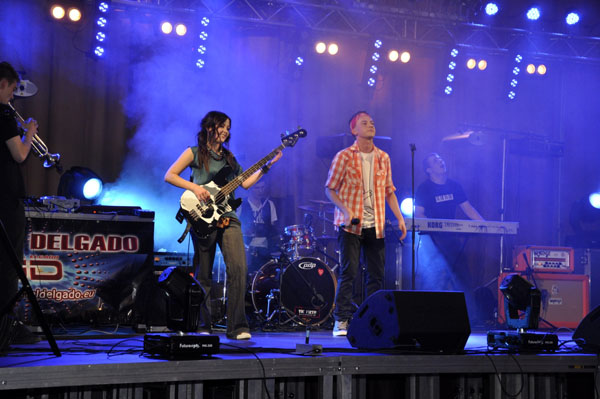</a> 
 
<a href="img/archive_files/1/_DSC0023[1].jpg" target="_blank">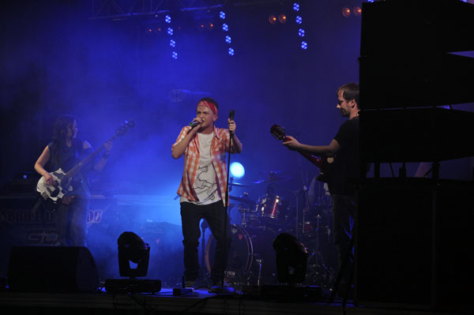</a> 
 
 
<a href="img/archive_files/1/_DSC0079.JPG" target="_blank">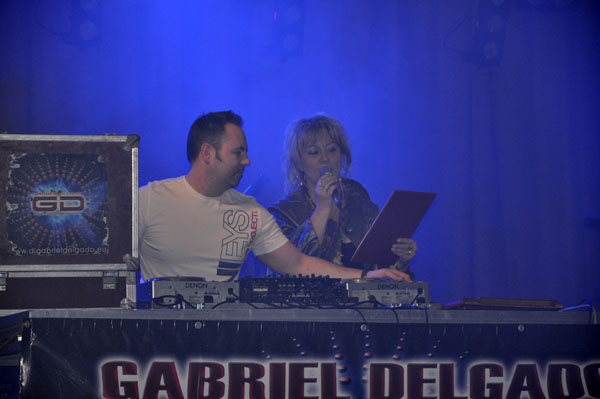</a> 
 
 
 
 
 
 
 
 
<a href="img/archive_files/1/_DSC0085.JPG" target="_blank">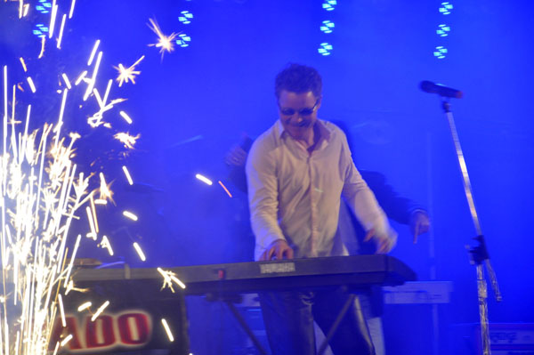</a> 
 
 
 
 
<a href="img/archive_files/1/_DSC0260.JPG" target="_blank">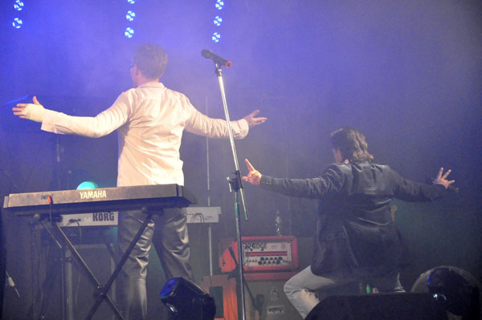</a> 
 
 
 
 
<a href="img/archive_files/1/_DSC0313.JPG" target="_blank">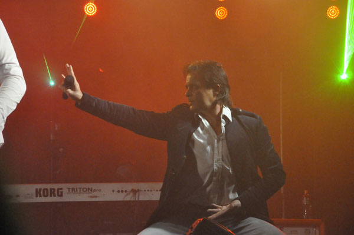</a> 
 
 
 
 
 
<a href="img/archive_files/1/_DSC0431.JPG" target="_blank">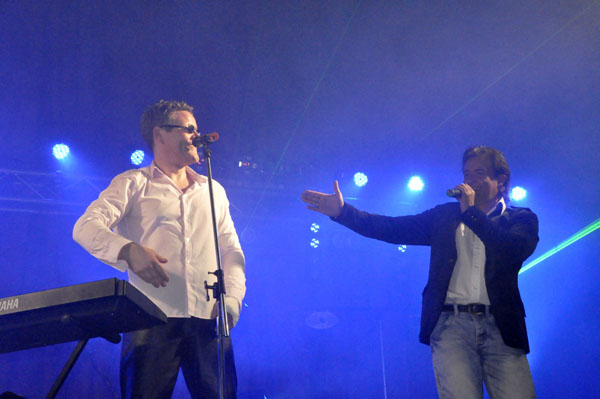</a> 
 
 
 
 
 
 
 
 
 
 
 
<a href="img/archive_files/1/_DSC0545.JPG" target="_blank">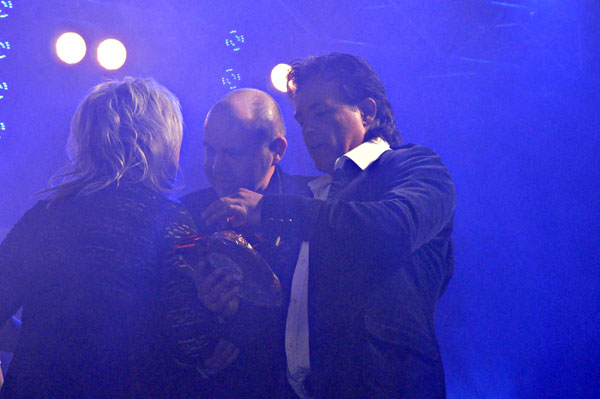</a> 
 
 
 
 
 
 
 
 
<a href="img/archive_files/1/_DSC0556.JPG" target="_blank">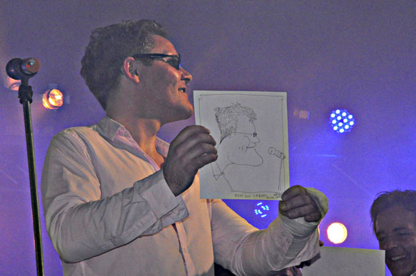</a> 
 
 
 
 
 
<a href="img/archive_files/2/na-probe.jpg" target="_blank">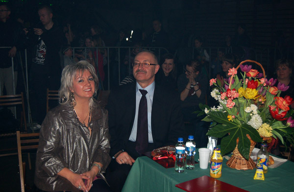</a> 

<i>2011-04-14 11:49:00</i> 
Eliminacje III edycji Programu „Masz Talent”
Eliminacje III edycji Programu „Masz Talent” już za nami. 12 kwietnia  br. komisja konkursowa wybrała 12 finalistów, którzy 22 maja będą  walczyć o nagrodę główną – laptop ufundowany przez jarosławski oddział  PKO BP S.A. Podczas przesłuchań do programu „Masz Talent" dominował śpiew, gra na  instrumentach, taniec. Wybrani przez komisję finaliści właśnie w tych  trzech kategoriach będą walczyć 22 maja o nagrodę główną. Publiczność  również będzie mogła wybrać swojego faworyta.
 

Eliminacje III edycji Programu „Masz Talent” już za nami. 12 kwietnia br. komisja konkursowa wybrała 12 finalistów, którzy 22 maja będą walczyć o nagrodę główną – laptop ufundowany przez jarosławski oddział PKO BP S.A. Podczas przesłuchań do programu „Masz Talent" dominował śpiew, gra na instrumentach, taniec. Wybrani przez komisję finaliści właśnie w tych trzech kategoriach będą walczyć 22 maja o nagrodę główną. Publiczność również będzie mogła wybrać swojego faworyta.

Finaliści III edycja programu „Masz Talent" to:

 <strong>WOKALIŚCI </strong>- Paulina Chodzińska, Gabriela Gamracy, Dawid Krzeptoń, Daniel Lipiec, Mateusz Wysocki, Natalia Zygmunt. ZESPOŁY - Fake, Overcom, Zespół Wokalny z ZS Szówsko. TANIEC - Monika Bartoszek. <strong></strong>

<strong>GRA NA INSTRUMENCIE </strong>- Wiktoria Ciemierkiewicz (skrzypce) i Piotr Konfera (akordeon).

 <strong>W skład komisji konkursowej weszli:</strong> przewodniczący - Arkadiusz Kłusowski (wokalista zespołu AMITI), Jadwiga Gryczman - dyrektor PKO BP S.A. Oddział w Jarosławiu; Urząd Miasta reprezentowały Joanna Mordarska - naczelnik Wydziału Kultury Turystyki i Promocji Miasta i Magdalena Rożek, Jarosławską Fundację „Pomocna Dłoń":  prezes Alicja Zając i wiceprezes Elżbieta Raczyńska oraz Irmina Kardaszyńska z Centrum Kultury i Promocji w Jarosławiu.

 Małgorzata Młynarska Biuro Informacji i Komunikacji Społecznej
 
<a href="#" class="loadImages">ZOBACZ ZDJĘCIA</a> 

 
 
 
 
 
 
 
 
 
 

<i>2011-04-15 22:25:00</i> 
Modern Talking Reloaded   Koncert charytatywny - filmy
Zapraszmy do obejrzenia filmów nagranych podczas koncertu charytatywnego zespołu Modern Talking Reloaded!!
 

Zapraszmy do obejrzenia filmów nagranych podczas koncertu charytatywnego zespołu Modern Talking Reloaded oraz finalistów "Masz talent".

<a href="http://vimeo.com/23469803">Koncert Modern Talking Reloaded - Organizator Jarosławska Fundacja Pomocna Dłoń cz. 6</a> from <a href="http://vimeo.com/user6801281">Pomocna Dlon</a> on <a href="http://vimeo.com">Vimeo</a>.

 

   
 
<a href="#" class="loadImages">ZOBACZ ZDJĘCIA</a> 

 

<i>2011-05-24 09:28:00</i> 
Młodzi, zdolni, wartościowi
Jarosławska Fundacja „Pomocna Dłoń” w szeroką strukturę swoich działań  wpisuje od lat różnorodne przedsięwzięcia charytatywne, pomocowe,  artystyczne oraz te, które związane są z promowaniem młodych talentów  Ziemi Jarosławskiej. To jedyna tego typu forma ekspozycji talentów  muzycznych, śpiewaczych, kompozytorskich , plastycznych itp.
 

Jarosławska Fundacja „Pomocna Dłoń” w szeroką strukturę swoich działań wpisuje od lat różnorodne przedsięwzięcia charytatywne, pomocowe, artystyczne oraz te, które związane są z promowaniem młodych talentów Ziemi Jarosławskiej. To jedyna tego typu forma ekspozycji talentów muzycznych, śpiewaczych, kompozytorskich , plastycznych itp.

Zarządem Fundacji kieruje ceniona na Podkarpaciu Alicja Zająć. To osoba o wrażliwej duszy i postawie horyzontalnej. W niedzielę, 22 maja, w Centrum Kultury i Promocji Jarosławia przeprowadzona została III edycja znanego i uznanego konkursu „Masz Talent”. Placówka ta jest współorganizatorem tej cennej inicjatywy. Jury pod kierownictwem dr. Jacka Ścibora oceniało solistów, zespoły wokalne i instrumentalne, muzyków oraz projektantkę mody. Pełna sala , znakomita atmosfera, muzyka, piosenka i aura zapożycz ona od Polihymni – to wszystko stało się udziałem finalistów konkursu i widzów. Był rock i jazz, były piosenki z lat 60. Nie sposób pominąć rapu oraz tańca i pokazu kreacji. Piękne dziewczęta wystąpiły podczas pokazu projektów ubiorów autorstwa utalentowanej uczennicy Zespołu Szkół Plastycznych Aurelii Fąfary. Do organizacji i wsparcia konkursu przyłączyły się także: Bank PKO BP oraz Wydział Kultury i Promocji Urzędu Miasta. Laureatem dzisiejszego przeglądu konkursowego został Daniel Lipiec, któremu przedstawicielka PKO BP wręczyła ufundowany przez tę instytucję bankową laptop. Publiczność wyróżniła gimnazjalistę z Laszek Dawida Krzeptonia. Wszystkim uczestnikom wręczono dyplomy i upominki. W poszczególnych edycjach konkursu uczestniczą uczennice i uczniowie ze szkół powiatu jarosławskiego. Projekt oceniany jest wysoko w środowisku jarosławskim. Daje bowiem możliwość eksponowania pasji artystycznych.

Henryk Grymuza

Główną nagrodą ufundowaną przez PKO Bank Polski Spółka akcyjna z siedzibą w Warszawie  oddział w Jarosławiu jest LAPTOP Samsung. Współorganizatorem koncertu jest <strong>Urząd Miasta w Jarosławiu</strong> i <strong>Centrum Kultury w Jarosławiu</strong>.  Patronat Medialny pełni <strong>Gazeta Jarosławska</strong>,<strong> Życie Podkarpackie</strong> i <strong>Radio AM Jarosław</strong>.

Finalistów oceniali JURY w składzie:
<ul><li>Jacek Ścibor Przewodniczący Jury - Dr Sztuki Wokalnej uniwersytetu Rzeszowskiego, Artysta Muzyk</li><li>Krzysztof Krzych- Dyr. Zespołu Sztuk Plastycznych w Jarosławiu</li><li>Gabriel Delgado - Dj i Producent z Jarosławia</li><li>Joanna Mordarska - Naczelnik Kultury Turystyki i Promocji Miasta Jarosławia</li><li>Irmina Kardaszyńska - Instruktor w Centrum Kultury w Jarosławiu</li><li>Maria Anna Połeć - przedstawiciel PKO Bank Polski oddział Jarosław</li></ul>
Gościnnie wystąpili Jakub Maga i Monika Czarny - Finaliści II Edycji "Masz Talent"

I MIEJSCE zdobył  <strong>Daniel Lipiec</strong>

WYRÓŻNIENIE: <strong>Aurelia Fąfara, Mateusz Wysocki i Piotr Kąfera</strong>

NAGRODA PUBLICZNOŚCI: <strong>Dawid Krzeptoń</strong>

NAGRODA SPECJALNA: <strong>Wiktoria Ciemierkiewicz</strong>

Koncert prowadziła Alicja Zając - Prezes Fundacji Pomocna Dłoń<strong> </strong>
 
<a href="#" class="loadImages">ZOBACZ ZDJĘCIA</a> 

 
 
 
 
 
 
 
 
 
 
 
 
 
 
 
 
 
 
 
 
 
 
 
 
 
 
 
 
 

<i>2011-06-05 15:48:00</i> 
Finał Programu &quot;Masz Talent&quot; - filmy z z udziałem uczestników
Finał Programu "Masz Talent" - filmy z z udziałem uczestników
 

Finał Programu "Masz Talent" - filmy z z udziałem uczestników
 
<a href="#" class="loadImages">ZOBACZ ZDJĘCIA</a> 

 

<i>2011-07-22 10:40:00</i> 
HAWŁOWICE: Licytacja konia. Cel: leczenie Sabinki Tomaszewskiej
Czwarty rok z rzędu w Hawłowicach odbył się Zajazd Huculski –  prestiżowe zawody jeździeckie, a tym samym eliminacje do Ogólnopolskiego  Czempionatu. Impreza odbyła się jak zwykle w drugi weekend lipca.  Zawody rozpoczęły się w sobotę o 10.30, wtedy też dokonano oceny koni na  płycie – Czempionat Hodowlany.
 

Czwarty rok z rzędu w Hawłowicach odbył się Zajazd Huculski – prestiżowe zawody jeździeckie, a tym samym eliminacje do Ogólnopolskiego Czempionatu. Impreza odbyła się jak zwykle w drugi weekend lipca. Zawody rozpoczęły się w sobotę o 10.30, wtedy też dokonano oceny koni na płycie – Czempionat Hodowlany. Kolejnym elementem był udział w ścieżce huculskiej tzw. próbie dzielności, a o 18.00 rozpoczęto ścieżkę sportową. Pierwszy dzień zawodów zakończyło ognisko dla hodowców i gości.

 W niedzielę rano imprezę poprzedziła msza święta w intencji śp. Józefa Babisia, inicjatora Zajazdu i byłego właściciela stadniny. Następnie konie ruszyły ścieżką huculską, tym razem do konkursu eliminacyjnego. Nie zabrakło również, jak co roku, pokazu zaprzęgów parokonnych i konkursu skoków przez przeszkody. Zwieńczeniem imprezy było ogłoszenie wyników i wręczenie nagród zwycięzcom.

 Podczas trwania zawodów można było przejechać się bryczką lub kucykiem, a na najmłodszych czekały liczne atrakcje. Dorośli mogli posilić się pysznymi potrawami prosto z grilla. Oko wszystkich cieszyły pokazy tańca zespołów Powiatowego Ogniska Baletowego z Jarosławia. Organizatorami tegorocznego Zajazdu byli: Okręgowy Związek Hodowców Koni w Rzeszowie, gospodarze ze Stadniny Koni Babiś Hawłowice, jak również Gospodarstwa Agroturystycznego „Swoboda”, na których to posesji zawody się odbywały

 Honorowy patronat nad imprezą objęli m.in. Ministerstwo Rolnictwa i Rozwoju Wsi, Starostwo Jarosławskie, Urząd Gminy Pruchnik, a wśród gości byli m.in. wiceminister Gospodarki – Mieczysław Kasprzak, czy marszałek Województwa Podkarpackiego – Mirosław Karapyta.

 – Tegoroczne zawody były dla nas bardzo szczególne, bo pierwszy raz odbyły się bez ich pomysłodawcy i głównego organizatora… Jednak myślę, że udało się utrzymać klimat i prestiż, taki jaki był w poprzednich latach. Z pewnością, kolejny już raz wielką pomoc i zaangażowanie okazał Okręgowy Związek Hodowców Koni w Rzeszowie. Wielki ukłon z naszej strony dla sponsorów, bez których na pewno nie poradzilibyśmy sobie – mówi Magdalena Babiś, właścicielka Gospodarstwa Agroturystycznego „Swoboda”. – Mam nadzieję, że w następnych latach Zajazdy Huculskie będą równie udane i tak wiele osób będzie dla nas przychylnych – dodaje właścicielka. <strong></strong>

<strong>Podczas imprezy odbyła się również licytacja konia, którego śp. Józef Babiś w ostatnich miesiącach życia podarował Jarosławskiej Fundacji Pomocna Dłoń. Został on nabyty przez Dariusza Fleszara za kwotę 5000 zł. </strong>

 – Pieniążki zostaną przekazane dla chorej na raka Sabinki Tomaszewskiej, a za hojność nabywcy jak i państwu Babisiom serdecznie dziękuję – powiedziała nam <strong>Alicja Zając, prezes fundacji</strong>. Każdy kto choć raz odwiedził stadninę w Hawłowicach zwrócił uwagę na malowniczo położoną posiadłość, z dwoma przestronnymi stawami. Właściciele chętnie podejmą się organizacji wesela, komunii, bankietu, czy innej imprezy. W Hawłowicach można również wypocząć z całą rodziną w specjalnie przygotowanych dla wczasowiczów pokojach, z dostępem do grilla i świeżego powietrza. Instruktorzy ze Stadniny chętnie nauczą jeździć konno, przewiozą bryczką, a w zimie zorganizują kulig. Szczegółowe informacje można uzyskać udając się osobiście na miejsce, bądź dzwoniąc pod nr telefonu podany poniżej.

Gospodarstwo Agroturystyczne Swoboda, Hawłowice 121, tel. (16) 628-88-31, 517 018 232.

Zajazd Huculski im. Józefa Babisia

Tekst: EMP

<strong>Pieniądze z licytacji <a title="Fundacja charytatywna" href="http://www.pomocna-dlon.com">Fundacja "Pomocna Dłoń"</a> przekazała na operację oraz leczenie Sabinki Tomaszewskiej</strong>

<strong> </strong>
 
<a href="#" class="loadImages">ZOBACZ ZDJĘCIA</a> 

 
 
 
 
 
 

<i>2011-08-01 08:03:00</i> 
Święto chleba
W niedzielę, 24 lipca, jarosławski Rynek tętnił życiem jak mało kiedy.  Sprawiły to obchody Święta Chleba połączonego z Jarosławskim Spotkaniem z  Folklorem i Sztuką Ludową, zorganizowane przez Starostwo Powiatowe i  Stowarzyszenie Miłośników Jarosławia.
 

W niedzielę, 24 lipca, jarosławski Rynek tętnił życiem jak mało kiedy. Sprawiły to obchody Święta Chleba połączonego z Jarosławskim Spotkaniem z Folklorem i Sztuką Ludową, zorganizowane przez Starostwo Powiatowe i Stowarzyszenie Miłośników Jarosławia. Oficjalne otwarcie imprezy nieco się opóźniło, bo organizatorzy czekali z tym na przyjazd wicepremiera Waldemara Pawlaka i wiceministra gospodarki, naszego posła, Mieczysława Kasprzaka. A kiedy już przyjechali starosta jarosławski Jerzy Batycki przywitał ich chlebem. - Bardzo się cieszę z tego spotkania tu w Jarosławiu, gdzie zaczyna się Unia Europejska - powiedział Wicepremier witając się z zebranymi na Rynku. - To święto to szczególny dzień, bo chleb ma swoją wielką wymowę. Chleb jest symbolem pojednania między ludźmi. To dzisiejsze święto ma tym bardziej mocną symbolikę, bo pokazuje jak ważne jest, abyśmy potrafili ze sobą współpracować, pomagać jeden drugiemu. Z jednej strony ważne jest, aby każdy starał się o własnych siłach o to, co najważniejsze dla człowieka, o swoją godność, ale także nie czuł się pozostawiony bez wsparcia, pomocy i szans na zbudowanie swojej lepszej przyszłości. Do zgromadzonych na rynku przemówił też Mieczysław Kasprzak. - Myślę, że dzisiejsze spotkanie na Rynku jarosławskim ma wymiar historyczny, bo pobyt tutaj premiera ludowca to naprawdę duże wydarzenie - powiedział. - Tu w 1937 roku, 15 sierpnia, kilkanaście tysięcy mieszkańców powiatu jarosławskiego zgromadziło się, aby walczyć o chleb. Dzisiaj spotykamy się w zupełnie innej atmosferze. Poseł Tomasz Kulesza zabierając głos nawiązał do pięknych słów C. K. Norwida "Do kraju tego, gdzie kruszynę chleba podnoszą z ziemi przez uszanowanie dla darów nieba, tęskno mi Panie". Podkreślił, że ten szacunek dla chleba musimy mieć i dzisiaj, dlatego że zawiera się w nim trud wielu ludzi, ich ciężka praca, której nie można przecenić. Potem honorowi goście zeszli ze sceny, by odwiedzić urządzone na Rynku stoiska Kół Gospodyń Wiejskich i artystów ludowych oraz porozmawiać z ludźmi. W tym czasie do występów przygotowywały się Polonijne Zespoły Folklorystyczne (m.in. z Brazylii, USA, Kanady, Francji i Czech). Przed nimi zaprezentował się Zespołu Pieśni i Tańca "Familia" z Rudołowic. Podczas finału na scenę wyszli wszyscy, ponad 280 osób, by w ten sposób podkreślić niezwykłą atmosferę tej imprezy. Gwiazdą wieczoru był zespół Karczmarze.

<em><strong>Źródło: <a href="http://jaroslawska.pl/index.php?PHPSESSIONID=&amp;artykul=6737&amp;kom=1" target="_blank">Gazeta Jarosławska</a></strong></em>
 
<a href="#" class="loadImages">ZOBACZ ZDJĘCIA</a> 

 

<i>2011-08-25 08:14:00</i> 
AKTUALIZACJA!! Koncert charytatywny pt. &quot;Podarujmy dzieciom uśmiech&quot; z udziałem Gwiazd! 
Jarosławska Fundacja "Pomocna dłoń" informuje, ze koncert charytatywny  zespołów ; Mr. PRESIDENT. MODERN TALKING Reloadad i FUN FACTORY -  Rzeszów Hala Podpromie dnia; 03.09.2011r zostaje <strong>ODWOŁANY</strong>.
 

Jarosławska Fundacja "Pomocna dłoń" informuje, ze koncert charytatywny zespołów ; Mr. PRESIDENT. MODERN TALKING Reloadad i FUN FACTORY - Rzeszów Hala Podpromie dnia; 03.09.2011r zostaje <strong>ODWOŁANY</strong>.

W/W Zespoły wystąpią na Podkarpaciu w następujących miejscowościach
<ul><li> <strong>Mr. PRESIDENT i FUN FACTORY</strong> Przemyśl dnia 02.09.2011 r NEO CLUB gdz. 21.30 Dyskoteka Forteca - URODZINY CLUBU godz. 24.oo</li><li><strong>Mr. PRESIDENT, MODERN TALKING Reloaded, FUN FACTORY</strong> Krosno dnia 03.09.2011r</li><li><strong>Mr. PRESIDENT, FUN FACTORY</strong> CLUB ARMAGEDON Sędziszów Małopolski dnia; 04.09.2011 r.  godz. 21.00 CLUB GALEON ok godz, 21.00</li></ul>
 Wszystkich zainteresowanych serdecznie zapraszamy!!!

Jarosławska Fundacja "Pomocna dłoń" organizuje w dniu 03.09.2011 r. o godz. 17.00 - 23.00  Koncert charytatywny pt. "Podarujmy dzieciom uśmiech".

Pieniądze z koncertu przeznaczymy na cele statutowe naszej fundacji, miedzy innymi na ofiarowanie  DAROWIZNY lub zakup sprzętu medycznego  dla  TOWARZYSTWA POMOCY CHIRURGICZNEJ CHORYM DZIECIOM W RZESZOWIE.  Koncert odbędzie się w obiekcie <strong>HALA PODPROMIE</strong> <strong>Regionalne Centrum Widowiskowo-Sportowe</strong> ul. Podpromie 10.

Wszelkie pytania proszę kierować: Alicja Zając Prezes Fundacji  tel. 696-475 -057

 <strong>PIERWSZA RZESZOWSKA "OLDIE NIGHT"</strong>

Plan imprezy:
<ul><li>SUPPORT Finaliści naszego programu "MASZ TALENT"  godz. 17.00</li><li>Znani artyści z naszego regionu  godz. 17.30 - Arkadiusz Kłusowski - Ewa Siembida - Sylwia Łyko - MARISHAA</li><li>Mateusz Ziółko Finalista <a title="Mateusz Zółko" href="http://dziendobrytvn.plejada.pl/25,45061,news,1,1,mateusz_ziolko_specjalnie_dla_kobiet,aktualnosci_detal.html">"Mam Talent"</a> godz. 18.00</li><li><a href="http://hubert-bisto.muzzo.pl/">Hubert Bisto</a> z pianistą  <a target="_blank">http://www.youtube.com/watch?v=lmA5Luf7sOM</a></li><li>DJ Gabriel Delgado  godz. 18.50</li><li>Gwiazdy koncertu Mr. PRESIDENT "Coco Jambo" godz. 19.00</li><li>MODERN TALKING RELOADED  Niemcy godz. 20.00</li><li>FUN FACTORY "Doh wah diddy" godz. 21.30</li><li>Zakończenie ok. godz. 23.00</li></ul>
<strong>Program prowadzić będą:</strong>
<ul><li>Alicja Zając - Prezes Fundacji Pomocna Dłoń</li><li>Hubert Ochmański - dziennikarz Tygodnika Życie Podkarpackie</li><li>Maciej Gnatowski - redaktor Radia Rzeszów</li></ul>
<strong>Bilety do nabycia: </strong>
<ul><li>TICKETPRO <a href="http://www.ticketpro.pl/jnp/home/index.html">www.ticketpro.pl</a></li><li>Kino ZORZA</li><li><a href="http://www.ebilet.pl/" target="_blank">e-bilet.pl</a></li><li>Trasa Podziemna Rzeszów</li><li>Jarosław Hala Sportowa MOSiR</li></ul>
 Alicja Zając Prezes Fundacji   Tel: 696-475-057 <a href="http://www.pomocna-dlon.com">www.pomocna-dlon.com</a>

<strong>PROŚBA O POMOC!!! KONCERT  CHARYTATYWNY pn. "Podarujmy dzieciom uśmiech" -  WIELKICH GWIAZD w Rzeszowie Hala Podpromie w dniu 03.09.2011r. </strong>

Pieniądze z koncertu przeznaczymy dla Towarzystwa Pomocy Chirurgicznej Chorym Dzieciom w Rzeszowie przy Szpitalu Woj.Nr. 2 Oddział Chirurgii Dziecięcej. Pomoc potrzebna od zaraz! Mamy koszty związane z organizacją koncertu tj. opłacenie Hali Podpromie , przyjazd artystów z zagranicy i wstepne wydatki które musimy ponieść -  aby doszło do koncertu.

<strong>Liczy się każda ofiara złożona na ten szczytny cel. </strong>

Pieniądze można wpłacać na  konto Nr. 12 9096 0004 2001 0000 2264 0001

Więcej informacji: <a href="http://www.pomocna-dlon.com">www.pomocna-dlon.com</a>

"Jedynie prawdziwy człowiek zauważy potrzeby innego człowieka. Jedynie człowiek wielkiego serca wyciągnie doń pomocna dłoń..."

<strong>Liczymy na wsparcie naszej inicjatywy.</strong>
 
<a href="#" class="loadImages">ZOBACZ ZDJĘCIA</a> 

<a href="img/archive_files/1/Fun_Factory_new.jpg" target="_blank">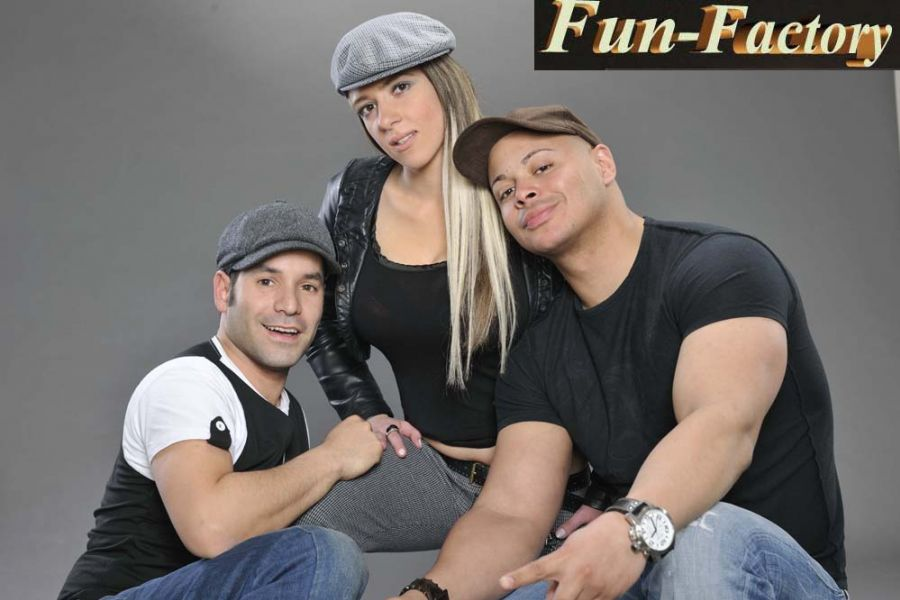</a> 
<a href="img/archive_files/1/IMG_0016_jako_Obiekt_inteligentny-1.jpg" target="_blank">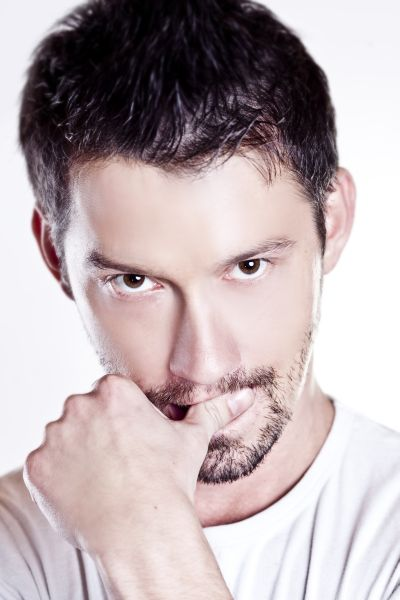</a> 
 
 
 
 

<i>2011-09-15 08:04:00</i> 
Prezes Jarosławskiej Fundacji &quot;Pomocna Dłoń&quot; - kandydat na posła
Prezes Jarosławskiej Fundacji "Pomocna Dłoń" startować będzie w wyborach Sejmowych z ramienia Polskiego Stronnictwa Ludowego. <strong>Lista 5 miejsce 21</strong>. <em>"Jedynie prawdziwy człowik zauważy potrzeby innego człowieka, jedynie człowiek wielkiego serca wyciągnie doń pomocną dłoń"</em>
 

Prezes Jarosławskiej Fundacji "Pomocna Dłoń" startować będzie w wyborach Sejmowych z ramienia Polskiego Stronnictwa Ludowego. <strong>Lista 5 miejsce 21</strong>. <em>"Jedynie prawdziwy człowik zauważy potrzeby innego człowieka, jedynie człowiek wielkiego serca wyciągnie doń pomocną dłoń"</em>
 
<a href="#" class="loadImages">ZOBACZ ZDJĘCIA</a> 

 
 

<i>2011-11-08 17:46:00</i> 
Wyprawka szkolna
W tym roku - Jarosławska Fundacja "Pomocna dłoń" -  rozdała wyprawki  szkolne uczniom  wytypowanym przez dyrekcję Szkoły Gimnazjum w Muninie i  Wójta Gminy Chłopice.
 

W tym roku - Jarosławska Fundacja "Pomocna dłoń" -  rozdała wyprawki szkolne uczniom  wytypowanym przez dyrekcję <strong>Szkoły Gimnazjum w Muninie i Wójta Gminy Chłopice</strong>.

<strong>Łącznie rozdano 50 szt  wyprawek</strong> tj. ( plecaki + przybory szkolne). Dzieci z radością i uśmiechem na twarzy podchodziły po podarowane plecaki,które od razu założyły na plecy.

Alicja Zając prezes fundacji dziękuje ofiarodawcy tj. <strong>Polska Grupa Słoń Trąbalski Sp. z o.o</strong>. z Krakowa za włączenie się w cykliczną akcję rozdania wyprawek dzieciom z biednych rodzin.
 
<a href="#" class="loadImages">ZOBACZ ZDJĘCIA</a> 

 

