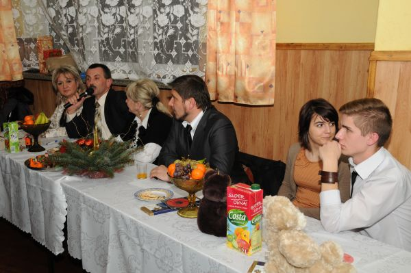
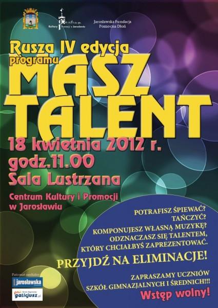
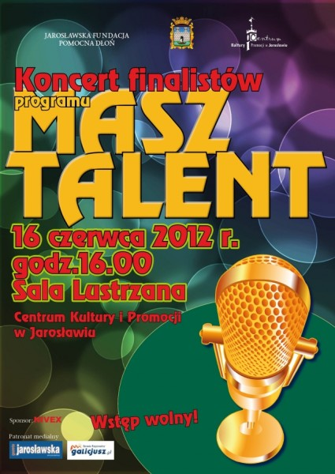

<i>2012-01-04 14:45:00</i>  
Program &quot;Masz talent&quot; oraz Mikołajki w Chłopicach
W dniu 14.12.2011r. Jarosławska fundacja "Pomocna dłoń" zorganizowała w  Chłopicach  Świąteczny Koncert charytatywny, połączony z programem "Masz  Talent".
  

W dniu 14.12.2011r. Jarosławska fundacja "Pomocna dłoń" zorganizowała w Chłopicach  Świąteczny Koncert charytatywny, połączony z programem "Masz Talent".

W programie wystąpiły dzieci ze Szkół z Gminy Chłopice.

 I - miejsce <strong>Kinga Stasiła</strong> kat. śpiew II - miejsce <strong>Dawid  Majcher</strong> kat. żonglerka  III - miejsce <strong>Adrian Brodowicz</strong> kat. taniec

 Gościnnie wystąpili Finaliści programu "Masz talent" - <strong>Monika Czarny</strong> i <strong>Daniel Lipiec</strong>, którzy swoim występem oczarowali publiczność. Na koniec pojawił się Mikołaj - rozdał paczki dla dzieci z Gminy Chłopice przygotowane przez Fundację.

<object width="560" height="315"><param name="movie" value="http://www.youtube.com/v/axuGjdCKgjU?version=3&amp;hl=pl_PL" /><param name="allowFullScreen" value="true" /><param name="allowscriptaccess" value="always" /><embed type="application/x-shockwave-flash" width="560" height="315" src="http://www.youtube.com/v/axuGjdCKgjU?version=3&amp;hl=pl_PL" allowscriptaccess="always" allowfullscreen="true"></embed></object>

 

 

  <object width="560" height="315"><param name="movie" value="http://www.youtube.com/v/uGlJGZx2_88?version=3&amp;hl=pl_PL" /><param name="allowFullScreen" value="true" /><param name="allowscriptaccess" value="always" /><embed type="application/x-shockwave-flash" width="560" height="315" src="http://www.youtube.com/v/uGlJGZx2_88?version=3&amp;hl=pl_PL" allowscriptaccess="always" allowfullscreen="true"></embed></object>

<object width="560" height="315"><param name="movie" value="http://www.youtube.com/v/Me3EsEtU2hY?version=3&amp;hl=pl_PL" /><param name="allowFullScreen" value="true" /><param name="allowscriptaccess" value="always" /><embed type="application/x-shockwave-flash" width="560" height="315" src="http://www.youtube.com/v/Me3EsEtU2hY?version=3&amp;hl=pl_PL" allowscriptaccess="always" allowfullscreen="true"></embed></object>

<object width="560" height="315"><param name="movie" value="http://www.youtube.com/v/4w12SBeaM_g?version=3&amp;hl=pl_PL" /><param name="allowFullScreen" value="true" /><param name="allowscriptaccess" value="always" /><embed type="application/x-shockwave-flash" width="560" height="315" src="http://www.youtube.com/v/4w12SBeaM_g?version=3&amp;hl=pl_PL" allowscriptaccess="always" allowfullscreen="true"></embed></object>
  
<b>Zdjęcia:</b> 

 
 
 
 
 
 
 
 

<i>2012-01-04 21:20:00</i>  
Zarząd  

<strong>Obecny skład Zarządu Fundacji: </strong> Alicja Zając - <strong>Prezes Zarządu</strong> Maciej Inglot - <strong>Wiceprezes Zarządu</strong> Wiesław Zając -<strong> Członek Zarządu</strong><strong> </strong>Lucyna Pleśniak -<strong> Prezydent Zgromadzenia</strong>

<strong>Organ nadzoru:</strong>

Marek Szuba Sławomir Olejarczyk Dawid Nykiel

<strong> </strong>
  

<i>2012-01-16 10:49:00</i>  
&quot;Koncert Charytatywny&quot; zespołu Dżem - 27.02.2012 r.
Zapraszamy na koncert charytatywny, gdzie gwiazdą wieczoru będzie zespół <strong>Dżem</strong>. Koncert odbędzie się w <strong>Hali SPortowej MOSiR</strong> Jarosław w dniu <strong>27.02.2012 r.</strong> o godzinie<strong> 17:40. </strong>
  

<strong>W programie:</strong> Finaliści "Masz Talent" godz, 17.40 Daniel Lipiec Monika Czarny   <strong>Gościnnie wystąpią:</strong> The Other Way Marcin Kołpak Magdalena Chodak Arkadiusz Kłusowski Hubert Bisto

 <strong>KONCERT zespołu Dżem godz. 19.00</strong>   Bilety  w cenie 30.00 PLN   Będą są do nabycia w: MOSiR Hala Sportowa, MOK - Jarosław, Kanapkowy Raj - ul. Kraszewskiego  4 Sklep Muzyczny HIT - ul Grunwaldzka 22A Pizzeria  CORLEONE  - ul Baśki Puzon 2

 

Wszelkie informacje można uzyskać od Prezes Fundacji Pomocna Dłoń P. Alicji Zając pod numerem tel. 696-475-057 lub e-mail <a href="mailto:pomocnadlon12@interia.pl">pomocnadlon12@interia.pl</a>
  
<b>Zdjęcia:</b> 

 

<i>2012-02-19 12:24:00</i>  
Audycja &quot;Podkarpackie-Pozarządowe&quot; w Polskim Radiu Rzeszów z Prezes Alicją Zając
Zapraszamy do posłuchania fragmentu audycji "Podkarpackie-Pozarządowe" w Polskim Radiu Rzeszów z Prezes Fundacji Pomocna Dłoń Alicją Zając. W/w audycja dotycząca koncertu Dżem, została wyemitowana 16.02.2012. Adycję prowadził Wojciech Wójcik.
  

Zapraszamy do posłuchania fragmentu audycji "Podkarpackie-Pozarządowe" w Polskim Radiu Rzeszów z Prezes Fundacji Pomocna Dłoń Alicją Zając. W/w audycja dotycząca koncertu Dżem, została wyemitowana 16.02.2012. Adycję prowadził Wojciech Wójcik.

  
<b>Zdjęcia:</b> 

 

<i>2012-03-14 12:31:00</i>  
Koncert charytatywny Dżem - zdjęcia!! 
Zapraszmay do obejrzenia fotogalerii z koncertu charytatywnego zorganizowanego przez Jarosławską Fundację Pomocna Dłoń. Koncert odbył się 27 lutego w Hali Sportowej MOSiR.
  

Zapraszmay do obejrzenia fotogalerii z koncertu charytatywnego  zorganizowanego przez Jarosławską Fundację Pomocna Dłoń. Koncert odbył  się 27 lutego w Hali Sportowej MOSiR.
  
<b>Zdjęcia:</b> 

 
 
 
 
 
 
 
 
 
 
 
 
 
 
 
 
 
 
 
 
 
 
 
 
 
 
 
 
 
 
 
 

<i>2012-03-27 08:57:00</i>  
&quot;MASZ TALENT&quot; IV EDYCJA
Jarosławska Fundacja "Pomocna Dłoń" już po raz czwarty organizuje konkurs <strong>"MASZ TALENT"</strong>. Eliminacje, odbędą się <strong>18.04.2012 r. o godz. 11:00 </strong>w Sali Lustrzanej Centrum Kultury i Promocji w Jarosławiu. Gorąco zapraszamy wszystkich chętnych - bez limitu wieku!!
  

Jarosławska Fundacja "Pomocna Dłoń" już po raz czwarty organizuje konkurs <strong>"MASZ TALENT"</strong>.  Potrafisz śpiewać? Tańczyć? Komponujesz własną muzykę? Odznaczasz się talentem, który chciałbyś zaprezentować?  Zrób pierwszy krok w kierunku kariery i przyjdź na eliminacje, które odbędą się <strong>18.04.2012 r. o godz. 11:00 </strong>w Sali Lustrzanej Centrum Kultury i Promocji w Jarosławiu. <strong> </strong> Gorąco zapraszamy wszystkich chętnych - bez limitu wieku!!
  
<b>Zdjęcia:</b> 

 

<i>2012-04-02 09:30:00</i>  
Koncert charytatywny Dżem -  FILMY
Zapraszamy do obejrzenia filmów z koncertu charytatywnego Dżem, który odbył się 27 lutego w hali sportowej MOSiR w Jarosławiu. Oprócz nagrań zespołu, dostępne również występy finalisów programu "MASZ TALENT".
  

Zapraszamy do obejrzenia filmów z koncertu charytatywnego Dżem, który odbył się 27 lutego w hali sportowej MOSiR w Jarosławiu.  Oprócz nagrań zespołu, dostępne również występy finalisów programu "MASZ TALENT".

 

 

<object width="560" height="315"><param name="movie" value="http://www.youtube.com/v/7Ce_K425Vlo?version=3&amp;hl=pl_PL" /><param name="allowFullScreen" value="true" /><param name="allowscriptaccess" value="always" /><embed type="application/x-shockwave-flash" width="560" height="315" src="http://www.youtube.com/v/7Ce_K425Vlo?version=3&amp;hl=pl_PL" allowscriptaccess="always" allowfullscreen="true"></embed></object><object width="560" height="315"><param name="movie" value="http://www.youtube.com/v/rEZePq62CyE?version=3&amp;hl=pl_PL" /><param name="allowFullScreen" value="true" /><param name="allowscriptaccess" value="always" /><embed type="application/x-shockwave-flash" width="560" height="315" src="http://www.youtube.com/v/rEZePq62CyE?version=3&amp;hl=pl_PL" allowscriptaccess="always" allowfullscreen="true"></embed></object><object width="560" height="315"><param name="movie" value="http://www.youtube.com/v/vhNEBRk0P4U?version=3&amp;hl=pl_PL" /><param name="allowFullScreen" value="true" /><param name="allowscriptaccess" value="always" /><embed type="application/x-shockwave-flash" width="560" height="315" src="http://www.youtube.com/v/vhNEBRk0P4U?version=3&amp;hl=pl_PL" allowscriptaccess="always" allowfullscreen="true"></embed></object><object width="560" height="315"><param name="movie" value="http://www.youtube.com/v/oNSnWafHt74?version=3&amp;hl=pl_PL" /><param name="allowFullScreen" value="true" /><param name="allowscriptaccess" value="always" /><embed type="application/x-shockwave-flash" width="560" height="315" src="http://www.youtube.com/v/oNSnWafHt74?version=3&amp;hl=pl_PL" allowscriptaccess="always" allowfullscreen="true"></embed></object><object width="560" height="315"><param name="movie" value="http://www.youtube.com/v/tlOf9sdRK1w?version=3&amp;hl=pl_PL" /><param name="allowFullScreen" value="true" /><param name="allowscriptaccess" value="always" /><embed type="application/x-shockwave-flash" width="560" height="315" src="http://www.youtube.com/v/tlOf9sdRK1w?version=3&amp;hl=pl_PL" allowscriptaccess="always" allowfullscreen="true"></embed></object><object width="560" height="315"><param name="movie" value="http://www.youtube.com/v/YxXrzwdwt-M?version=3&amp;hl=pl_PL" /><param name="allowFullScreen" value="true" /><param name="allowscriptaccess" value="always" /><embed type="application/x-shockwave-flash" width="560" height="315" src="http://www.youtube.com/v/YxXrzwdwt-M?version=3&amp;hl=pl_PL" allowscriptaccess="always" allowfullscreen="true"></embed></object>

    <object width="480" height="360"><param name="movie" value="http://www.youtube.com/v/lCwlzumxCeg?version=3&amp;hl=pl_PL" /><param name="allowFullScreen" value="true" /><param name="allowscriptaccess" value="always" /><embed type="application/x-shockwave-flash" width="480" height="360" src="http://www.youtube.com/v/lCwlzumxCeg?version=3&amp;hl=pl_PL" allowscriptaccess="always" allowfullscreen="true"></embed></object><object width="480" height="360"><param name="movie" value="http://www.youtube.com/v/GjvZ3-hUhE0?version=3&amp;hl=pl_PL" /><param name="allowFullScreen" value="true" /><param name="allowscriptaccess" value="always" /><embed type="application/x-shockwave-flash" width="480" height="360" src="http://www.youtube.com/v/GjvZ3-hUhE0?version=3&amp;hl=pl_PL" allowscriptaccess="always" allowfullscreen="true"></embed></object><object width="560" height="315"><param name="movie" value="http://www.youtube.com/v/mkhwXcI9AuE?version=3&amp;hl=pl_PL" /><param name="allowFullScreen" value="true" /><param name="allowscriptaccess" value="always" /><embed type="application/x-shockwave-flash" width="560" height="315" src="http://www.youtube.com/v/mkhwXcI9AuE?version=3&amp;hl=pl_PL" allowscriptaccess="always" allowfullscreen="true"></embed></object><object width="560" height="315"><param name="movie" value="http://www.youtube.com/v/tS6Of5La3Hk?version=3&amp;hl=pl_PL" /><param name="allowFullScreen" value="true" /><param name="allowscriptaccess" value="always" /><embed type="application/x-shockwave-flash" width="560" height="315" src="http://www.youtube.com/v/tS6Of5La3Hk?version=3&amp;hl=pl_PL" allowscriptaccess="always" allowfullscreen="true"></embed></object>
  
<b>Zdjęcia:</b> 

 

<i>2012-04-20 08:13:00</i>  
IV eliminacje Masz Talent 
W środę Centrum Kultury i Promocji w Jarosławiu po raz kolejny stało się  miejscem zmagań utalentowanych uczestników „Masz Talent”. Młodzież z  całego województwa, na deskach Sali Lustrzanej, prezentowała swoje  umiejętności w 5 kategoriach. Zachwycili wszyscy, niestety do finału  mogło przejść tylko 12 solistów i drużyn, które już w czerwcu zmierzą  się w wielkim finale.
  

W środę Centrum Kultury i Promocji w Jarosławiu po raz kolejny stało się miejscem zmagań utalentowanych uczestników „Masz Talent”. Młodzież z całego województwa, na deskach Sali Lustrzanej, prezentowała swoje umiejętności w 5 kategoriach. Zachwycili wszyscy, niestety do finału mogło przejść tylko 12 solistów i drużyn, które już w czerwcu zmierzą się w <strong>wielkim finale</strong>.  Izabela Skrzypek, Kinga Bobowicz, Urszula Grabowska, Gabriela Benedyk, Grzegorz Lenartowicz, Mateusz Olejarz, Rafał Rostecki, Kacper Kot, Sylwia Łyko, Paulina Szkoła, Mateusz Skotnicki, Dawid Bugryn, Romuald Kuras i Konrad Grzesik to nazwiska zwycięzców środowych eliminacji „Masz Talent” – konkursu organizowanego już po raz czwarty przez <strong>Jarosławską Fundację „Pomocna Dłoń”</strong> przy współpracy z Centrum Kultury i Promocji w Jarosławiu.  Dodatkowym urozmaiceniem występów były dzieci z przedszkola w Zapałowie, które odwiedziły tego dnia Centrum Kultury i Promocji i bez najmniejszych oporów zaprezentowały swój talent, zgromadzonej w Sali Lustrzanej publiczności. Zachęcone przez jury, dzieci chętnie wyrecytowały wierszyki i zaskoczyły swoją odwagą tak publiczność, jak i panie przedszkolanki. Widać u niektórych talent i zapał sceniczny dają o sobie znać już w najmłodszych latach.  Zapraszamy do zapoznania się ze zdjęciami, które pokazują sylwetki wszystkich osób biorących udział w tegorocznych eliminacjach.

Źródło: www.ckip.jaroslaw.pl

Skład Jury

 
<ol><li>Dorota  Kochanowicz - Wydział Kultury Turystyki i Promocji Miasta Jarosławia</li><li>Marlena Dudek  - Centrum Kultury i Promocji w Jaroslawiu</li><li>Arkadiusz Kłusowski   - Muzyk</li><li>Elżbieta Raczyńska  -  w -ce Prezes Fundacji</li><li>Maria Piśko - nauczyciel i wykładowca -  Zespół Szkół Plastycznych w Jarosławiu</li></ol>
 Program przygotowała i prowadziła Alicja Zając Prezes Fundacji. Wielkie podziękowania  za współpracę w programie "Masz talent"  dla CENTRUM  KULTURY I PROMOCJI w JAROSŁAWIU.
  
<b>Zdjęcia:</b> 

 
 
 
 
 
 
 
 
 
 
 
 
 
 
 
 
 
 
 
 
 
 
 
 
 
 
 
 
 
 
 
 
 
 
 
 

<i>2012-05-10 12:49:00</i>  
Zamów reklamę  

<strong>Zapraszamy do zgłaszania reklam, które będą wyświetlane na stronie Fundacji www.pomocna-dlon.com</strong>!  Środki zgromadzone z reklam zostaną przekazane na cele statutowe Naszej Fundacji.  Umieszczając u nas reklamę pomagasz potrzebującym dzieciom i młodzieży.  Sponsorzy którzy chcieliby przekazać środki dla Jarosławskiej Fundacji będą również uhonorowani na naszej stronie.

Skontaktuj się z nami w celu udostępnienia specyfikacji.

Biuro: +48 16 621-11-72 Komórka: 48 696 475 057 e-mail: pomocnadlon12@interia.pl
  

<i>2012-05-22 08:32:00</i>  
Festyn rodzinny z okazji Dnia Dziecka - Jarosław Carmel Club Caffe 
Carmel Club       Caffe oraz Jarosławska Fundacja Pomocna Dłoń zapraszają na piknik z okazji Dnia Dziecka 27.05.2012.

W programie m. in.: występy wokalne, szermierka średniowieczna, pokaz sztuczek piłkarskich.
  

Carmel Club       Caffe oraz Jarosławska Fundacja Pomocna Dłoń zapraszają na piknik z okazji Dnia Dziecka 27.05.2012.

<strong>W programie m.in:</strong>

Występy wokalne Arkadiusz Kłusowski Sylwia Łyko Gabriela Benedykt Urszula Grabowska Jakub Maga Dawid Krzeptoń

Szermierka średniowieczna: Mateusz Skotnicki i Dawid Bugryn  Pokaz sztuczek piłkarskich Romuald Kuras i Konrad Grzesik   <strong>Wstęp wolny Start 15:00</strong>
  
<b>Zdjęcia:</b> 

 
 
 
 
 
 
 
 
 
 
 
 
 
 
 
 
 
 
 
 
 
 
 
 
 
 

<i>2012-06-08 17:24:00</i>  
Koncert Finalistów konkursu „Masz Talent” 
Jarosławska Fundacja „Pomocna Dłoń” zaprasza na Koncert Finalistów konkursu „Masz Talent” Miejsce: Sala Lustrzana. Wstęp wolny!
  

Jarosławska Fundacja „Pomocna Dłoń” zaprasza na Koncert Finalistów konkursu „Masz Talent” Miejsce: Sala Lustrzana. Wstęp wolny!
  
<b>Zdjęcia:</b> 

 

<i>2012-06-21 15:32:00</i>  
Wielki finał IV edycji Masz Talent - FILMY!!!
Organizowany przez Alicję Zając – Prezes Jarosławskiego Stowarzyszenia  „Pomocna Dłoń” przy współpracy z Centrum Kultury i Promocji w  Jarosławiu, konkurs z roku na rok cieszy się coraz większym  zainteresowaniem, przyciągając nowych uczestników i rozszerzając swój  charakter z przedsięwzięcia lokalnego na regionalne.
  

Organizowany przez Alicję Zając – Prezes <strong>Jarosławskiego Stowarzyszenia „Pomocna Dłoń”</strong> przy współpracy z Centrum Kultury i Promocji w Jarosławiu, konkurs z roku na rok cieszy się coraz większym zainteresowaniem, przyciągając nowych uczestników i rozszerzając swój charakter z przedsięwzięcia lokalnego na regionalne – w tym roku po raz pierwszy w <strong>„Masz talent”</strong> mogli startować uczestnicy z terenu całego województwa podkarpackiego.  Współzawodnictwo, które ma za zadanie wyłonić młode talenty, w swojej formie przypomina znane i popularne programy telewizyjne, do czego nawiązuje choćby sam tytuł - „Masz Talent”, a sylwetki uczestników wcześniejszych edycji, których nazwiska zaczynają być rozpoznawalne, dodatkowo zachęcają młodzież do publicznego zaprezentowania swoich umiejętności. Jedną z takich osób jest Arkadiusz Kłusowski – zdobywca I miejsca w I edycji programu, dziś znany i ceniony wokalista, członek zespołu Kłusowski i The Keenz, który swoim wykonaniem utworu Louisa Armstronga „What A Wonderful World”, rozpoczął sobotnią rywalizację.  Tegoroczna edycja okazała się nowatorską – nie tylko ze względu na zasięg programu, ale także innowacyjne konkurencje, w których zaprezentowała się młodzież.  Pogrążona w gorączce Euro i najwidoczniej kochająca piłkę nożną publiczność, nie mogła pozostać obojętną wobec pokazu freestyle football, w wykonaniu Romualda Kurasa oraz Konrada Grzesika. Pod wrażeniem występu chłopców było także jury, przyznając im pierwsze wyróżnienie.  Mateusz Skotnicki, Dawid Bugryn oraz Izabela Wojtuń wywalczyli w samurajskim pojedynku, którego zwyciężczynią – jak to zwykle bywa, okazała się kobieca przebiegłość; drugie wyróżnienie. Z kolei beatboxowy talent oraz umiejętność rozbawienia publiczności, zagwarantowały Rafałowi Rosteckiemu zdobycie III miejsca.  Bezkonkurencyjną wśród wokalistek okazała się zwyciężczyni programu, pochodząca z Nowej Sarzyny, Sylwia Łyko. Osiemnastoletnia artystka wykonaniem utworu Alicji Keys – Fallin, zauroczyła jury, z przewodniczącym na czele, dr. sztuk wokalnych – Jackiem Ściborem.  I tak oto kolejna edycja programu dobiegła końca. Z niecierpliwością oczekujemy na przyszłoroczne wydanie konkursu.  <strong>Jury konkursowe IV edycji programu „Masz Talent”:</strong>
<ul><li>Jacek Ścibor, dr sztuk wokalnych -przewodniczący jury ,</li><li>Alicja Zając - prezes Jarosławskiej Fundacji „Pomocna Dłoń”,</li><li>Agnieszka Lech Przepłata – kierownik ds. organizacji imprez CKiP w Jarosławiu, </li><li>Grzegorz Walczak – wiceprezes Jarosławskiej Fundacji „Pomocna Dłoń”,</li><li>Elżbieta Raczyńska – oceniająca uczestników również z ramienia fundacji „Pomocna Dłoń”,</li><li>Joanna Mordarska - naczelnik Wydziału Kultury, Turystyki i Promocji Miasta, </li><li>Maria Anna Połeć reprezentująca głównego sponsora - PKO Bank Polski z siedzibą w Warszawie/oddz. Jarosław </li></ul>
Źródło: www.ckip.jaroslaw.pl

<strong>Jaroslawska Fundacja Pomocna Dłoń dziękuje współorganizatorom w przygotowaniu konkursu.</strong>

<strong> </strong>

<strong>  </strong>

 

<object width="480" height="360"><param name="movie" value="http://www.youtube.com/v/FPXrCESG3OQ?version=3&amp;hl=pl_PL" /><param name="allowFullScreen" value="true" /><param name="allowscriptaccess" value="always" /><embed type="application/x-shockwave-flash" width="480" height="360" src="http://www.youtube.com/v/FPXrCESG3OQ?version=3&amp;hl=pl_PL" allowscriptaccess="always" allowfullscreen="true"></embed></object>

<object width="480" height="360"><param name="movie" value="http://www.youtube.com/v/_6eqoAiulkc?version=3&amp;hl=pl_PL" /><param name="allowFullScreen" value="true" /><param name="allowscriptaccess" value="always" /><embed type="application/x-shockwave-flash" width="480" height="360" src="http://www.youtube.com/v/_6eqoAiulkc?version=3&amp;hl=pl_PL" allowscriptaccess="always" allowfullscreen="true"></embed></object><object width="480" height="360"><param name="movie" value="http://www.youtube.com/v/EWhiin1kx5g?version=3&amp;hl=pl_PL" /><param name="allowFullScreen" value="true" /><param name="allowscriptaccess" value="always" /><embed type="application/x-shockwave-flash" width="480" height="360" src="http://www.youtube.com/v/EWhiin1kx5g?version=3&amp;hl=pl_PL" allowscriptaccess="always" allowfullscreen="true"></embed></object><object width="480" height="360"><param name="movie" value="http://www.youtube.com/v/wP1DdDK72T4?version=3&amp;hl=pl_PL" /><param name="allowFullScreen" value="true" /><param name="allowscriptaccess" value="always" /><embed type="application/x-shockwave-flash" width="480" height="360" src="http://www.youtube.com/v/wP1DdDK72T4?version=3&amp;hl=pl_PL" allowscriptaccess="always" allowfullscreen="true"></embed></object><object width="480" height="360"><param name="movie" value="http://www.youtube.com/v/u5WNFxtdG70?version=3&amp;hl=pl_PL" /><param name="allowFullScreen" value="true" /><param name="allowscriptaccess" value="always" /><embed type="application/x-shockwave-flash" width="480" height="360" src="http://www.youtube.com/v/u5WNFxtdG70?version=3&amp;hl=pl_PL" allowscriptaccess="always" allowfullscreen="true"></embed></object><object width="480" height="360"><param name="movie" value="http://www.youtube.com/v/UWKowGSccPE?version=3&amp;hl=pl_PL" /><param name="allowFullScreen" value="true" /><param name="allowscriptaccess" value="always" /><embed type="application/x-shockwave-flash" width="480" height="360" src="http://www.youtube.com/v/UWKowGSccPE?version=3&amp;hl=pl_PL" allowscriptaccess="always" allowfullscreen="true"></embed></object><object width="480" height="360"><param name="movie" value="http://www.youtube.com/v/jiCE7GcPUrM?version=3&amp;hl=pl_PL" /><param name="allowFullScreen" value="true" /><param name="allowscriptaccess" value="always" /><embed type="application/x-shockwave-flash" width="480" height="360" src="http://www.youtube.com/v/jiCE7GcPUrM?version=3&amp;hl=pl_PL" allowscriptaccess="always" allowfullscreen="true"></embed></object>
  
<b>Zdjęcia:</b> 

 
 
 
 
 
 
 
 
 
 
 
 
 
 
 
 
 
 
 
 
 
 
 
 
 
 
 
 
 
 
 
 
 
 
 
 
 
 
 
 
 
 
 
 
 
 
 
 
 
 
 
 
 
 
 
 
 
 
 
 
 
 
 
 
 
 
 
 

<i>2012-12-31 08:25:00</i>  
Mikołajki 2012
Jarosławska fundacja "Pomocna dłoń "  zorganizowała w dniu 05.12.2012r  imprezę Mikołajkową - połączona z programem "Masz talent" w Domu  Dziecka  Jarosław.  Jak co roku fundacja  ofiarowała wszystkim dziecion  paczki ze słodyczami i nagrody rzeczowe.
  

Jarosławska fundacja "Pomocna dłoń "  zorganizowała   w dniu 05.12.2012r imprezę Mikołajkową - połączona z programem "Masz talent" w Domu Dziecka  Jarosław.  Jak co roku fundacja  ofiarowała wszystkim dziecion paczki ze słodyczami i nagrody rzeczowe. Dzieci chętnie brały udział w różnego rodzaju konkursach tj; taniec, śpiew, wiersze skecze, malowanie rysunków z Mikołajem  itp. Program "Masz talent'  prowadziła prezes Alicja Zając. "Żaden instynkt - tak bardzo się nie liczy - jak instynkt  serca - z którym powinniśmy się dzielić i przekazywać naszym  pokoleniom"

Ofiarodawcy:
<ul><li>Jan Pajda</li><li>Janina Pałys</li><li>Janina Jakubek</li><li>BRITISH SHOP-AGĘS Bogdan Sęga</li><li>Krzysztof Bartosiewicz</li></ul>
Zdjęcia wykonały:
<ul><li>Maria Piśko</li><li>Kinga Fleszar </li></ul><ul></ul>
<object width="560" height="315"><param name="movie" value="http://www.youtube.com/v/lI0AdKZ8yh4?version=3&amp;hl=pl_PL" /><param name="allowFullScreen" value="true" /><param name="allowscriptaccess" value="always" /><embed type="application/x-shockwave-flash" width="560" height="315" src="http://www.youtube.com/v/lI0AdKZ8yh4?version=3&amp;hl=pl_PL" allowscriptaccess="always" allowfullscreen="true"></embed></object>
  
<b>Zdjęcia:</b> 

 
 
 
 
 
 
 
 
 
 
 
 
 
 
 
 
 
 
 
 
 
 
 
 
 

