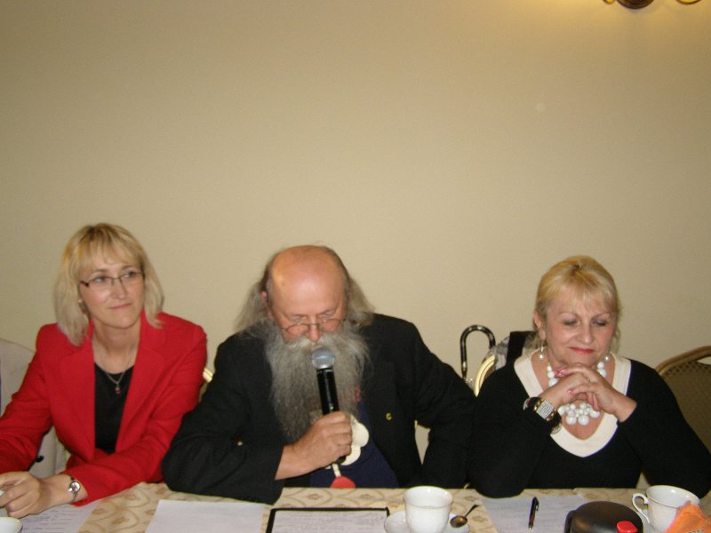
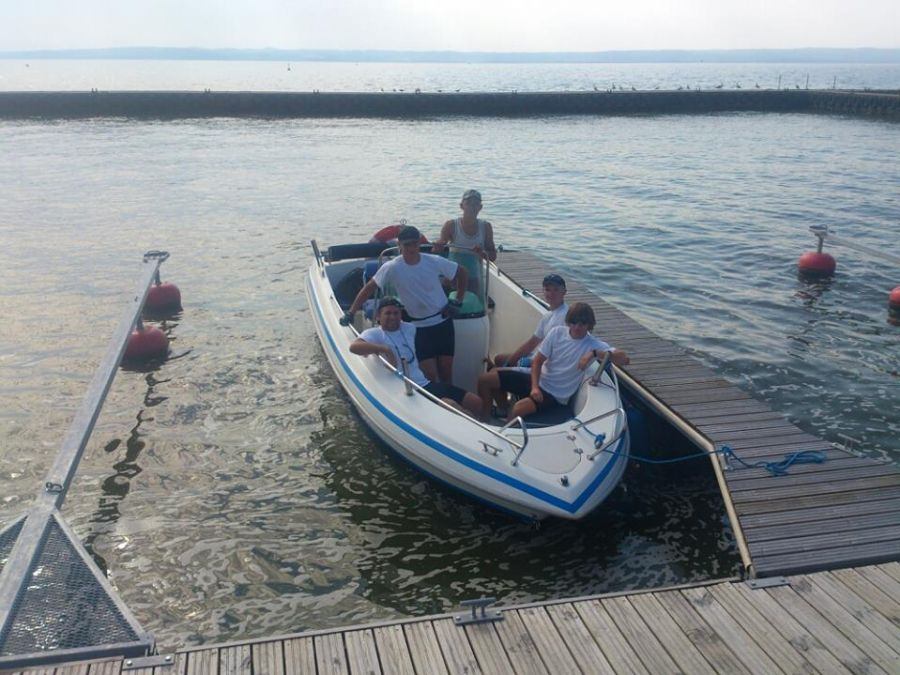
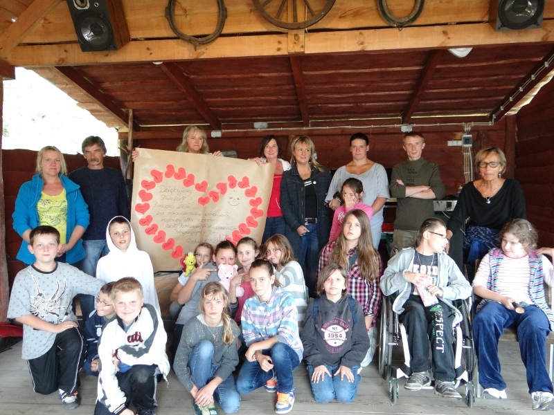

<i>2013-01-15 09:21:00</i> 
Koncert charytatywny zespołu WEEKEND!! Zapraszamy!
Zapraszamy na koncert charytatywny zespołu WEEKEND który odbędzie się 7 lutego 2012 r. w hali MOSiR. Wszelkie informacje dotyczące koncertu dostępne są na plakacie.
 

Zapraszamy na koncert charytatywny zespołu WEEKEND który odbędzie się 7 lutego 2012 r. w hali MOSiR. Wszelkie informacje dotyczące koncertu dostępne są na plakacie.
 
<a href="#" class="loadImages">ZOBACZ ZDJĘCIA</a> 

 

<i>2013-02-05 12:44:00</i> 
Wywiad w Radiu Rzeszów
Zapraszamy do przesłuchania wywiadu przeprowadzonego z Prezes Fundacji Pomocna Dłoń - Alicją Zając. Rozmowę przeprowadziła Zofia Stopińska - dziennikarka Radia Rzeszów.
 

Zapraszamy do przesłuchania wywiadu przeprowadzonego z Prezes Fundacji Pomocna Dłoń - Alicją Zając. Rozmowę przeprowadziła Zofia Stopińska - dziennikarka Radia Rzeszów.

 
<a href="#" class="loadImages">ZOBACZ ZDJĘCIA</a> 

 

<i>2013-03-12 10:48:00</i> 
Zwrot biletów z koncertu Weekend
Informujemy, że  w dniu 22.03.2013 r.  Koncert  zespołu Weekend nie  odbędzie się. Prosimy Państwa o zachowanie biletów z koncertu, który się  nie odbył w dniu: 07.02.2013, do czasu rozprawy sądowej.
 

Informujemy, że  w dniu 22.03.2013 r.  koncert  zespołu Weekend nie odbędzie się. Prosimy Państwa o zachowanie biletów z koncertu, który się nie odbył w dniu 07.02.2013, do czasu rozprawy sądowej.  Nasza Fundacja  złożyła <strong>pozew do Sądu Rejonowego w Jarosławiu</strong> przeciwko zespołowi Weekend. Po wygranej rozprawie sądowej -  Fundacja zwróci pieniądze z zachowanych biletów.

Jest nam bardz przykro z powodu zaistniałej sytuacji, na którą nie mieliśmy wpływu.

Proszę być z na nami w kontakcie.

Alicja Zając  prezes Fundacji tel. <strong>696 475 057 </strong>
 
<a href="#" class="loadImages">ZOBACZ ZDJĘCIA</a> 

 

<i>2013-03-15 08:29:00</i> 
Występy finalistów koncertu charytatywnego
Zapraszamy do obejrzenia występów finalistów programu Masz Talent przed planowanym koncertem zespołu Weekend który się nie odbył.
 

Zapraszamy do obejrzenia występów finalistów programu Masz Talent przed  planowanym koncertem zespołu Weekend który się nie odbył.
 
<a href="#" class="loadImages">ZOBACZ ZDJĘCIA</a> 

 

<i>2013-03-20 09:48:00</i> 
Koncert zespołu WEEKEND ZOSTAŁ ODWOŁANY - Informacja dot. zwrotu pieniędzy - AKTUALIZACJA 25.03.2013
Koncert zespołu WEEKEND W JAROSŁAWIU ZOSTAŁ ODWOŁANY z powodu złych  warunków atmosferycznych - jak Twierdzi zespół. Jarosławska Fundacja  "Pomocna dłoń " wszystkich z tego powodu bardzo przeprasza.
 

Koncert zespołu WEEKEND W JAROSŁAWIU ZOSTAŁ ODWOŁANY z powodu złych warunków atmosferycznych - jak Twierdzi zespół. Jarosławska Fundacja "Pomocna dłoń " wszystkich z tego powodu bardzo przeprasza. Będziemy informować w mediach na temat kroków poczynionych w sprawie nieodbytego koncertu. Jeszcze raz wszystkich przepraszamy i liczymy na Państwa wyrozumiałość. Nie mieliśmy żadnego wpływu na to - aby Zespół Weekend wystąpił w tym dniu na naszym Koncercie Charytatywnym. Pozdrawiam wszystkich i przepraszam w imieniu Fundacji.

Informacja dot. zwrotu pieniędzy - za nieodbyty Koncert Charytatywny Zespołu Weekend!

Proszę - o zachowanie biletów z koncertu - do czasu zakończenia rozprawy w Sądzie- przeciwko zespołowi Weekend. Proszę również zgłosić się do punktów sprzedażnych - wpisać się na listę - podać swój numer telefonu. Po zakończeniu rozprawy, fundacja każdemu - kto zachowa bilet z koncertu, wróci pieniądze. Informujemy zainteresowanych,że ponieśliśmy duże koszty związane z organizacją całego koncertu (najem hali, nagłośnienie imprezy, ochrona koncertu,reklama,ubezpieczenie koncertu itp.) tych roszczeń będziemy się domagać w Sądzie. Przepraszamy wszystkich - którzy byli na naszym Koncercie Charytatywnym - czekali na Zespół Weekend - który do Jarosławia nie przyjechał.

INFORMACJE DOT. NIEODBYTEGO KONCERTU CHARYTATYWNEGO ZESPOŁU WEEKEND.  Fundacja została z długami - a zespół „honorowo” trzyma się swojej wersji. <strong>To była impreza masowa - a nie dyskoteka</strong>. Taki koncert załatwia się w dwa miesiące - potrzebne są Pozwolenia na koncert - a to daje - Urząd Miasta, policja, straż pożarna, sanepid, Centrum Medyczne – Karetka, ubezpieczenie imprezy (PZU) itp. Na stronie <a title="plakat koncertu" href="koncert-charytatywny-zespolu-weekend!!-zapraszamy!,167.html">Fundacji</a> jest plakat i można zobaczyć - kto był gwiazdą Koncertu Charytatywnego w tym dniu. Ludzie, którzy byli na koncercie - przyszli na zespół Weekend - a program "Masz talent" organizowany od lat przez Fundację jest programem wstępnym - który trwał pół godziny - potem miał wystąpić zespół Weekend (ok 1 godz. wystep). Na dyskotekę zespół pojechał - na gotowe warunki, tzn że organizator nie płacił się za ochronę, postawienie sceny, najem hali sportowej, nagłośnienie, ubezpieczenie imprezy itp - bo to wszystko w dyskotece jest.  Zespół na początku stycznia już wiedział, że w Jarosławiu ma dać koncert charytatywny ale <strong>z wynagrodzeniem dla zespołu a nie za darmo</strong> - jak sami mówią. To była – impreza masowa, która wiąże się z dużymi kosztami, które do tej pory ponosi Fundacja. Tylko skąd ma wziąć - na to wszystko pieniądze? Zespół miał o godz. 13.00 wcześniej ustalone spotkanie w Krakowie - odbierał tam czekoladę. Załóżmy, że gdyby wyjechali z Krakowa o godz. 14.00 ( 4 godz. jedzie się do Jarosławia) - to w Jarosławiu byli by o godz. 18.00. Koncert ich w Jarosławiu miał się zacząć o godz. 17.30. Więc z góry założyli że do Jarosławia nie przyjadą. To znaczy że o godz. 18.00 pocałowali by klamkę Hali Sportowej w Jarosławiu. Wybrali Dyskotekę na Podhalu w Cichej gdzie dali swój koncert w tym samym dniu - kilka godzin po nieodbytym naszym Koncercie charytatywnym .  <strong>Dla Fundacji zespół Weekend jest niewiarygodny i Fundacja nie ma do zespołu zaufania. </strong>

 Jeszcze raz Fundacja przeprasza wszystkich - którzy przyszli na koncert. Fundacja nie miała żadnego wpływu na to, że zespół nie dotarł na Koncert Charytatywny w tym dniu.
 
<a href="#" class="loadImages">ZOBACZ ZDJĘCIA</a> 

 

<i>2013-03-25 11:26:00</i> 
Rusza V Edycja Programu „ Masz Talent”
Jarosławska Fundacja Pomocna Dłoń już po raz piąty organizuje we współpracy z Centrum Kultury i Promocji Miasta Jarosławia<strong> Program "Masz Talent"</strong> Eliminacje odbędą się <strong>16.04.2013 r</strong>. o <strong>godz. 11:00</strong> w Sali Lustrzanej CKiP w Jarosławiu Rynek 5 (kamienica Attavantich).
 

Jarosławska Fundacja Pomocna Dłoń już po raz piąty organizuje we współpracy z Centrum Kultury i Promocji Miasta Jarosławia<strong> Program "Masz Talent"</strong> Eliminacje odbędą się <strong>16.04.2013 r</strong>. o <strong>godz. 11:00</strong> w Sali Lustrzanej CKiP w Jarosławiu Rynek 5 (kamienica Attavantich). <strong>Potrafisz śpiewać? Tańczyć? Komponujesz własną muzykę? Wyróżniasz się talentem, którym chcesz się pochwalić?</strong> Przyjdź na eliminacje „Masz Talent”! To może być Twój pierwszy krok do rozpoczęcia kariery! Program jest przeznaczony m.in. dla uczniów szkół podstawowych, gimnazjalnych i ponadgimnazjalnych. Serdecznie zapraszamy wszystkich chętnych! Zgłoszenie kandydata musi zawierać:
<ol><li>imię i nazwisko</li><li>adres zamieszkania</li><li>wiek</li><li>kategoria występu</li><li>telefon kontaktowy</li><li>nazwa szkoły (jeśli dotyczy)</li></ol>
 Zgłoszenia przyjmowane będą do 12.04.2013
 
<a href="#" class="loadImages">ZOBACZ ZDJĘCIA</a> 

 

<i>2013-04-08 15:38:00</i> 
Dzień dobry TVN &quot;Fundacja pozywa zespół Weekend&quot;
Zapraszaby do obejrzenia rogramu w Dzień Dobry TVN. Program emitowany  był 5 kwietnia w programie TVN. Nagranie odbyło się m.in. w siedzibie  Fundacji.
 

Zapraszaby do obejrzenia rogramu w Dzień Dobry TVN. Program emitowany był 5 kwietnia w programie TVN. Nagranie odbyło się m.in. w siedzibie Fundacji.

<a title="DDTVN" href="http://dziendobry.tvn.pl/wideo,2064,n/fundacja-pozywa-zespol-weekend,82455.html">Dzień dobry TVN</a>

Różne portale również piszą o nas  <strong><a title="Interia" href="http://muzyka.interia.pl/pop/news/fundacja-z-jaroslawia-nie-odpusci-weekendowi,1908643,50" target="_blank">muzyka.interia.pl</a></strong> i<strong> <a title="Wyborcza" href="http://wyborcza.pl/1,75248,13614008,Fundacja_pozywa_zespol_Weekend__Nie_przyjechali_na.html" target="_blank">Wyborcza.pl </a></strong>
 
<a href="#" class="loadImages">ZOBACZ ZDJĘCIA</a> 

 

<i>2013-04-09 13:08:00</i> 
Fundacja Pomocna Dłoń w programie TV Agnieszki Szulim &quot;Na językach&quot;
W niedzielę w dniu 7.04.2013 o godzinie 22:00 nadano emisję 10  odcinka programu <strong>"Na językach"</strong>, który prowadzi znana prezenterka  <strong>Agnieszka Szulim.</strong> W odcinku tym został wyemitowany fragment z  Prezes Fundacji "Pomocna Dłoń" Alicją Zając. Termatem była aktualna,  nieprzyjemna sprawa z zespołem Weekend.
 

W niedzielę w dniu 7.04.2013 o godzinie 22:00 nadano emisję 10 odcinka programu <strong>"Na językach"</strong>, który prowadzi znana prezenterka <strong>Agnieszka Szulim</strong>.

W odcinku tym został wyemitowany fragment z Prezes Fundacji "Pomocna Dłoń" Alicją Zając. Termatem była aktualna, nieprzyjemna sprawa z zespołem Weekend.

Film trwa 42 minuty zaś temat procesu został poruszony w 18 minucie filmu (18:18)

Film dostępny tu-&gt;<strong><a title="Na językach" href="http://tvnplayer.pl/programy-online/na-jezykach-odcinki,1175/odcinek-10,S00E10,19293.html" target="_blank"> TVN-PLAYER Na językach</a></strong>
 
<a href="#" class="loadImages">ZOBACZ ZDJĘCIA</a> 

 

<i>2013-04-18 15:04:00</i> 
Masz Talent - eliminacje
„Masz Talent” to konkurs organizowany przez Jarosławska Fundację  „Pomocna Dłoń” przy współpracy z Centrum Kultury i Promocji w  Jarosławiu. Od 2009 roku biorą w nim udział młodzi, utalentowani  mieszkańcy Jarosławia i okolic. Z czasem zmagania przybrały regionalny, a  nawet wojewódzki charakter.
 

„Masz Talent” to konkurs organizowany przez Jarosławska Fundację „Pomocna Dłoń” przy współpracy z Centrum Kultury i Promocji w Jarosławiu. Od 2009 roku biorą w nim udział młodzi, utalentowani mieszkańcy Jarosławia i okolic. Z czasem zmagania przybrały regionalny, a nawet wojewódzki charakter. Chęć udziału w tegorocznej rywalizacji zgłosiło ponad 40 osób. Zachwycili wszyscy, niestety do finału mogło przejść tylko 13 najlepszych: Luiza Garnarska, Aleksandra Gilarska, Aleksandra Tymczyk, Katarzyna Wysocka, Hubert Żołyniak, Dawid Krzeptoń, Krzysztof Miłosz, Dawid Prus, Grupa DBB, Piotr Kąfera, Ewa Trojniak, Paweł Surdej, Krzysztof Kądziołka. <strong>Finał odbędzie się 26 maja (niedziela) o godzinie 17:00.</strong>

<strong> </strong>

Skład  Jury:
<ol><li>Bernard Augustynowicz (Muzyk) - Przewodniczący Jury</li><li>Szczepanik Małgorzata - Urząd Miasta Jarosławia</li><li>Gemra Erwin - Urząd Miasta Jarosławia</li><li>Irmina Kardaszyńska - Centrum Kultury i Promocji w Jarosławiu</li><li>Elżbieta Raczyńska - W-ce Prezes Fundacji</li></ol>
 Program przygotowała i prowadziła Alicja Zając - Prezes Fundacji <strong>Finał "Masz Talent" odbędzie się   26.05.2013  o godzinie 17:00 w Centrum Kultury i Promocji w Jarosławiu.</strong>

<strong>Z okazji Dnia Matki który będzie właśnie 26 maja zapraszamy również wszystkie matki do obejrzenia występów.  </strong>

<strong> Zapraszamy!</strong>

 Wyróżnieni artyści (3 osoby) wezmą udział w "Dniach Jarosławia" które odbędą się w czerwcu.

<img src="data:image/jpeg;base64,/9j/4AAQSkZJRgABAQEASABIAAD/2wBDAAUDBAQEAwUEBAQFBQUGBwwIBwcHBw8LCwkMEQ8SEhEPERETFhwXExQaFRERGCEYGh0dHx8fExciJCIeJBweHx7/2wBDAQUFBQcGBw4ICA4eFBEUHh4eHh4eHh4eHh4eHh4eHh4eHh4eHh4eHh4eHh4eHh4eHh4eHh4eHh4eHh4eHh4eHh7/wAARCAFoAoADASIAAhEBAxEB/8QAHQAAAgEFAQEAAAAAAAAAAAAAAwQCAAUGBwgBCf/EAFQQAAEDAwIDAwgFCQYEAwQLAAEAAgMEBREGIQcSMUFRYQgTFCJxgZGhMjNCscEVI0NSYnKCktEJFiSissI0U2NzRKPSFxiDhCU1RUZUdYWTs+Hi/8QAHAEBAQEBAQEBAQEAAAAAAAAAAgEAAwQFBgcI/8QAPBEAAgECAwQHBgQFBAMAAAAAAAECAxEEBTESIUFRBgcTMmFxkRRCgbHB0SIzUqEVYpLh8IKi0uIjQ0T/2gAMAwEAAhEDEQA/ALCERgUWhFaF98/PIkAiMGVFoRWjAUKSATFNK+GQPYd+0HoUFoRGBFiL9RzMnZzN2I+k3tCaaFj9O58Tg9hw4K90VSycAH1ZO0d/sRKMBTaMrwKYHaoynqmAvGhTAUKehTYN140ZRQsYoBSaFQCmAoI9aFNo2VAKYChSgFNoVAKbQsUoBTa3K9a1TaFBFAKQC9AU2tyoYiAptYpNapgKGseAL0NUgFNrcrXEVC8xv5h7x3q4Mw9ocDsk2tRoHFh8D1CLKhkBe4XrAHDIOymG4UEQwV7ylEwpALGBho7l7yhEDVXKpc1iGF7hT5V7ha5geFWETCrAUuawPCrCJhVgLXNYGR4LzlHci4Ci7la0uc4Na0ZJJwAO8q3NYHyhI3y522y299wutbDR0rOskrsD2DtJ8AtccR+NVksQkodPiO73AZaZAf8ADxHxI+mfAbeK551Xqm+6orzW3q4S1L/sMJwyMdzWjYBeqlhpT3vcjy1sVGG5b2bT4i8camqElBpGN9JCctNbIPzrh+w37PtO/sWl6qonqp3z1Er5ZXnmc97iS495JQlS+hTpRgrI+ZUqyqO8ilSpSY1zjhoJPcF0OZFSa0uOGgknsCfp7a9zeaU8v7I3Kv8ApnTVzutUILXQSyntcG7D2noEHNIcYNsx6K3yHBkPIO7tV6sVnqaupbBQUsk0juxreYrcGmuE0EYbLfKnnd1MMJ297v6LYVqtFutVP5i3UcNMzt5G7n2nqV5Z4lLcj1wwre9mq9O8LaiUNlvM4p2ncxM3f8egWwrHp20WWPlt9FHG7GDIfWefeVfHNGENwXmlVlLU9UaUYAXDKG5pBRyFEhA6ACMqBCM5vcoEKkAkKBCKRhRIVIAIUSEZwUHDdUIEhQcEUhQcFiASFBwRnAYUCFSAsbIZGNkUhRcMhUgEhRKKQoFUgF4QnBMOCE4brGAkKBCK4bobgqQC4KLhlFeBhDOytyME8ZQyMozkJwwUiGPMCKAotCI0LGJsHaitCi0bIjQoyokAisaoNCM0IlJNCKzIIIOCO1RaEVgUKXKiqw7DJjh3Y7sKfaFYQnaKqdHhj8uZ8woxF0CmAoROa9ocwggozQoY9aNlNoVAKYChSmhFaFFoRWjCgigFMBeAKbQsU9aO9Ea1UwFEAUEUApgKmhEa3oozHgaptC9aFMDChTwBTa3J2UmN3RQ0YUuUi1uApBqmGqQb2BEpFrSphqkGqQCxT2Fxjd4doTbcOGRuEqGokbnNO247QsVDIaMKsBSjAeMgqYaECgwD3L3lKKB4L3CxbAgxe8iLyquVYwPl8VXKEXlVcqxrAuQKuQK16s1NYtK2/wBOvtyho4j9BrjmSQ9zWjdxXPHEbjvebv52h0vG+0UJy01BwamQe3oz3b+K606Mqmhxq1oU9Wbo4g8RtMaLidHX1YqbhjLKGnIdKf3uxg8T8FzdxE4p6l1iX00swoLYTtR07iGuH7burz8vBYNLJJLI6WV7pJHnmc5xyXHvJPVQX0KWHjT36s+bVxM6m7RFKlSnHG+Q4Y0lem55bEFJjHvOGNJPgn4Lc5xbzZeT9lq2VojhPqS+wsmkpRbaN2/nagFpcO8N6lGdRRV2OFKUnZI1pR28yOHnD/C3qs00nw+1Dfnt/JtteyA9Z5PUYP4j19y31o/hPpiwFs08TrnVj7dQPUB8GdPjlZxJywxBrGhoAw1oGAPcvHUxnCJ7qeC4yNVaa4SWi1sY+7Sm4VA3cxuWxg93efks7paSmo4GwUlPFBE3oyNoaPknnNJOeuVAheWVSUtWeuNOMdELuahkEJlzVBzVEy2FiFEhGc1QIVuYA5qGQmCFBwVDoAIUHtyjOCgQqYAQoEI7m5Q3BYgEhQIRSN1AhZEYFwUCEY9ENwSCCIQ3BGIUCsQCRlQIwiu6qDgqQG4dqE4IyGeuFSMGQhvCKQoOCpADhshuCM8YKG4KojBEIbxhGIQ3jZYwJ24Q3DIRSoO6pIJjzQixjdQaN0Zo2VMSaERoUWjZEYEWImwbIzQoNCK0KFRJo7EVqi0bIgChUejqiNGyiwIoRKFp5HxO5mH2jsKulLUsm2+i/uKtTQisHaoyl7aFMBW+mqnMw2T1h39oVyic17Q5rgQoUm0KY3XgCI1u6xSmhEYF40ZOEUBQZ60KQC9ARGjChCmhTAXoGVMBQSR4AjMZ3rxje1FY1FlKAU2hegKbW96lynjRlTDV61qI1iwiAaphqm1imGqXMQDQphqm1qkGqMtiLAWnITMbg4dxQ2tKkGYKhQoCkGleRv7D8UbChQfKVXKo1tTS0NJJV1tTDTU8QzJLM8MY0eJOwWleIflA2e3ecotIUwutSMj0uYFtO097Rs5/yHtThTlN2igTqwpq8mbiu9xt1nt8lwutdT0VJGMvlmeGtHx6nwG60PxF8oJjfOUGiaXnO7Tcapm3tjjP3u+C0lq3VV/1XXmtv1znrJAfUa44jjHc1g2aPYrMvfSwkY75bz51XGSluhuHL1drlerhJcLtXVFbVSfSlmeXO9ngPAbJJUjR08jxnHKO8r16Hi1AokUL5D6o27z0WT6U0VftRTtjstpqa3fBkDcRt9rjsPit2aP4ARN83U6puRe4YJpaTp7C8/gPeuc60Ias606E6miOf7XZqqtq2U1LTTVc7zhscTC4n3Bbf0jwLvleI575PHaac4JiA55SPYNh7yugtP6dsun6YU9mttPRsxgljfWd7XHcq5loXinjG+7uPfTwUVvlvMR0noDTGmY2egW9klQ0f8ROA+QnwzsPcsmIOUYtUSMdV5XJyd2etRUVZAX4a0k9AkJCXuJITUzud230R0Qi1VGYsRsoOamHM7lAt3VIALVAjKO4KBGyxAD2oTmJlwQ3NVTILEKDmphzchCI7CrcgBze1DIR3DCg8dqobAHBQcEZwUCFSC7ghkI7ghuCpARCG4IxCgVSACoOCM4b7IZCpAThshEI5CE4YWIwTgou6IjgoEKkBHfdQIRHbHCiQqEE8bIRRyEJ43VMAcFA9UVwUHBUgBwUSiuAxlIV1bFTAtHryfqjs9qqIy1MG6MAhsCK1JuxkSaEVgUGBGYMIFCNCI0bqLQisCjKTaFJo3UQiRhRiJtHREaFFo3RGhQyJNBKM0KDAitCgkSaExC50ZyxxBQmBGaFBWHqepa7Z/qnv7E63swrRGE1TyPjOxyO4qFsXJoRGhAgmZJ+ye4ppgyVDHrWogCpoUwFBWPQEVjMKmNx7UVoRbKU1qIAqaFNoUKU1qm1qk0IjWrCItaitavWhTDUblPGtUg1TY3vUw3C1ykA1TDQFMNUw33I3LYGGqQarfqTUFh03R+l367Ulvixt55+HO/db9J3uC0rrjyiqaIPpdHWozu6CsrhytHi2Mbn+Ij2LpClOfdRyqVoU+8ze1fU0lvo5KyvqoKSmjGXzTSBjG+0nZac135QVktfnKTSlMbxUjI9Jlyymae8faf8h4rnvVmq9Q6qq/Sb/dqiucDljHuxGz91g9VvuCsi9tPBxW+W88NXGye6G4yLWmtdTawq/P3+6zVLQcxwD1IY/wB1g2Ht3PisdRWQSOAJHK3vdsrzprS161BU+j2W1Vlxl7fNRnkb7XdB7yvXuiuR4/xTfNlia1zjhoJKYipXvc1pySTgNaMkrfui/J2uVRyT6oukNBEdzTUmJJPYXfRHzW6tHcO9IaUYz8k2eDz7f/Ezjzsx/iPT3YXnqYuEdN56qeCqS13HMGh+DesdQFkwt35Mo3b+k1o5Mj9lv0j8Fu7RnAzSllaya7ecvdUNz54ckIPgwdfeVtvl3yvOVeGpipz8D3U8JTh4idLS09JTspqSCKCBgwyONga1o8ANkXlKPyrzl9i89z0pC5C8wmOXvUHMGVbmaA4S07ub1R0+9MTH7I96AWqkYuWkKJbhMFqg5uVQ2FyFBzUdzVEtVuQVcFAtTLmobm43SILlqG5qYcNkMhQgu5qG9qZe3CG5qSIKkdig4I725Q3BUgu4b5QyEw4ITgqF7gJCE4YR3DdDeMpEAOCg4IrgoELEAuGyG4Iz0NwVCCcEN4yjEIZCpAJCg4Ir0NypAThlQd3op2UCACqRgiFB4RCoP2GSqQA4bIMz2RsL3uDWjtKDWXGOMlsOJHd/YFZqmWSd3NI8uPYOwJxiByQeuuTngsp8tb+t2n+itMnXJ6ozghvXRKxze8Vh1BZ5CAK6NpP6wIT8FfQy7RVlO8+EgVpfpu2v3NDGD+xK5qXk0hbnOy1tXGT+rI133qNRYrzRlcRa4ZaQ72HKO0LCP7omLPo9zq4iemYj/tK9bZtQQN5abUIJHY97m/eFNhcGVTlyM6aEZqwRo1vCR5qqpqkDuex2fijNvGtad2JrK2Vo7Wxn7wVHT8SqfNGbt3KM0bLA261ukGfTNPStx1xzN+8JiLiJQAD0i21UZ7cOB/oj2Ui9rEzhoRGDdYlT6/0884e+pi/eiz9xVwptZaZkG11jZ++xzfwRcJchKpHmZG0IjArVT6gsU2BHd6I57PPAferjTVdHLvFWU7/3ZWn8UGmjomhpg2RWjKgzB+jv7N0djSOoPwRGiTAitCi0bI0Y2UKkSYOxMwTPZtnI7ihNCPG1FsQ5FI1w7j3FMsb2pBrUzDI9mBnI7ipcthxoRGjJQ4pWO26HxTDRsoax60KbQqaOxEYAsI9a3ZEaFJjHEZDTj2JWuulqt7eavudDSNHUzVDGfeUd7LoOAeCI1qwe7cWuHlsBEmpKepePsUkbpj/lGPmsLvflF2OAFtl0/X1rux9TI2FnwHMV0jRqS0RzlXpx1ZvBrVCsqKWipnVNbUw0sDRl0s0gYwe87LlLUHHnXdzDo6GWis8Z/wDwsPM8fxvz8gFru63a8X+s57nca651BO3npXSu9w3x7gu8cHJ952PPLHRXdVzqvVXHHQlkD46OrmvdS3oyhZ6mfGR2G/DK1DrDj7rG7h8FmZT2GmdsDD+cnI/fd09wC103TV5EQmqqUUEJ6SVsjYB8HEE+4J6zaXNynEFALhep/wDl2ujc5vvkeAB8F3hQpQ36nnniK09y3FhuFbWXCrfWV9VPV1Dzl808he8+0ndeQUlTO3njhcWdrzs0e87Lc+meBmsa8sklttt0/Cf0ldJ6RUY/dGQD7gtm6d4A6WpXMn1BXXC/Tj7Mr/NQ+5rd8e9KeJpw4khhak+Bytb7TNWVTaWlZNW1DjhsNJGZHE/D8CtoaQ4E61u/JLWUtNYKZ2/PVu55sfuDce/C6osVis9ipxT2a10dvi/Vp4gzPtI3PvVyDfBeSeNk+6j1wwEVvkzU2keA2jLOWzXRtRfaobk1R5Ys+DG9feStn0NDS0NM2moqaGmgYMNjiYGNHuCbDV7yryTqSnqz2Qpwh3UDDVIeIU8KsIHQ8ABVYXuF6PELGB8pVYCNgFecqxgOEKZ32W/FHeewILmqkFi1RLUcswFEtVDYAWIbmpkhQLViC5ahuamC1Dc1UjFiFBwTL2oTmq3ILub2oTgmS3ZDc1K5BdwQyMI7ghvBWILuCC9uEyRlDeEkyMWchuCO8YKE4JEAOCGQjvCE4KgAvCE4JhyC4KmAkKB6opCg4KoLAOUHBFd1QyFSAnBCIRygTPZEMveGjxKyIyDgoPIAydglqm4MAIhYXeLtgrXUzzTfWPJHd2JqLC2h2quEMeRH+cd4dPirTWVM1Rs93q/qjoqcEN3RdErHNsXKg4Ih6qDkgAHBCcjSdUNyRhlqI1QaEVgXA6hWdEVvRDaEYLMpXmYnD1o2HPe0KhS0/QRBv7pI+5FaFJvVS5bHjacY2lnb7JD+K8dQRyfTcJB3SRMd+CYaEVql2WxapdPW6b6yht0hPa6lA+4pSXRVllyDaqUeMc0jD+KyRg3Rm9FtuS4m2IvgYTNw8s0m4oqth7o6sH/UEpLwzoMHzVRdYj1+rjf9xC2MwIzQr201xJ2MHwNWO4eVURPo2oK6HPTnpZB/pJUf7q6ppyPRdZBvYA+WaP7wttRjdHZk9p+K3byN2EeBqBtv4kQ49H1VTS9w/KDf9wRWP4vRD83WMqB+zNTvW3xDG76UbHe1oKibfQP+nQ0rvbC3+izr+CL2HJs1MLtxlhG9skl9lJG77lR1dxdp/rNPyn22tx+5babZLS7rbqb3Mx9yILFa8+rTOb+5NI37nKdtHjFF7CXCTNPniJxPh+s06B+9bJR+KgeKvERn0rDAPbbpf6rdDLFQ/ZfWs/drZR/uRWWKnPStuzfZcJf6qdtT/Sbsan6jR54ucQh0tFK3/wDT5P6rz/2ucTDtFRwt8Ba3H71vUafgP/2pfB7LlJ/VTbpqncd7rfsf/mkv9VVWpfpN2FX9ZoN/Evi7UbQisZn/AJNo/wD8lCfqDjbcPov1UQf+TROj+5gXQX90bc/6ytvkntus/wCDlIaF04/66nrZ+/ztwndn/Ot7TTWkSey1H7zObqrT/Fy5gurqbUr2nqamqdGPfzOCtkugL813PcaqxUR7TV3iAOHtAcSuq4NAaLa4F2mbfKe+VhkP+YlXig0zpyjI9EsFqgI6clHGD9yvti4IywLerOQ6XQ1PI4Nk1XbJXfqW+lqax3u5GAfNZFa+Fb6nBp7NrO6HvFDFQx/zSucce5dZ08bYmcsTWxt7mANHyRgCTvug8ZLgOOBitTnK08Fr1Jgx6VsFuH/MutylrXjx5I+VizO08GKlrA25avqIIj1p7LRx0TPZzNHMVt4NRGjC5PEzZ2jhaaMEsXCPQNqlEzdPx11QNzPXyOqHk/xHHyWc0lNBSwiGlgip4h0ZEwMaPcNkYBTAXGU5S1Z2jCMdERa3ZehqmB2KQb3oXHYgApBp7lMDwUsKFB8viveUKYaveVYxDA7lXKO5T5VQC1zWIco7l5yjxRcBeEBYwPlCG9xBw1Ff3BQI7MLGBe1Uplqt+oLrbrDZau83epFLQUcZlqJi1zhGwdSQ0E9vYFSDZaoFo7Fjt019o616dteoq/UFJT2q7PYygqXB3LO54JaAAMjYHqBjtwjXzVdit1+g0xU3eCmvdbSyz0lO5jnOLGNcTJsCAG8rjuRnlKxLF4c1DLVgnDbWFFDwki1PqnXtrvdNFJL5+9sgNLC4B+A0MLWnI+jgNyT0yrpoPiRobXctRDpTUNNcZqcc0sIY+ORrc45uV4BLc7ZGQrtGcTJS3dDc1YVfeMfDCyahdYbnrK3w17H+blYA97IndC172tLWkduTt24Vx1xxB0XouipavUuoqOhjq289MMmR8zdvWY1gJLdx62Mb9VroOyzIHBDc3KwPXetLZceEtVqnSevbZZ6YyRtjvMlO6ojhPOA5jo+UuDjnGC3IyCs6oSZLfTSGZs5fCxxlaMCQloPMB2A9fekmRxsQcENwWK3Hinw8om0xqNV0IbUxiVjmNke1rCSA95a0iNpIOC/HwV0rqwDVlqp232nhino6mUW/zIc6rDeQiVsn2QwHcfa5x3KpkcWXF7UJwWCycUtDMvZqZNd0Tbd6MIvRHUUwxNz/AFnnCzuw3l6Z3WW6mu9FYbBW3m4VEVPS0kLpXySZ5R+rnG+5IHvSTRHFjLxthCcN8rAeCXE+g4gaV9Nq57fSXiBsklbRwucBTxB5DXkv6AjfqnrJxT4fX6//AJBtGqKKquDiWxxtD2iU9zHEBrj7Dv2ZUUkyODTtYyt7UFwWA8OdTXq8cU+IVkuNYJqCz1MDKGPzbW+aa4PyMgAnoOpKep+KXD2s1ELBTaqoJbg6TzbWjm829+ccrZMchOdtjukpojg0ZY4IThukKDUdiuNzutto7jFLWWh3LXxcrmmA79cgbbHcZ6K3x600pPpObVcN7pn2WFxbJVgO5WkODSMY5s5I7O1K6A4svTghPG6w6LUsD+IMx/vhROtP5EbWttXorhIxuA70gycv0S37Oc79ErJxj4aD6OqqVxPTEUv/AKVttF2JcjN3BDcFhtNf6g8RrtRu1HSS0cNvjmbazByvpvokyukwAQQemTjPQJS38TdIXe8ts9DqWllq3u5Y2Na5rXu7muIAJ9+6Sa4gcXwM3lexgPO4N9pSc9bE3PKHPPwCTfuck5QnBdUjm2SnrZn/AESGDw6/FJSFziSSSe8orghFJbjncA5CcEd/VCcEkRgHIZCM8bITlSMA8IZCM8bIRVAwTxsguR3boLgkjDLeqNGhN6o0fYuJ1CsRWKDeiIwKMoQIkY3QwisUYibQitUGhEaoUIzoitUGjdFaiJBIwjNCg1FjG6gkEYOiMwbobQjxhRlSCMCOwIbAjxhBjCNbsixtUGhHYFComwI8Y2UGBHYEWMm0IzGqLGo8YRZScTe1GY1RY1HiHaiKxNjUZjV4xqI1udyoJEmAhGZjKTukdXLa6uOgnbBWOheIJXN5gx+DykjtwcLUnCfiRdvyw/SurpHPuEMrmCaTAc4g7tPeR2HtGF56mJjTqRhL3tOXkfVwmUVsXhKuKpNPs7XXGz963JceRuxrQiNaox4c0OByD0RWtXe58zZKAU2tXrW49qXvFbHbLTWXKYgR0kD5nexrSfwUckldihSlOSjHVmkWcRLueMd4po6yaW2RSihpqUH82C0gOfjvy12/it605L4WPcMEgHC5b4G0Ml31lDVzgufJM+pkPiT/AFyuqmtw0Adi8eAcpUVOWru/U+90ohSpZlOhSSUaaUN3OKSb827ngC9AU2t9qkGgL2H58hylehqIqUKQ5FXKp4KpW5LEC0Dqhu39iKRlecqxgJavMIxaokYWuawFzUjfbVT3qyV9mrGh1NX00lLKD+rI0tP3q5EbqJblUhwfZLTd+ImnqPhPMagVWg7feqifAIDqhr+Wnbn97b2FbH4C3Wbibr/UfEaqjfyWjSdPaIS7p591PmYj3tk/nXStv09YbddK262+y26kuFec1lVBTNZLUHOfXcBl2++6HZdO2CxUk9HZLJbrZTVLzJPFSUzImSuIwS4NABJG26KiNyOIp6evPkqcOq0S+Zs1LqiofcpnU/n44cyYjkkj+20ev6p65x2rZmnrXHeOKtJf7fxi0vqDUrbJWw0dJZ7S2mM7TA8MD3Ru5QWue0gO3w3ptt0dRadsNBY3WKhsltprU4Oa6hipWNgIccuBjxynJ67LX3Cvhj/cviJrO8x2vT1PbbpJCbUaKDkmp4gCHwluMMbnlPq/SO5PYMo2M5Gp/J71Dwgs/BiotespLHSXiGeoF7prrA11TM8POPVc0uf6uAA3cEHtSGva2eDymIb2NXWnTVvuOn6d9gulytjaqlMJY3LGh+Gxuzz79mcbcy6Ru2g9F3S9C9XPSVjrbkCHelT0Mb5CR0JJG58TlNak05YNR0LaG/2W33SmY7mZFV07ZGsPe3I2PswlbdYO0r3OTNW2e2WvyfuJU9q1xa9Usrb1RS1Jt1H6PBTzmQF3K0EtIcHD6Pq+rjsXVen3uGn7XsD/AIKD/wDjatY8ZOGWotSWai0Houl0zp/R07mS3J7YeSZr2SZAjY0YIwAd9yepAW2KanZS0kNLHnkhjbGzPXDQAPkEoqzDN3RqThDb6Gk8moshpYgLhaq6erON53u86CXd+wAGegACX0bO59/4RveS5x0XVZJPX81SbrbMFtoKS2tttLRU0FC1hjbTRxBsYac5byjbBydvEpZtntUZpTHbaNhpIHU1NywtHmYXAB0bNvVaQ1oIG2wVsFyNf092pOIOrG3KpuFOdJ2OpPoMMlQ0C5VrDg1DgTvFEchnY52XdAFm2oWR19jr6R9MypE9LI0RvaHh5LDjY7HfCssnDfh6Dn+4ume7/wCrIf8A0rIixrWhrGhrWgBoHQAJpW1BJ8jlTQtXSVvko6g09YfMf3ppoZjcII4uWqNOKhrnZ25nN5CR1PaEtbILXqHSuj6eo4r6YpWUVRTOoaKGytiq4JsgcjnNPN16uOxOHErqClsVmorrU3ajtNDTXCqby1FTDA1kkoznDnAZO++6tUOjNI0d3N4pdMWaC4cxd6THRsEnMepBxsfEIqncXao0m2rqTrzjjZaCTzV7uNPz0UAyJJQ1jy7k7zyu+YWE2eK2XvhLbLRX8TtNWikge13oLrM0VlPOHn7bTzuJJ3d0I69Nuq5LRajeRevybR/lMR+aFZ5lvngz9XnxnHgrTNo7Sjrz+WHaas7riXc/pJo2ec5v1s46+PVV0idqkaO4zV1bojiBd6ylfI92rNOehB0Y3kqmlsfN7cYP8Sxu62irsla/gtH510dzvFBVMcScGF0X574PaP5V05d7PabnLTS3K2UVbJSv85TvqIGyGJ2Ru0kbHYdO4INVaLVNdorvNbaOS4wt5Iqt0LTMxu+wfjIG5+JSdK71CqyS0NVs9Fp/KWuIlMUVJFpdvN5zAY2NvJnPgGhYhar5ojV/EN19u9fY7Rp+yv5LZRSBkL6uXr56RoH0dgQD4D9Zb8qrNaZq2aumtdFJVTwGnlmdA0vkiPWNzsZLfDorLPofRwid5rSNg5+U8oNBHjONs7dMpOmwqrH9rGuKu6fknjRre8sgNWKXTcdQImn6zDYzj2H7lrrVN3luen9LVr7xptr5a+OWG02qgbG+iaHYy949Ydg5T1Jzvhbm4e6S1HSasvGrdWz203CvgZSx0tCCYoom8vafBoGN+3JWQw6R0rTtkZDpq0RtkkbI8No2Yc9u7XdOoycdynZyki9rGDCsvNqqb9W2WCtjfcKRokqIADzRtdjBO2N8joe1NOCi23UENwnuMVFTsrZ2hs1Q2MCSQDoHO6kDA6qbgvSr8TyO3ABIMHKE/qjyDZBcNspIDAvGyE4I7hsguCxALgguCO5Cd1TIBd0QXI7kF3VVBYJwQnhGcEJ4SRBhgR2ITAjNC4nVBWorBhDaitUKSHVFYEJvVGaiII1FYN0NqKzqVmUI1FYN0NqNEiIK0I0aE1HYFGII1HjGyEwZIR2bIiQViOwbZQoxlHb2IDCMHRMRhCjajxhZlCxt2R2DdDYOxHjCAkFjCPG1DjG6YYPBEaJsbvhMMCHGExGESonGERgXjBhFYMqCPWt71pTyhdGTQvj1tZWFlRTEGqDBvyjo/wB3Q+HsW8GBVVUsVXTSU07GvjkaWua4ZBB6hebE0FXpuD+Hg+Z9fJs0qZXi44iCutGuEovVPzRg3BbWUOqdPRNleBVwgMlbnfIWxWjC5cutLW8IeJzZYOf8j1buaM9nJndvtb9y6WsNxp7tbIa6mkD45Ggggrjg8RKpFxn3o7n9/ie3pDlVPB1o18M70Kq2oPw4xfjF7mPALAfKGun5K4UXQNdiStLKRnjzuy7/ACgrYTQtF+VbcPOTaa0812z5ZKyVvgMNb/vVx03GhK2r3eu43RehGrmtFz7sXtvygtp/I98ma0Br6isc36tjYwfHG/zW+A3uWv8AgPbfQtGRTObh85Lz71jOrbp5Sdv1Pcnad0tpC8WP0l3oDX1HJP5nPqh2Xt9bHVd4LYiorgfHxNaWIrTqz1k238Xc3PylVylcxaK8o7idf5LlFScGHXk2qf0euNrrXnzUmSOXBa7P0T0z0WwaXjjLScOL1rTVXDrU1ggtFVBBNSzNBlkEhA52c4ZlrSQD7Uto4bJt3CrCQ0hfbfqrS1r1JbBJ6FcqVlTB5wYcGuGcOA6EdCg6y1VprR9tiuOp71SWiklmEEc1S/la55BIaPHAJ9yW0TZZdV5jK9p3x1FPHUQSNlhlYHxvachzSMgjwIKmW4OO9a6DZg8LzCJyqsDvVuQGQvMInKvMLGBluyGWo+FEhUoAhQc1HLVAha5LAXDtQ3NR3BQcNtkgi727ILm4CacEKRuypBVwQXt7Uy4IT2qkYq4IDxhNyBAkakBirwl3hNuCDI3tSRGKSBBeEzIEF4VCxSQIEgTUrUB4TQWKPG6A8Jp4QJAqgCzggvHVMPG6C8bpBYs4ILhumHjCDIN0kECQguCM5Cf1VIBcEBwTDkB/UqoDBFBeN0Z3VCf1VMBchP6ozkKQJhAu6oTwjOCE8KhYFyG/oiu6IbxsqiDDEZgQmIzFyOqCt6hEahsRQoJE2IzEKNFaiUI1Fb0QmozVGUI0I8YQWo7FBII0I7UJiMwIsYVnUJhg2QYwjsUZUGiG+EwwIMQ2R29UBoKwJiJBYOiYiGwUkJBWBMRhCj6phgQYkGjCPEN0KMJiEIsQVjUeMIbEZgUYkTaEZjcKEfVGYEWJE2jZGYMBQYEUlrGFziGtAySTgAeKjGlcxPino6m1lpae3vDW1LB5ymlI+hIOnuPQ+BWp+AGr6qxXqfRd+5oZIpCyMSH6JB3b/TwW7J9X6SppTDUams8cg2LXVjM/etB+UdJpduoqG/aevdJJeQWmeKmdzggbteXN2B7MZyQV8nGzjRksRBq63NX1X3XA/edHMNXzCjPJ8RTlsz/FCVn+CaWundlo/U6djwWhwOQdwuXeNFY6+cbqynjJcygiiomfvYy75ud8FlWj/KCslJaaamvlsub6hjQHvgDHNPxcCtd8PK6lv/E59bXVMcUtwuL58SuxnLiWtyds74x4IVcZQxFSnCElrf00/c6YHo7meU4TGYivRknsbK3X7zSk919yin6nVukaJtBp2jpmjHJEPuVzqZm01LNUvOGwxukJ/dBP4KcEYZG1mMBowsf4q14tfDDVNyJ5fRrPVyA9xETsfPC+sfgjR/8AZ+wun4f6qvsg9e4395z3hsbT97ytxcdLGdScHdW2YAvfPapzEOvrsbzs/wAzQtfeQpQmj8ne2TFuDWV1VOfH1+QH/It6OjZI0xyNDmOHK4HoQdiPgotDGlPIlvJvHk72SN7uaS3TVFE7wDZC5o/leFpvywqq5cSeIN30vZpC62aCsc1yr3NPqmocG8zfEhpaPc9XryZdUUvC3TfGO1XUlselLk+qjhccc+eeJjR+85kY/iWYeSroOpruDGodQ6hHnLzxA9IqKmR438y9r2xj2Eue/wBjgpwKbH8nK8/l/gVo65OfzvNrjgkd3vizE75sWmtXPn4s+WVbNNU80rtP6Hi9IrvNuIa+YEOc0kHteY2exrlXkq68h0h5LGpK+5kCTSVbVx+acfpPcGujZ75HkLJ/If0jU27h3Wa5vQL7zq+sdWyyPHrGEOdyfzOL3+xwWuYa4+8Zr1YtW0XDPhrao71re4AF3O3miomuGQXDYF3L625DWt3Oc4VopOFHlB11MK+68eJKG4vHMaalo+aBh/VyOUEexqsvkbQM1Nxb4p8QLiBNcHXH0SB7hkxxvkkcQO71Y42+wLqfBWIczW/ijxK4Tazt2mONraK52O5yeaodS0bA0Nd0/OAAAgZGQQHAb+sF0hy8wDmkEEZBB2K075bFso7j5Ot/lqmtMlDJT1NO4jdsnnWs29rXuHvWW+T3cKu68D9G19c4vqJLRAHud1dyjlBPtDQknYjimWzUnFKns/HKwcLfyNNU1N4pPSfTGzgNgH5w4LMb7RntHVbEI71zewflb+0Kk+0LNp/+U+YH4zLfuutR2zR+kbpqe7yBlFbqd00g7X4+iweLnYaPEqqRNlGPX7ifoax69odDXS+sp7/Xeb8xTeZe4EyHDGl4HK0nsBI6jvWYOC4N1No/UV34OXLyhruXt1HWagguNMP+TRtcWNI8Ocsx+ywd67i0leqfUulLTqGlIMNzo4qtmOznaHEe4kj3LKRHEccEMhMOahkJph2WAcENwR3DZCeqmFpi0jcILgmpNwgPCQbCzwgvCZeEB4SQWhV4QZAmZAEBwVQBV4QXgpiQboL+iYWKyhLvCbkHVKvCSCLSDBQJAmZAgP6JIL1FnhAeEw9BeNkkBi8gQJBsmHjZBf0VQQDkKRFchyDtSRADkF6O5LyyRgbvaPeFUFgnhDkVSVNOOszPil5a6lA+sz7AVSEnIT+iBJcqcdBI73JWW6tH0YD73JpBY47ohuVtluk32Y4x8Sk5bhVuH1nL+60BULLuUGWSNg9d7W+04VinqJ3/AEppD/ElH7pWC3YzNnRHYgs6IzFxOyCs6oiGzoioiQRiKxCZ0RWKFCNRm9QhNRWqMoVnUI7EBnVHYoxhmBGYhRozEWVho0dnVCYEaPqixoYi6I0YQmbNCPGiJBmBMRhAj6plqLEg0Y7UxGECPomYkWIMwbJmPogN6JlgRY0FYEZqGxGYERBWBGYMIbOqMwZKI0Tc5kUT5ZHBrGNLnOPYAMk/Bch8WeJV21jdp4YaqWnskby2npWOID2j7b8fSJ677BdXaojdLpe7RsJDn0M7QR3+bcuEh0HsX5zPq84RjTi7J3uf1/qqyzDV6lbFVYpzhZRvwve7892pS9VLyHmmkdHFHI9zevKwlfm6dKdR2gr+R/ZsVjcNg4qeIqKCbtdtJX5bz1UDg5C9eyRn045G+1pCjzDtIVlRqR1i18AUsywdb8urGXlJP6mz7Hx14g2ukgpfTKOsihYGN9Kpg5xAGBlwIJ9pR9ccb9Qat0FedK19rt0IulI6ldUwF4dGHYyeUkg7bY2Wqcher0xzHFQ3KbPjV+h+R4m7lho7+W75NG7eCXGay6C4c2XR9ZY66o/J0TmOqYJGfnC57nl3KcY+l3rZtB5QfD6pA9IddaMkfpKTmHxaSuRVS9EM6xUdWn8D4tfq0yOr3Yyj5Sf1uXPizRQas8oG7U+n7uyHSOrKyikuVa/MTI2sDTJzc2CMODj03OF3Lp6/aQFupqGy3u0PpaaJkUEUNWw8rGgBoAz3ABcDqvcF6IZ9UXegj49fqowUvycRJeaT+Vh7Ulivlfxw1RwQtAfHbtRatirpns3DYGh8mfYGSc3tYF9ArXQ0lrtlLbaGEQ0tJCyGCMDAaxgAaPgAvntS1lXS1Dailqp4Jm/RkikLXD2EHKyK38Rdd0AApdW3hoHY6qc8fB2V6I59D3oM+RX6p8SvycRF+aa+TZm2gbtD5P8A5SWqNNaqeaLSurpfTLbcZBiFjudzm8x7APOOY49hDSdjlda000FVTsqKaaOeGRvMySNwc1w7wRsQuFdV6+1Hq6xmy6slo77RdWNrKSNzo3frMe0BzXeIK15Bp6np2mGmuN3pqQn1qeGtc1hHcvRHO8M9br4HyK3VjnVPuuEvKX3SOjvLB1pFrV1t4I6Glju19u1dEa8U7udlMxh5g17hsDnDnfqtZv1XRekbJT6b0padO0hBgttFFSRnGOYMYG59+M+9ckcHNf6R4ZRSix8OqVtVM0NmrnV7n1Eg7QXOacDwbgJLX/GXijeNTXSXS+qnWGx14Y1lI+COWWkAYGvMb+XIJIJ2I69nVeiOa4R+/wDM+VV6BZ/T1w7fk4v6mecBXN1D5YXFfU0B87TUcfoDJBu3m52M2P8A8Byxzy2dbyX/AFfauFVppblcaKikjuGoYrZEZZi3ILYwB+qw82+2Xtz0V54Ma64b8KeHVba7Ey83K9zB9VUVNXTtZ6dVcvqgkOPIwHYZzgEnclIeSle9L6WqNR6v17qKIax1BVudO8xyPEcPNzYDwCPWcc4HQNaF2jjcPLSa9T5tXoxnFLvYWf8AS38hzV/H/hXd+GN00NW2DVGn6aotb6CnjqbYOSHDMR9HZ9UhvZ2LJPIT1R+XuCEdpmk5qmw1klIQTv5p/wCcj93rOH8K2cOJnDavZh+qrPI07ctQ7HyeFoPgncbXojyqtc2OkraQaZ1DGa2iqY5W+jiTIlawO+iCA+VuPABdlXpvSSfxPn1MsxtLv0ZLzi19DqhwQ3hBiutqnOILnQynuZUsd9xRuZsjcsc1472nK7KSeh4p05Q7ysBcEKQI5Q3DKRzYs8JeQbpqQJeQKhYvIBgpd4TTwgPCSAxOQEdqXlLuwlNzDYpSRNMLFpHOx1KWlkePtJmUbJWUZSTYGLySyAfS+SXkmk3PN8kaQJZ4TCwMs8vePglZKiX9b5I8oSswSQGgMlRN+v8AJLyVE3Tn+QRJUs9MLQOSpnx9YUtJUT5+td8USQdUtJ1SObByzTEfWv8Ail3veQcvcfeUWQbIDu1JBF3k9pKBKEw/ql5FUFgHIMiM9BkCaCwD0CRMPQZEkFgHoDuiYegP6KhAP6IDkd/RBckRmZs6I7EGPsRmLgzugrOiIoNUwiVBGdEVqG3oitUKgjeqM1BajN6qMoWPqjtQWIzVGNBmIzEFnVHjRYg7OxHjQWI0XVFiGW9MI0aC38UeNESDxdiZYl4+qYjRYg7OgTMYS7EzEixrUPH1TUaWi+kmWIMSDMRmdUJnRGjG6ggzEeNBYjRojJVMYmp5YT0kY5h94wuCKuLzFVLCdvNvc34HC77j+k32rhXWUBpdXXmmIx5qvnb8JHL830hj+GD8/of2Pqkq2q4qnzUX6X+5aluLyXaShrb/AF8FZTxzAgEB4z2LTq215Lk3m9cTx5+nGF4cjdsTbwZ+n6z6e3kqfKcX+zX1OjqnRGmakfnLVTn+EK21XCfSFSDzWhgz2hizZmxB8V8zuMOsNa2DjHq2kt2rb/RsgvFS2NkNxlY1jfOHAADsAL9cz/PJ3FW8DNGTk4pfNk92ys9Z5PGnJMmnqJY/Y5cR0HG/i5RMDIOIWocDoJKsyf6sq/2/ymuNlG7P99JKgd09FA8f6EHCEtUeilia9LfTm15No6kq/JwiOfRrrIO7KstZ5Ol6Zn0e5NcOzmatJ0Pld8YacATVVkq8dTNbWgn+QtV/oPLT4hRH/Gab0zUD9iOaM/6yuEsJh5awXofSo9I82o9zEzX+p/czOt4C6xgyY3Qy48FZqvg/rinzm3NkH7JKnQ+W9dmhoreH1DKftOhuT2fAFh+9dL8K+Iz+IHCKPXlBpyZk0rKgx2xlQ175HROc3la8gDLuXbIHVcJZZhZe4fTpdOc+paYhvzUX80cnVfD7WNNnzllnOO5W2o01qCD620Vbcf8ATytzweWRw1c8xXDS+p6WRri2Rpp4XcpHXP5wH5K7UvlUcDax3LUvulKD2z2txH+QuXGWTYV6Jr4n06XWXnsO9KMvOK+ljnSW33CI/nKGpZ7YigOZI04dG9vtaQu/6ay6au1BBXU1JSVFNUxNlhlY0Fr2OGWuHgQQk6nQWlZyfOWmn/lC4yyKg9JP9j6NLrVzOPfpQf8AUvqzgrI7wqyO8LuCr4TaLqAea1RD+FWiq4G6JmJIogwnuC4vII8J/t/c+hT62qn/ALMKvhL/AKs43VLrKq8nvSb/AKvzjPYVa6nycrI4/ma2Zn8RXN5BPhNeh76fWzhn38NJeUk/ojmFUujZ/Jui3MVznHcrZP5OVY0nkuzvDIXN5DX4SX7/AGPXDrVyt96lNfCP/I0KNjkYHsTttu91tkrZbdcqyke05Bhncz7is84k8Ja/RWn/AMsVVeJYzO2FrMDcuyfuC1svm4nD1MJU2JPf4H7PJs3wmf4R4ilB7F2rSS4fF8zdHDjjneqKrhoNVSC4UbyG+lFoEsficbOHzXRttrqa40bKqlkbJFIMggrgl5w0nuGV1d5N01VNoGB1Q8uA+jnuX6PJMVVrRlGbvax/H+szJMDl1ejVwsVB1Nq6Wm629LhqbLk6oEiYl6oD194/los9Al6ph6BIkAVm6JWVNy9ClZOhSCKSBLSBNSJWRJHNiknVLSDqmpeqWkXRBYrL1KVmTcvVKzJILFJUtImpEtImBiz+pS0vVMydSlpe1I5sA/tS7upTD+iXP0lUFi7+pQZOiPIl5eiSCwDupQn9EVyE/okgsXegyI70B/UphYFyDJ2ozkGTtVCAf0QHdUd/QoDuqRGZpH2IzUCPsR2LgzugzVMKDVMIlQVvRFahN6IrVCoI1Gb1QWozeqjKGYjMQWIzFGNBo+1HYgRo7EWIYYjRdUFiNF1RYhlv4o8fRAb+KPH0REhiPqEwxLx9QmI0GIZYmI+iWj7EzH2KM6IYj6pliWi+kmWIMqDs6I8aAzoite1p3KjEMR9UVrg3qUoJSegwiM71B3GhISdtlxhxhgFNxQ1FCBgenPd/Nh34rsyNckeURTej8WruQMCURS+3Mbf6L4OfxvQi/H6H9R6qauzmlWHOD/aUTXy2R5OM3muI0Tc/Tj/Fa3WbcDZvMcSaA5xzZHzXxcndsXH4/I/o/WJT28grPk4v/cjtZvRcw8UfJKGs9dXrVNPrgUDrpVvqTTvt3OIy7qOYPGfgunYzlgPgit7V+0Z/ms4pqfIlvzc+ja9tUg/6lDIz7iVzlxT0dWaA19ddIV9VDV1Fukax80IIY/mY14IB36OX1lHRfNry1oPM+UjqY4wJRTSfGnj/AKItGNMLbGg/J74m630lSao05aqKqt1Xz+ac6ujjd6ri05a4gjcFanC+knkOSec8nCwj9Serb/57lCnH1X5MnG2neR/cqSUDtiradwP+ddseSTpm/aQ4G2iw6ltstuuUE9SZKeQtLmh0znNOWkjcEFbY27lIeCxj5/8Al28Kv7p64bra0U3JZr/ITUNY3DYKzGXjwDx648edc1L628VdFWziDoK6aTurQIa2EiOXGTBKN2SDxa7B8Rkdq+VGsNP3PSmqLjpy8QGCvt87oJmdmQeo7wRgg9oIWMdv+QDxO/L+jJ+H90qM3Gxt85RFx3kpHH6I7+Rxx7HN7l1Ceq+SnCXWtw4e8QbTqy3Fzn0UwMsQOBNEdpIz7Wkj24K+rWm7zb9Q2CgvlqqG1FDX07KinkH2mOGR7+/xWMXAqKkVFYx4VzZ5a3Gl2idPHRWm6vk1FdYs1E0T8OoqY7ZBHR79wO4ZPctu8beIlq4Y6ArdT3IsklYPNUVKXYNTOR6rB4dpPYAV8uNXaguuqtS1+ob3VOqrhXzGaeQ9pPYB2ADAA7AAsYuVLxD19Ss5KbW+pYW/qsukwH+pbm8mV3GbifrEUkXELVlJYKEtkudYLjKeVh6RsJO8jsHHcMk9Fpnhhoi98QtZ0Wl7DDz1NS7L5HD1IIx9KR57GgfHYdSvp3wt0LY+HWiqLS9hixBTjmmmcAH1Mp+lK/xPyGAOiqMaw8rycU2i7DbWPe4PrXO9d5c5wZHjJJ3J9bquZlv3yx6suu2naEHZlPNMR+88NH+krQS/GZxLaxcvC3yP9KdXlDssgov9Tk/9z+wOo+qcB2jHxXZXBCi9C4f0DMYJYCuO4IzNWU0AGfOTMb813Homm9E0vQwgY5YW/cvs5BC1GUubP5z1rYjbzKlR/TC/q39kXR6A9HkQHr75/LGLvQHo70CQpAFpeiVk7U1KlZDsUgCsiWkTMiVk6FJAYrL1S0ial6pWVdEFi0vVKzJqbqlZuiSCxWRLSJmRLSdUwMWk6lLS9qZk6lLS9qRzYB6XP0kw/olz9JVBYB6BL0KO9Al6FJBYu5Cf0RXoT+iSCwD0B6O9AemQC5Bk7UZyC9UACToUB3VHk6FAd1SIzM2dAjsQGdEZhXBndBmdEQITeiKESoIzojNQWIrVCoK1GagtRWqModnVGYgR9UdqjGgzOqMzogx9UZiLEMRo8aBH0Ro+qLENN7EaNAZ0R4+xESGI+qYjS0fVMxovUQy3sTEZ2S0fQKYqI2bZ5j3BEaHo+qP5xjfpHfuVq9Je/p6o8ESI7qWKmXETk7NHKPmixnfdJx9Qmo0SoZajxlAYixlFjQ0zAXLvlSQea4mslxtNb4Xe8FzfwXT7CucvKyjLdXWiUgYfQEDbukdn718fO1fCPzR/QurSpsZ7Fc4yX7X+hphZNwrl8zxAtT89ZMLGVetCPEes7U8nAFQF+ayx2xcPM/svTaG3kOJX8t/Rpnd1KeaBh72hHYk7c7mooSO1gTQK/cn+XQoXzs8u+LzflC3B+PraCkf/AOVj8F9EgchfPv8AtAovN8eI34+tstM7/NIPwUZUc8L6N+Qg/m8na2N/Urqtv/mZ/FfORfRLyBX83k/QN/UutU35tP4olOgV6FEHHVerGJLkf+0A4Ven2uHifZqbNTRNbT3drBu+HOI5f4SeUnuI7l1ulrrQ0l0tlTbbhTx1NHVROhnheMtkY4Yc0+0FYx8dF2t/Z78TTU2+s4Y3WozLTB1ZaS49YycyxD2E84HcXdy5p4/8OazhhxLuGnJRI+hJ8/bp3D66ncTynPeN2nxaVjOhtS3PR+r7Xqazy+brbdUNni7nY6tPg4ZafAlYx9eVCpmhpqeSoqJWRQxML5JHnDWNAyST2ADdWbQOqLZrPRlq1RaJOajuNO2Zgzuw9HMPi1wLT7FzZ5enF38j2YcM7FU4r7jGJLtIw7w05+jF4F/U/s/vLGOe/Kr4tTcUuIUj6GV407ay6C2RHYPGfWmI73ke5oaO9anttFV3K4U9voKeSpqqmRsUMMbcuke44DQO0kpdds+Q1wW/JlFDxP1NSAVtSw/kWCRu8MRGDUEH7ThkN7m5PaFjG1/Jh4P0nCnRTW1ccUupLi1slzqG78naIGH9Vvb3uye5bacdl6oPKZDk7ysasz8T46YHamt0LPe4ud+IWolsPyjKkVPGG+cpyInRRde1sTcrXi/BY+W1iZvxZ/qzorR7HJsLH+SL9Vf6l10ZTemaxtVPjOZw4+5dw2+MRUEEYGOVgHyXG/BmmdU8SLe1oB5BzHbxXZrdo2juC/V5PDZwkfG/zP4L1hV+2z+t/Lsr0ivqQk6oD0V5QJCvqn4lgZECTqjPQJDukABKdkpL0KZlO2ErKdkkEWk6FLSJiQ4CWkKSObFpDuUrKmJEs/tXRBYvN1SsxymZSlZCkgMWk7UtJ1TEh6paTqmFi8nUpeRMP7UtJ1SObAP7Uu7qmH9Eu7qVUFgZOqBL0KNJ1QJeiSCwDkJ/RFcgyJoLAv6IEiM9Bk6JBYFyC9GcgvVYGAk6FAd1R39CgO6pGZmcaKxBYUZi4HdBmIgQmorUSoIxFahM6orFChWozUFqK07ZUZQzUdhS7UeNRjQdiMxLsKO0osQxGdkeM7peMo8fVFiQ1F0R4+iQNXBFkOfk9w3KG64PdtG0NHedypZluXkOa0cznADvKo1sY2jBee/oFZmyOfu9xce8piI7qOJblwE8kn0nYHcOiNCUlGd01EcLMqHYymYzvskoymo3LmxocYU3Ge1JRuymYXbIjQ4w7IrD2peIozCiIaYVobyt6f8AO6dqwPszxk+9h/Ere0bsrTvlYQc+lbLU43jrnsz4Ojz/ALV8zNo7WEn/AJxP2fQKr2ef4d8216xZz5Q2641zJX0NBV1TYRzSuhhc8MHe7A2HtRNOSea1DbpM9Khv3rZ3AzifdNG2m42eg0tJe/PSekg0/MHsdygetytOW7D2brWM1Y+p1Ga+SJkL5q0zOjYMNYXPyQB2AZwvy+FhThUpTjK7b3q2h/bc7r4vE4PMMPWpKMIwey9pNy/C3vWq+J3bYZOe0Urs9Y2/criCrFo6XzunKF+esTfuV6BX7c/zKFBXB/8AaJQ8nGCzz/8ANsUfymlC7uBXEP8AaNQ8uvdLVGPrLS9mf3Znf+pFlRyuvoP/AGfknPwJmZ+peqgfFkZXz4XfX9nhLzcGbpH+pe5PnFGVEZnSwd3qQKHleq2NcnlVkKAJXvMVrGuaT8sPhY3iPw1krLbTh+obG19TRcrfWmZjMkPvAyP2mjvK+bhBBIIwQvsfzFfPDy2OFf8AcXiGdR2mm83YdQPdMwMHq09T1kj8Ac848CR2KNFH/JS4+03DTSOpbDfueopmQOrrPFuQ6q2aYfBr8h2ezld3rQWqr7c9Tajr7/eal1TcK+d088h7XOPZ3AdAOwAK2K/8PdJXjXOsbdpexwGWtrpQxpI9WNvVz3Hsa0ZJPgoY2l5IvB13EzWn5TvEDv7sWh7X1hI2qZOrYAfHq7ub7QvozGyOONscTGxxsaGta0YDQOgA7Asb4YaLtHD/AERbtK2Vn+Go4/XlIw6eU7vld4uPwGB2LJHOwkkS5TihnfA7yqJQ5ZBFG6VxwGNLj7hlUyV3ZHDnFKs9P4j6iq85D7jMB7A8tH3LGkxc6g1dyqqp3WaZ8h/icT+KXX87qy2puXNn+wcFR7DDU6X6YpeisbN8mij9J17LORkRMAyurXnbC518k6j5qq41xH2yAV0O85X73BQ2KEF4I/yr0jxHtOa4irznL57iDyl5DuiPdhBcdl6z4bBuKXkKLIUvI7CSAwMpyUrK5HlOAlZCkkFgJSl5TsjyFKSlJAYCUpaQo8pS8nRMDF5SlJTumZTulZTukggJSlnnqUeQpaUpgYF6Wk6o7ylnndIDBSdEu7qjSnZBf2lJBAPQJe1GeUvIUkFgnIL+iK5BkSQWBegP7UdyA9JBYJyC8osnRBf0VABk6ILkWQoLkiMzJnVGYgM7EZi4HdBmdUZqC1FaoJE2FGagtRWlEoZqKzogtKKw74UZQzCjsOyUfPFEMySNb4E7oD7rE3aJjnnvOwWsxXLuxTdNFEMySNb4E7qwOr6mX7fIO5uyhGSXZPVTZM5l9dc2g4iYXeLtkN1VPLs55A7hsFbYymYyVrG2mNxnYJmMpSMpiLqoxIdiOyaiKSiPRNRFBjQ7GUzGUnGdgmIndiIkOxFNRlIxHdNRuwUBocjcmonJGM9E1GfVRY0OxlHYUnG7ZMRu3RYkNMK1n5TkPneGrJf+TXxO+Ic38VskFYRx8h9I4UXYYyYzFIPdI3+q8WPjtYaovBn6DotV7LOcLL+eP7uxp/gJxEuOi6i4UNBpqS+GuDX8lPzCZpYD3NOW79ywPV10qLvqq4Xaqo2UVRU1jppIGNLRE4uyW4O+yyjgxxFk4dXitrBa47hFWQiKRpk829uDkFrsH3j2dyxziBqKbVuq7jqGalipX1knP5mPcNAAA37TgbntK/IQrLs6ac9HpbT4n+gsRls/bcbOOGSVSnbb2ruTta2zw/t4nYvDWYTaNtz8/oh9yyZrsrTHDfihoq0aNoqW53xkVRHGA6MQyOI+DVd6jjpw8hOGV1dP/wBuid+OF+ueMw61mvVH+fafRvN6vdw0/wCl/Y2oCuQ/7QXTt8vd/wBHSWWzXG5ObSVTHikpXzFv5xhGeUHHVbYqPKG0bED5m3XqfHTETG5+Llbqjyk7Sz/hNM3F4/6lUxn3ArjLMsKvfR9Cl0Kz6pphpfGy+bOJaHhPxOrW81Nw/wBTvHf+TJR97V2v5Dek9T6O4bXi36pslZaKma7GeGKqZyuewxMHMB3ZGFbqrylqw59G0nAD2GWtc77mhWyq8o/VLz/hrHZoR+15x/8AuC4vN8Ive/Zn0KfV3n89aSXnKP0bOpQqyuRqnyguIMoIjfaafPbHR5I/mJVrquNvEqcnGofM+EVNE3/auTzzDLRP/Pie+n1XZzLvSgv9T+kTs7mXoyegPwXDlTxS4h1DS2XV91wf1JeT/SArXVaz1dUnM+qL0/210n9Vyln9LhFnup9U+OffrwXkm/sd7OPKMu9Ud52WG8XdJ6X4haHrNL6jrIYaWoLXxztmYJIJGnLXsLtsjceIJC4pnulznJM9xrJSevPO52fiUq5znfSJd7TlcpdIFwp/v/Y99Pqkl7+K9If9jb//ALq/BehlBuPEa4EHox1fSR5/ylZ5wh0nwM4SXKur7Dq2jnr6uIROnrrhHK+OMHJazlaMAnBPfgLmPYdg+CrK5PP58IL1PZT6psKu/iZPySX3O2Z+LPDqMkHVtAcfqc7vuakJeNXDZhIOoS7H6tJKf9q41yqQefV+EV+/3PXDqpytd6rN/GP/ABOvJeO/DhriBcq5/i2hfhWjUfHjRMtmrqegNzlqJaaSOI+i8o5nNIGcu6ZK5Zyq5m94+K5vO8TJWSXp/c9NPqzyWjJScpu3OS+xQ6KnEBpJ6DdQdNG045gT3Dcq/aR0bfdWV8cFNRyw0hcOeRzcZC8mFwFbESSSsuZ+gz3pXl2UUZSnUTnbdFO7b+i8Wb58lmiMGj31JbgyvzlbheVYNC2CHTenqe2xAeo0cx8VenuX7yKsrH+Wqk3OTk9WRe5Ae7ZSe5Bc5M4kZHJaU9iJK7YpaRyoWClKXkKJIcpaQpoLByFKyHqjSlLPKSAwMpS8jkZ5ylpXJBYCUpWQo8pS0hXRIDAyFLSo0hS7zklVAbAydEu9GkKA8pIAGQ7oMiI85cgypILAvS8iNIdku9JBYNxQHlGcgPSRGDeUByK/tQXJILBSFBk6IsiDIVQAZOqC5FkKC9IjMxYUdiXb1UnVEMIzLKxntcuB3G2ozT0VnkvNIzaPnkPgMD5pd96ndtFGyMd59Yq7LNtIyMKElZTQ5D5m5HYNz8ljElVUTfWzPcO7O3wXjOxbYNtmQSXlg2hhLvF5wgPuFVL1k5R3N2VtaUZhV2UbaYw0knJOT3pmMpVhTEZRMhmMo7DulmFHYURIajKPEUqw7I8RRYkORHdMMKUjKZjKjGhuMpqM7JKIpmIosaHonJmM7hIxu2TMbshcxodYUzG5IxlMxOUaEh6JyYjckY3JhjkGJMfY7G4TDHJGN3YmI3DtRGOscrZrW1G+6QuloacPqqZ7GHud1b8wE8x3ijNdnqhOClFxejO+HrzoVY1Yaxaa81vOH6qCalqZaaojdHNE8skY4YLXA4IVU0fnqiOHnbHzvDedxw1uTjJ8F0Xxb4XxX+Z93tQbDXEfnABtJ7fHxWirrpTUNtndFPa53EHGWDIK/E4jJ8RSnaMdpeB/pHKOsHKMdh1KtUVKpbenz8Ho1+5sDjHwlt2hNKW+702pBXz1EjY3Qua1vnMtJ548Hdox2943Rb/obhzQ8GafUVNqnz9+khjkbEJ2EPkJHNF5rHM3GTue5a1jsWpqwMa21VcgYOVnOdmjuHcrlR8PdZVRHJagzP6xXoWBrSlJxoWTVt708T476TYClRpRrZo5ShLabjB/iX6XZWt/nK2a6LpODn/spqqjUNVI7UhZL6gfIJWv382I2j1SOm58crUa2FRcG9Z1OOZsMQPgr5Q8A79Lj0m4tZnrygKzyjE1VFNRjZevmc8P1gZNgalWcalWrtu9mlaPhG7VkahXhOOq35Q+TxGcGrukrvY5X+h8n/TUeDPJJIfEpR6P1PemvQ51utnDL8rDSfnJL5JnMRkYOr2/FU2RrjhuXfugldeUHBjRlNjNC15HeFfqLh3pOlA83aodu9q9Eej9P3ps+TW62cW/ysPFebb+VjiuKnq5TiKjqZP3YinqewX+o+ps1Y7PezC7dptM2Gn+qttOP4AnordQRDDKSFvsaF3jkeGWt38T5NbrPzqfd2I+Ufu2cUUugNY1P1dllbn9Yq7UnCLW9R/4JkftyV2S2KJv0YmD2BS9UdgC9Ecpwkfc+Z8ut0+z+r/9DXkor6HJVJwK1fMfzksUY/dV3pfJ7vT8efuYb7AF07zLwuXaOAw0dIL0Pm1elOc1e9ip/wBTXyOd6bydTj8/dpT7CrjB5PFoaQZq6Z/8RW9C5RLl2jh6UdIr0Pn1M0xtXv1pPzk/uacg4A6XZ9Y+R/tKdh4G6QiGDT83tW0y5Qc8rooJaI8cq1SWsmzALbwl0fQSB7LexxHeFl1vtlBbohHR00cTR+q3Ccc7KHI5OxyuU9yC9ypxQnk4VC2ePcgvcvXlAkckFkZXZS8rlJ7kvI5ILZCRyWkciSFLSOSSAQkclpD2Ikjku9yaQWQkclZHZRZXbpaQqoLAyFLyHJRZD2peQpoLBSFLvPVFkPYl5CkjmwUnVAeUSQoEhSCwTigyHdFfsl3nqkFgpCgOKLKUByoSEh2QHorygPKZGCehORHlCeqgME87oDyjPPVAedlUQC9CeUR6FIkgMM+vq5vrKh+O4HA+Si053PVLsO6M0q2NcOxHYdkuwozCixjLDsisQIyitKhhhhRmEpeNGYVBjLCjxlLMR2FBiQ0wo7DlLRlGYUWUaYUdhSrCjsOyLEhqI7JmJyTjdgo8bkRIdY5MRuScZTEblDoh6NwymInbpKN3Yjxu2yEGhD7HI7HJON2Qjsd2IiQ9G5MRuSMbsI8bkGhofjcmI3JCNyYY5GwkPRvR2vGEix6jXzmGje4HfGyL3HSEXOSiuIpe70Y3GGA5d2lY/JUTzPy55JKC9xe8ud1JRIHFkjXgZwcr5s6s5PU/X4fL6FKFnG78Q5ZWQNDnecYD0JCNHV10bQ4SPx3lOXK7mtpWQmEN5e1HmutO+0il9HAeBjOFdt8JHP2enJLapK7fAVivFwZ0kJwmotRVreu6lQ1Vtba3RSwAykdcK0EDJwNlnWmuNyRy/D1G1stWMhh1PMD60abj1S37UZWKAL0NWWIlxQZZPRekmZpFqWld12TMd9o3/bAWBhqkB4J+0+BwlkvKZsNl0pHdJR8UVtbTu6St+K1wC4dCQpiWUdJHD3pLExOMsoqrRo2QKiI9Hg+9S84w/aHxWuW1dU3pK74orblWt/SlJV4HGWWYhcDYPOD2j4rzmz2rA23mtb9vPvRm3+rHVLtYczjLA117pmnMvHPCw8ahnHVimNRuxuxNTjzOTw9ZaxZlDnKBcsbGo2nqwr3+8UR6tKu0jm6U1wL+56E926szL7TuOCcJyGrimGWOBSRyaa1GXuwgvcvHPQHvSCSkel3uVPcgSP2VCePcgSOXr3YQHuSQWRkclpHKcjkvI5JILZCRyBI7CnI4JaVyQWyEhS8rlOQ+KXkcmkBsHI7bCXeUSQ5QJCkFgpDkoEjkR5S8h3SAwbygOKLIdkAnO6oWQkKBIUR53QJDsUgsC87oTiiPKC9JBBvKC87KbkGRIgN5QnlEeUJ5SAwL0F5RZCgP7VUQG4oMhRHFAeVUE8aUZhS7SjMOypEMMRmFLtKMwqDQyw7ozUsxHaUSh2FGYUs0o7FGJDMaMwpZhRmlFiQ1EUdhSkbsJlhRYhlpRo3bJZm4RmHBRZUNMKYjOyUYco7HYRYkORlHY4pNjkxG7ZFjQ4xyYjcko3YTEblGK49E5MsdukGOR4noMaY9G9HY5JsPajMcoK48x2yOx6RY9HY7xQaEPMdul7xJ/g3BUx5St3fmnwudTus9WE/NiKWajiqnkSycuFCsgbBUujY7mAPVGtFOyUOc6Tlx4oM7Q2pLQ7O/VeFR0P0cqz2pb+BkNro6d9K0vjBKbNtpD+iCDbXctO0eCea5ezYjyPzqxFVPdJi35IpD9ghDktFE3Zz+X2q4tdvlYzq2eRsjORxbt2IOnDkdY42uveZcvyRSn6M4+K8/IbXfRlysQZWVAO0r/isv0nPJJTEyOLjntR7GD4HZZjiF7x46xSDo8IZslQOmCsj5gvQ5T2eDGs1roxh1oqh9nKG621Q/RlZXzexVzDwR9midVnFXijEHUNQB9UVB1LMP0bvgsxyPBJXOrhpIS9wBPYFHhlzOizmX6TGDBKOrD8FHzTx9gp3+8ERO8A+Cct1wpKx3L5trT4qezeI/4xziWMsd3FRc09xWXmmpyM+bCE6jpj+jC3sz5lWcQ5GJOae5DcD2hZY6gpifoBLVdBTiFxDcHCjw7XESzWnJ2sYyQpQVEsEgc1xwqlGHkIbuiMHKLPRiKVOtHejKqKq8/Th2UR7tlaLLJ+ZxlPvevoLeflJrZdiUj8oD3LyR6C5yRzPXvQHvXj3oL3BJILPJHJd7lJ7slBkdskEjK7dLvdsvXuygSFJINyMjkvI5SkcgPckEg9yA9ynI5AedkkFkJHYQHlSe7JQXuwkAHIclCecKZQZCqgsG8peQo0hSzzukgsg4oTyiOKA8pJEZB5QHlEeUFxSQWQcgvO6I8oLyqAE8oLiiSFBeUjMg8oD0WQ7IDlQMi0ozCl2FFYVWZDTUVh6JdhRWosSGWFGYd0sw7I7SiyjDSisKXYUZhWKhhpRoyl2FFYd0RjTDsjxnKVadkaM7osSG2lGaclKscjMPZlFiQ1G7sR2lKMKNG7ZEo5G7IR2Owk4zvtk+xEdNFE3MsjIx3vcG/epYSY+0o8blj1RqbT9J/wARe6BmOzzwJ+WVbqjiPpGnJxc3zEdkUD3fgFlTk+BXUitWZyxyYY5avn4u6fi+ooblP/A1g+ZVvn40Nb/w2nif+7VY+5qXYVHwD7RTXE3RG/ZHa7tXP8/Gq+HaC1WyIftue8/eEjLxg1lJ9VLboh+xSg/eSt7LUJ7XTR0o16Mx471y3LxO19L0vEsf/bpWD/alpNea+lOTf7sP3By/c1X2Ob4k9thyZ1ox+UpdHEsAwVybJq/Wzvp6hvn/AO+8JWbVGqX/AF1/u5/eqpP6oywEpK1zrRzONKalsnXdugDoy4uIQS0ifG5GVyKNT6hHTUFyH/zb/wCqmzVWpWnLNQ3QHwq3/wBVz/hcv1Hsln8XdbL3nbNG7ETQSmmyeK4mi1zrSL6vVV5b/wDNvP4puDiXr6E5Zqy5n9+QO+8Lr7BLmfP/AIjDkztESexY5qd3PKFzBBxf4ixf/eSSQf8AUp4nf7UZ/GPXEhBqKqgmx+tRtH3YQeAqc0NZhS8TfoG6y7S55af3rl6n4zaiZjz1ttc2O5r2n5OWTWXyg56NgZU6WieO0xVhB+BaubwVVcDqsdRfE6Y516HhaMovKM05IQKuwXanHaWPjk/EK+UPHjh/U/W1lwpD/wBajd/tyg8NVXA6LE0n7xtjnVc4WDW/ilw/reUQ6rtzXO6NleYz/mAWQ0N+sleM0N4t9T/2qpjvuK5unJao6KpF6Mu0soYwkrDr/WmomLQfVCu94rOWEtYSc9oWMO9d2Sd8oNDTA4J6ItJM+CZr2kjBV0oKASQlxHXorfWQGKUjotY1zL7bWtqIAc79qaLlh1qq3QSAF2xWRxTiRoIKqI2NOfhAqX5jcPBRL/FClflpCrRouzuY9VDEzgl3Jmt+tKVd0Xicd5+jhVvBD1rfykjKuLn7Ky0T+WRXIybL3Q0Pz2IVqjJucgyPyovfshOcmkedsp7kF7lTnZQXuwkG57I/G5S0jl7I7JQJHJJBZ49yA9y9e5Ae5JBvc8e7dAkcpPcgPdnZUjZF7t0CR3YpvKA8pIBF5QHuU5CguVCzx5S7yiSOygSFIIOQoLipPOShuKpCEhGEB5RHuQXlMJB52QXKbihPOEgsg8lAecojj1QHnCyCQeeqE8qbigvKRGDeUFxU3FCeUgsiw7IrSl2lGaVmQYjO6M07JZhR2FRlGGFGjO6WaVT6ylhGZaiJnteER3H2FFYVY5dQ2qH/AMQZP3GkpSXWFK04gpJpT2ZIH9VlGXIm2uZlrDsitKwkahvlTtRWrHceRzv/AOlIjWdSMvlFK097mR4/FXs2XtPAzph7TsO9DmuVBTf8RW00WP1pBlYIbBXVLsV1/Y4ncta58h+SbptH2/Zz5LlUfuRCMfFyjhHizbcnojI5tY6fg29O86R2RRuckKjiLbI/qKKqlPe4tYPxVU2lrYz6NnDyOhqaon5NV2pLNHD9RSWqn7i2m5yPe4qWgi/+RmOv4g3Wodi32aMnx55D8sKm3biLX/8ADUM0LT0LKYM+blmkdJUY5XXKoa3uiYyMfIIwtdK8/nn1U/b+cqHkfAELbcVoi7E3qzA5bLr6sGa66mnYevnq8MHwalf7liR2bhqu2B3aA90zlsyG2WyNwLbfTZ7zGHH4lXCBkcQxHHHGP2Wgfcp2zWhexXE1jS6HsO3NerlU+FLbnYPvIKutNojToAxZ9T1fi4NiHzIWw2PJG5PxRWOQdaQlRhyMIptIWdn1Wg6iXuNTcWj7nFXGn06yPHmNAafZ4zVfMf8AQVlrHIzHIOq2dVSiv8RjkFsvEf8Aw+mNIQe0ud9zE5HT6vaMRUWkox4Ry/gAr6xyMx6Lmx7CLGz+/rPq26WHhyzhTE/EZv0aXSsn/wAaZv4K/scjMei5+AtjxMbNz4jRfS0zYagD/lXJzf8AU1I1uoNWtd/juHTpR2+j1sUv3hZuH7dUCd2Suc5q2h6MPB7W6T/b7Gvp9W26PP5X4f3enA6udbo5QPeAl4dR8IqyQMr7dQ0zj1FTbTGR7wFsdjiOhIVPo6OsBZV0lPUNPZLE1/3hCE430a+J6q0J7OqfmjEaTS/Bm9sxR/kgvdsPMV7o3e4F34KVXwN0XVN56SputMO+OobK3/M0/erxceHGhrk0mfTtLG8j6dPmI/5Tj5KyScI6Wkd5zTeqr7Zng5a0Tc7B8CCvSqnKTR8p0ucEyyXHyfm4Lrbqg57G1NJ+LXfgsSvHBnVtC4+jy26uaOnm5ywn3OA+9bDfbOM1iGaDUFuv8LejKloDyP4gD/mVtrOJeqLS/k1XomppwOstOXBvzyP8y6qpW91pnKVKh70WjU1x0Tq235NTp+u5QfpRx+cb8W5VhmjkgfyTxvid+q9pafgV0ZZeKejq8t56+SgeeyqiLR/MMhbAtrrFqCi2/Jt2hIx0ZMMfPCXtc49+IPYqc1+CZxivF1td+FWgbnzF9gipXnq+jkdCfgDj5LDLzwAtUuXWfUFZTO7GVMTZW/FuD96ccZTeu45SwVVabzn1eAAHIAB8Atm3rghrWh5n0YoLnGOnmJ+R5/hfj71g9505f7M8tulmr6THUyQnl/mG3zXojUhLRnCVKpDVAKS8XejINLda6DHTzdQ8Y+avdDxC1pR481qGreO6Xlk/1ArFgQehB9ipVwjLVAVScdGbStXHTW1HhszLXWMA6SU3IT72kK7x8eZp8flHTMJP2nU9SR8nA/etLKlzlhqT907RxdaPvG+6HjNpuU/4miuVKf3GyD5FZhYeK2iZ8MdfooD3VEb4/vC5UXq5PA03odVj6q13nbVv1FY7kAaC826pJGQI6lhPwzlPudlmRuD2jcLhUAA5AAPerjQX2929wdQ3i4Uxb081Uvbj3ZXJ4DkzrHMecTsKuP50pR5PeuZ6PiZrimwBfppwOydjZM+8jKvlFxn1JEAKuht1V3kNdGfkcLyzy+pfdZn1qOc0NlKV0b8gdh6fD/VC0lbuNlGSPT7FUR+ME4ePgQFk9v4v6MqAGy1VXSH/AK1OcfFuVY4epFb0cK2Lo1JXjI2G96C5xVhodZaWuGPRL/b3k9hmDT8HYV1ZURTN5oJWSDvY4O+5Rxa1Cpp6MI+RAe45Xj3dhQXOWSJck96A92V45yC926SRLlOf3IL3L17kCR2yoWzyRyC92F69yC9ytgNnj3IMjlJ7kB7kiM8JQnu6qTigvO6oWRcUCR3YpyHAQHndJEIuKFIdlJxQXndJILIuOUF5U3FBcd0gtkHFCeVN5QXHtVCQed0F5yVN5QXFUhFxQJCiPKA8pBIOKE8qbyhPIVQRJ1wpGdZgf3d0N17p2j1I5Hn4IcVvp2/oC799/wDROw07GY5GQsHgzJ+ae4KuKC71su1PRZ8cFynzagm6Ygb7mq5NZn6Ujz4Zx9yKyOIfYBPjupdci2fMs/5Mq5j/AIq6A57Guc9MQaepM+uaqb2AMHzV5j2GBsEZpUcmVRQhT2WiZ0oIjjtlkLvkFcqejEQwwQQ/9qED5lSY7KOHbIOTGopEmwg/Tmmf4F+B8sIsVLTNO0EZ9oz96iworSjcQxGQ0YaAB4bIzClmFFYURjTCiscl2u2RGlFqwhtjkdjkowozHIlGgUVjtksxyI0lRiG2ORmOSjHIrXIlG2O3RmPSbHIzXKWEmONcjMek2ORWuUFccY/dGY8JJr0Vr1LCHQ/IQ3u3Q2vx1Xhdvuuc1uO9GVmFaQjwHDspVp3R43YIQjHed6k7xLjG/ZEa/wAUmH7ZUXTEFM8ty484wkao8xI6g9R2FQExUHO5io0W5YLzorS15LjXWWl8479LE3zT/i3HzWJ13BWKKT0rTGo6u3TjdrZckD+NmHfIrZjeqM15A6pxq1I6M5zo056o1E+q416P3kJvtGzq4gVIx7RiQK4WPjzSiQQaisNRSSg4c+ldzAe1jsOHxK2g2V2eu6SvVgsV+h5LvaaSs2wHSRjnHscNx8V07WMu/H0OfZTj3JeoKy6/0nfWAW690rpT+imPmn/yux8lcpnc+x3aezsK1TqXgpZ6guksVwqKF/URT/nY/cfpD5rFZLLxU0TmShnq6ikj7ad/pEWPFh3HwW7GnPuS9SdvUh34+huO56K0teXE3Cw0Ujz+kZH5t/8AM3BWLXngVpyqDn2u5V9veejX4mZ88H5rGtPcb62lcINQWVk5acOkpj5t49rHbfMLZOnuJmj70WRwXdlNO7pDVjzTs92T6p+KuzXpaE2qFXkahvnBHVtEHPt81BdGDoI5PNvP8L9vmsFvWm7/AGVxbdbNXUf7UkJ5f5ht812KJQ5ge1wcw9HA5B968c/maWO3aerT0PuThjJrVXBLA033XY4mBB6HKpdZX7QukLyHOrrFSCU/pYW+af8AFuPmsDv3BG1Scz7NeKmlPZHUNErfiMH716I4uD13Hllgqi03miVSzy98J9YW7mdBSw3GMdtLJl38rsFYZcKCut8pir6OopXj7M0ZYfmvRGcZaM80qcoaoWVKlSYClSpUsYo79RlGpqqqpXc1NUzQO745C0/JBVLFMjodc6togBDfqwgdBI7nH+bKvdFxY1TCQKgUVWB154eUn3tIWAqlzdKD1Q1VmtGbao+MLSAK6yEd5gm/AhXek4paZnwJvTKUnrzxcwHvaVo5Ug8PBnVYqojomk1dpytwKe80hJ7Hv5D88K4x1EMzeaGaOUHoWPDvuXMqJFNNC7milkjPexxH3Lm8KuDOixb4o6Vkd7kF5WhKPVGoKTAgu9UAPsufzD4FXml4i3+LAn9GqB+1Hgn3hB4aS0EsVFm23OzuoOOy13TcTDt6Vah4mKX8CFc6biBY58CUVNOT+szmHxCPZTXAarQfEyuRyC4q2U+o7JVY81cqfJ7HO5T8022eKUZjkY8d7XAo7LQk09CnuQ3FeuOENzlbEIvcguKk8oLykQ8eUFxUnFCecJBbIvKC92yk4oLysgkXndCcVJxQnFIjISFBeVN5QXlULIuKC85U3FCeUgsEwo7ClWFHYVmQZaURpS7D0RmqMQwwozSlmlFYVCjLDhGYUs0orCiNDTSitKWY7dFY5QwwxyM0pZpRWuUYkMtcjMclWlFYVGriGWO3R2OylWlEY5ASHGORWuSrHIrHKFGQUVjku1ym0oiG2uRWOSjHIrXLFG2uRWPSjX4RQ5RoSY21yIx6Ua7CK1470RJjbXjKnnPRKNciNeo0NSsNBGjclGv36ojXI2K53HA9VnKWa8ojXrWJcMAphqCHqQeFLMtw7QF6AhB6lzhQtwowiB2yXD16HjvWsa4YkKgQDndC5h3quYd6xrlt1DpjTt/Zi7WmnqHY2l5eWQexwwVrXUnBOmkLpdP3V0XaIKsczfYHjf4hbc5h3rwuHeukKs4aM5zpQnqjnGSi4jaCkMkZuFLA0/Thd52nd7eo+ICyPTvG64xcsd9tsNUztmpj5t/8py0/JbrLmkEHcHqO9YpqTQGlb4HvntrKaod+npvzbs95A2PvC7dtCffRw7CcPy5BNPcRtKXvlZBc200x/Q1Q8273E7H4rJ/OhzQ5pBaehByCtEaj4O3WkD5LLWxV7BuIpPzcn/pPyWK0l01jo2q8yJq+3kHeGYHzbvcdj7lewhPuMntM4fmROn3PS9XFBVQGGqginiPVkrA4H3FadsHGaoaWxX22Mlb2zUx5Xe9p2+BC2BYtb6avPK2kukTJXfoZvzb8+w7H3FcpUZx4HaNenPRiV64a6QuXM4Wz0KQ/bpHmP/Lu35LCL1wZqWFz7PeI5R2R1TOU/wAzcj5Lcbn/ADQ3PyrCtOPE06NOeqOar1ofVNpDnVVonfEOskH51v8Al3WOuBa4tcC1w6gjBC60LsdCrXd7NZrq0i42ykqc/afGOb+bqvTHFv3keSeDXus5eVLdl54VWGpJfb6iqoHH7OfOM+B3+aw278L9Q0nM6jfTXBg6ebdyP+Dv6rvGvB8Tzyw1SPAwVUnLjbLjbZDHX0NRTOH/ADIyB8eiTXVO+hwaa1KVKlSpClSpUsYpUqVLGKVKlSIj1TjmmiOY5XsPe1xCGqWMXOmv14p8ebuNRgdjnZHzVyp9aXaPAm8zMP2mYPyWNFeIuKY1KS4mbQa3afr6LHeWP/qnYtWWqX6ZliP7TM/cteKkeziNVZI2bFeLZP8AV1sOe4nH3o4lY/dj2uHe05Wq8okc0sZzHI9h8DhR0uRu15mzHndBe5YLDeLjF9GqkI7nHP3pyLUdYPrGxvH7uFOzYlVRlLigvcrLHqNh+spyP3XIrb3RP6l7Pa1bZaMpJj7yhvOyEytpZfoTxn34XrnAjYg+wrWNci8oL3KbygPKwSDSjRlUqVZkGYUZpVKlCoK0orHKlSJUGaURpwqVLMaCscjtPaqVIsoVpRGlUqUKFYUVpVKlGMMxyI0qlSjKgrHozSqVIFQVjsIzHKlShSYKI16pUoyoK1yK1ypUoJBGuRA5UqUKibXlEa9UqULcK1ymHqlSgkTD/FEa9UqUKSDypCRUqUKS5wpc471SpYpIPXvnFSpaxj3zhVc5VKlrGK51XOqVKWNcovUC9UqVsY8L/FL10FNW07qesp4amF3VkrA4fAqlSxHoYFqHhXp+u5pba+W2zHcNaeeP4Hce4rW+oeHupLOXyCl9Mp27+epzzYHeW9QqVL0U607pHlqUYNXsKWbWGpbHiOluEwjafqZvXZ8D0WeWDi3FKGx3q3mN3bLTHI97T+BVKl65Uoy1R441Zx0ZnFn1HZrw3/6PuMMzsZMeeV4/hO6uLnKlS8NSKi7I+jTm5RuwZchueqVIoTAzNZKwxysbIw9WuGR8Csau+i9NXDmc+3MgkP26c8h+A2+SpUkpNaAlFPUxC7cMHtJda7k1w7I6huD/ADD+ixO6aT1Bbg509ukdGP0kR52/JUqXpp1pN2Z5qlCFrosjmuacOBB7ivFSpes8LKVKlSxSlSpUoYpUqVLGPFSpUoIpUqVLGKVKlSqIylSpUsQpVlUqWMVlEZLIzdryPeqVLGDsrqlv6UkeO6I24y/aa1ypUtZF2mf/2Q==" alt="" width="132" height="74" />Zmagania osób biorących udział w konkursie można zobaczyć tu: <a href="http://twojatv.info/kolejna-edycja-masz-talent/" target="_blank"><strong>twojatv.info</strong></a>
 
<a href="#" class="loadImages">ZOBACZ ZDJĘCIA</a> 

 
 
 
 
 
 
 
 
 
 
 
 
 
 
 
 
 
 
 
 
 
 
 

<i>2013-05-27 12:29:00</i> 
Finał konkursu - Masz Talent 2013
Organizowany przez Alicję Zając – Prezes Jarosławskiej Fundacji  „Pomocna Dłoń” przy współpracy z Centrum Kultury i Promocji w  Jarosławiu, konkurs z roku na rok cieszy się coraz większym  zainteresowaniem, przyciągając nowych uczestników i rozszerzając swój  charakter z przedsięwzięcia lokalnego na regionalne.
 

Organizowany przez Alicję Zając – Prezes Jarosławskiej Fundacji  „Pomocna Dłoń” przy współpracy z Centrum Kultury i Promocji w Jarosławiu, konkurs z roku na rok cieszy się coraz większym zainteresowaniem, przyciągając nowych uczestników i rozszerzając swój charakter z przedsięwzięcia lokalnego na regionalne.

Konkurs "Masz Talent odbył sie 26.06.2013 r. o godzinie 17:00.

 W tym roku bezkonkurencyjny okazał się akordeonista – Piotr Kąfera. Najlepszą wokalistką została Luiza Ganczarska, zdobywczyni II miejsca, zaś III nagroda przypadła również wokalistce, Ewie Trojniak. Jury przyznało wyróżnienia dla Dawida Krzeptonia i Katarzyny Wysockiej, za wykonanie utworów „Skrzydlate ręce”, Enej oraz „Wiosna w Paryżu”, zespołu Bajm. Nagrodę publiczności otrzymała siedmioletnia, Aleksandra Tymczyk.

Jury konkursowe IV edycji programu „Masz Talent”:
<ol><li><strong>Jacek Ścibor</strong>, dr sztuk wokalnych -przewodniczący jury ,</li><li><strong>Alicja Zając</strong> - prezes Jarosławskiej Fundacji „Pomocna Dłoń”,</li><li><strong>Elżbieta Raczyńska</strong> – fundacja „Pomocna Dłoń”,</li><li><strong>Henryk Cebula</strong> - satyryk, rysownik i karykaturzysta</li><li><strong>Joanna Mordarska</strong> - naczelnik Wydziału Kultury, Turystyki i Promocji Miasta</li></ol>
<em>www.ckip.jaroslaw.pl</em>

Nagrodzeni:

<strong>I Nagroda</strong> Piotr Kąfera <strong>II Nagroda</strong> Luiza Ganczarska <strong>III Nagroda</strong> Ewa Trojniak <strong>Nagroda Publiczności</strong> Aleksandra Tymczyk <strong>Wyróżnienie </strong>Katarzyna Wysocka <strong>Wyróżnienie </strong> Dawid Krzeptoń <em></em>

W linku poniżej można obejżeć prezentację przygotowaną przez Marię Piśko:

<a href="http://przeklej.net/file_details/102012.html">http://przeklej.net/file_details/102012.html</a>
 
<a href="#" class="loadImages">ZOBACZ ZDJĘCIA</a> 

 
 
 
 
 
 
 
 
 
 
 
 
 
 
 
 
 
 
 
 
 
 
 

<i>2013-08-01 10:38:00</i> 
CHARYTATYWNY RAJD POMOCY DZIECIOM
Czwórka studentów <strong>(Patryk Krzeptoń, Damian Parys,  Bartłomiej   Krzyszkowski i Kuba Nowak) </strong>chcą przejechać rowerami z Podkarpacia aż do  Gdańska. Celem tej wyprawy jest rozpowszechnianie aktywnego  wypoczynku oraz pomoc potrzebującym dzieciom, podopiecznym Fundacji  Pomocna Dłoń.
 

Czwórka studentów<strong> (Patryk Krzeptoń, Damian Parys,  Bartłomiej  Krzyszkowski i Kuba Nowak)</strong> chcą przejechać rowerami z Podkarpacia aż do Gdańska. Celem tej wyprawy jest rozpowszechnianie aktywnego wypoczynku oraz pomoc potrzebującym dzieciom, podopiecznym Fundacji Pomocna Dłoń. Ci młodzi ludzie o wielkich sercach i sile ducha robią to bezinteresowne z czystej chęci pomocy.  Zachęcamy wszystkich do honorowania ich wyprawy oraz dobrowolnych wpłat na rachunek bankowy Fundacji z dopiskiem <strong>"Wakacyjny rajd charytatywny"</strong>. Dochody uzyskane z tego rajdu przekazane będą na promowanie aktywności wśród młodych ludzi oraz dla najbardziej potrzebujących. Planowana trasa:

TRASA PLANOWANA I Rzeszów - Sokołów  - Nisko - Janów Lubelski - Frompol - Wysokie - 124 km (rozpoczęcie 1.08.2013) II Wysokie - Lublin - Lubartów - Radzyń Podlaski - 113 km III Radzyń Podlaski - Międzyrzec Podlaski - Siemiatycze - Ciechanowiec - 122 km IV Ciechanowiec - Zambrów - Łomża (łomżing) - Kolno - 99 km V Kolno - Pisz - Orzysz - Giżycko - Węgorzewo - 107 km VI Węgorzewo - Bartoszyce - Pieniężno - Frombork - Tolkmicko - 182 km VII Tolkmicko - Stegna- Gdańsk - 83 km

Zapraszamy serdecznie!!

Dane do wpłat:

Jarosławska Fundacja Pomocna Dłoń ul. Spytka 5/4 37-500 Jarosław

Nr konta banowego 12 9096 0004 2001 0000 2264 0001

Dopisek: <strong>Wakacyjny rajd charytatywny</strong>

8.08.2013  Powitanie Uczestników Rajdu Rowerowego Rzeszów-Gdańsk

<strong> </strong>
<!-- This version of the embed code is no longer supported. Learn more: https://vimeo.com/help/faq/embedding -->
<a href="http://vimeo.com/72089795">2013 08 08 Powitanie Uczestników Rajdu Rowerowego Rzeszów-Gdańsk</a> from <a href="http://vimeo.com/twojatv">TwojaTV</a> on <a href="https://vimeo.com">Vimeo</a>.
 
<a href="#" class="loadImages">ZOBACZ ZDJĘCIA</a> 

 
 
 
 
 
 
 
 
 
 
 
 
 
 
 
 
 
 
 
 
 
 
 

<i>2013-08-21 13:03:00</i> 
Spotkanie z autorką książki &quot;Blizny dzieciństwa Sybir 1940-1945 &quot;
Spotkanie  z  autorką książki  "Blizny   dzieciństwa  Sybir 1940-1945"                     Maria Anna Czeżewska   Drostek  -  Pałac w Boratynie  16.08.2013 r. 
 

Spotkanie  z  autorką książki  "Blizny   dzieciństwa  Sybir 1940-1945"                     Maria Anna Czeżewska   Drostek  -  Pałac w Boratynie  16.08.2013 r.

W spotkaniu  wzięli  udział  artyści  z naszego programu "Masz talent" Luiza Ganczarska i Arkadiusz Kłusowski.
 
<a href="#" class="loadImages">ZOBACZ ZDJĘCIA</a> 

 
 
 
 
 
 
 
 
 

<i>2013-09-13 08:57:00</i> 
Charytatywny Piknik w Radawie
Charytatywny Piknik w Radawie   dla dzieci  ze Szkoły Podstawowej Nr  11  w Jarosławiu  w dniu 11.09.2013 r. Atrakcja dla dzieci -  przejażdżka  bryczką po lesie, jazda  na koniu oraz  Adrenalina wspinaczka  wysokościowa.
 

Charytatywny Piknik  w Radawie dla dzieci ze Szkoły Podstawowej Nr  11 w Jarosławiu  w dniu 11.09.2013 r. Atrakcja dla dzieci -  przejażdżka bryczką po lesie, jazda  na koniu oraz  Adrenalina wspinaczka wysokościowa.

Dla  uczestników  Pikniku nasza  fundacja  zorganizowała "Masz Talent" z nagrodami oraz pieczenie  kiełbasek itp. Piknik  był zorganizowany z pieniędzy zebranych z Charytatywnego Rajdu  Rowerowego Studentów  z  Rzeszowa do Trójmiasta (Gdańsk, Gdynia, Sopot).

Również do  tej imprezy dołączyli się  sponsorzy  z naszego rejonu.W imieniu Fundacji składam wszystkim Sponsorom serdeczne podziękowanie  za  zorganizowanie Charytatywnego Pikniku w Radawie.

<strong>Sponsorzy:</strong>
<ul><li>Adrenalina  Radawa  Artur Inglot i Paweł Płonka</li><li>Andrzej Szarek</li><li>firma  Autokarowa  Piotr Cioch</li><li>Piekarnia "Wilusz" </li></ul>
Oprawę muzyczną przygotował i prowadził <strong>Dj Piotr Bilik </strong>

<strong>Sponsorzy pikniku: </strong>
<ul><li>Jan Pajda</li><li>Krystyna Dusiło</li></ul><ul></ul> 
<a href="#" class="loadImages">ZOBACZ ZDJĘCIA</a> 

 
 
 
 
 
 
 
 
 
 
 
 
 
 
 
 
 
 
 
 
 
 
 

<i>2013-12-04 09:22:00</i> 
Mikołaj w Domu Dziecka Jarosław
Po raz kolejny do dzieci z Domu dziecka w Jarosławiu przyszedł św. Mikołaj zorganizowany przez Jarosławska fundacje "Pomocna dłoń". Dzieci przywitały świętego częścią artystyczną własnej aranżacji przy współpracy wychowawców.
 

<!--[if gte mso 9]><xml> <o:OfficeDocumentSettings> <o:AllowPNG /> </o:OfficeDocumentSettings> </xml><![endif]-->

<!--[if gte mso 9]><xml> <w:WordDocument> <w:View>Normal</w:View> <w:Zoom>0</w:Zoom> <w:TrackMoves /> <w:TrackFormatting /> <w:HyphenationZone>21</w:HyphenationZone> <w:PunctuationKerning /> <w:ValidateAgainstSchemas /> <w:SaveIfXMLInvalid>false</w:SaveIfXMLInvalid> <w:IgnoreMixedContent>false</w:IgnoreMixedContent> <w:AlwaysShowPlaceholderText>false</w:AlwaysShowPlaceholderText> <w:DoNotPromoteQF /> <w:LidThemeOther>PL</w:LidThemeOther> <w:LidThemeAsian>X-NONE</w:LidThemeAsian> <w:LidThemeComplexScript>X-NONE</w:LidThemeComplexScript> <w:Compatibility> <w:BreakWrappedTables /> <w:SnapToGridInCell /> <w:WrapTextWithPunct /> <w:UseAsianBreakRules /> <w:DontGrowAutofit /> <w:SplitPgBreakAndParaMark /> <w:EnableOpenTypeKerning /> <w:DontFlipMirrorIndents /> <w:OverrideTableStyleHps /> </w:Compatibility> <m:mathPr> <m:mathFont m:val="Cambria Math" /> <m:brkBin m:val="before" /> <m:brkBinSub m:val=" " /> <m:smallFrac m:val="off" /> <m:dispDef /> <m:lMargin m:val="0" /> <m:rMargin m:val="0" /> <m:defJc m:val="centerGroup" /> <m:wrapIndent m:val="1440" /> <m:intLim m:val="subSup" /> <m:naryLim m:val="undOvr" /> </m:mathPr></w:WordDocument> </xml><![endif]--><!--[if gte mso 9]><xml> <w:LatentStyles DefLockedState="false" DefUnhideWhenUsed="true"   DefSemiHidden="true" DefQFormat="false" DefPriority="99"   LatentStyleCount="267"> <w:LsdException Locked="false" Priority="0" SemiHidden="false"    UnhideWhenUsed="false" QFormat="true" Name="Normal" /> <w:LsdException Locked="false" Priority="9" SemiHidden="false"    UnhideWhenUsed="false" QFormat="true" Name="heading 1" /> <w:LsdException Locked="false" Priority="9" QFormat="true" Name="heading 2" /> <w:LsdException Locked="false" Priority="9" QFormat="true" Name="heading 3" /> <w:LsdException Locked="false" Priority="9" QFormat="true" Name="heading 4" /> <w:LsdException Locked="false" Priority="9" QFormat="true" Name="heading 5" /> <w:LsdException Locked="false" Priority="9" QFormat="true" Name="heading 6" /> <w:LsdException Locked="false" Priority="9" QFormat="true" Name="heading 7" /> <w:LsdException Locked="false" Priority="9" QFormat="true" Name="heading 8" /> <w:LsdException Locked="false" Priority="9" QFormat="true" Name="heading 9" /> <w:LsdException Locked="false" Priority="39" Name="toc 1" /> <w:LsdException Locked="false" Priority="39" Name="toc 2" /> <w:LsdException Locked="false" Priority="39" Name="toc 3" /> <w:LsdException Locked="false" Priority="39" Name="toc 4" /> <w:LsdException Locked="false" Priority="39" Name="toc 5" /> <w:LsdException Locked="false" Priority="39" Name="toc 6" /> <w:LsdException Locked="false" Priority="39" Name="toc 7" /> <w:LsdException Locked="false" Priority="39" Name="toc 8" /> <w:LsdException Locked="false" Priority="39" Name="toc 9" /> <w:LsdException Locked="false" Priority="35" QFormat="true" Name="caption" /> <w:LsdException Locked="false" Priority="10" SemiHidden="false"    UnhideWhenUsed="false" QFormat="true" Name="Title" /> <w:LsdException Locked="false" Priority="1" Name="Default Paragraph Font" /> <w:LsdException Locked="false" Priority="11" SemiHidden="false"    UnhideWhenUsed="false" QFormat="true" Name="Subtitle" /> <w:LsdException Locked="false" Priority="22" SemiHidden="false"    UnhideWhenUsed="false" QFormat="true" Name="Strong" /> <w:LsdException Locked="false" Priority="20" SemiHidden="false"    UnhideWhenUsed="false" QFormat="true" Name="Emphasis" /> <w:LsdException Locked="false" Priority="59" SemiHidden="false"    UnhideWhenUsed="false" Name="Table Grid" /> <w:LsdException Locked="false" UnhideWhenUsed="false" Name="Placeholder Text" /> <w:LsdException Locked="false" Priority="1" SemiHidden="false"    UnhideWhenUsed="false" QFormat="true" Name="No Spacing" /> <w:LsdException Locked="false" Priority="60" SemiHidden="false"    UnhideWhenUsed="false" Name="Light Shading" /> <w:LsdException Locked="false" Priority="61" SemiHidden="false"    UnhideWhenUsed="false" Name="Light List" /> <w:LsdException Locked="false" Priority="62" SemiHidden="false"    UnhideWhenUsed="false" Name="Light Grid" /> <w:LsdException Locked="false" Priority="63" SemiHidden="false"    UnhideWhenUsed="false" Name="Medium Shading 1" /> <w:LsdException Locked="false" Priority="64" SemiHidden="false"    UnhideWhenUsed="false" Name="Medium Shading 2" /> <w:LsdException Locked="false" Priority="65" SemiHidden="false"    UnhideWhenUsed="false" Name="Medium List 1" /> <w:LsdException Locked="false" Priority="66" SemiHidden="false"    UnhideWhenUsed="false" Name="Medium List 2" /> <w:LsdException Locked="false" Priority="67" SemiHidden="false"    UnhideWhenUsed="false" Name="Medium Grid 1" /> <w:LsdException Locked="false" Priority="68" SemiHidden="false"    UnhideWhenUsed="false" Name="Medium Grid 2" /> <w:LsdException Locked="false" Priority="69" SemiHidden="false"    UnhideWhenUsed="false" Name="Medium Grid 3" /> <w:LsdException Locked="false" Priority="70" SemiHidden="false"    UnhideWhenUsed="false" Name="Dark List" /> <w:LsdException Locked="false" Priority="71" SemiHidden="false"    UnhideWhenUsed="false" Name="Colorful Shading" /> <w:LsdException Locked="false" Priority="72" SemiHidden="false"    UnhideWhenUsed="false" Name="Colorful List" /> <w:LsdException Locked="false" Priority="73" SemiHidden="false"    UnhideWhenUsed="false" Name="Colorful Grid" /> <w:LsdException Locked="false" Priority="60" SemiHidden="false"    UnhideWhenUsed="false" Name="Light Shading Accent 1" /> <w:LsdException Locked="false" Priority="61" SemiHidden="false"    UnhideWhenUsed="false" Name="Light List Accent 1" /> <w:LsdException Locked="false" Priority="62" SemiHidden="false"    UnhideWhenUsed="false" Name="Light Grid Accent 1" /> <w:LsdException Locked="false" Priority="63" SemiHidden="false"    UnhideWhenUsed="false" Name="Medium Shading 1 Accent 1" /> <w:LsdException Locked="false" Priority="64" SemiHidden="false"    UnhideWhenUsed="false" Name="Medium Shading 2 Accent 1" /> <w:LsdException Locked="false" Priority="65" SemiHidden="false"    UnhideWhenUsed="false" Name="Medium List 1 Accent 1" /> <w:LsdException Locked="false" UnhideWhenUsed="false" Name="Revision" /> <w:LsdException Locked="false" Priority="34" SemiHidden="false"    UnhideWhenUsed="false" QFormat="true" Name="List Paragraph" /> <w:LsdException Locked="false" Priority="29" SemiHidden="false"    UnhideWhenUsed="false" QFormat="true" Name="Quote" /> <w:LsdException Locked="false" Priority="30" SemiHidden="false"    UnhideWhenUsed="false" QFormat="true" Name="Intense Quote" /> <w:LsdException Locked="false" Priority="66" SemiHidden="false"    UnhideWhenUsed="false" Name="Medium List 2 Accent 1" /> <w:LsdException Locked="false" Priority="67" SemiHidden="false"    UnhideWhenUsed="false" Name="Medium Grid 1 Accent 1" /> <w:LsdException Locked="false" Priority="68" SemiHidden="false"    UnhideWhenUsed="false" Name="Medium Grid 2 Accent 1" /> <w:LsdException Locked="false" Priority="69" SemiHidden="false"    UnhideWhenUsed="false" Name="Medium Grid 3 Accent 1" /> <w:LsdException Locked="false" Priority="70" SemiHidden="false"    UnhideWhenUsed="false" Name="Dark List Accent 1" /> <w:LsdException Locked="false" Priority="71" SemiHidden="false"    UnhideWhenUsed="false" Name="Colorful Shading Accent 1" /> <w:LsdException Locked="false" Priority="72" SemiHidden="false"    UnhideWhenUsed="false" Name="Colorful List Accent 1" /> <w:LsdException Locked="false" Priority="73" SemiHidden="false"    UnhideWhenUsed="false" Name="Colorful Grid Accent 1" /> <w:LsdException Locked="false" Priority="60" SemiHidden="false"    UnhideWhenUsed="false" Name="Light Shading Accent 2" /> <w:LsdException Locked="false" Priority="61" SemiHidden="false"    UnhideWhenUsed="false" Name="Light List Accent 2" /> <w:LsdException Locked="false" Priority="62" SemiHidden="false"    UnhideWhenUsed="false" Name="Light Grid Accent 2" /> <w:LsdException Locked="false" Priority="63" SemiHidden="false"    UnhideWhenUsed="false" Name="Medium Shading 1 Accent 2" /> <w:LsdException Locked="false" Priority="64" SemiHidden="false"    UnhideWhenUsed="false" Name="Medium Shading 2 Accent 2" /> <w:LsdException Locked="false" Priority="65" SemiHidden="false"    UnhideWhenUsed="false" Name="Medium List 1 Accent 2" /> <w:LsdException Locked="false" Priority="66" SemiHidden="false"    UnhideWhenUsed="false" Name="Medium List 2 Accent 2" /> <w:LsdException Locked="false" Priority="67" SemiHidden="false"    UnhideWhenUsed="false" Name="Medium Grid 1 Accent 2" /> <w:LsdException Locked="false" Priority="68" SemiHidden="false"    UnhideWhenUsed="false" Name="Medium Grid 2 Accent 2" /> <w:LsdException Locked="false" Priority="69" SemiHidden="false"    UnhideWhenUsed="false" Name="Medium Grid 3 Accent 2" /> <w:LsdException Locked="false" Priority="70" SemiHidden="false"    UnhideWhenUsed="false" Name="Dark List Accent 2" /> <w:LsdException Locked="false" Priority="71" SemiHidden="false"    UnhideWhenUsed="false" Name="Colorful Shading Accent 2" /> <w:LsdException Locked="false" Priority="72" SemiHidden="false"    UnhideWhenUsed="false" Name="Colorful List Accent 2" /> <w:LsdException Locked="false" Priority="73" SemiHidden="false"    UnhideWhenUsed="false" Name="Colorful Grid Accent 2" /> <w:LsdException Locked="false" Priority="60" SemiHidden="false"    UnhideWhenUsed="false" Name="Light Shading Accent 3" /> <w:LsdException Locked="false" Priority="61" SemiHidden="false"    UnhideWhenUsed="false" Name="Light List Accent 3" /> <w:LsdException Locked="false" Priority="62" SemiHidden="false"    UnhideWhenUsed="false" Name="Light Grid Accent 3" /> <w:LsdException Locked="false" Priority="63" SemiHidden="false"    UnhideWhenUsed="false" Name="Medium Shading 1 Accent 3" /> <w:LsdException Locked="false" Priority="64" SemiHidden="false"    UnhideWhenUsed="false" Name="Medium Shading 2 Accent 3" /> <w:LsdException Locked="false" Priority="65" SemiHidden="false"    UnhideWhenUsed="false" Name="Medium List 1 Accent 3" /> <w:LsdException Locked="false" Priority="66" SemiHidden="false"    UnhideWhenUsed="false" Name="Medium List 2 Accent 3" /> <w:LsdException Locked="false" Priority="67" SemiHidden="false"    UnhideWhenUsed="false" Name="Medium Grid 1 Accent 3" /> <w:LsdException Locked="false" Priority="68" SemiHidden="false"    UnhideWhenUsed="false" Name="Medium Grid 2 Accent 3" /> <w:LsdException Locked="false" Priority="69" SemiHidden="false"    UnhideWhenUsed="false" Name="Medium Grid 3 Accent 3" /> <w:LsdException Locked="false" Priority="70" SemiHidden="false"    UnhideWhenUsed="false" Name="Dark List Accent 3" /> <w:LsdException Locked="false" Priority="71" SemiHidden="false"    UnhideWhenUsed="false" Name="Colorful Shading Accent 3" /> <w:LsdException Locked="false" Priority="72" SemiHidden="false"    UnhideWhenUsed="false" Name="Colorful List Accent 3" /> <w:LsdException Locked="false" Priority="73" SemiHidden="false"    UnhideWhenUsed="false" Name="Colorful Grid Accent 3" /> <w:LsdException Locked="false" Priority="60" SemiHidden="false"    UnhideWhenUsed="false" Name="Light Shading Accent 4" /> <w:LsdException Locked="false" Priority="61" SemiHidden="false"    UnhideWhenUsed="false" Name="Light List Accent 4" /> <w:LsdException Locked="false" Priority="62" SemiHidden="false"    UnhideWhenUsed="false" Name="Light Grid Accent 4" /> <w:LsdException Locked="false" Priority="63" SemiHidden="false"    UnhideWhenUsed="false" Name="Medium Shading 1 Accent 4" /> <w:LsdException Locked="false" Priority="64" SemiHidden="false"    UnhideWhenUsed="false" Name="Medium Shading 2 Accent 4" /> <w:LsdException Locked="false" Priority="65" SemiHidden="false"    UnhideWhenUsed="false" Name="Medium List 1 Accent 4" /> <w:LsdException Locked="false" Priority="66" SemiHidden="false"    UnhideWhenUsed="false" Name="Medium List 2 Accent 4" /> <w:LsdException Locked="false" Priority="67" SemiHidden="false"    UnhideWhenUsed="false" Name="Medium Grid 1 Accent 4" /> <w:LsdException Locked="false" Priority="68" SemiHidden="false"    UnhideWhenUsed="false" Name="Medium Grid 2 Accent 4" /> <w:LsdException Locked="false" Priority="69" SemiHidden="false"    UnhideWhenUsed="false" Name="Medium Grid 3 Accent 4" /> <w:LsdException Locked="false" Priority="70" SemiHidden="false"    UnhideWhenUsed="false" Name="Dark List Accent 4" /> <w:LsdException Locked="false" Priority="71" SemiHidden="false"    UnhideWhenUsed="false" Name="Colorful Shading Accent 4" /> <w:LsdException Locked="false" Priority="72" SemiHidden="false"    UnhideWhenUsed="false" Name="Colorful List Accent 4" /> <w:LsdException Locked="false" Priority="73" SemiHidden="false"    UnhideWhenUsed="false" Name="Colorful Grid Accent 4" /> <w:LsdException Locked="false" Priority="60" SemiHidden="false"    UnhideWhenUsed="false" Name="Light Shading Accent 5" /> <w:LsdException Locked="false" Priority="61" SemiHidden="false"    UnhideWhenUsed="false" Name="Light List Accent 5" /> <w:LsdException Locked="false" Priority="62" SemiHidden="false"    UnhideWhenUsed="false" Name="Light Grid Accent 5" /> <w:LsdException Locked="false" Priority="63" SemiHidden="false"    UnhideWhenUsed="false" Name="Medium Shading 1 Accent 5" /> <w:LsdException Locked="false" Priority="64" SemiHidden="false"    UnhideWhenUsed="false" Name="Medium Shading 2 Accent 5" /> <w:LsdException Locked="false" Priority="65" SemiHidden="false"    UnhideWhenUsed="false" Name="Medium List 1 Accent 5" /> <w:LsdException Locked="false" Priority="66" SemiHidden="false"    UnhideWhenUsed="false" Name="Medium List 2 Accent 5" /> <w:LsdException Locked="false" Priority="67" SemiHidden="false"    UnhideWhenUsed="false" Name="Medium Grid 1 Accent 5" /> <w:LsdException Locked="false" Priority="68" SemiHidden="false"    UnhideWhenUsed="false" Name="Medium Grid 2 Accent 5" /> <w:LsdException Locked="false" Priority="69" SemiHidden="false"    UnhideWhenUsed="false" Name="Medium Grid 3 Accent 5" /> <w:LsdException Locked="false" Priority="70" SemiHidden="false"    UnhideWhenUsed="false" Name="Dark List Accent 5" /> <w:LsdException Locked="false" Priority="71" SemiHidden="false"    UnhideWhenUsed="false" Name="Colorful Shading Accent 5" /> <w:LsdException Locked="false" Priority="72" SemiHidden="false"    UnhideWhenUsed="false" Name="Colorful List Accent 5" /> <w:LsdException Locked="false" Priority="73" SemiHidden="false"    UnhideWhenUsed="false" Name="Colorful Grid Accent 5" /> <w:LsdException Locked="false" Priority="60" SemiHidden="false"    UnhideWhenUsed="false" Name="Light Shading Accent 6" /> <w:LsdException Locked="false" Priority="61" SemiHidden="false"    UnhideWhenUsed="false" Name="Light List Accent 6" /> <w:LsdException Locked="false" Priority="62" SemiHidden="false"    UnhideWhenUsed="false" Name="Light Grid Accent 6" /> <w:LsdException Locked="false" Priority="63" SemiHidden="false"    UnhideWhenUsed="false" Name="Medium Shading 1 Accent 6" /> <w:LsdException Locked="false" Priority="64" SemiHidden="false"    UnhideWhenUsed="false" Name="Medium Shading 2 Accent 6" /> <w:LsdException Locked="false" Priority="65" SemiHidden="false"    UnhideWhenUsed="false" Name="Medium List 1 Accent 6" /> <w:LsdException Locked="false" Priority="66" SemiHidden="false"    UnhideWhenUsed="false" Name="Medium List 2 Accent 6" /> <w:LsdException Locked="false" Priority="67" SemiHidden="false"    UnhideWhenUsed="false" Name="Medium Grid 1 Accent 6" /> <w:LsdException Locked="false" Priority="68" SemiHidden="false"    UnhideWhenUsed="false" Name="Medium Grid 2 Accent 6" /> <w:LsdException Locked="false" Priority="69" SemiHidden="false"    UnhideWhenUsed="false" Name="Medium Grid 3 Accent 6" /> <w:LsdException Locked="false" Priority="70" SemiHidden="false"    UnhideWhenUsed="false" Name="Dark List Accent 6" /> <w:LsdException Locked="false" Priority="71" SemiHidden="false"    UnhideWhenUsed="false" Name="Colorful Shading Accent 6" /> <w:LsdException Locked="false" Priority="72" SemiHidden="false"    UnhideWhenUsed="false" Name="Colorful List Accent 6" /> <w:LsdException Locked="false" Priority="73" SemiHidden="false"    UnhideWhenUsed="false" Name="Colorful Grid Accent 6" /> <w:LsdException Locked="false" Priority="19" SemiHidden="false"    UnhideWhenUsed="false" QFormat="true" Name="Subtle Emphasis" /> <w:LsdException Locked="false" Priority="21" SemiHidden="false"    UnhideWhenUsed="false" QFormat="true" Name="Intense Emphasis" /> <w:LsdException Locked="false" Priority="31" SemiHidden="false"    UnhideWhenUsed="false" QFormat="true" Name="Subtle Reference" /> <w:LsdException Locked="false" Priority="32" SemiHidden="false"    UnhideWhenUsed="false" QFormat="true" Name="Intense Reference" /> <w:LsdException Locked="false" Priority="33" SemiHidden="false"    UnhideWhenUsed="false" QFormat="true" Name="Book Title" /> <w:LsdException Locked="false" Priority="37" Name="Bibliography" /> <w:LsdException Locked="false" Priority="39" QFormat="true" Name="TOC Heading" /> </w:LatentStyles> </xml><![endif]--><!--[if gte mso 10]> <mce:style><!   /* Style Definitions */  table.MsoNormalTable 	{mso-style-name:Standardowy; 	mso-tstyle-rowband-size:0; 	mso-tstyle-colband-size:0; 	mso-style-noshow:yes; 	mso-style-priority:99; 	mso-style-parent:""; 	mso-padding-alt:0cm 5.4pt 0cm 5.4pt; 	mso-para-margin-top:0cm; 	mso-para-margin-right:0cm; 	mso-para-margin-bottom:10.0pt; 	mso-para-margin-left:0cm; 	line-height:115%; 	mso-pagination:widow-orphan; 	font-size:11.0pt; 	font-family:"Calibri","sans-serif"; 	mso-ascii-font-family:Calibri; 	mso-ascii-theme-font:minor-latin; 	mso-hansi-font-family:Calibri; 	mso-hansi-theme-font:minor-latin; 	mso-fareast-language:EN-US;} --> <!--[endif] -->

Po raz kolejny do dzieci z Domu dziecka w Jarosławiu przyszedł św. Mikołaj zorganizowany przez Jarosławska fundacje "Pomocna dłoń".

Dzieci przywitały świętego częścią artystyczną własnej aranżacji przy współpracy wychowawców.

Następnie odbył się program "Masz talent" który prowadziła Alicja Zając.

Wszystkie dzieci brały czynny udział w konkursach i zostały wynagradzane różnymi nagrodami w postaci zabawek, gier i odzieży.

Po w/w programie św. Mikołaj obdarował wszystkie dzieci paczkami ze słodyczami.

Na koniec imprezy Alicja Zając otrzymała od dzieci piękne podziękowanie.

Ten wyjątkowy dzień dzieci obchodziły razem z fundacją bardzo wesoło ,radośnie i z uśmiechem na twarzy.
 
<a href="#" class="loadImages">ZOBACZ ZDJĘCIA</a> 

 
 
 
 
 
 
 
 
 

