

<i>2014-02-14 09:21:00</i>  
Walentynkowy Wieczór POEZJI I PIOSENKI
Zapraszamy serdecznie na <strong>Walentynkowy Wieczór POEZJI I PIOSENKI.</strong><strong></strong>

14.02.2014 (piątek) godz.17.00 Biblioteka PWSTE w Jarosławiu.
  

Zapraszamy serdecznie na <strong>Walentynkowy Wieczór POEZJI I PIOSENKI.</strong>

14.02.2014 (piątek) godz.17.00 Biblioteka PWSTE w Jarosławiu.

 

Zdjęcia z <strong>Walentynkowego Wieczoru POEZJI I PIOSENKI.</strong>
  
<a href="#" class="loadImages" data-images="1">Załaduj Zdjęcia</a> 

 
<a href="img/archive_files/1796562_690389891000092_403258471_n.jpg" target="_blank">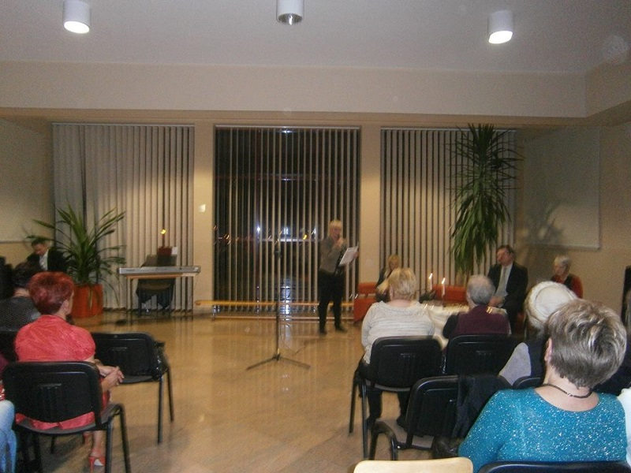</a> 
<a href="img/archive_files/1800466_690732990965782_941899443_n.jpg" target="_blank">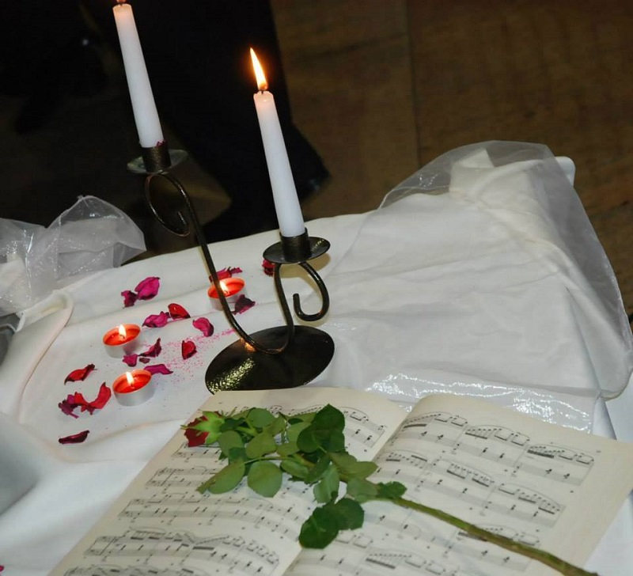</a> 
 
 
 

<i>2014-03-26 15:40:00</i>  
Spotkanie Autorskie z Olgierdem Łukaszewiczem
Zapraszamy do obejrzenia zdjęć ze spotkania z Olgierdem Łukaszewiczem. Spotkanie zorganizowano z okazji Międzynarodowego Dnia Kobiet, które odbyło się w dniu 09.03.2013 w Miejskim Ośrodku Kultury.
  

Zapraszamy do obejrzenia zdjęć ze spotkania z Olgierdem Łukaszewiczem.  Spotkanie zorganizowano z okazji <strong>Międzynarodowego Dnia Kobiet,</strong> które  odbyło się w dniu<strong> 09.03.2013 </strong>w Miejskim Ośrodku Kultury.

 

Spotkanie odbyło się  w miłej atmosferze. Na  widowni  siedziały same kobiety. Pan Olgierd opowiadał o swojej  twórczości na scenie aktorskiej i nie  tylko. Swoim pięknym głosem przeczytał wiersze znanych pisarzy. Wiersze były poświęcone kobietom.
  
<a href="#" class="loadImages" data-images="1">Załaduj Zdjęcia</a> 

 
 
<a href="img/archive_files/spotkanie-dzien-kobiet-4.jpg" target="_blank">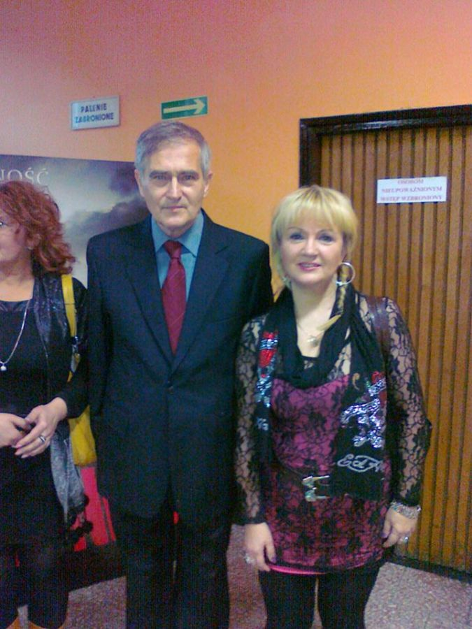</a> 

<i>2014-04-25 09:20:00</i>  
Eliminacje VI edycji Masz Talent
Projekt realizowany przez <strong>Jarosławską Fundacją Pomocna Dłoń</strong> przy współpracy z <strong>CKiP</strong>. Miejsce: Sala Lustrzana. Wstęp wolny. Zgłoszenia będą przyjmowane w Punkcie Informacji Centrum Kultury i Promocji w Jarosławiu do <strong>14 maja 2014 roku</strong>.
  

Eliminacje <strong>„VI edycji programu MASZ TALENT”</strong>  Projekt realizowany przez <strong>Jarosławską Fundacją Pomocna Dłoń</strong> przy współpracy z <strong>CKiP</strong>  Miejsce: Sala Lustrzana

<strong>Wstęp wolny</strong>   Zgłoszenia będą przyjmowane w Punkcie Informacji Centrum Kultury i Promocji w Jarosławiu do <strong>14 maja 2014 roku</strong>.
  
<a href="#" class="loadImages" data-images="1">Załaduj Zdjęcia</a> 

 

<i>2014-05-21 12:17:00</i>  
Eliminacje VI edycji Masz Talent - wyniki
15 maja w Sali Lustrzanej miały miejsce zmagania uczestników VI edycji  programu Masz Talent. Rywalizacja wyłoniła siedemnastu młodych  finalistów. <strong>„Masz Talent” </strong>to konkurs organizowany przez <strong> Jarosławska Fundację „Pomocna Dłoń”</strong> przy współpracy z <strong>Centrum Kultury i  Promocji w Jarosławiu</strong>. Od 2009 roku biorą w nim udział młodzi,  utalentowani mieszkańcy Jarosławia i okolic. Z czasem zmagania przybrały  regionalny, a nawet wojewódzki charakter.
  

<strong>15 maja w Sali Lustrzanej </strong>miały miejsce zmagania uczestników <strong>VI edycji programu Masz Talent</strong>. Rywalizacja wyłoniła siedemnastu młodych finalistów.  <strong>"Masz Talent"</strong> to konkurs organizowany przez Jarosławska Fundację „Pomocna Dłoń” przy współpracy z Centrum Kultury i Promocji w Jarosławiu. Od 2009 roku biorą w nim udział młodzi, utalentowani mieszkańcy Jarosławia i okolic. Z czasem zmagania przybrały regionalny, a nawet wojewódzki charakter.  Chęć udziału w tegorocznej rywalizacji zgłosiło 30 osób. Zachwycili wszyscy, niestety jury w składzie: <strong>Alicja Zając</strong>, <strong>Maciej Inglot</strong>, <strong>Magdalena Rożek</strong>, <strong>Jolanta Szewczyk</strong>, <strong>Agnieszka Horodejczuk</strong>, zdecydowało, że do finału przejdzie 14 najlepszych osób, w tym zespół dwu- i trzyosobowy:
<ol><li><strong>Kinga Bobowicz</strong> – Gimnazjum w Pawłosiowie, 16 lat</li><li><strong>Katarzyna Czarny</strong> – Zespół Szkół w Pawłosiowie, 15 lat</li><li><strong>Wiktoria Dejnak</strong> – Świetlica Przy Parafii Bożego Ciała w Jarosławiu, 10 lat</li><li>Duet <strong>Adrian Duczyński</strong>, <strong>Piotr Chludziński</strong> – Zespół Szkół Plastycznych w Jarosławiu, Zespół Szkół Salezjańskich w Przemyślu, 17 i 18 lat</li><li>Trzyosobowy zespół <strong>Street Bonus</strong> – Zespół Szkół Licealnych i Technicznych w Jarosławiu, Zespół Szkół Mechanicznych w Jarosławiu, wiek 17 i 18 lat</li><li><strong>Krzysztof Kądziołka</strong> – uczestnik otrzymał zieloną kartę od publiczności</li><li><strong>Dawid Krzeptoń</strong> – Zespół Szkół w Laszkach, 16 lat</li><li><strong>Weronika Makowska</strong> – Publiczne Gimnazjum nr 2 w Jarosławiu, 16 lat</li><li><strong>Natalia Michalik</strong> – Publiczne Gimnazjum nr2 w Jarosławiu, 14 lat</li><li><strong>Aldona Mikoś</strong> – I LO im. M. Kopernika w Jarosławiu, 18 lat</li><li><strong>Jakub Moskwa</strong> – Zespół Szkół Technicznych i Ogólnokształcących w Jarosławiu, 19 lat</li><li><strong>Jakub Preisner</strong> – Publiczne Gimnazjum nr 2 w Jarosławiu, 15 lat</li><li><strong>Paweł Surdej</strong> – Publiczne Gimnazjum nr 3 w Jarosławiu, 16 lat</li><li><strong>Ewa Trojniak</strong> – Zespół Szkół Technicznych i Ogólnokształcących w Jarosławiu, 17 lat</li></ol>
 

<em>Źródło: ckip.jaroslaw.pl</em>
<ol> </ol>
 
  
<a href="#" class="loadImages" data-images="1">Załaduj Zdjęcia</a> 

 
 
 
 
 
 
 
 
 
 
 
 
 
 
 
 
 
 
 
 
 

<i>2014-05-23 07:19:00</i>  
&quot;Magiczne zwierzenia&quot; Alicja Zając
"Magiczne zwierzenia" to album złożony z lirycznych przemysleń Alicji Zając - prezes Jarosławskiej Fundacji Pomocna Dłoń, przedstawiający miłość do świata, podziw dla otaczającej przyrody, przywiązanie do ludzi i chęć niesienia im pomocy w różnych kolejach ich życia oraz to jak tę pomoc wraz ze swoją fundacją organizuje.
  

<strong>"Magiczne zwierzenia"</strong> to album złożony z lirycznych przemysleń Alicji Zając - prezes Jarosławskiej Fundacji Pomocna Dłoń, przedstawiający miłość do świata, podziw dla otaczającej przyrody, przywiązanie do ludzi i chęć niesienia im pomocy w różnych kolejach ich życia oraz to jak tę pomoc wraz ze swoją fundacją organizuje.

Zapraszamy do lektury!
  
<a href="#" class="loadImages" data-images="1">Załaduj Zdjęcia</a> 

 
<a href="img/archive_files/okladka-magiczne-zwierzenia.jpg" target="_blank">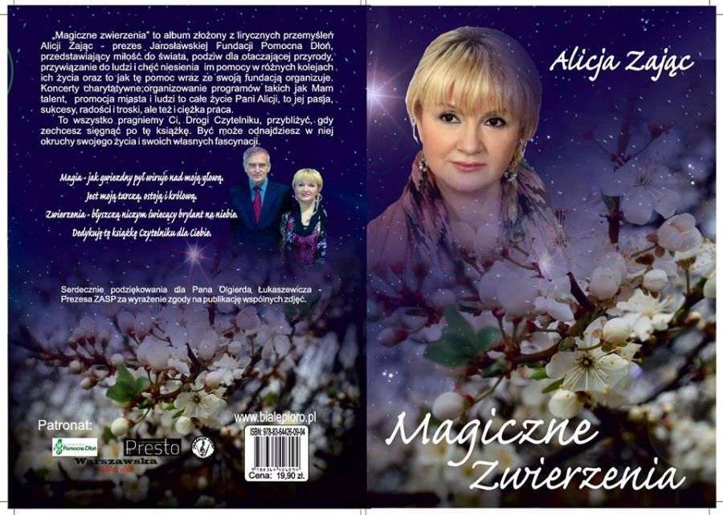</a> 

<i>2014-06-24 12:40:00</i>  
Promocja książki
W dniu 14.06.2014 podczas Imienin Jana Kochanowskiego - odbyła się promocja książki <strong>"Magiczne Zwierzenia"</strong> autorstwa Alicji Zając. Wielkie podziękowania dla Wydawnictwa Literackiego Białe Pióro i dla Pana Olgierda Łukaszewicza, za to że w magicznym uniesieniu promują książkę w Warszawie.  Dziękujemy za zakup książek w tak dużym nakładzie.
  

W dniu 14.06.2014 podczas Imienin Jana Kochanowskiego - odbyła się promocja książki "Magiczne Zwierzenia" autorstwa Alicji Zając.

 Wielkie podziękowania dla Wydawnictwa Literackiego Białe Pióro i dla Pana Olgierda Łukaszewicza, za to że w magicznym uniesieniu promują książkę w Warszawie.

 Dziękujemy za zakup książek podczas pobytu na mieninach Jana Kochanowskiego.

  
<a href="#" class="loadImages" data-images="1">Załaduj Zdjęcia</a> 

<a href="img/archive_files/01[3].jpg" target="_blank">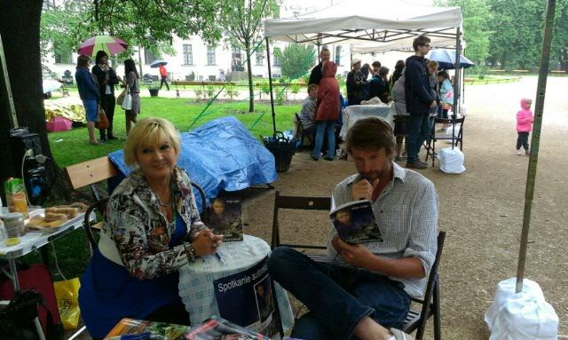</a> 
 
 
<a href="img/archive_files/04[4].jpg" target="_blank">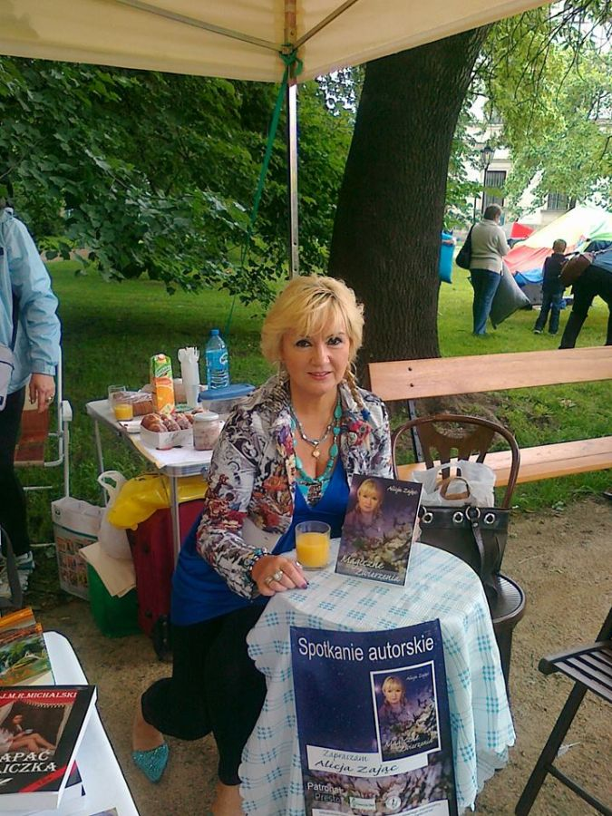</a> 
<a href="img/archive_files/05[5].jpg" target="_blank">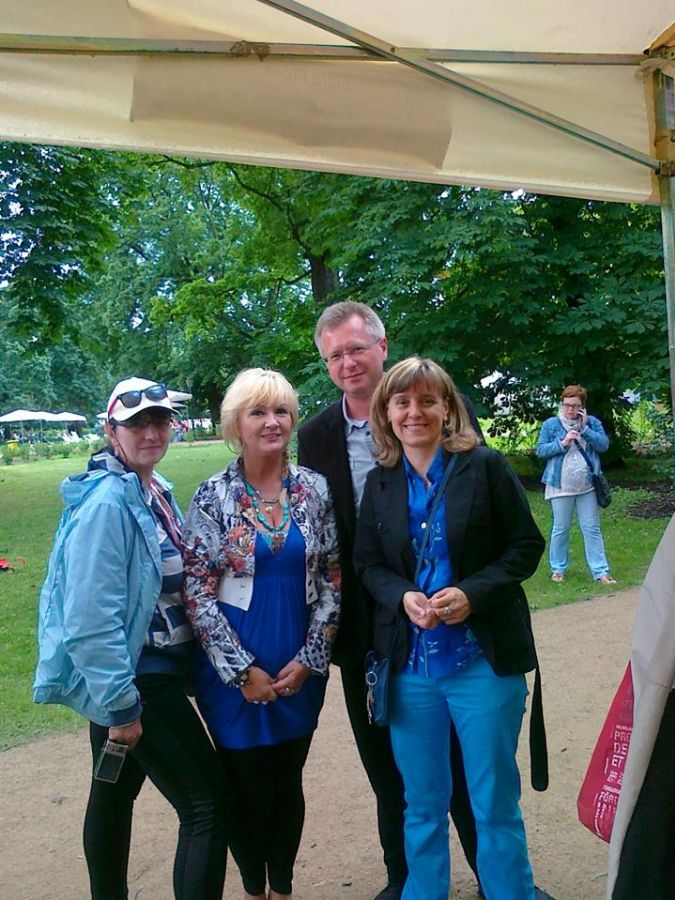</a> 
 
 
<a href="img/archive_files/08[2].jpg" target="_blank">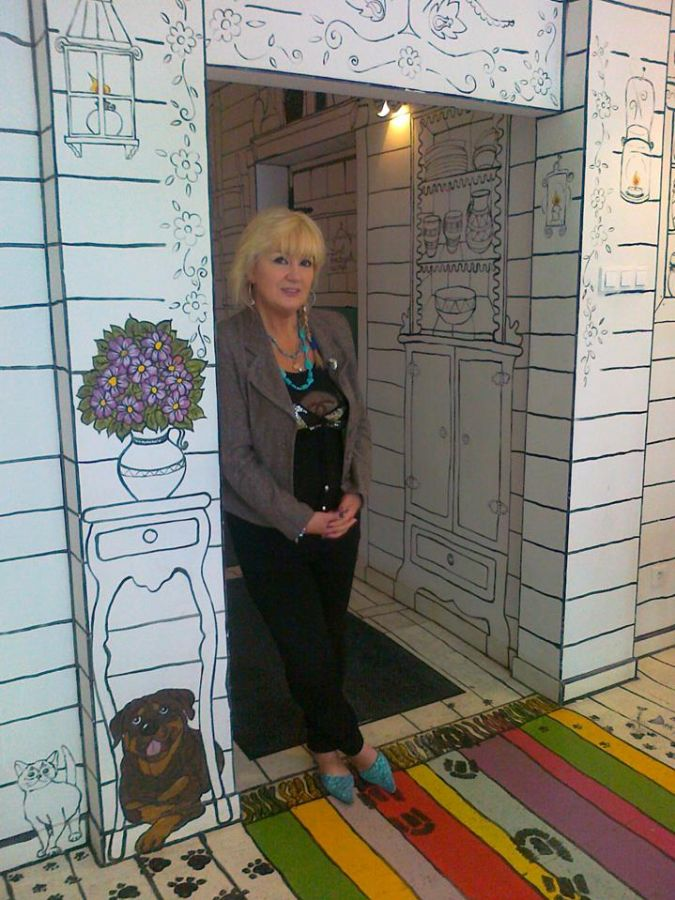</a> 
<a href="img/archive_files/09[3].jpg" target="_blank">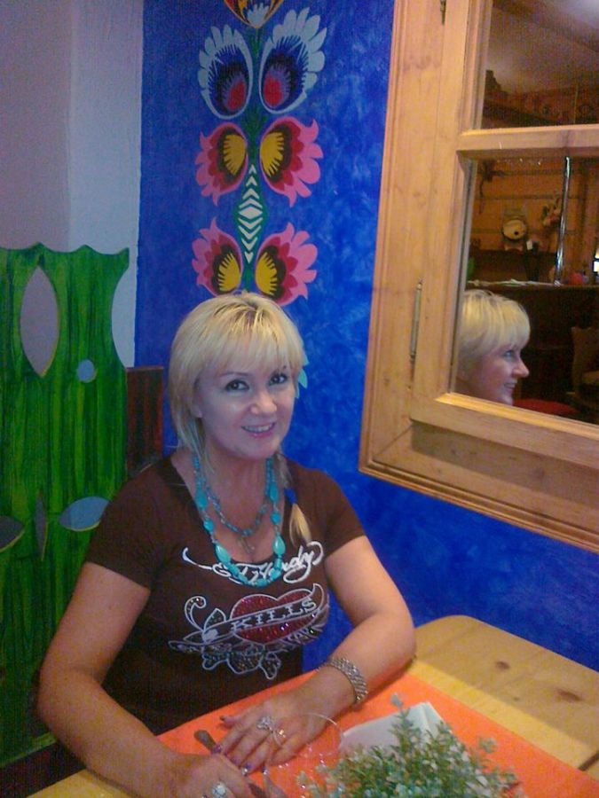</a> 
 
 
 
 
 
 
 
<a href="img/archive_files/17[2].jpg" target="_blank">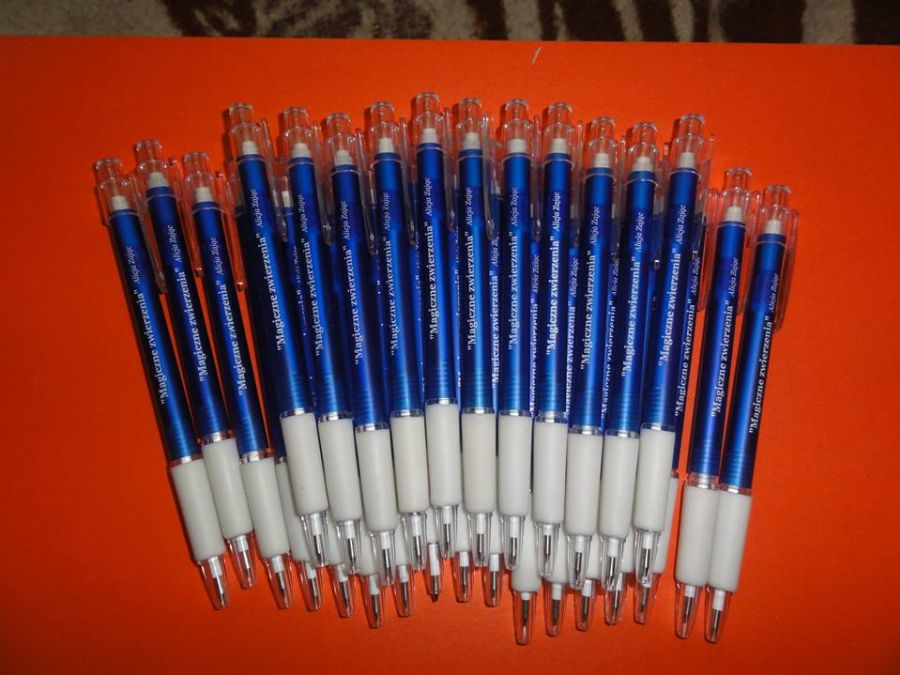</a> 
 
<a href="img/archive_files/19[2].jpg" target="_blank">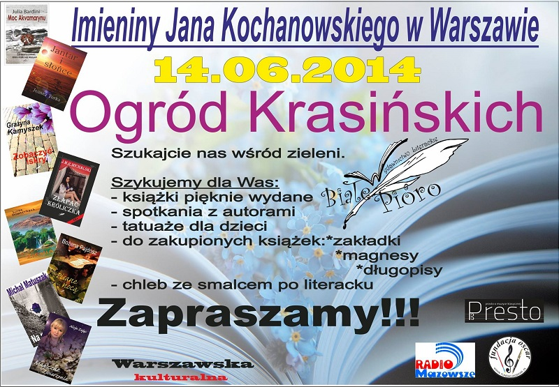</a> 
 
 
 
 
 
 
 
 
 
 
 
 

<i>2014-07-29 12:02:00</i>  
Wielki finł VI edycji &quot;Masz Talent&quot;
Jarosławska Fundacja "Pomocna dłoń" zaprasza na "Masz Talent" - Jarosław Rynek (wstęp wolny) 09.08.2014 W Jury zasiądzie JUAN CARLOS CANO - godz. 20.00 wystąpi zespół ENCLOSE
  

Jarosławska Fundacja "Pomocna dłoń" zaprasza na "Masz Talent" - Jarosław Rynek (wstęp wolny) 09.08.2014 W Jury zasiądzie <strong>JUAN CARLOS CANO</strong> - godz. 20.00 wystąpi zespół ENCLOSE
  
<a href="#" class="loadImages" data-images="1">Załaduj Zdjęcia</a> 

<a href="img/archive_files/MASZ_TALENT.jpg" target="_blank">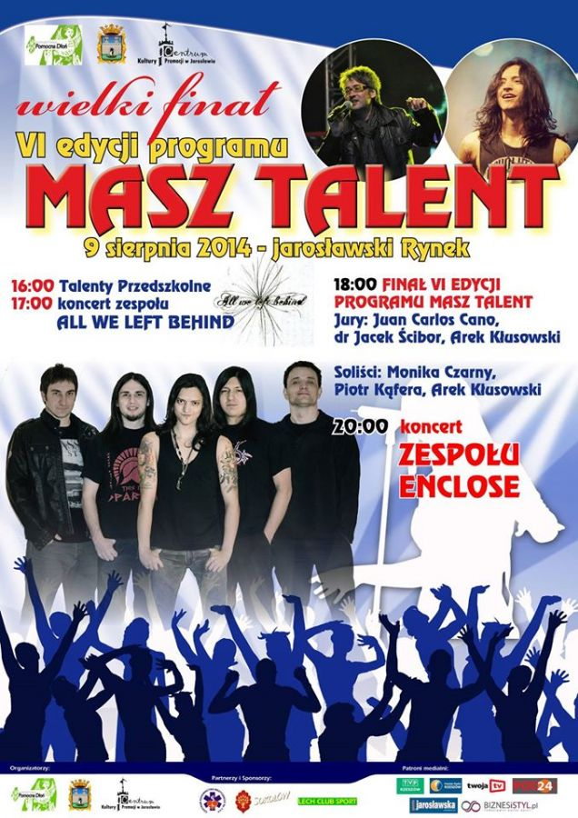</a> 

<i>2014-08-18 14:44:00</i>  
VI edycja  „Masz talent” oraz gość specjalny Juan Carlos Can z zespołem Enclose
W ubiegłą sobotę 9 sierpnia, jarosławianie prezentowali swoje talenty w VI Edycji Programu Masz Talent. Impreza  rozpoczęła się popołudniu. Jako pierwsi swoje talenty prezentowały  dzieci z okolicznych przedszkoli. Następnie odbył się koncert zespołu  All We Left Behind. <strong>Gwiazdą wiezoru był zaś Juan Carlos Can z zespołem Enclose.</strong>
  

W ubiegłą sobotę 9 sierpnia, jarosławianie prezentowali swoje talenty w<strong> VI Edycji Programu Masz Talent</strong>.

Impreza rozpoczęła się popołudniu. Jako pierwsi swoje talenty prezentowały dzieci z okolicznych przedszkoli. Następnie odbył się koncert zespołu All We Left Behind. Punktualnie o godzinie 18 rozpoczął się finał VI Edycji Programu Masz Talent. Wszyscy uczestnicy oceniani byli przez wymagające jury, w skład którego zasiedli: jako przewodniczący <strong>Arkadiusz Kłusowski</strong>, lider zespołu Enclose, zwycięzca IV Edycji Programu The Voice of Poland, gwiazda wieczoru <strong>Juan Carlos Cano</strong>, oraz <strong>Małgorzata Rożek</strong> przedstawicielka Urzędu Miasta, <strong>Maciej Inglot</strong>, muzyk, <strong>Jolanta Szewczyk</strong>, członkini Fundacji Pomocna Dłoń i <strong>Ewa Wasiewicz</strong>, sponsor imprezy.

Spośród wszystkich uczestników, którzy prezentowali swoje umiejętności wokalne, muzyczne czy taneczne najlepsza okazała się <strong>Aldona Mikoś</strong>, która ujęła wszystkich swoim wyjątkowym głosem. Ponadto jury przyznało wyróżnienia dla Zespołu Street Bounce, Piotra Chludzińskiego, Jakuba Moskwy oraz Jakuba Preisnera. Wyjątkowym wydarzeniem tego dnia był niezaplanowany występ Asi Kidy, dziewczynki w wieku przedszkolnym, która za swój występ śpiewaczy otrzymała indywidualną nagrodę od samego Juana Carlosa Cano. Wydarzeniu tłumnie towarzyszyli widzowie.

 - Chciałabym serdecznie podziękować księdzu Marianowi Bocho, dzięki któremu mieliśmy możliwość wykorzystania sceny umieszczonej na jarosławskim Rynku. Ponadto przekazuję najwyższe wyrazy uznania oraz wdzięczności dla Juana Carlosa Cano, dzięki któremu całemu wydarzeniu towarzyszyła wyjątkowa atmosfera – mówi Alicja Zając, główna organizatorka, przewodnicząca Jarosławskiej Fundacji Pomocna Dłoń.

Na zakończenie imprezy wystąpił zespół Enclose.  <em>P. Szczepanik</em> - Gazeta Jarosławska  <strong>Zwyciężczyni VI Edycji Programu Masz Talent Aldona Mikoś</strong>
  
<a href="#" class="loadImages" data-images="1">Załaduj Zdjęcia</a> 

 
 
 
 
 
 
 
 
 
 
 
 
 
 
 
 
 
 
<a href="img/archive_files/masz-talent-a.jpg" target="_blank">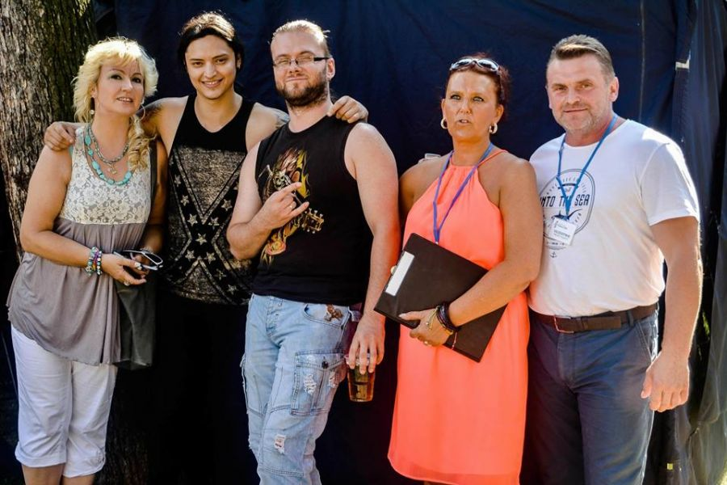</a> 
 
<a href="img/archive_files/masz-talent-c.jpg" target="_blank">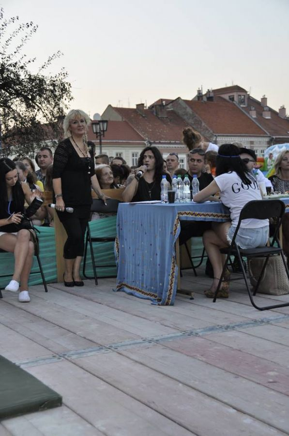</a> 
 
 
 
 
 
 
 
 
 
 
 
 
 
 
 
 
 
 
 
 
 
 
 
 
 
 
 
 
 
 
 
 
 
 
 
 

<i>2014-09-09 08:04:00</i>  
Wywiad udzielony przez Alicję Zając w Radiu Rzeszów
Zapraszamy do wysłuchania wywiadu, którego udzieliła Alicja Zając, autorka tomiku poezji "Magiczne zwierzeia"
  

Zapraszamy do wysłuchania wywiadu, którego udzieliła Alicja Zając, autorka tomiku poezji "Magiczne zwierzeia"

  
<a href="#" class="loadImages" data-images="1">Załaduj Zdjęcia</a> 

 

<i>2014-09-24 12:56:00</i>  
Wieczór poezji &quot;Magiczne Zwierzenia&quot;
W  dniu 18.09.2014  o godz.18.00 w Sanatorium Ojca Pio w Radawie odbył się wieczór poezji <strong>"Magiczne Zwierzenia"</strong> autorki Alicji Zając. Na widowni zasiadali kuracjusze Sanatorium.
  

W  dniu 18.09.2014  o godz.18.00 w Sanatorium Ojca Pio w Radawie odbył się wieczór poezji <strong>"Magiczne Zwierzenia"</strong> autorki Alicji Zając.

Na widowni zasiadali kuracjusze Sanatorium.

Autorka zaprosiła  swoich gości do uświetnienia wieczoru którzy zaprezentowali swoje talenty: gitara i śpiew - Piotr Chludziński, promocja swoich wierszy - Jolanta Szewczyk.

<strong>"Magiczne Zwierzenia"</strong> czytane przez autorkę, wprowadziły publiczność w romantyczny i magiczny nastrój przy zapalonych świecach i bajecznej dekoracji.
  
<a href="#" class="loadImages" data-images="1">Załaduj Zdjęcia</a> 

 
 
 
 
 
 

<i>2014-09-30 14:00:00</i>  
Ludzie z pasją - spotkanie z Alicją Zając
2 października 2014 roku o godz. 18.00 zapraszamy na spotkanie z Alicją Zając jarosławianką, autorką tomiku poezji pt. „Magiczne zwierzenia”. Spotkanie rozpoczyna realizację projektu „Ludzie z pasją”, którego celem jest skupienie wokół biblioteki ludzi posiadających ciekawe zainteresowania, pasje tworzenia lub promowania sztuki, ludzi, którzy chcą zaprezentować własny dorobek artystyczny.
  

<strong>2 października 2014 roku o godz. 18.00 zapraszamy na spotkanie z Alicją Zając jarosławianką, autorką tomiku poezji pt. </strong>„Magiczne zwierzenia”.

Spotkanie rozpoczyna realizację projektu „Ludzie z pasją”, którego celem jest skupienie wokół biblioteki ludzi posiadających ciekawe zainteresowania, pasje tworzenia lub promowania sztuki, ludzi, którzy chcą zaprezentować własny dorobek artystyczny.

<strong>Alicja Zając </strong>- urodzona i zamieszała w Jarosławiu. Od dzieciństwa przejawiała w sobie różne talenty artystyczne. Już jako dziecko, będąc w szkole podstawowej, recytowała wiersze na akademiach i w instytucjach państwowych, czynnie biorąc udział w wydarzeniach kulturalnych miasta.

Z zawodu włókiennik i projektant odzieży. Potrafi z niczego zrobić dzieło sztuki, stosując odpowiednie gamy kolorów i ich łączenia. Jej pasja to: taniec, śpiew. muzyka, plastyka, dekoracja wnętrz i architektura.

Od 2000 roku zajmuje stanowisko Prezesa <strong>Jarosławskiej Fundacji ''Pomocna dłoń''</strong>.

Jest inicjatorką i prowadzącą regionalny program <strong>''Masz talent''</strong>, promujący zdolną młodzież z całego województwa podkarpackiego. Jako prezes fundacji organizuje koncerty charytatywne z udziałem znanych gwiazd polskiej estrady i nie tylko.

W tym roku Alicja Zając wydała swój pierwszy tomik wierszy pt. „Magiczne zwierzenia” zawierający liryczne przemyślenia autorki.

<strong>Wszystkich zainteresowanych serdecznie zapraszamy na spotkanie!</strong>
  
<a href="#" class="loadImages" data-images="1">Załaduj Zdjęcia</a> 

 

<i>2014-10-06 13:38:00</i>  
Spotkanie  Z Alicja Zając  autorka  książki &quot;Magiczne zwierzenia&quot; 
Spotkanie  Z Alicja Zając  autorka  książki "Magiczne zwierzenia",  02.10.2014 godz.18.00 w Miejskiej Bibliotece Publicznej w Jarosławiu. Wieczór odbył się w magicznym nastroju i cudownej dekoracji.Autorka całym sercem czytała swoje zwierzenia. Wprowadziła publiczność w bajeczny i magiczny nastrój.
  

Spotkanie  Z Alicja Zając  autorka  książki "Magiczne zwierzenia",  02.10.2014 godz.18.00 w Miejskiej Bibliotece Publicznej w Jarosławiu.

Wieczór odbył się w magicznym nastroju i cudownej dekoracji.Autorka całym sercem czytała swoje zwierzenia. Wprowadziła publiczność w bajeczny i magiczny nastrój.

Została nagrodzona  gromkimi brawami i kwiatami. Z rąk Jolanty Szewczyk otrzymała  wiersz  ....Tylko dla niej...

Zdjęcia wykonane przez Paulinę Trojnar.

 
  
<a href="#" class="loadImages" data-images="1">Załaduj Zdjęcia</a> 

 
 
 
 
 
 
 
 
 
 
 
 
 
 
 
 
 
 
 

<i>2014-10-29 11:30:00</i>  
Alicji zając poetyckie reminiscencje
W Miejskie Bibliotece Publicznej w naszym mieście spotkania z literatami nie są niczym nowym. Nieczęsto jednak zdarza się, aby zaszczycali te spotkania posłowie.
  

W Miejskie Bibliotece Publicznej w naszym mieście spotkania z literatami nie są niczym nowym. Nieczęsto jednak zdarza się, aby zaszczycali te spotkania posłowie.

Tym razem było inaczej. Na wieczór autorski Alicji Zająć, prezesa Fundacji „Pomocna Dłoń”, przybył poseł Mieczysław Kasprzak oraz wielbiciele poezji. Z całą pewnością pani Alicja swoim pierwszym zbiorem eklektycznym (poezja, proza poetycka, sacrum i profanum – przyp. HG) zyska sympatyków. Bo w twórczości literackiej liczy się odwaga pisania i talent. Pani Alicja nie tylko sama prezentowała swoje utwory. Jej wiersze czytał także, ze szczerym zaangażowaniem, poseł Mieczysław Kasprzak. Adriana Fudali, polonistka i germanistka, wiersze zinterpretowała po mistrzowsku – ciepło, aksamitnie i… niebiańsko.

Okolicznością spotkania było wydanie staraniem Alicji Zająć j przez oficynę „Białe Pióro” jej tomiku opatrzonego tytułem „Magiczne zwierzenia”. Jak na debiut całkiem niezły. Pani Alicjo – gratulacje. Magiczne wiersze

w Bibliotece glamour to jest to.
  
<a href="#" class="loadImages" data-images="1">Załaduj Zdjęcia</a> 

<a href="img/archive_files/1wieczorek.jpg" target="_blank">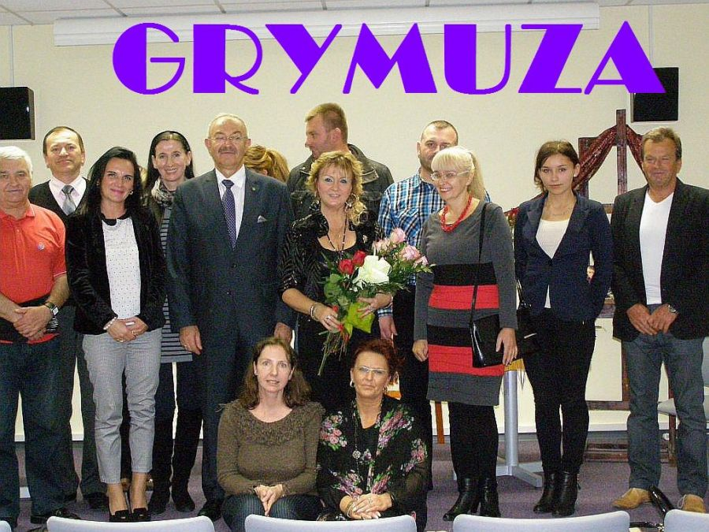</a> 
 
<a href="img/archive_files/grymuza2.jpg" target="_blank">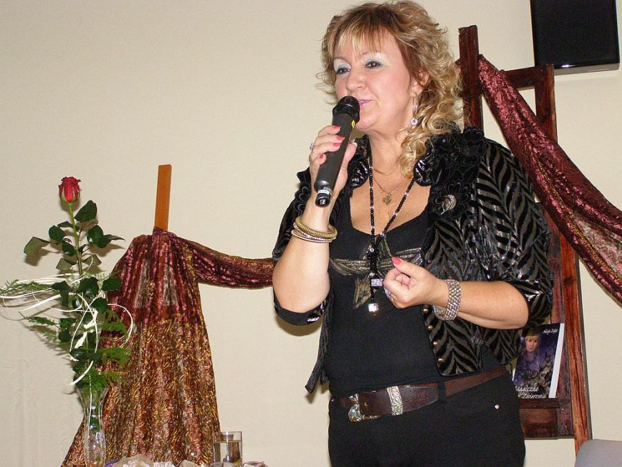</a> 
 

<i>2014-10-31 10:30:00</i>  
Wieczór Poezji &quot;Magiczne zwierzenia&quot; 
Wieczór Poezji "Magiczne zwierzenia" 29.10.2014 Centrum Kultury i Promocji w Jarosławiu
  

Wieczór Poezji "Magiczne zwierzenia" 29.10.2014 Centrum Kultury i Promocji w Jarosławiu
  
<a href="#" class="loadImages" data-images="1">Załaduj Zdjęcia</a> 

<a href="img/archive_files/20141029.jpg" target="_blank">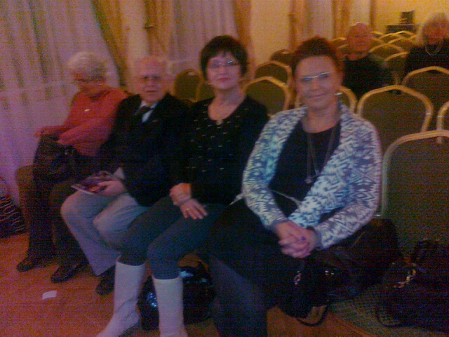</a> 
<a href="img/archive_files/201410291.jpg" target="_blank">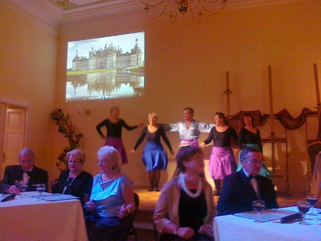</a> 
 
 
 
 
 
 
 
 
 

<i>2014-10-31 13:00:00</i>  
Alicja Zając - Kandydat PSL do sejmiku Województwa Podkarpackiego.
Wybierajmy sercem ! Każdy z nas ma obowiązek w tym dniu czuć się Polakiem.
  

Wybierajmy sercem ! Każdy z nas ma obowiązek w tym dniu czuć się Polakiem.
  
<a href="#" class="loadImages" data-images="1">Załaduj Zdjęcia</a> 

 

<i>2014-11-21 09:49:00</i>  
Wieczór Poezji &quot;Magiczne Zwierzenia&quot;
Wieczór Poezji "Magiczne Zwierzenia"  w Centrum Kultury Sportu i Rekreacji "Sokół" w Sieniawie - 20.11.2014
  

W czwartek 20 listopada 2014 roku w Centrum Kultury Sportu i Rekreacji "Sokół" w Sieniawie odbył się Wieczór Poezji "Magiczne Zwierzenia". Swoim śpiewem wieczór umilała nam Kinga Bobowicz.
  
<a href="#" class="loadImages" data-images="1">Załaduj Zdjęcia</a> 

 
<a href="img/archive_files/20141120.jpg" target="_blank">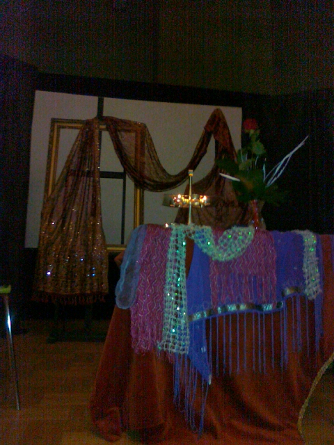</a> 
 
 
 
 
 

<i>2014-12-13 11:49:00</i>  
Mikołaj w Domu Dziecka - Jarosław 11.12.2014
11 grudnia 2014r. jarosławski Dom Dziecka odwiedził św. Mikołaj.
  

11 grudnia 2014r. jarosławski Dom Dziecka odwiedził św. Mikołaj. Dzieci przywitały go z wielką radością uświetniając Jego przyjście przygotowanym przez siebie programem artystycznym.   Serdecznie dziękujemy Panu Piotrowi Bilikowi z zespołu OnLive za oprawę muzyczną wydarzenia.

 

Zapraszamy do obejrzenia krótkiego filmu z wydarzenia na portalu facebook nagranego przez Pana Piotra:

http://www.facebook.com/video.php?v=774759252577547

 

Tak pisano o wydarzeniu w tygodniku Gazeta Jarosławska:  "W czwartkowe popołudnie, 11 grudnia wychowanków Domu Dziecka nr 1 w Jarosławiu odwiedzili wyjątkowi goście. Dzieciaki spotkały się ze Świętym Mikołajem i prezesem Jarosławskiej Fundacji Pomocna Dłoń Alicją Zając.

Jak co roku, odwiedzin Mikołaja wyczekiwali wszyscy, zarówno maluchy, jak i młodzież. Aby podziękować gościom za wręczone prezenty, dzieci wspólnie z wychowawcami przygotowali program artystyczny, który zaprezentowali w ubiegły czwartek. Po świątecznym występie, przyszedł czas na rozdanie prezentów, o które zatroszczyła się Jarosławska Fundacja Pomocna Dłoń. Wśród upominków znalazły się zabawki, słodycze oraz ubrania.

Każdy wychowanek Domu Dziecka, przed odebraniem prezentów, zaprezentował swój talent, dlatego też tego dnia nie brakowało tańców, śpiewów oraz recytacji wierszy. Jak powiedziała nam prezes Fundacji Alicja Zając, tego typu spotkania mają na celu stworzenie wyjątkowej atmosfery, podczas której dzieci mogą się otworzyć i współpracować, a przede wszystkim poczuć bliskość z drugim człowiekiem."
  
<a href="#" class="loadImages" data-images="1">Załaduj Zdjęcia</a> 

 
 
<a href="img/archive_files/10849910_744003922360579_3242834923632151543_n.jpg" target="_blank">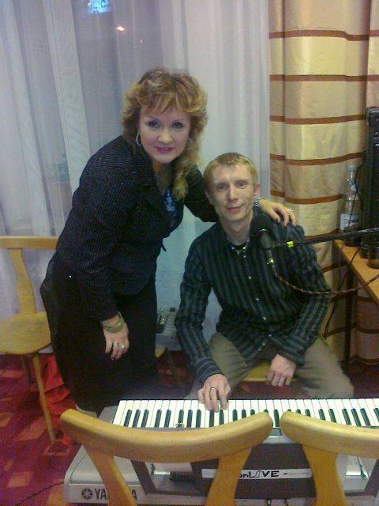</a> 
<a href="img/archive_files/10867150_747775098650128_406873512_n.jpg" target="_blank">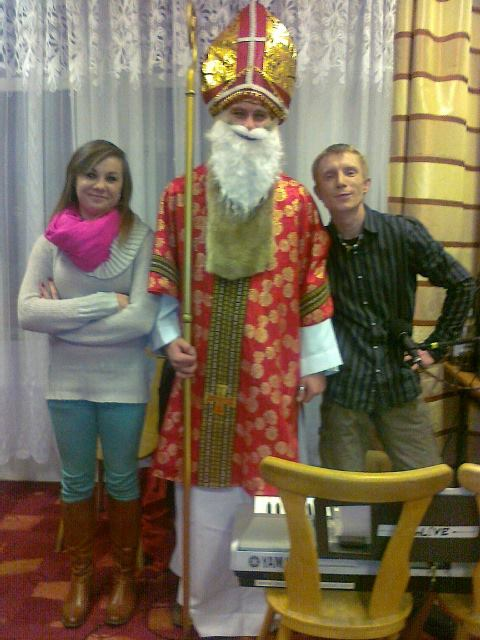</a> 
<a href="img/archive_files/1888657_744003299027308_7881727903879542920_n.jpg" target="_blank">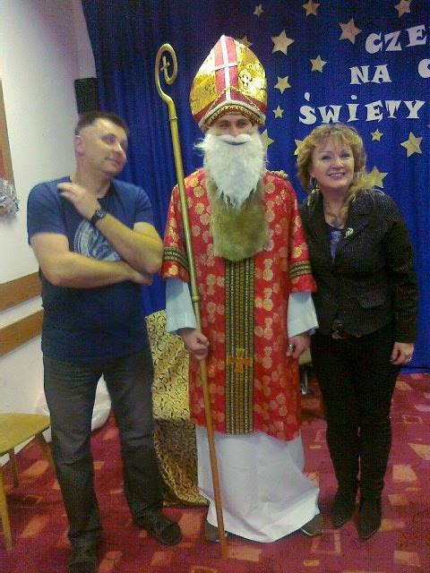</a> 
<a href="img/archive_files/20141211.jpg" target="_blank">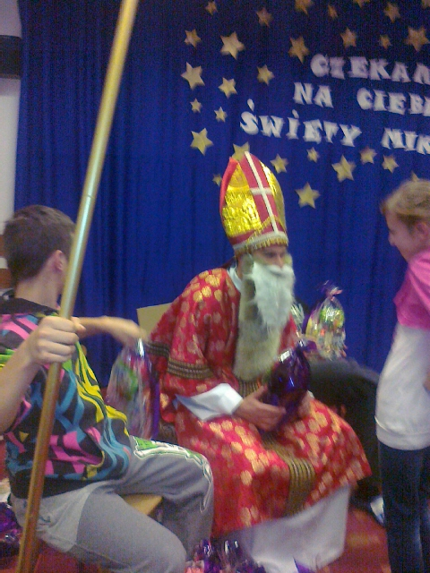</a> 

