

<i>2015-01-27 12:26:00</i>  
Spotkanie Noworoczne PSL 25.01.2015
25.01.2015r. w Filharmonii Podkarpackiej w Rzeszowie odbyło się Spotkanie Noworoczne PSL...
  

25.01.2015r. w Filharmonii Podkarpackiej w Rzeszowie odbyło się Spotkanie Noworoczne PSL. Swoją obecnością zaszczycić Wicepremier PSL Janusz Piechociński, a swoimi występami spotkanie uświetniły zespoły "Ratatam" oraz zespół folklorystyczny "Rzeszowiacy".
  
<b>Zdjęcia:</b> 

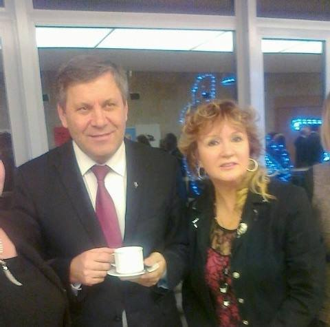 
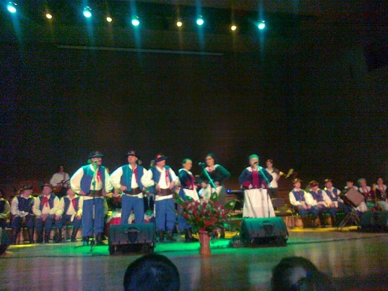 
 
 
 

<i>2015-02-27 15:39:00</i>  
Jabłka na jarosławskim rynku
Dnia 4.03, tj. środa, około godziny 14:00 na jarosławskim rynku rozdawane będą jabłka...
  

Dnia 4.03, tj. środa, około godziny 14:00 na jarosławskim rynku rozdawane będą jabłka.

 

Zapraszamy wszystkich potrzebujących i zainteresowanych.

Starczy dla każdego!
  
<b>Zdjęcia:</b> 

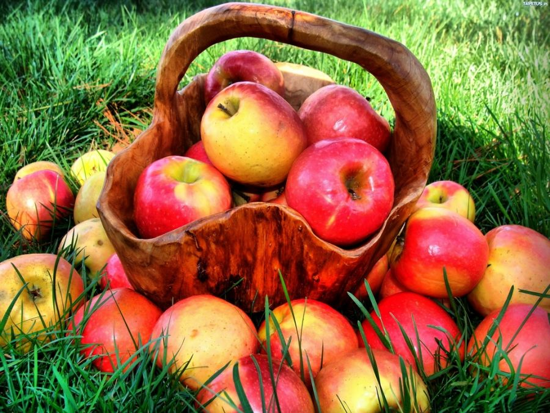 

<i>2015-03-09 21:53:00</i>  
Jabłka na jarosławskim rynku - relacja
W środę, 4 marca, na rynku w Jarosławiu odbyła się zorganizowana przez naszą fundację akcja rozdawania jabłek. Darmowe owoce mógł otrzymać każdy...
  

W środę, 4 marca, na rynku w Jarosławiu odbyła się zorganizowana przez naszą fundację akcja rozdawania jabłek. Darmowe owoce mógł otrzymać każdy.

Inicjatorem akcji rozdawania jabłek był sadownik z Sandomierza, Norbert Szczudło, który zdecydował się przekazać fundacji 1000 skrzynek owoców. Jabłka zostały przywiezione do Jarosława przez Bank Żywności w Rzeszowie, a ich przekazanie było możliwe dzięki dofinansowaniu z funduszy unijnych oraz Agencji Restrukturyzacji i Modernizacji Rolnictwa.

- Inicjatywa okazała się wielkim sukcesem. Jestem bardzo zadowolona. Rozdaliśmy 20 ton jabłek. Trafiły one do różnych instytucji, tj. szkół, przedszkoli, świetlic, Domu Dziecka, a przede wszystkim do mieszkańców Jarosławia - mówi koordynatorka akcji i prezes fundacji, Alicja Zając.

W związku z ogromnym zainteresowaniem akcją pomysłodawcy zdecydowali się ją powtórzyć. Jabłka prawdopodobnie będą rozdawane ponownie na jarosławskim rynku już 19 marca.

Zapraszamy wszystkich zainteresowanych!

<em>źródło: Gazeta Jarosławska</em>
  
<b>Zdjęcia:</b> 

 
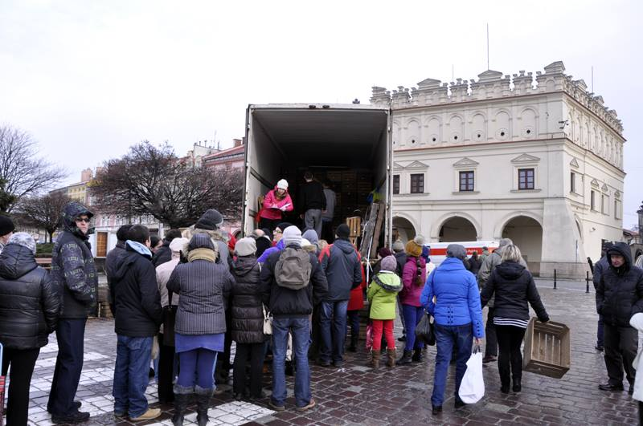 
 
 
 
 

<i>2015-03-24 15:28:00</i>  
Jabłka na jarosławskim rynku, ponownie!
Jarosławska Fundacja "Pomocna dłoń" w dniu 19.03.2015 czwartek ul. Rynek rozdawała jabłka w pierwszym gatunku mieszkańcom Jarosławia i nie tylko...
  

Jarosławska Fundacja "Pomocna dłoń" w dniu 19.03.2015 czwartek ul. Rynek rozdawała jabłka w pierwszym gatunku mieszkańcom Jarosławia i nie tylko. Tłumy ludzi były nie do opanowania przez Organizatora, Straż Miejską i Policję. Takiego zainteresowania jabłkami w Jarosławiu od niepamiętnych czasów jeszcze nie było. Bardzo dziękujemy za zainteresowanie akcją i tak liczną obecność!
  
<b>Zdjęcia:</b> 

 
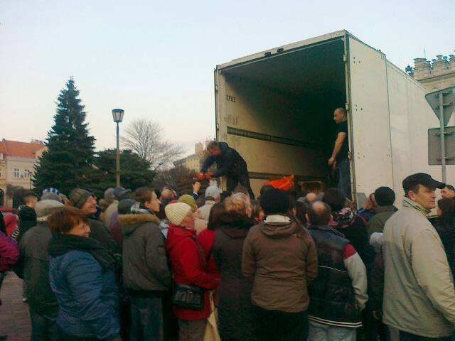 
 
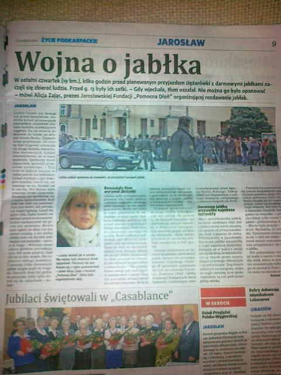 
 

<i>2015-03-28 18:34:00</i>  
&quot;Magiczne Zwierzenia&quot;  w Szkole Podstawowej Nr 11 w Jarosławiu
Wiersze czytane były przez autorkę, p. Alicję Zając, Prezes Fundacji.
  

Wiersze czytane były przez autorkę, p. Alicję Zając, Prezes Fundacji.

Dzieci w skupieniu słuchały poezji i aktywnie włączały się w rozmowę z autorką.
  
<b>Zdjęcia:</b> 

 
 
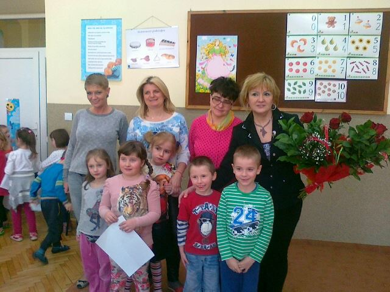 

<i>2015-04-02 21:11:00</i>  
Masz talent - eliminacje
Jarosławska Fundacja Pomocna Dłoń wraz z Centrum Kultury i Promocji Miasta Jarosławia<strong> </strong>zapraszają na <strong>Program "Masz Talent"...</strong>
  

Jarosławska Fundacja Pomocna Dłoń wraz z Centrum Kultury i Promocji Miasta Jarosławia<strong> </strong>zapraszają na <strong>Program "Masz Talent"</strong>  Eliminacje odbędą się <strong>15.04.2015 r</strong>. o <strong>godz. 11:00</strong> w Sali Lustrzanej CKiP w Jarosławiu Rynek 5 (kamienica Attavantich).  <strong>Potrafisz śpiewać? Tańczyć? Komponujesz własną muzykę? Wyróżniasz się talentem, którym chcesz się pochwalić?</strong>   Przyjdź na eliminacje „Masz Talent”! To może być Twój pierwszy krok do rozpoczęcia kariery!  Program jest przeznaczony m.in. dla uczniów szkół podstawowych, gimnazjalnych i ponadgimnazjalnych.  Serdecznie zapraszamy wszystkich chętnych!  Zgłoszenie kandydata musi zawierać:
<ol><li>imię i nazwisko,</li><li>adres zamieszkania,</li><li>wiek,</li><li>kategoria występu,</li><li>telefon kontaktowy,</li><li>nazwa szkoły (jeśli dotyczy).</li></ol>
 Zgłoszenia przyjmowane będą do 11.04.2015

Poniżej zamieszczony został link do pobrania formularza zgłoszeniowego:

 
  
<b>Zdjęcia:</b> 

 
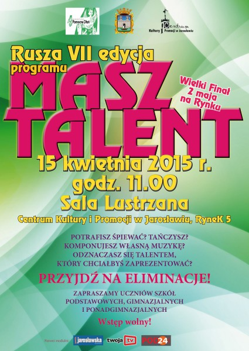 

<i>2015-04-17 19:11:00</i>  
Eliminacje &quot;Masz talent&quot; 
15.04.2015 w Centrum Kultury i Promocji w Jarosławiu odbyły się eliminacje "Masz Talent"...
  

 

15.04.2015 w Centrum Kultury i Promocji w Jarosławiu odbyły się eliminacje "Masz Talent".

Organizatorem eliminacji jest Jarosławska fundacja "Pomocna dłoń". Współorganizator: Burmistrz Miasta Jarosław, Urząd Miasta Jarosław, CKiP w Jarosławiu.

 

 
  
<b>Zdjęcia:</b> 

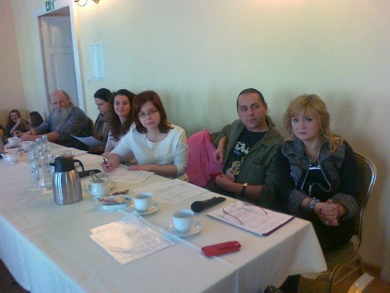 
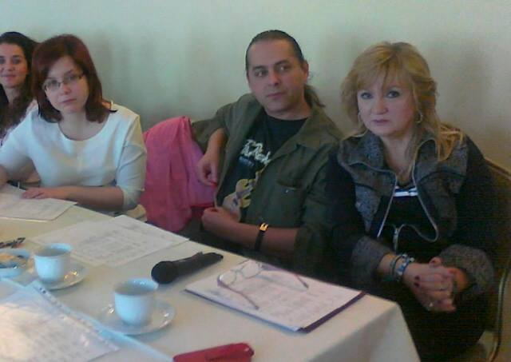 
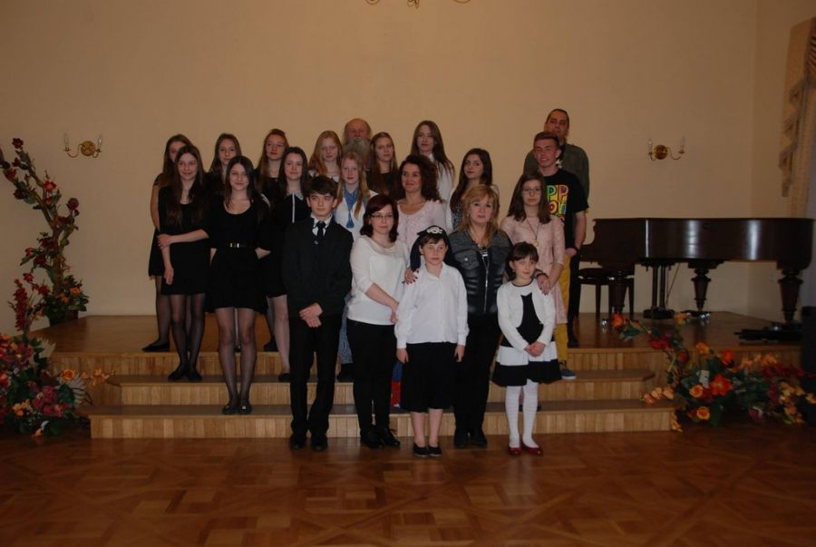 
 

<i>2015-04-17 19:14:00</i>  
Finał &quot;Masz talent&quot; 2.05.2015r
Zapraszamy wszystkich zainteresowanych na jarosławski rynek...
  

Zapraszamy wszystkich zainteresowanych na jarosławski rynek. 2.05.2015 o godz. 17.00 w trakcie Jarosławskich Majówek odbędzie się finał programu "Masz Talent".
  
<b>Zdjęcia:</b> 

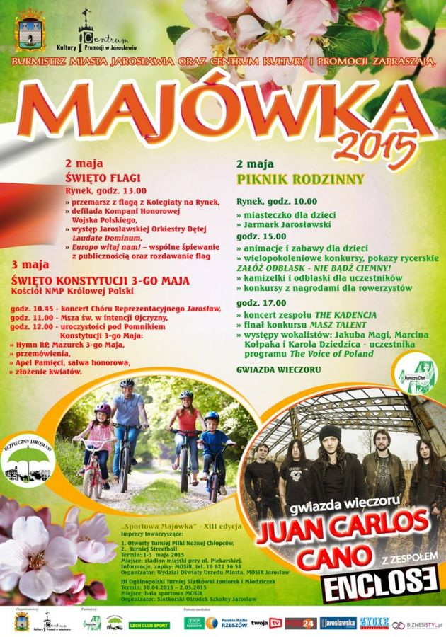 

<i>2015-05-03 22:18:00</i>  
Eliminacje do programu &quot;Masz Talent&quot; w gminie Chłopice
Eliminacje do programu "Masz Talent" w gminie Chłopice wyłoniły...
  

Eliminacje do programu "Masz Talent" w gminie Chłopice wyłoniły finalistkę: Paulinę Kurecką, kl. VI, kat. śpiew.

PWSTiE reprezentować będą natomiast następujące osoby:

- Tatiana Shustko, kat. śpiew

- Serhij Jazybczyk i Oleksiy Panasko  - duet, kat. śpiew

- Łukasz Szałaj, kat. śpiew

 
  
<b>Zdjęcia:</b> 

 
 
 
 
 
 
 

<i>2015-05-04 20:22:00</i>  
Majówka 2015 na jarosławskim rynku
W sobotę 2 maja w ramach jarosławskiej "Majówki" odbył się finał VII edycji konkursu "Masz talent" organizowanego przez naszą fundację, przy współpracy z Centrum Kultury i Promocji w Jarosławiu oraz Burmistrza Miasta Jarosławia...
  

W sobotę 2 maja w ramach jarosławskiej "Majówki" odbył się finał VII edycji konkursu "Masz talent" organizowanego przez naszą fundację, przy współpracy z Centrum Kultury i Promocji w Jarosławiu oraz Burmistrza Miasta Jarosławia.

Uczestników oceniało jury w składzie: Jacek Ścibor (dr sztuk wokalnych) Alicja Zając (prezes fundacji) Karol Dziedzic (muzyk) Marcin Kołpak (muzyk) Maciej Inglot (muzyk) Henryk Cebula (artysta plastyk) Marcin Zaborniak (wiceburmistrz Jarosławia)

Zwyciężczynią tegorocznej edycji konkursu została <strong>Katarzyna Wygnaniec</strong> (śpiew). Ponadto jury przyznało pięć wyróżnień. Otrzymali je: Katarzyna i Aleksandra Wygnaniec (śpiew), Tatiana Shutsko (taniec), Kacper Dąbrowski (śpiew), Mateusz Wolwowicz (taniec) oraz Jarosław Dominik (akordeon). Nagroda publiczności powędrowała do Sergieja Jazywczuka i Oleksija Pamarko.

Imprezę, która cieszyła się sporym zainteresowaniem prowadziła prezes fundacji Alicja Zając.

- Publiczność mimo niesprzyjającej pogody dopisała. Chciałam podziękować wszystkim za przybycie. Kolejna edycja "Masz talent" okazała się sukcesem. Słowa podziękowania kieruję także do współorganizatorów konkursu - zaznacza prezes fundacji.

W finale wystąpiła 16 młodych artystów. 12 wyłonionych w eliminacjach które odbyły się 15 kwietnia w CKiP w Jarosławiu, 3 studentów jarosławskiej PWSTE oraz jedna osoba wyłoniona ze zmagań stoczonych w Chłopicach. Główną nagrodą był telefon najnowszej generacji. Laureatka, K. Wygnaniec została ponadto zaproszona przez K. Dziedzica na godzinną, prywatną lekcje śpiewu w Krakowie.

Gwiazdą sobotniego wieczoru na jarosławskim Rynku był zwycięzca programu "The Voice of Poland" Juan Carlos Cano wraz z zespołem Enclose.

 

tekst: Gazeta Jarosławska

zdj.: Centrum Kultury i Promocji w Jarosławiu oraz Marta Dobrucka, Gazeta Jarosławska
  
<b>Zdjęcia:</b> 

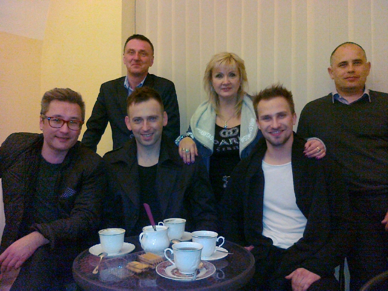 
 
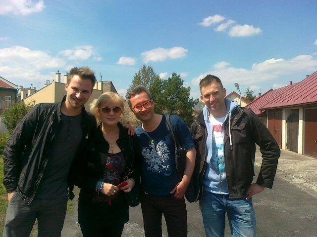 
 
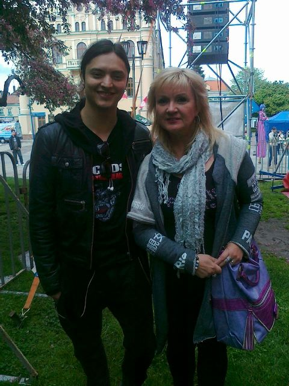 
 
 
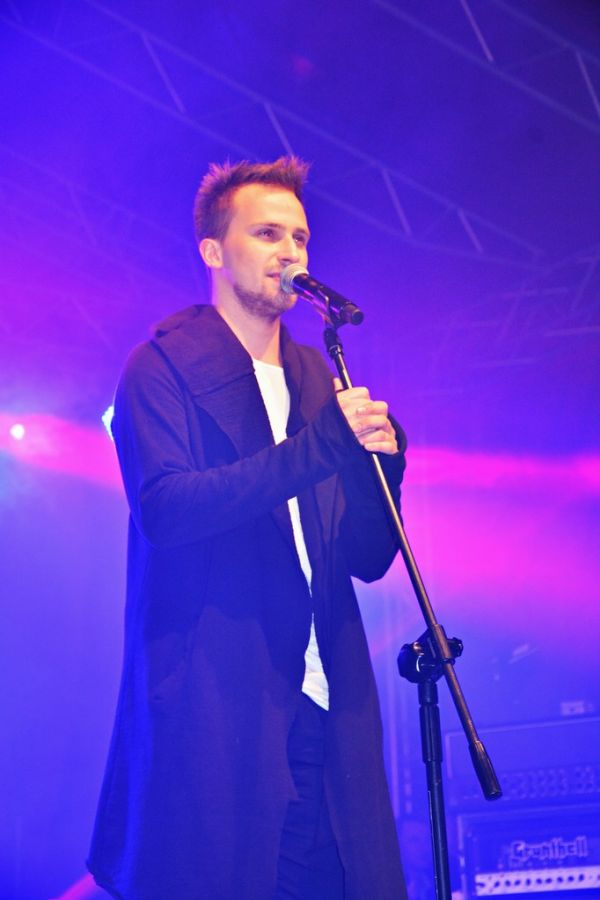 
 
 
 
 
 
 
 
 
 
 
 
 
 
 
 
 
 
 
 
 
 
 
 
 
 
 
 
 
 
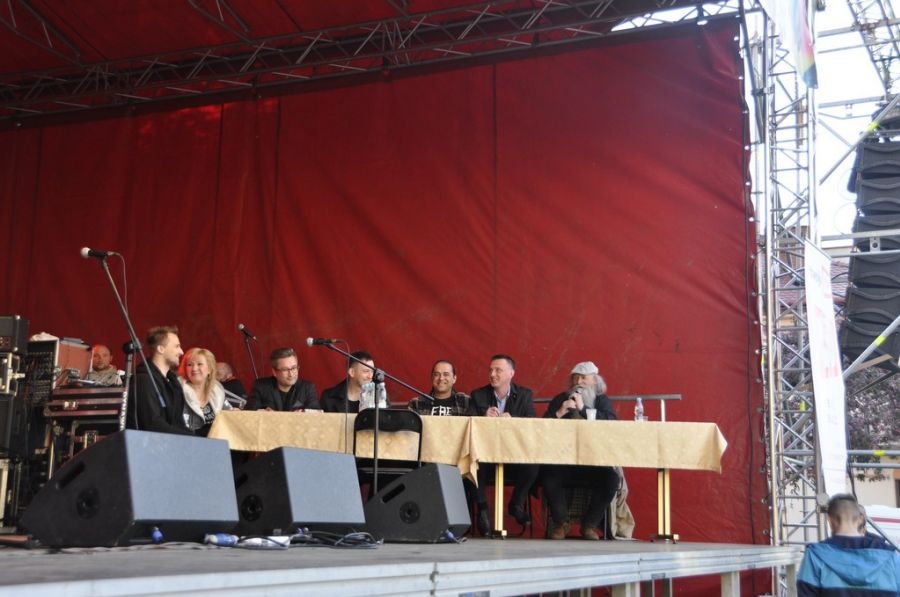 
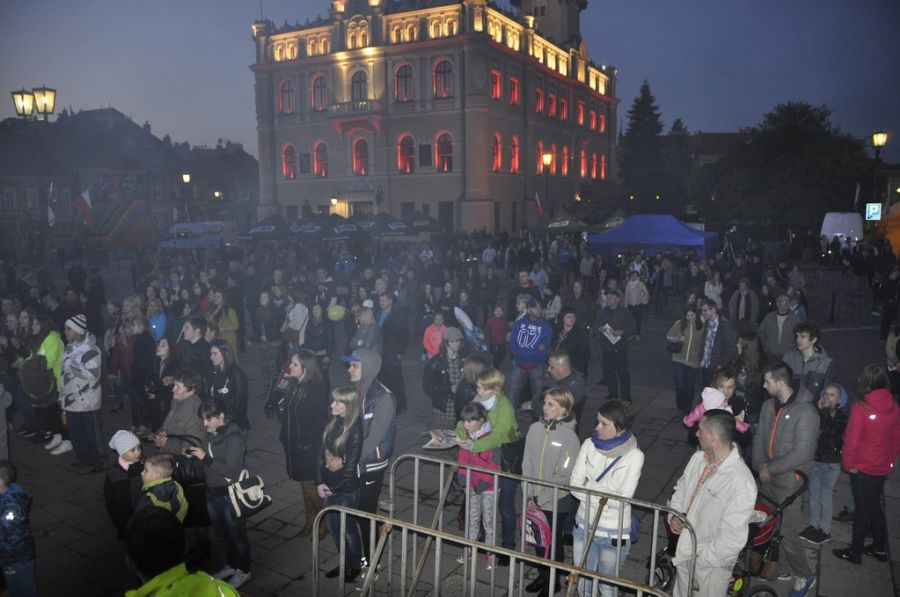 
 
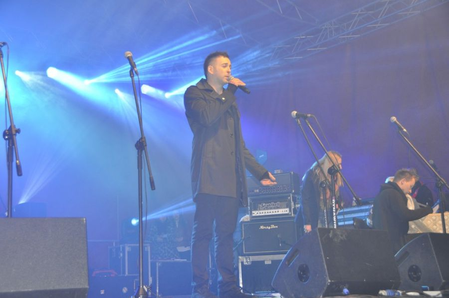 
 
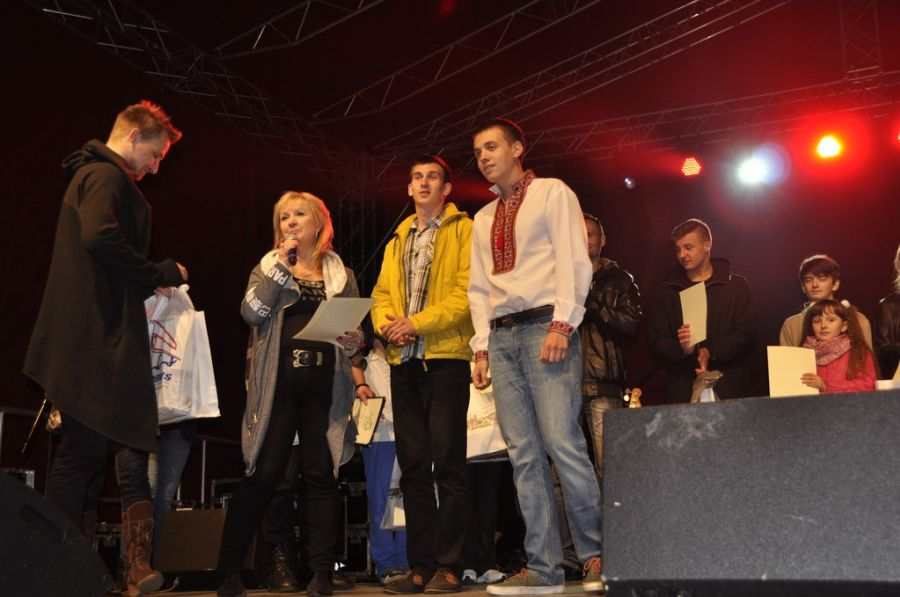 

<i>2015-08-04 07:42:00</i>  
Bijemy rekord w czytaniu na głos!
Jarosławska Fundacja „Pomocna Dłoń” i Wydawnictwo Literackie Białe Pióro oraz Burmistrz Miasta Jarosławia w dniu 28/08/2015r. przeprowadzą wydarzenie, obejmujące bicie rekordu Polski w czytaniu na głos...
  

Szanowni Państwo,

Jarosławska Fundacja „Pomocna Dłoń” i Wydawnictwo Literackie Białe Pióro oraz Burmistrz Miasta Jarosławia w dniu 28/08/2015r. przeprowadzą wydarzenie, obejmujące bicie rekordu Polski w czytaniu na głos. Maraton czytania odbędzie się w Jarosławiu pod przewodnictwem Biura Rekordów, które zajmuje się nadzorowaniem poprawności przebiegu rekordów Guinnessa i Polski.

Zwracamy się do Państwa z serdeczną prośba o wsparcie naszego wydarzenia przez wpłacanie wolnych datków na konto Fundacji:

<strong>12 9096 0004 2001 0000 2264 0001</strong> (Bank Spółdzielczy w Jarosławiu)

Firmy, które zechcą dokonać zgłoszenia udziału i wpłaty na konto Fundacji będą obowiązkowo wpisane do Księgi Rekordu. Jeśli nie będą mogły wystawić swojego przedstawiciela, będą reprezentowane na wydarzeniu przez wolontariuszy, którzy będą czytać w ich imieniu.

<strong>Każdy darczyńca zostanie wymieniony na naszych portalach i w mediach nas wspomagających.</strong>

Zapraszamy również do dołączania do wydarzenia w serwisie Facebook: <a href="https://www.facebook.com/events/1615753285350895/" target="_blank">https://www.facebook.com/events/1615753285350895/</a>
  
<b>Zdjęcia:</b> 

 

<i>2015-09-02 22:42:00</i>  
Maraton Czytania. Pobiliśmy rekord w czytaniu!
Po 45 godzinach ciągłego czytania na głos pobito rekord Polski...
  

Po 45 godzinach ciągłego czytania na głos pobito rekord Polski w tej konkurencji! Mieszkańcy czytali przez dwie noce i niespełna dwa dni, podczas gdy poprzedni rekord wyniósł „tylko" 30 godzin. W sumie książki wydawnictwa Literackiego „Białe Pióro", które współorganizowało Maraton czytały 154 osoby, w tym pracownicy Urzędu Miasta Jarosławia, uczestnicy Festiwalu Muzyki Dawnej oraz harcerze.

Jest to wielki sukces dla Fundacji, Wydawnictwa i mieszkańców miasta Jarosławia.

 

Dziękujemy wszystkim którzy przyczynili się do naszego wspólnego sukcesu!

 

Maraton Czytania oraz bicie rekordu Polski były pomysłem Fundacji. Prezes Fundacji Pani Alicja Zając postanowiła w ten sposób promować czytelnictwo i zachęcić do sięgania po ciekawą lekturę w tradycyjnej drukowanej postaci. Patronat nad wydarzeniem objął Burmistrz Miasta Jarosławia.

Maraton - informacje podstawowe:

Organizator bicia rekordu: Alicja Zając - Prezes Jarosławskiej Fundacji "Pomocna Dłoń",

Współorganizator: Agnieszka Kazała  - Wydawnictwo Literackie Białe Pióro z Warszawy,

Gospodarz: Burmistrz Miasta Jarosławia

Rozpoczęcie Maratonu Czytania: 28.08.2015 - godz. 14.43

Zakończenie: 30.08.2015 - godz. 11:45

Liczba godzin czytania: 45 godzin!

Liczba osób czytających: 154 osoby

Liczba rozdanych książek z wyd. Literackiego „Białe Pióro" dla osób czytających - 350 egzemplarzy.

Rekord został pobity prawie podwójnie, ponieważ w założeniu było 30 godzin, a udało się zrealizować 45 godzin czytania.

 

 

Jest to wielki sukces dla Fundacji, Wydawnictwa i mieszkańców miasta Jarosławia.

 

Dziękujemy wszystkim którzy przyczynili się do naszego wspólnego sukcesu!

 
  
<b>Zdjęcia:</b> 

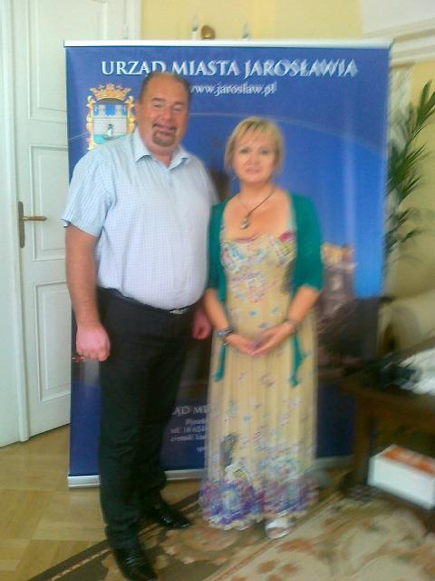 
 
 
 
 
 
 
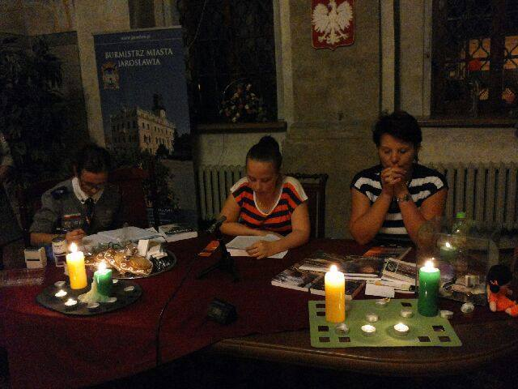 
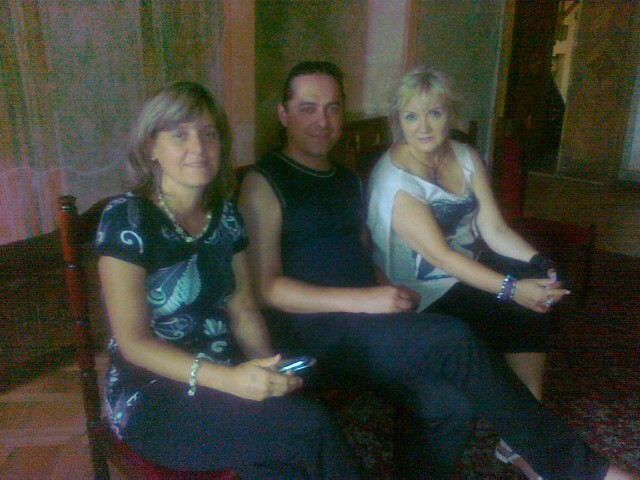 
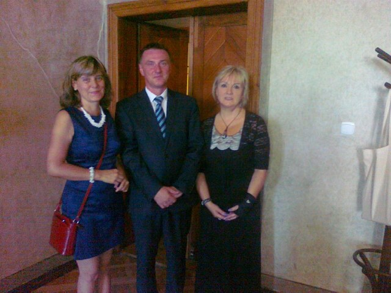 
 
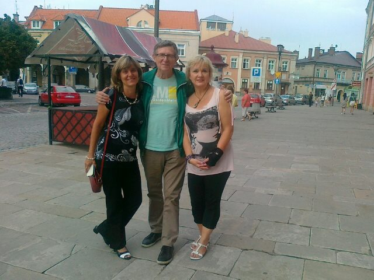 

<i>2015-09-25 17:36:00</i>  
Wybory do Senatu
Zachęcamy do wzięcia udziału w głosowaniu w wyborach w dniu 25.10.2015r.
  

Zachęcamy do wzięcia udziału w głosowaniu w wyborach w dniu 25.10.2015r.
  
<b>Zdjęcia:</b> 

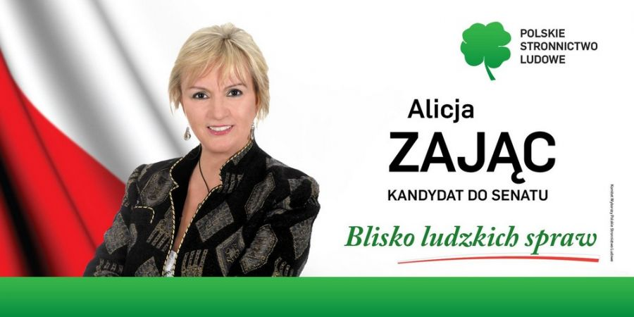 
 

<i>2015-12-01 17:27:00</i>  
Uroczystość wręczenia Certyfikatów Bicia Rekordów Polski
W dniu 27.11.2015 w Sali Ślubów Jarosław odbyła się Uroczystość wręczenia Certyfikatów Bicia Rekordów Polski...
  

Ostatnie dni sierpniowe należały do czytelników, którzy podjęli się próby pobicia w Jarosławiu rekordu Polski w głośnym czytaniu non stop. Po książki Wydawnictwa Literackiego „Białe Pióro” sięgnęło 154 osoby, którym udało się wytrwać 45 godzin. Potwierdzeniem ustanowienia nowego wyniku jest oficjalny certyfikat wręczony 27 listopada br. przez zastępcę burmistrza Wiesława Pirożka m.in. pomysłodawczyni akcji Alicji Zając, prezes Jarosławskiej Fundacji „Pomocna Dłoń”.

154 osoby na pożegnanie lata w Jarosławiu sięgnęły po książki Wydawnictwa Literackiego „Białe Pióro". Chodziło nie tylko o przyjemne spędzenie czasu z wybraną przez siebie literaturą, ale ustanowienie nowego rekordu Polski w głośnym czytaniu non stop. Realizacja ambitnego planu rozpoczęła się 28 sierpnia br. w Sali Ślubów kamienicy Gruszewiczów i tam też po 45 godzinach (3 dniach i 2 nocach) zakończyła się sukcesem. Organizatorami akcji były: Jarosławska Fundacja „Pomocna Dłoń" oraz Wydawnictwo Literackie „Białe Pióro", które wysłało do naszego miasta aż 350 książek.

Wybrane przez siebie egzemplarze czytali m.in. pracownicy Urzędu, harcerze, nauczyciele jarosławskich szkół, uczestnicy odbywającego się w tych dniach Festiwalu Muzyki Dawnej „Pieśń Naszych Korzeni", czy mieszkańcy miasta. Każdy mógł przyłączyć się w dowolnym momencie, a wybraną książkę otrzymywał na pamiątkę.

27 listopada ponownie zostało przypomniane sierpniowe wydarzenie. Biuro Rekordów zajmujące się poprawnością przebiegu tego typu przedsięwzięć, przyznało oficjalne certyfikaty za ustanowienie w naszym mieście rekordu w kategorii „Najdłuższy Maraton Czytania Książek Jednego Wydawnictwa". Dokumenty organizatorom wręczył zastępca burmistrza Wiesław Pirożek, który pogratulował pomysłu i wytrwałości oraz podziękował wszystkim zaangażowanym w realizację niecodziennej akcji, szczególnie prezes JF „Pomocna Dłoń” oraz Agnieszce Kazała z warszawskiego Wydawnictwa Literackiego „Białe Pióro”. - Cieszę się bardzo, że to się zdarzyło w Jarosławiu. Jesteśmy otwarci na każdą inicjatywę tworzenia czegoś nowego i przełamywania barier, które wydawałoby się, są nie do przełamania - zaznaczył W. Pirożek.

Miłym akcentem spotkania był program artystyczny w wykonaniu uczestników tegorocznej edycji programu „Masz Talent" - laureatek I miejsca Aleksandry i Katarzyny Wygnaniec z PG nr 1, Łukasza Szałąja - członka Zarządu Fundacji „Pomocna Dłoń” oraz I-klasistów z SP nr 11 pod opieką Aliny Mazur i Agnieszki Dębickiej.

Małgorzata Młynarska

 

<strong>Zapraszamy do obejrzenia nagrania z wydarzenia pod adresem:</strong> <a href="https://www.youtube.com/watch?v=kywlGIx6XZY">https://www.youtube.com/watch?v=kywlGIx6XZY</a>
  
<b>Zdjęcia:</b> 

 
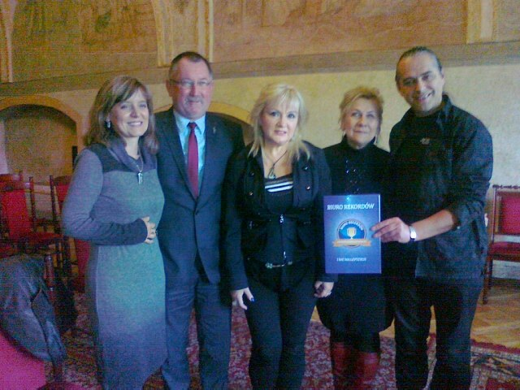 
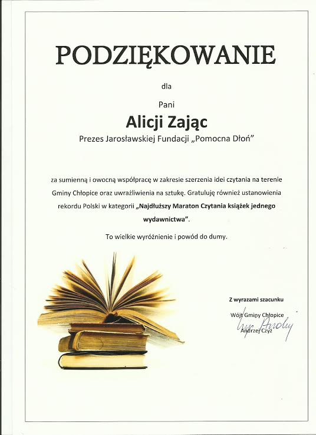 
 
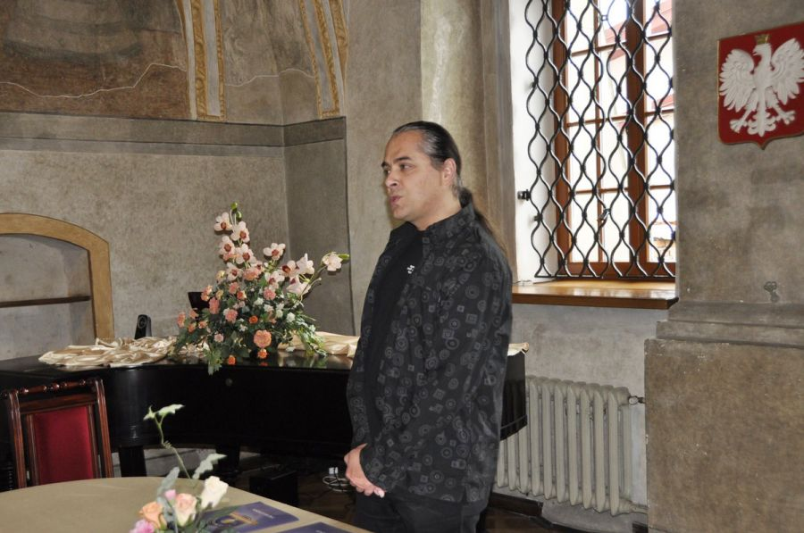 
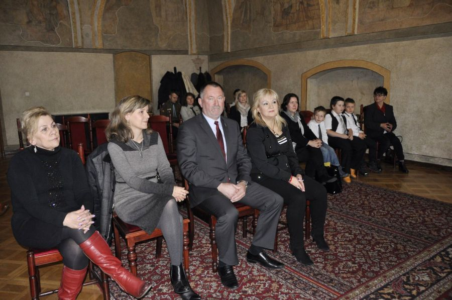 
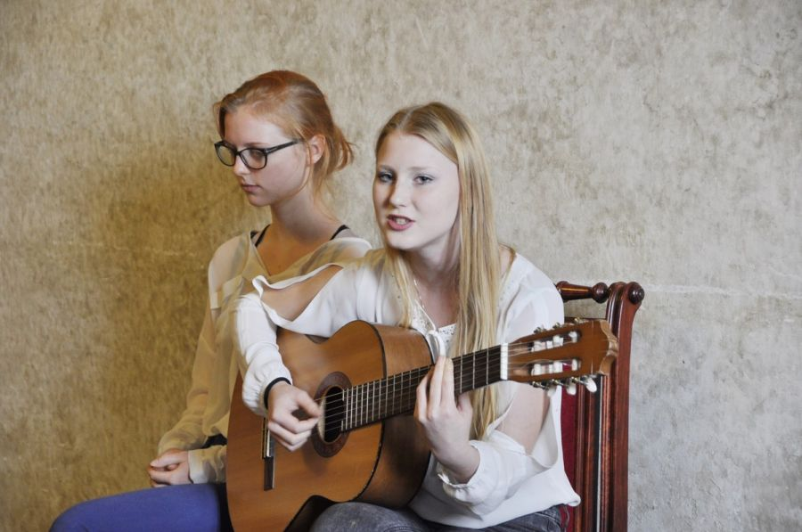 
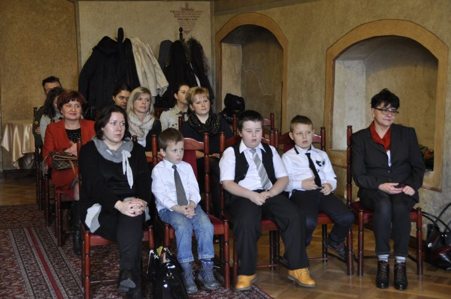 
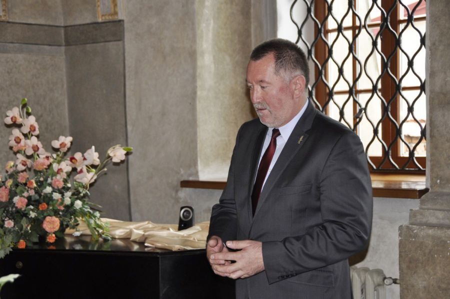 
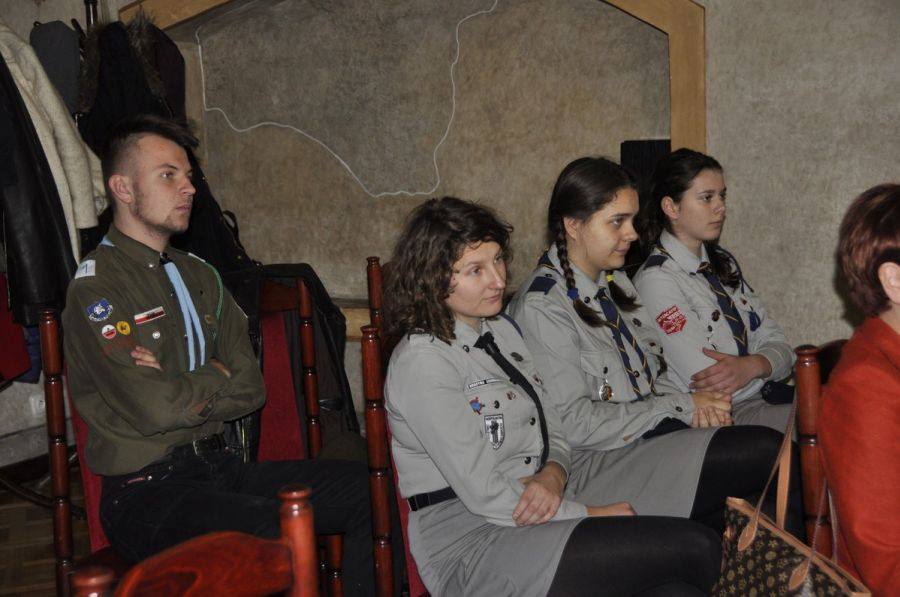 
 
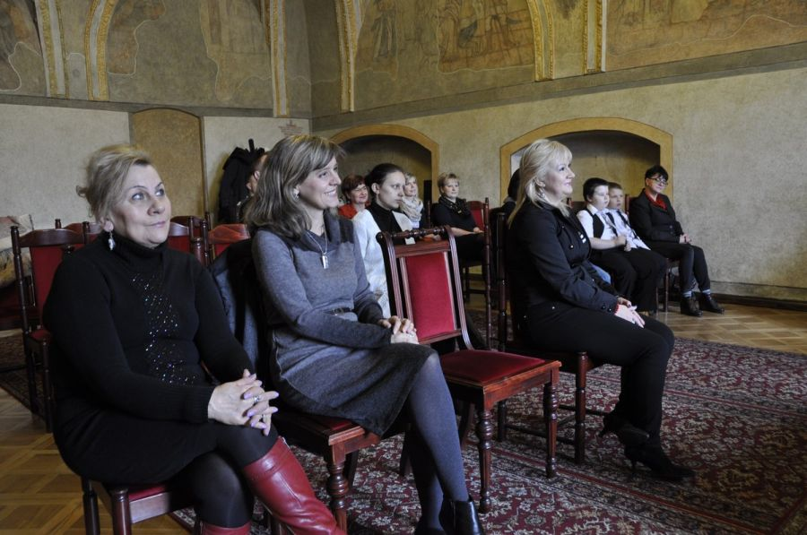 
 
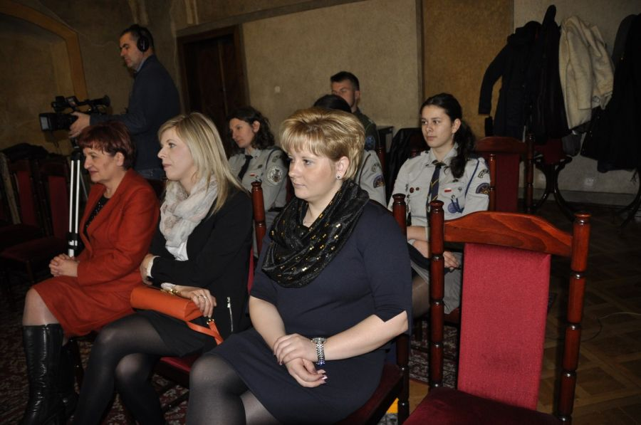 
 
 
 
 
 
 
 
 
 
 
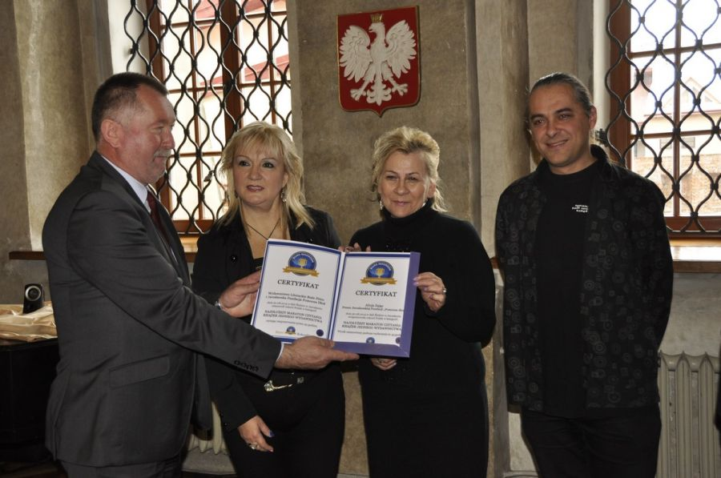 
 
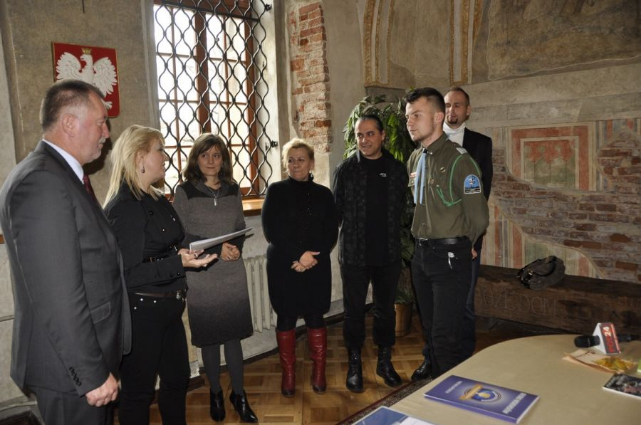 
 
 
 
 
 
 
 
 
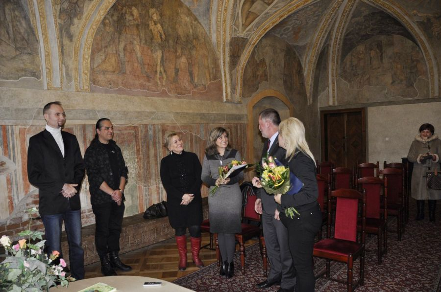 
 
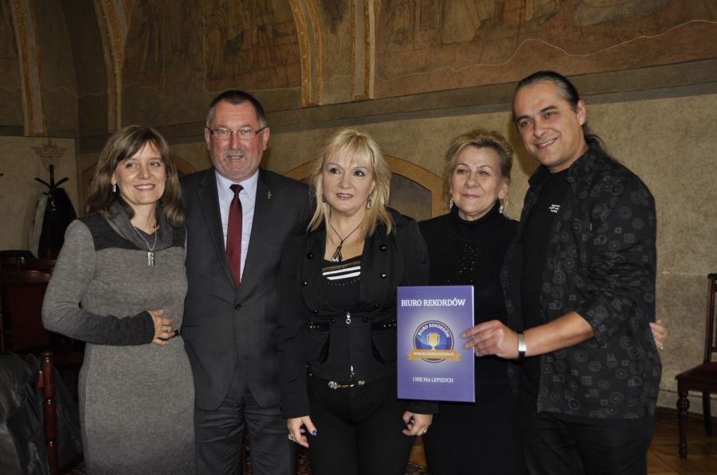 
 
 
 
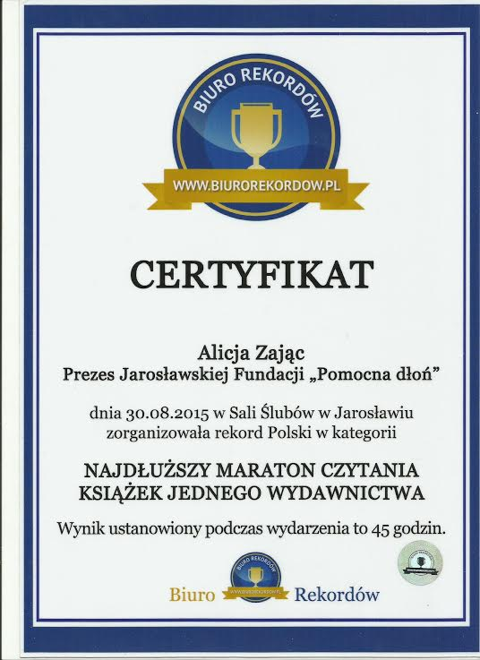 

<i>2015-12-09 18:09:00</i>  
Mikołaj w Domu Dziecka 8.12.2015r
W dniu 08.12.2015 Jarosławska fundacja “Pomocna dłoń” zorganizowała w Domu dziecka w Jarosławiu imprezę z Mikołajem, połączoną z programem “Masz talent”...
  

W dniu 08.12.2015 Jarosławska fundacja “Pomocna dłoń” zorganizowała w Domu dziecka w Jarosławiu imprezę z Mikołajem, połączoną z programem “Masz talent”

 

Mikołaj rozdał dzieciom paczki ze słodyczami, zabawki i odzież. Dzieci czynnie brały udział w programie “Masz talent”, z radością uczestniczyły w pokazywaniu swoich umiejętności artystycznych i nie tylko. Całe spotkanie z Mikołajem uatrakcyjnił muzyk Pan Janusz Rajtar, który przygotował dzieciom kolędy do wspólnego śpiewania. Dzieci również na początku naszej imprezy przygotowały teatrzyk związany ze Św. Mikołajem. Dziękujemy wychowawcom Domu dziecka za przygotowanie dzieci do całości programu. W imprezie wzięli udział wolontariusze z Ukrainy oraz członkowie Zarządu Fundacji: Lucyna Pleśniak i Łukasz Szałaj.
  
<b>Zdjęcia:</b> 

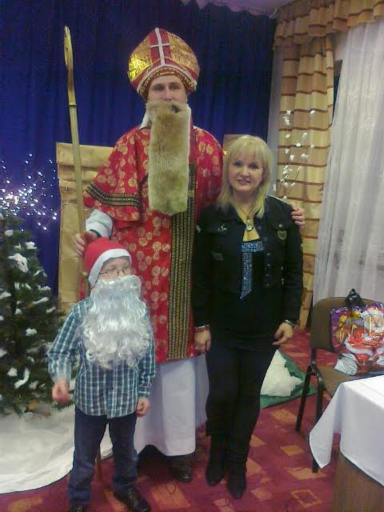 
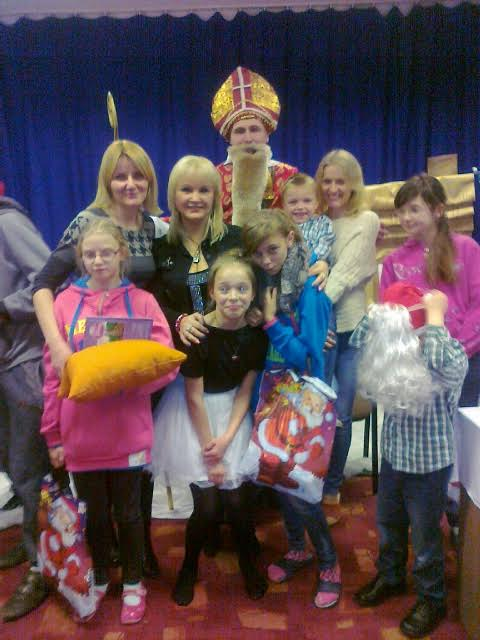 
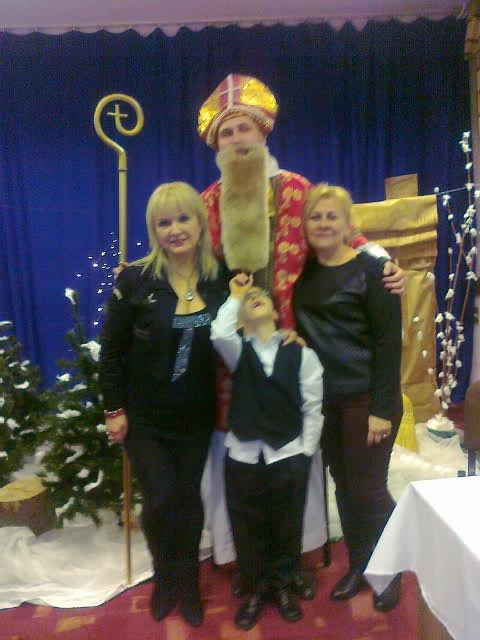 
 
 
 

