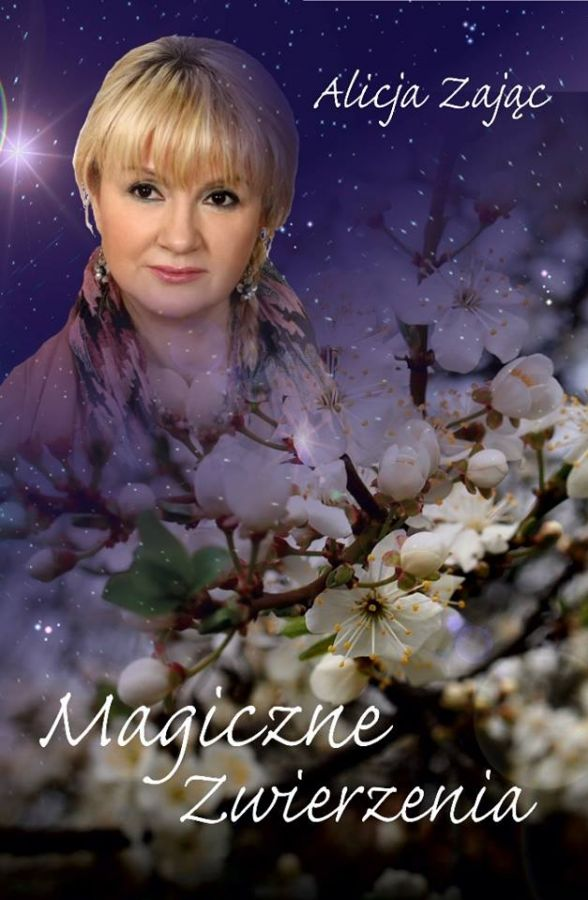

<i>2017-01-17 18:28:00</i>  
Impreza Noworoczna w Zakładzie Karnym w MedyceKoncert Karola Dziedzica i Michała Okularczyka, połączony z poezją Alicji Zając "Magiczne Zwierzenia". Impreza odbyła się w dniu 05.01.2017 o godz. 11:00.  
Koncert Karola Dziedzica i Michała Okularczyka, połączony z poezją Alicji Zając "Magiczne Zwierzenia". Impreza odbyła się w dniu 05.01.2017 o godz. 11:00.  
<b>Zdjęcia:</b> 

 
 
 
 
 

<i>2017-02-21 23:48:00</i>  
Wydarzenia  
<iframe src="https://www.facebook.com/plugins/page.php?href=https%3A%2F%2Fwww.facebook.com%2Fpomocnadlonjaroslaw%2F&tabs=timeline&width=500&height=900&small_header=true&adapt_container_width=false&hide_cover=true&show_facepile=false&appId" width="500" height="900" style="border:none;overflow:hidden" scrolling="no" frameborder="0" allowTransparency="true"></iframe>|n||n|  |n||n||n|
Darmowy Program PIT dostarcza <a href="https://www.iwop.pl/">Instytut Wsparcia Organizacji Pozarządowych</a> |n|w ramach projektu <a href="https://www.pitax.pl/">PITax.pl</a> dla OPP.
  

